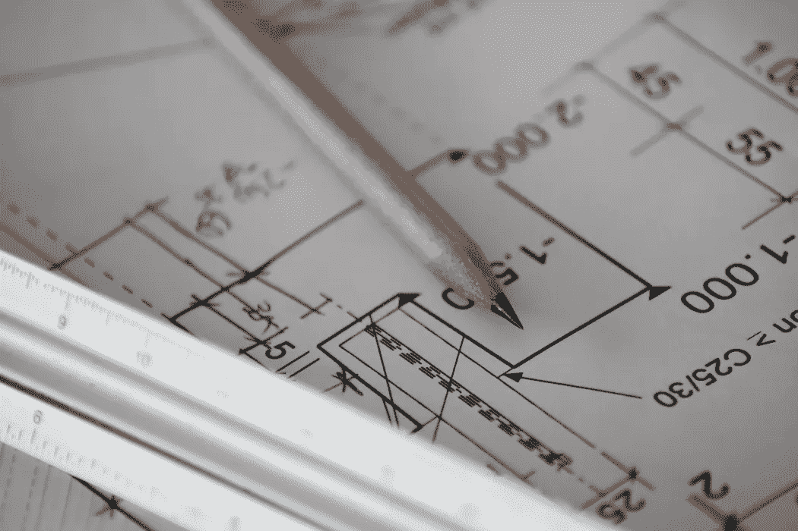
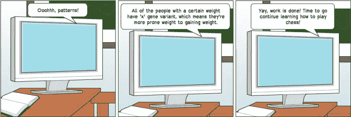
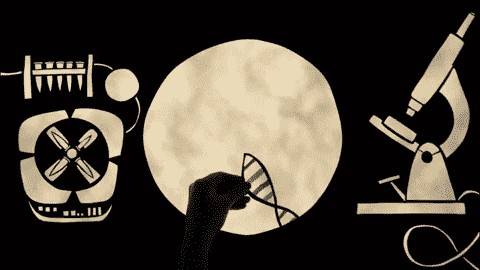

# 我是谁？AI 可以帮你找到那个问题的答案。

> 原文：<https://medium.datadriveninvestor.com/who-am-i-ai-can-help-you-find-the-answer-to-that-question-7ea6b70e423?source=collection_archive---------5----------------------->

每个人都有自己的人类蓝图。我们的 DNA 控制着我们的一切。根据一些新的研究，它不仅定义了我们的身体特征，甚至可能影响我们的性格特征。如果我们能破解我们的 DNA 密码，我们就能解开大量关于我们自己的秘密。我们可以了解诸如哪些疾病可能会影响我们，以及一旦它们进入我们的系统，我们应该使用哪些药物来治疗它们等信息。

然而，与建筑的蓝图不同，DNA 可能极其复杂，难以理解。利用人工智能(AI)，我们可以加速基因组学研究。随着人工智能(AI)的兴起，我们可以开始使用个性化医疗，更快地在基因数据中找到模式，并使基因编辑技术更加有效。

[https://www . datadriveninvestor . com/2019/02/13/ai-creativity-biggan-as-a-creative-engine/](https://www.datadriveninvestor.com/2019/02/13/ai-creativity-biggan-as-a-creative-engine/)

# 有了人工智能，我们可以停止对每个人使用千篇一律的治疗方法。

人类 99.9%相同，0.1%不同。尽管 0.1%看起来是一个很小的量，但考虑到人类拥有的碱基对数量，这实际上是一个很大的量。我们的 DNA 中都有三百万个独特的点。如果我们能够理解我们 DNA 中的不同基因变异，以及它们如何影响我们，我们就可以开始应用所谓的个性化医疗。个性化医疗是医生为患者定制治疗方案。就我个人而言，我认为我们应该使用个性化的药物，因为我们都是如此不同。对一个人有效的治疗方法对另一个人就不一样了。然而，人工分析基因变异需要数年时间。这就是人工智能的用武之地。**人工智能可以用来分析变异如何影响我们，以预测某人患某种疾病的概率，以及哪些治疗方法对治疗我们可能患的疾病最有效。**

现在，我来回答你迫切的问题。AI 是如何分析数据集的？嗯，**使用一个称为机器学习(ML)的人工智能子集来分析数据，以在大型遗传数据集中找到模式**。然后，这些模式被转换成计算机模型，对疾病和治疗进行预测。使用这种方法，我们可以使用人工智能来确定我们是谁，以及我们应该成为谁来避免这些疾病。我们的 DNA 是关于我们的医学信息的宝库，如果解开了，我们可以学会如何改变我们的生活方式，以避免陷入疾病。**使用人工智能，我们可以更好地了解我们自己独特的 0.1%。**

# 使用人工智能，可以更快地找到遗传数据中的模式。

像 23andMe 这样的各种公司已经意识到了这个秘密，并将其用于商业目的。特别是对于 23andMe 来说，他们正在使用 ML 为他们的客户更深层次地理解遗传信息。例如，不久前，他们正在研究如何提供一个个性化的分析，来分析一个人的基因如何影响他们的体重。为了做到这一点，他们创建了一个遗传体重报告模型，并将其提供给客户。该公司结合研究参与者的数据，用 ML 开发了这个模型。使用这样的模型，可以更快地发现遗传数据中的模式，并可以深入了解一个人的身体过程如何决定体重等事情。

# 有了人工智能，基因编辑将变得轻而易举。

自从基因编辑的概念形成以来，它一直是一个热门话题。然而，即使技术进步，我们今天有像 CRISPR 这样的工具，仍然有方法来改进系统。基因编辑的最大障碍之一是精确有效的切割，而不影响 DNA 的其他部分。直到最近，科学家们不得不手动测试所有可能切割的位置，以确定最佳位置。这种方法不是很有效，因为它要花很多时间，而且非常昂贵。然而，微软已经为此创建了一个解决方案。**他们创造并训练了一个计算模型，分析 DNA 链的模式和各种不规则性**。要了解有关此方法的更多信息，请单击此处。利用这一点，已经找到了 CRISPR 可以得到最佳应用的位置。这种方法可以让科学家找到有效采伐的好地点，而不需要花费太多的时间和金钱。

# 关键要点:

*   如果我们使用人工智能来分析我们的基因数据，我们可以更好地了解自己
*   通过人工智能，遗传数据通过寻找模式进行分析，然后将这些模式转化为计算机模型
*   一旦我们分析了数据，有可能影响我们的威胁生命的疾病就可以避免
*   我们可以使用个性化的药物来治疗这些疾病
*   像 23andMe 这样的商业公司正在使用人工智能来更快地分析基因数据，以帮助他们的客户更好地了解自己
*   使用人工智能，我们可以找到 CRISPR 切割 DNA 的最佳位置

当大多数人想到人工智能时，他们会想到它会根除我们所有人，并接管世界。然而，这是翻译我们的蓝图以更好地了解我们自己的关键，这将有助于我们充分地生活。

*原载于 2019 年 6 月 8 日*[*【https://www.datadriveninvestor.com】*](https://www.datadriveninvestor.com/2019/06/08/who-am-i-ai-can-help-you-find-the-answer-to-that-question/)*。*