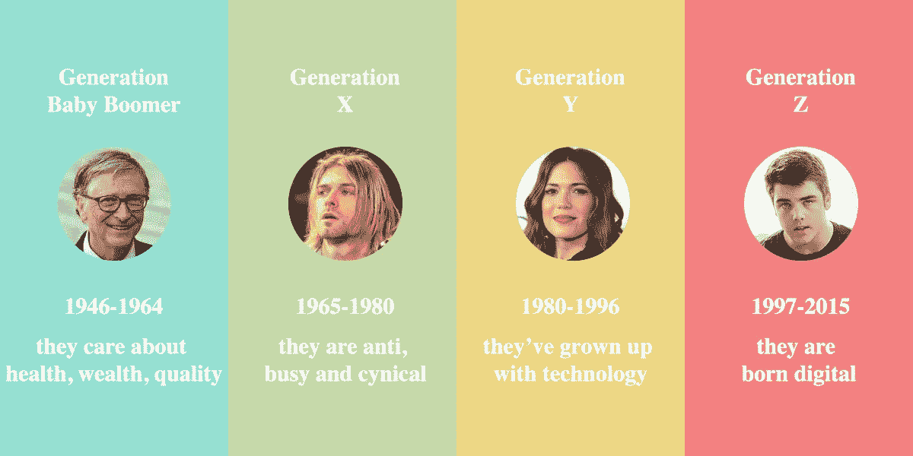

# 谁是婴儿潮一代，X 世代，Y 世代和 Z 世代？

> 原文：<https://medium.datadriveninvestor.com/who-are-boomers-gen-x-gen-y-and-gen-z-d1784f02d25d?source=collection_archive---------0----------------------->

## 不同的世代有不同的需求、能力和想法

[illustration by me](https://www.linkedin.com/in/dangtrunganh/)

在这个时刻，世界上有七代人居住在**。我是 Y 世代，出生于 1980 年到 1996 年之间。不同的世代会有不同的需求、能力和想法。**

让我们仔细看看四大代。

## **谁是婴儿潮一代？**

他们出生于 1946 年至 1964 年之间。第二次世界大战后，出现了“婴儿潮”，这一代人因此获得绰号。他们是最大的群体，拥有历代最大的财富。婴儿潮一代关心健康、财富和生活质量。

他们仍然非常努力工作，并且相对来说乐于接受新的体验。他们仍将存在相当长一段时间，所以也许最好利用他们丰富的经验和洞察力。

 [## 幸福的算法？-数据驱动型投资者

### 从一开始，我们就认为技术正在使我们的生活变得更好、更快、更容易和更实用。社交媒体…

www.datadriveninvestor.com](https://www.datadriveninvestor.com/2019/03/08/an-algorithm-for-happiness/) 

婴儿潮一代喜欢比尔盖茨，他是世界上最富有的人，也是最慈善的人之一。

## 谁是 X 世代？

有时被称为失落或被遗忘的一代。其中包括 1965 年至 1980 年欧洲战后重建期间出生的人，如詹妮弗·洛佩兹。X 世代，成长在互联网之前。他们关心寻求生活平衡。

X 一代是反传统的，忙碌的，愤世嫉俗的。他们被教导要相信他们可以得到他们想要的任何东西。

## 千禧一代是什么人？

Y 一代(或千禧一代)现在已经成为职场中最大的群体。他们伴随着媒体和技术成长。他们出生于 1980 年至 1996 年之间。最著名的人是脸书联合创始人马克·扎克伯格。

与其他几代人相比，他们更多的是在工作中寻找意义，他们关心的是有所作为。他们希望学习新的知识和技能，与积极的人和公司一起工作，实现他们的梦想。

他们似乎比前两代人在同一年龄时更信任长辈。

 [## 世界的未来

### 我看到了未来，它会让你大吃一惊。

medium.com](https://medium.com/datadriveninvestor/future-of-the-world-f0c8e9b67a69) 

## Z 世代是谁

> 没有人能准确地确定千禧一代何时结束，Z 世代何时开始。

他们被称为数字青少年，出生于 1997 年至 2017 年之间。他们比所有几代人都更以自我为中心。这是一个非常多样化的一代，有许多不断变化的亚文化。Z 世代让他们的存在在工作场所广为人知，组织和领导者不能忽视他们。

他们的父母(X 世代)最知道如何与他们相处。

## 你是哪一代人…？

这四代人——婴儿潮一代、x 一代、千禧一代、z 一代——有着独特的职业道德、不同的工作观、不同的管理和被管理方式、独特的风格，以及看待质量、服务、环境等世界问题的独特方式。

你是谁？请与大家分享你的需求、能力和想法。

或者我们可以通过在 LinkedIn 上联系我来进一步讨论。

感谢阅读！