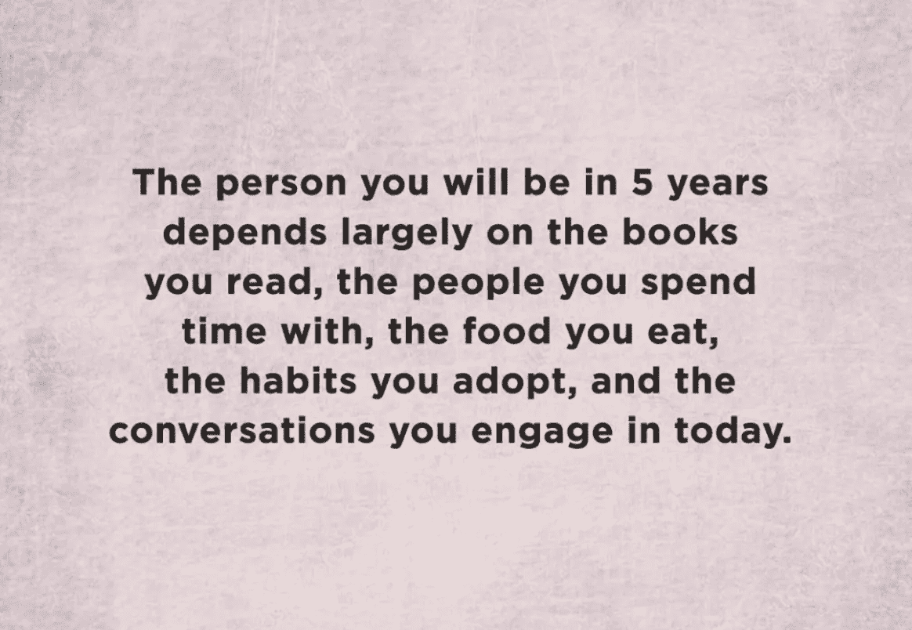
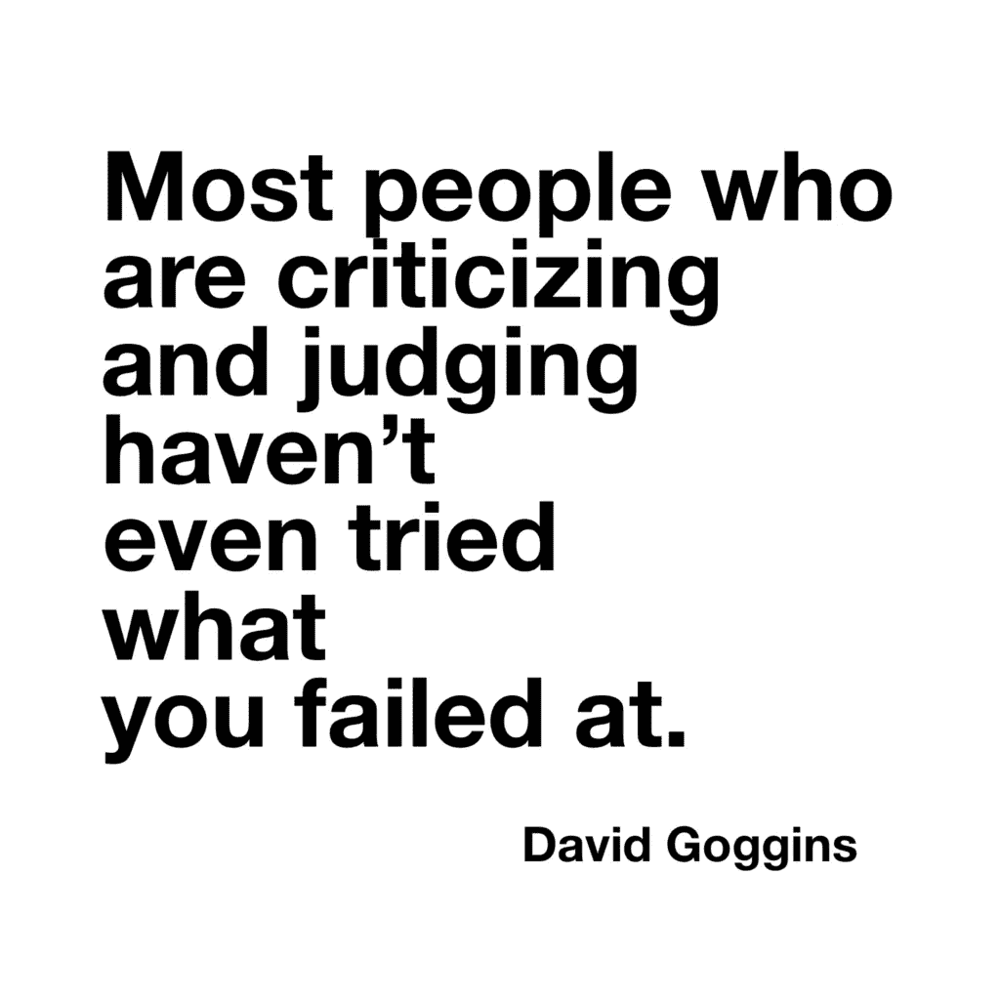

# 世卫组织，五年后你会成为什么样的人？

> 原文：<https://medium.datadriveninvestor.com/who-are-you-becoming-in-5-years-92ca0f000961?source=collection_archive---------9----------------------->

## 是什么阻止你成为你想成为的人…

photo credit: HOUSE OF LEADERS

# 五年后你会成为什么样的人？

> 领导力、目标和进步不是梦想，而是每天打自己的耳光(打个比方，用爱)。

# 你觉得这句话怎么样？

我不得不说，当我第一次读它的时候，它对我来说完全有意义。我的意思是，这是有一定道理的。

于是，我开始幻想自己会成为什么样的人。我开始设想五年后的生活。那个人长什么样？他是做什么的？他赚了多少钱？他终于结婚了，并且和他的生活伴侣生孩子了吗？他爱他的生活和朋友吗？他是否周游世界，是否仍在写作和学习写作技巧，以帮助激励他人和自己？

我的意思是，我今年快 40 岁了，这些是我真正的好奇心。

# 但是严肃地问自己:“五年后我要成为什么样的人？”

> (20 分钟后)…我略显模糊的回答:我将成为一名 44 岁的世界旅行家、作家、投资者和助手，喜欢自由生活，忠于我的冒险、创业、梦想、目标、习惯和朋友。

我可以得到更具体和更聪明的目标，但这真的重要吗，这是一个非常普遍的引用，它确实错过了我们每天面对的做我们梦想的事情的要点。美国人喜欢整天梦想成为自己想要的样子。人类喜欢在手机、电视、网飞、HBO(但说真的，《权力的游戏》什么时候会上映)和电脑上沉浸在自己的幻想中。

**嘿，我把自己扔在公共汽车下，我也喜欢这样做。**

这句励志名言所忽略的，可能是最重要的一点，是这样一个事实，即前方有巨大的挑战，让你活得更快乐、更健康、更好，成为你梦想的样子。

 [## 摔倒不是失败。-数据驱动型投资者

### 你只有在放弃的时候才会失败。每个英雄都会倒下，我们活着就是为了失败者出现的时刻；上升到…

www.datadriveninvestor.com](https://www.datadriveninvestor.com/2019/01/17/falling-isnt-failing/) 

梦(你知道我们睡觉时做的那些事)是有原因的。梦是不真实的，没有人想去做让它们真实或发生的工作，因为那样它们就不再像梦了。

我们喜欢梦，因为梦让我们有感觉。

我同意这个前提 [@house.of.leaders](https://www.instagram.com/house.of.leaders/) 人们每天都在通过他们的社会、习惯、朋友、食物、对话的影响而改变，但不仅仅是被动地成为某种东西。生活是每天的选择。我总是选错。选择倾向于恐惧、怀疑、孤立，还是倾向于成长、应对挑战和联系。

> 如果我们选择行动——我们开始实现我们的梦想，而不是梦想。

当我从欧洲打完职业篮球回家时，每个人都在继续做他们自己的事。婴儿。家庭。工作。我不想重新开始。我想继续做我喜欢的事情，或者找到我同样喜欢的其他事情。

***我陷在了过去。PS。很多事情我还是失败了。***

美国人真的在乎选择吗？我们会选择去克服那些阻止我们做自己喜欢的事情的障碍吗？

对我来说，分歧在于我认为你也可能只是一个痴迷的混蛋，只专注于一件事，而忽略了这个世界，通过获取更多和给予更少来取得成功(我想到了我们的政治环境)。我可以一天读 5 本书，但永远不会变得更快乐或帮助他人成长。我可以和僧侣们一起出去玩，永远不会更精神。我可以阅读世界上最好的自助书籍，但永远不会成功。我从不抽烟、喝酒、吃变质的食物，也从不和任何人一起进餐。

一般的建议很糟糕，因为它不能帮助你振作起来，面对每天的梦想给你带来的挑战。你必须失败才能变得更好。面对挑战，你必须失败。我不是一个精通生活的专家，但如果我是，我会说这句话并不能概括我五年后的你。