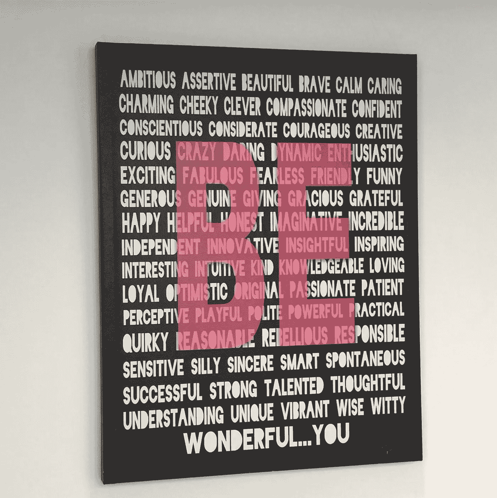

# 你想成为谁？

> 原文：<https://medium.datadriveninvestor.com/who-do-you-want-to-be-c238d7dcacd7?source=collection_archive---------12----------------------->

秩序是强大的。想想你附加在“我是”这个词上的那些词，它们是用来赋予你力量还是剥夺你力量？

你喜欢这些词定义你的方式吗？

当你说这些话的时候，你感到强大和自信吗？还是感到害怕和不确定？

当你说出你的话和让它们在你脑海里跑来跑去时，你有不同的感觉吗？

直到我经历了发生在我周围的一系列事件，我才相信那些话“无关紧要”。我开始注意到并真正倾听单词的影响，并开始意识到它们确实很重要，不管我们是否意识到了这一点。你说的话很重要，因为你是听到你说的最多的人！一定要和那些鼓舞你、鼓励你的人在一起。

 [## Noobs 的数字身份——数据驱动的投资者

### 聪明人如何在增强现实中创造身份价值？我最近刚满 40 岁。作为一个生物…

www.datadriveninvestor.com](https://www.datadriveninvestor.com/2019/02/28/digital-identity-for-noobs/) 

我喜欢亨利·福特的名言:

> **“不管你认为你能，还是你认为你不能，你都是对的。”——**[**亨利·福特**](https://www.goodreads.com/author/show/203714.Henry_Ford)

感谢这个[博客](http://www.positivelypresent.com/2011/08/i-am-two-little-words-one-big-impact.html)分享你的见解。我喜欢再次看到这个提醒:

> ***“单词‘我是……’是有力的单词；小心你把它们挂在什么上面。你所宣称的事物有办法反过来宣称你。***

*-A. K .基泽尔曼*

你在“我是”这个词后面加上什么？

这个帖子最初出现在[健康与活力上。](https://lovehealthandwellness.wordpress.com/2015/02/)