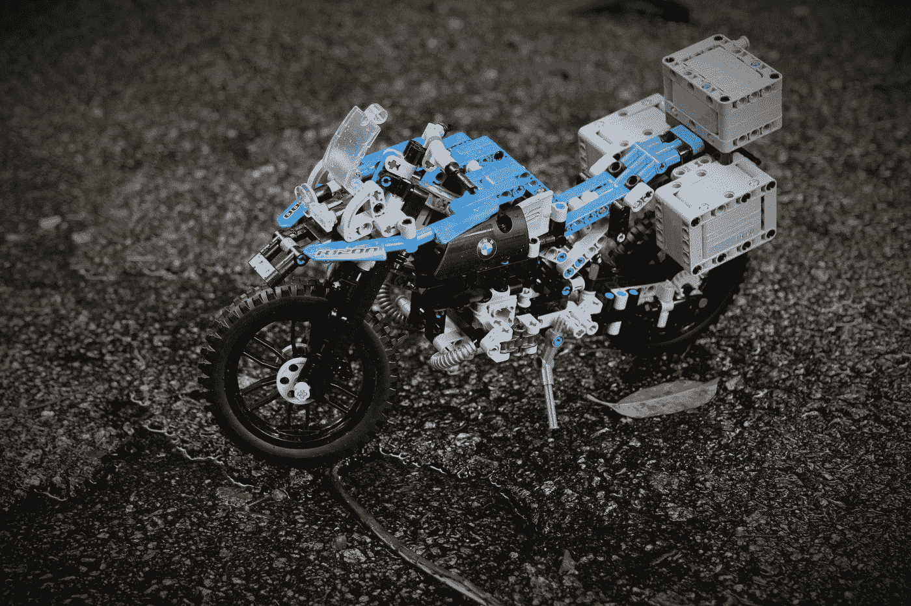

# 谁是数据科学家？—简单来说

> 原文：<https://medium.datadriveninvestor.com/who-is-a-data-scientist-in-simple-terms-6700afe5b301?source=collection_archive---------6----------------------->

除非你在过去的 5-6 年里一直生活在岩石下，否则你一定听说过大数据、机器学习和数据科学家这些词从任何地方冒出来。2012 年，《哈佛商业评论》发表了一篇文章，认为数据科学家是 21 世纪最性感的工作:[https://HBR . org/2012/10/data-scientist-the-sex-student-the-study-the-study-study-the-study-the-study-the-study-the-study-study-the-study-study-the-study-job](https://hbr.org/2012/10/data-scientist-the-sexiest-job-of-the-21st-century)

炒作开始了。世界开始深入挖掘什么是数据科学家，这项工作涉及哪些内容。有人开始说他是程序员。有人说他是现代统计学家。有人说他是一个讲故事的人，有人说他是一个能预测未来的人。事实是它们都是真的。这就引出了一个问题。谁是真正的数据科学家？他的工作包括什么？我的目的是尽可能用最简单的术语解释这一点，这样每个人都能理解，当一个 10 岁的孩子问你时，你就能告诉他们。

## **直觉——数据科学家和乐高**

“assorted-color plastic toy lot” by [Rick Mason](https://unsplash.com/@egnaro?utm_source=medium&utm_medium=referral) on [Unsplash](https://unsplash.com?utm_source=medium&utm_medium=referral)

**免责声明**:你将需要慷慨地运用你的想象力来正确理解这种直觉:)

想象你想用乐高积木建造一辆超级自行车。但是有一个问题。有人添加了一些不同型号的乐高积木，不属于你正在建造的超级自行车型号。更糟糕的是，他们去掉了一些需要的部分。你将如何建造它？首先，你要将所有的乐高积木按照各自的颜色分类。然后，你会试着一步一步地构建它，并时刻牢记最终结果。你要么扔掉那些你不需要的部分，要么试着看看你是否能把它们整合到某个地方。至于缺失的部分，你将尝试看看没有它们你是否能建造它，如果不能，那么你将不得不找到一种方法，通过尝试使用几乎相似的部分来最小化缺失部分造成的损害。

经过几个小时的分类和反复试验，最终你会得到超级自行车模型。

“LEGO blue and gray motorcycle toy” by [Christopher Chang](https://unsplash.com/@c4?utm_source=medium&utm_medium=referral) on [Unsplash](https://unsplash.com?utm_source=medium&utm_medium=referral)

现在你必须想象 5 件事[不要放弃。相信我你以后会感谢我的:)

1.  你制造的超级自行车实际上靠燃料行驶，最高时速为 10 英里
2.  你有一个**机器人**，它可以通过先学习任务来为你做事。它可以端来咖啡，打开电视，预报天气等等。但首先它需要被训练。需要展示如何煮咖啡、如何打开电视以及如何预测天气。
3.  机器人需要通过看到任务 10000 次来学习。所以要煮咖啡，我们必须向它示范 10000 次如何煮咖啡。它看到的越多，学到的就越多(我知道这听起来是一项艰巨的任务，但请耐心听我说)。
4.  根据任务的不同，机器人只能理解特定的语言。让我们假设，对于这个预测任务，机器人需要使用日语来学习。
5.  我们打算批量生产这些乐高自行车。我们想预测我们生产的自行车的燃油经济性。所以我们基本上需要了解影响燃油效率的因素有哪些。

“white and gray RoboSapien in white background” by [Mathew Schwartz](https://unsplash.com/@cadop?utm_source=medium&utm_medium=referral) on [Unsplash](https://unsplash.com?utm_source=medium&utm_medium=referral)

我知道这很难想象，所以让我们总结一下。我们必须对机器人说日语，并向它展示 10000 次，然后它最终会学会。一旦学会了，把咖啡粉或者牛奶换成不同的牌子也没关系。机器人已经学会了基本知识，它仍然会用现有的东西和通过看你煮 10000 次而获得的知识来煮咖啡。

在我们的例子中，我们希望机器人预测我们的乐高自行车的燃料效率。需要放映 10000 次。机器人将从我们制造的自行车中学习。它将学习某些乐高积木如何影响燃油经济性，如何移除受影响的东西，如何搬运受影响的负载等。因此，在看到并了解了影响自行车燃油效率的性能和其他不同因素后，我们的机器人最终能够通过查看乐高积木来预测如果我们用这些积木制作一辆自行车的燃油经济性。

简而言之，在机器人成功学习之后，如果我们给他所有相同的成分(乐高积木)来制作一辆超级自行车，机器人将会预测燃料效率。如果我们添加或去除一种成分，它将预测效率如何从它通过 10000 次学习所学到的东西变化。

## 与数据科学家比较乐高超级自行车和预测机器人

所以现在在现实世界中，乐高积木就是数据。我们有如此多的数据混杂在一起，有时我们有不需要的数据，有时我们可能会丢失数据，如丢失的部分。

让我们假设我们正试图预测明天的室外温度。为此，我们首先需要历史数据，可能是过去 5 年或 10 年的数据。每天的温度、湿度、降雨量等。我们不需要没有帮助的数据。比如年龄、电话号码、姓名，这些显然对天气没有影响，所以这些都可以去掉。我们只选择我们需要的数据(乐高积木)，用其他东西替换缺失的数据(有不同的方法来处理缺失的数据)，最后我们得到我们的主数据集(乐高超级自行车)。

现在我们想用这个数据集(乐高自行车)来训练一个机器学习模型(机器人)。我们可以使用不同的算法来训练模型，但我们需要选择最合适的算法(日语)。

机器学习模型将使用特定算法进行训练，它将从数据集学习哪些因素影响目标变量(温度)。它还会根据从历史数据中了解到的信息，告诉我们明天的预测温度(燃油效率)可能是多少。

## **将所有这些放在一起**

根据类比，数据科学家是谁，他做什么:

数据科学家是一名统计学家，他使用统计方法在数据中发现模式，开发一个故事，并利用他的编码技能和不同算法的知识，通过他完美的研究技能来预测未来。然后，他利用自己出色的讲故事、商业和沟通技巧，以引人注目的视觉化形式传达这一发现。

我知道你现在在想什么。是的，他有点像独角兽，这就是为什么对优秀数据科学家的需求如此之高！

**略作技术解释**:数据科学家首先研究业务问题。然后，他浏览大量数据(乐高积木),只选择他需要的数据来解决手头的问题。然后，他决定使用哪种算法(日语)来训练模型(机器人)。他对模型进行训练和再训练，直到达到相当高的预测精度。最后，在模型尚未看到的新数据上测试准确性，并评估模型预测结果的准确程度。

## **各阶段使用的一些流行工具**

1.  选择数据(选择我们需要的乐高积木)— SQL
2.  要素工程(清理数据并管理缺失值)SQL、Python、R
3.  EDA(探索性数据分析以查看数据如何分布)— Python、R、Power BI、Tableau
4.  模型构建(训练机器人)— Python，R
5.  面向生产的纵向扩展— Hadoop、Spark
6.  向利益相关方展示模型的成果和优势—表格、Power BI

## **所需知识**

统计学、线性代数、微积分、编码技巧、不同算法的知识、研究敏锐度、讲故事技巧、沟通技巧

## 结论

我希望我用简单的术语解释了谁是数据科学家，他做什么。随着行业每天产生越来越多的数据，对能够预测公司未来的优秀数据科学家的需求也在稳步上升。这个领域的人来自各行各业，包括统计学家、经济学家、物理学家、心理学家等。

数据科学家是一个独特的角色，它需要结合许多不同的技能，一旦你开始逐一培养它，你肯定可以进入这个领域，并为数据世界做出贡献。请随时让我知道你对得到解释感兴趣的其他主题

万事如意！