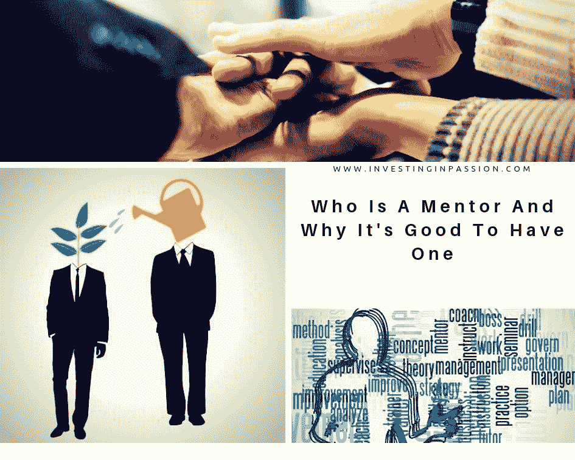

# 谁是导师，为什么有一个导师是好的

> 原文：<https://medium.datadriveninvestor.com/who-is-a-mentor-and-why-its-good-to-have-one-d3b38d9e07ee?source=collection_archive---------19----------------------->

随着在线教育，远程学习变得越来越受欢迎，人的因素，老师，领导，导师现在越来越少了。如今，我们试图在工作、操持家务、旅行、购物的时候学习，这不再是我们把注意力完全放在学习和欣赏教师的智慧上的时候了。从某一点来说，这很好，因为我们有无限的机会，我们可以灵活地调整我们的学习时间表。另一方面，我们完全错过了真实的人的无价知识的优势，他们可以观察我们的行动，对进展提出建议，指导我们的步骤，并分享他们的长期生活经验，我们可能永远不会从书面文本中获得。尽管如此，我希望你经历过被导师带领的时光，至少一生中有一次。

导师……是关心你并真心希望你成长的人。
不是追他，24 小时在一起。看着他工作，不去干涉他，不去打断他，并努力扮演重要的角色，这是一种能力和宽容。被允许来到交易、会议的中心，不断观察、感受、分析、总结和从误导性的假设中学习，这是一种特权。

然后，你可以学习如何以一种特殊的方式思考，你应该问什么样的问题，不要偏离应该带你去重点的轨道。你可以学习如何引导对话，收集你需要的信息，为你的风投和创始人做出最好的决定。你可能会学会如何考虑双方，并以对双方都有利的方式做出妥协。

如果需要的话，你可能会看到你是如何走出困境并调整行动的。您可以学习如何监控以及何时支持操作。你可能会超越你现有的技能，当你发现那些你一点都不知道的技能时，你可能会陷入困境。

有一个导师，你将自己学习，但对你行动的反馈将使你的学习过程更有效，它将加速你变得足够好以独立的过程。
这不是必须的，但它可能对你获得清晰和最佳实践有很大的帮助，你可能会在途中找到，但只是在你生命中的某个时候。想想天使投资的实践，风险资本家的交易经验，有限合伙人在财务和投资独立的道路上的起伏。身边有一个好人可能会缩短你理解的过程，并有意义地获得该领域的无意识能力！

让自己走出去，认识人，获得灵感。在我的生活中，经常只是一些我没有期望的偶然事件，会议，引发了一连串的事情，引发了谈话，带来了长久的关系。享受学习的过程，让自己被领导。从数百个事件中选择你最感兴趣的几个，然后放手。有时候，一句话可以触动你脑海中的某些东西，引发你有意识的思维和做事方式的巨大变化。

对生活中的人和事保持开放。

最初发布于[www.InvestingInPassion.com](http://www.InvestingInPassion.com)