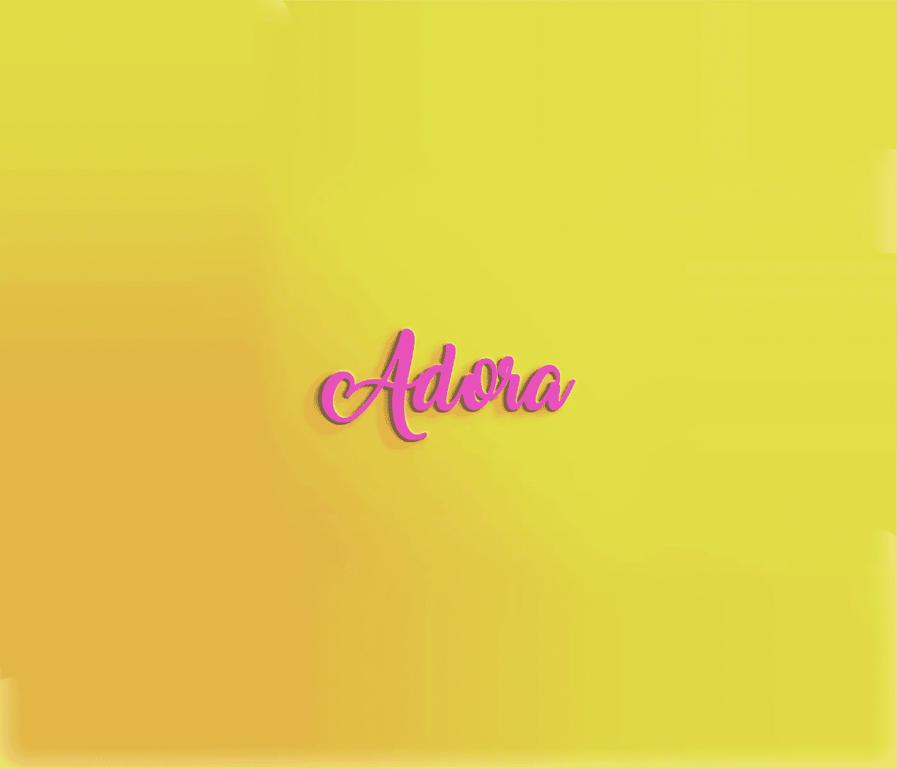

# 谁是阿多拉·恩沃多？请允许我重新介绍我自己

> 原文：<https://medium.datadriveninvestor.com/who-is-adora-nwodo-allow-me-to-re-introduce-myself-e5a550ca41f3?source=collection_archive---------13----------------------->

谁是阿多拉·恩沃多？

我叫 Nenne(至少这是我父母给我起的第一个名字)。我更喜欢被叫做阿达奥拉(我把它拼写成 Adora)，这实际上是我的中间名。

我有很多爱好，这让很多人在过去的几个月里不确定我到底是谁。

*我热爱音乐，我在房间里混音——有些人叫我 DJ(很久以前，我也想成为一名 DJ)。*

*我是一名企业家。我拥有一家时装公司——我的一些女性朋友称我为贝斯普克夫人。*

我喜欢化妆，也经常自拍——有个家伙曾经在 instagram 上给我发了一条 dm，因为他以为我是模特。

我喜欢出去吃饭，当我出去吃饭时，我会给我的食物拍照——有些人认为我有一个美食博客。

我喜欢办派对和招待客人。并不意味着我是活动策划人。

我喜欢在做饭的时候用 snapchat 拍视频——有些人以为我有一个美食博客。

老实说，我喜欢所有这些东西。我喜欢食物、音乐、衣服、人和许多其他东西。但这并不意味着我的职业一定是音乐或美食倾向。

**清嗓子**

***所以请允许我重新介绍一下自己***

我是 Nenne Adaora (Adora) Nwodo，一名软件开发人员和 DevOps 工程师。我也是一名企业家和谷歌助理 Android 开发人员。我于 2017 年从 Unilag 毕业，获得计算机科学学士学位(一级宝贝)，现在在 [Neukleos](http://www.neukleos.com/) 工作。

## 我是怎么到这里的？

对我来说，我对技术的热爱始于我父亲把我的第一台电脑带回家的时候。当时我六岁。我不记得电脑本身的品牌(我想是戴尔)，但它运行的是 Windows 2000。六岁时，我会在 Corel draw 中制作非常蹩脚的补充卡，我也会在 Microsoft powerpoint 中制作开场序列(或电影简介),我感觉自己很棒。对我来说，学习很有趣。我想用自己的方式创造东西，这就是我正在做的事情，而且感觉很好。

当我进入中学时，我认真对待我所有的 ICT 课程。我学会了用 Visual Basic 编写代码，那时我也从事 Web 开发。老实说，这影响了我进入大学后的课程选择。

在我 12 岁的时候，是时候选择我的道路了。我的一面想学习数学，学习编码(我是一个数学天才)。另一方想完全进入整个计算机科学的事情。我得到了一些人的建议，决定从事计算机科学。

## 为什么？

老实说，我觉得软件开发人员和其他相关职业就像迷你神一样。我的意思是，你有了一个想法，然后把它变成完全令人惊奇的东西。我们创造东西。就像我们是被造物主创造出来的一样(看到我在那里做了什么吗？).完美的例子将是脸书，优步，谷歌，亚马逊，易贝等。

我喜欢能够看着一个问题，通过把这个问题分解成一个个子问题，能够解决每个子问题，并利用技术共同解决大问题。太棒了。

然而，我想做得更多。我一直喜欢用科技让世界变得更美好的想法。我想产生影响，现在我离开了学校，我希望我能利用我新的*超能力*以某种方式让我周围的人的生活变得轻松。

这篇文章最初是在我的[博客 Adora Hack 上看到的。](https://adorahack.com/who-is-adora-nwodo)