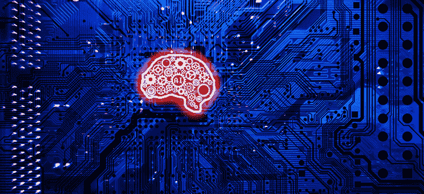
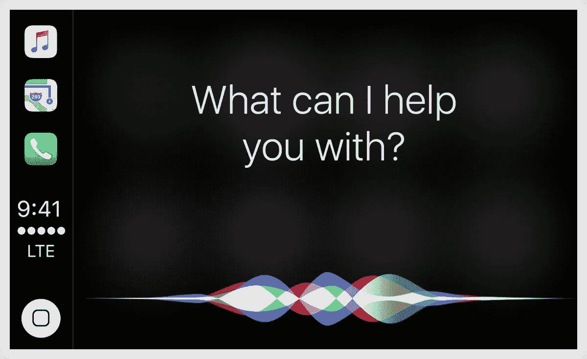
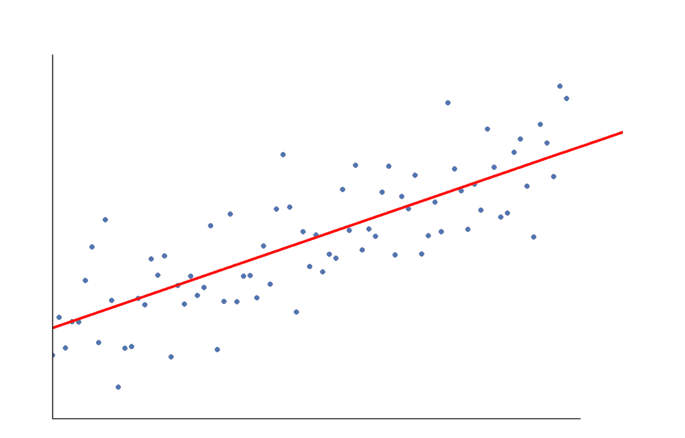
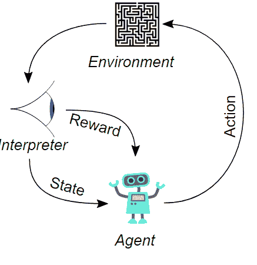
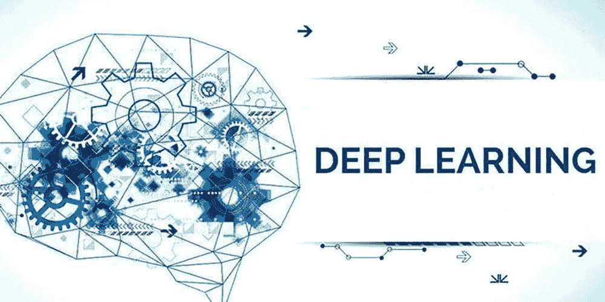
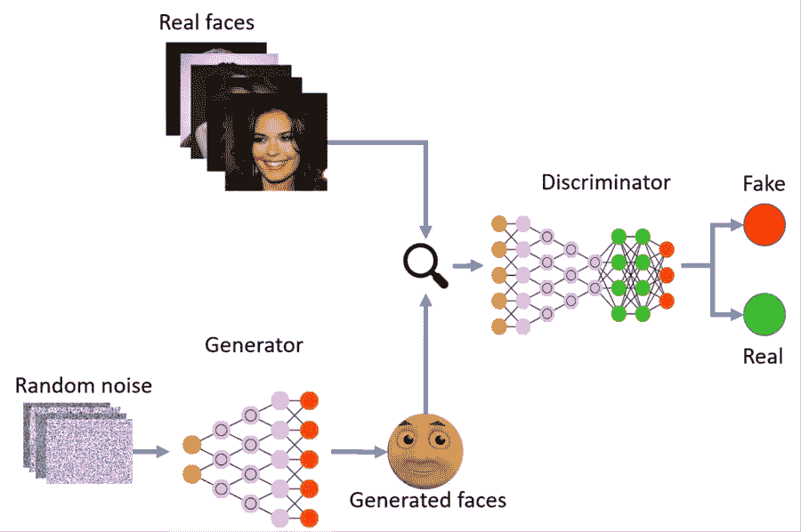
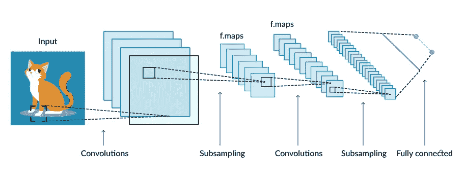
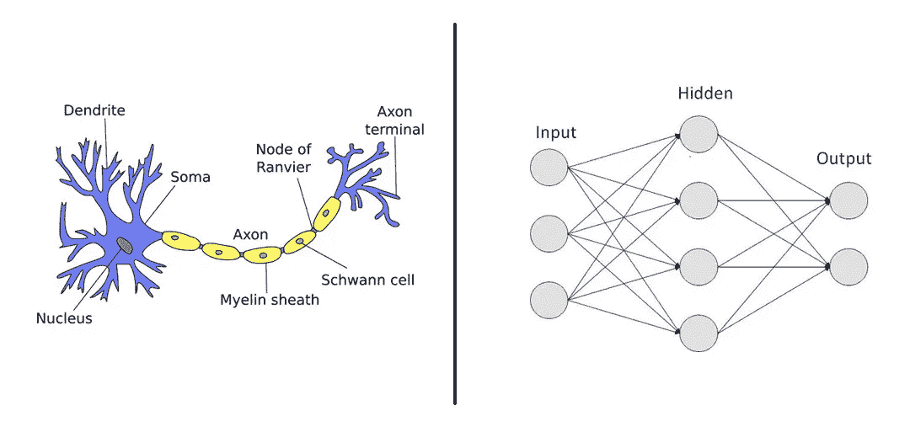

# 理解人工智能

> 原文：<https://medium.datadriveninvestor.com/who-is-ai-ea21790f7d03?source=collection_archive---------2----------------------->

那是上周。我坐在自助餐厅的桌子旁，和一群同学谈论着我不知道是什么，感到无聊和尴尬。所以我决定和旁边的女孩聊一些我感兴趣的事情。她真的对科学和技术很感兴趣，她在我的学校里成立了气候俱乐部，所以出于好奇，我向她询问了一项指数级增长的技术，人工智能。她说的第一句话是:“谁是艾？”

说实话，甚至是我，两个月前，对 AI 还一无所知。那么*什么是 AI？*

# 人工智能

人工智能是计算机科学的一个分支，它是人类的计算机版本，因此被称为人工智能。其核心目的是制造智能机器，执行需要人类智能的任务。

> 历史上定义人工智能领域的四种不同方法:
> 
> **人性思考**
> 
> **理性思考**
> 
> **为人处事**
> 
> **理性行事**

 [## 人工智能与创意:作为创意引擎的 BigGAN |数据驱动的投资者

### 的确，2018 年可以被视为人工智能创造的创造力全盛时期的开始。当然可以…

www.datadriveninvestor.com](https://www.datadriveninvestor.com/2019/02/13/ai-creativity-biggan-as-a-creative-engine/) 

# 人工智能的使用

有两大类人工智能-

1.  **人工狭义智能(ANI)**——又称，*弱 AI，*能*很好地执行奇异任务*，想必比人类更好。它的能力*非常有限，因为它不能自我扩展*并且每个人都使用它。谷歌搜索引擎(最好的朋友)，Siri 和其他个人助理(机器智能)，图像识别软件是日常使用的人工智能的例子。*也是现在的 AI*

2.**人工通用智能(AGI)**——这是一个*机器可以使用人类推理*来执行的想法。它不像阿尼一样能力有限，相反，它可以像人类一样利用理性自学并在其环境中操作。*未来人工智能*

# 机器学习

机器学习基本上是利用数据来预测或回答问题。它有生存技能。它的核心目标是让计算机能够利用它拥有的所有统计数据和数据自动学习和修改自己，并做出合理的预测。

ML 的两个子类别是监督学习和非监督学习。那么这两者有什么区别呢？

**监督学习**——它*使用带标签的训练数据*。它是一个从训练数据集中学习算法的*过程。它需要人类的参与。它既有输入变量又有输出变量，它利用算法“学习从输入到输出的映射函数”*

> 目的是近似映射函数，以便当我们有新的输入数据时，我们可以预测该数据的输出变量。

分类与回归

*分类* -假设你有一篮水果，你必须将相同的水果归类在一起，首先你需要知道水果的不同名称，然后你需要查看鞋子的物理属性，如颜色和形状。之后，您需要查看每个水果的大小，然后根据已知的输入变量将它们配对。这就叫分类。

classifying fruits

*回归*——就是输出，y 值，不断的线性变化。这是一种因果关系法。我们以一个人的年龄为例，那么随着岁月的流逝，一个人也在成长，无论是精神上还是身体上。

example of a linear regression. notice that the line in red is straight not curvy

**无监督学习**——它是一种*不需要标记数据来预测结果的算法，嗯，没有结果。*好的。因此，如果你试图用 10 个人的薪水和他们的 Instagram 粉丝来制作散点图，你将无法在中间画出一条直线，因为 x 和 y 值根本没有关系！(如果你明白这个笑话，你就是它)

> 重要的是没有要匹配的输出，也没有要绘制的表示关系的线。

一种非常流行和重要的无监督学习类型是

*聚类* -聚类基本上在未标记的数据集中找到*一个模式。“聚类的广义定义可以是‘将对象组织成其成员在某些方面相似的组的过程’。”它根据相似性对事物进行分组。*

the shapes are all grouped based on their physical similarites in this example

**强化学习**——基本上是*机器根据环境做出决定的能力，而不需要编程*。它*通过试错*来学习。假设两个机器人被放在一个情境中，当他们面临一个问题时，你可能会想，“好吧，他们不是人类，所以他们甚至不可能试图找到解决方案”。但是不。他们会努力找到解决障碍的方法，直到成功。

In this picuture, the agent’s obstacle was to find a solution to get out a labyrinth

# 深度学习

深度学习是一个*自学系统*，其中*使用现有数据寻找模式，然后使用模式进行预测*。它从训练集中学习，然后将其应用于新数据。它处理数据的速度比人脑快。

> 深度学习从大量非结构化数据中学习，这些数据通常需要人类几十年才能理解和处理

深度学习有四个子类别…

1.  **生成对抗网络(GANs)** -它*识别并学习给定输入数据中的模式，然后生成从原始模型或数据集提取的新输出*。它创建类似于训练数据的新数据。因为新数据几乎与训练数据相似，所以鉴别器将示例分类为真实或虚假。

The generator generated a new face and then adds it to the real face and then the discriminator discriminates the original from the new one

2.**卷积神经网络**——它是一种 *n 图像识别技术*。它使用输入图像，然后对其进行处理，然后对图像进行分类，并将其归入特定类别。

It is a picture of cat. So the CNN will observe everything and then classify it as a cat

3.**人工神经网络** -它通过从同一问题的旧模型中获取信息来解决新问题。它是一种信息处理技术。

> 这台机器创造了一系列能够通过网络发送信息的人工神经元。每个神经元评估问题，做出决定，并在我们称之为网络训练的过程中将信息向前传递。

A nerve cell vs a computer neural network

4.**递归神经网络(RNNs)** -它识别数据序列中的模式。它利用当前输入和先前输入来产生结果。它识别过去的所有模式，并将这些模式分组到当前输入中。

an example of RNNs

在我看来，人工智能在现实世界中有着最多的含义。它被用于自动驾驶汽车、购物、疾病测绘、制造机器人、智能助手等。人工智能还被用于推进新兴技术，如量子计算、脑机接口、个人医疗等等。！！

# 人工智能的伦理问题

很多人认为人工智能正在接管工作，这个世界已经充满了需要工作才能生存的危机，但这些技术是为了让生活更容易。如果人工智能接管卡车司机的工作，那么它也将开辟更多高级工作的可能性。不会有蓝领工作，因此，不会有关于社会等级问题的争论。

许多人认为，如果人工智能可以像人类一样做决定，那么它应该像人类一样被对待。我真的认为，既然人工智能只是机器，他们真的不应该像人类一样被对待。人工智能没有心脏，也不需要氧气来呼吸。见鬼了。它甚至不呼吸。因此，人工智能机器真的不会统治世界，因为它可以根据数据进行预测和决策，所以它们必须像人类一样被对待。

包括我在内的许多人认为，人工智能可以实现意识，这引发了许多关于人工智能伦理方面的辩论。意识意味着意识到物体周围环境的状态。截至目前，AI 还没有意识。它的生存本能只有在面临问题时才会发挥作用，但随着技术的发展，它真的可以拥有意识。

# 🔑外卖食品

*   人工智能是一项正在崛起的新兴技术，可以在医疗保健、教育等许多领域实施。它也有许多道德问题，比如它可能接管工作。
*   机器学习是人工智能，但在机器中，人工智能只是人类的计算机版本。它能比人类更好地完成任务。
*   人工智能和人工智能都有子领域，这些子领域都有不同的方式来预测或回答基于所提供的数据的结果。

**最后但同样重要的是……感谢** **阅读这篇文章！希望你学到了新的东西…**

👋我是 Swatee Barman，我是一名 15 岁的知识社会创新者，我想利用新兴技术解决影响数十亿人的问题。如果你想联系我——

与我联系:

[领英](https://linkedin.com/in/swatee-barman-028a27192)

[中等](https://medium.com/@swateebarman)

Gmail-swateebarman@gmail.com