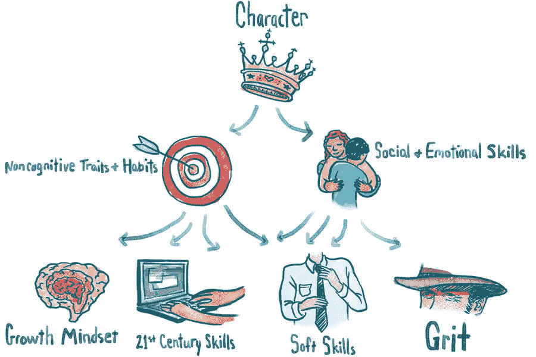
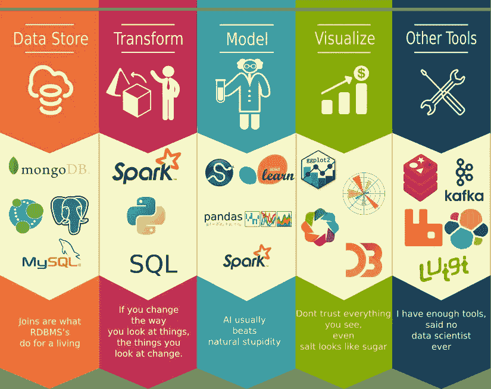

# 谁是数据科学家——现代技术忍者

> 原文：<https://medium.datadriveninvestor.com/who-is-data-scientist-modern-tech-ninja-cd59750b99d2?source=collection_archive---------2----------------------->

我们有很多数据——现在怎么办？我们如何释放数据的真正价值？数据科学家是技术忍者，能够创造性地应对技术挑战，以使他们的代码工作。

# **谁是数据科学家-好奇心和培训**

## **心态**

数据科学就是要积极主动，提出新问题，做出新发现，学习新事物。如果问最专注于工作的数据科学家，他们工作的动力是什么，他们不会说是“钱”。真正的动力是能够利用他们的创造力来解决困难的问题，并不断试图找到任何商业问题的解决方案。正如我最喜欢的老师 Kiril 所说:“我们正在把复杂的事情变得简单”。它是关于揭露隐藏在表面下的“真相”。解决问题不是一项任务，而是一个激发智力寻求解决方案的旅程。数据科学家对他们的工作充满热情，并在接受挑战中获得巨大的满足感。相信我，当你找到解决方案时，满足感是巨大的。

## **训练**

有一种误解，认为你需要一个科学或数学博士才能成为一名合法的数据科学家。学术界高度集中的研究当然是有帮助的，但并不能保证毕业生拥有成功的全部经验和能力。例如，为了在数据科学市场上竞争，一名博士统计学家可能仍然需要掌握大量编程技能并获得业务经验。所以，我认为最好的方法是在你获得学士学位后去找一份数据科学领域的工作，在线学习并在你的日常活动中实施。真的不需要博士学位，相信我。

事实上，数据科学是一个相对较新的新兴学科，大学在开发全面的数据科学学位课程方面还没有跟上，这意味着没有人可以真正声称自己已经“完成了所有学业”，可以成为一名数据科学家。大部分培训来自哪里？数据科学家推动他们在自己的决心指导下，积极主动地自学正确的技能。成功的秘诀是，你所学到的一切都应该尽快在你的业务中实现。每种业务都可以使用数据科学，美就在于此。正如你已经阅读了我的如何在六个月内成为顶级数据科学家的路线图，你可以看到我正在向基里尔·叶列缅科、哈德林·德·庞特维斯、何塞·波尔蒂利亚学习。这些天我开始在麻省理工学院在线学习 python 课程。但是在这四个月里，我意识到最好的学习方法是用你的方式去教别人。为什么？因为你会推得更多，学得更快。当你三个月前开始学习的时候，教别人并不容易，但是正如我之前所说的，美就在其中。同样，你所学的一切都可以在日常活动中实现。例如，我用 Tableau 进行个人理财。我意识到我的钱去了哪里，以及把钱投资到其他活动的更好方式。我还分析了塞尔维亚和加拿大市场，从中获得了非常有价值的见解。

## 技能组合

**数学专业知识**

许多业务问题的解决方案都涉及到建立基于难数学的分析模型，而能够理解这些模型的底层机制是成功建立这些模型的关键。但是不要害怕，当你深入数学的时候你会爱上它的。当你不知道为什么要学习一些愚蠢的函数时，这就不像在学校里了。你所学到的一切都可以应用到你的业务中，并获得有价值的见解，从而更快地发展你的业务。

另外，一个误解是数据科学完全是关于统计的。虽然统计学很重要，但它不是唯一使用的数学类型。当大多数人提到*统计*时，他们通常指的是*经典统计*，但是这两种类型的知识都是有帮助的。

**技术和黑客**

首先，让我们澄清一下，我们不是在讨论侵入电脑的黑客行为。

为什么黑客能力很重要？因为数据科学家利用*技术*来处理庞大的数据集和复杂的算法，这需要比 Excel 更复杂的工具。数据科学家需要能够编码——快速原型解决方案，以及与复杂的数据系统集成。与数据科学相关的核心语言包括 SQL、Python、R 和 SAS。处于外围的是 Java、Scala、Julia 等。但这不仅仅是了解语言基础。黑客是技术忍者，能够创造性地通过技术挑战，使他们的代码工作。

## 商务沟通技巧

数据科学家成为**优秀** **商业顾问**很重要。数据科学家与数据的关系如此密切，他们能够以其他人无法做到的方式从数据中学习。这就产生了将观察结果转化为共享知识的责任，并对如何解决核心业务问题的策略做出贡献。这意味着数据科学的核心能力是使用数据令人信服地讲述一个故事。

对于任何希望通过更多的数据驱动来提升业务的公司来说，数据科学是秘方。数据科学项目可以从数据洞察指导和数据产品开发中获得成倍的投资回报。然而，雇佣拥有这种不同技能组合的人说起来容易做起来难。市场上根本没有足够的数据科学家来满足需求。因此，当你设法雇佣数据科学家时，培养他们。让他们参与进来。给他们自主权，让他们成为自己解决问题的建筑师。这使他们在公司里成为高度积极的问题解决者，在那里处理最棘手的分析挑战。我还可以说，这是任何数据科学家的完美环境，你应该考虑雇用数据科学家。还有一点，你不应该认为数据科学是一根神奇的魔杖，可以在两个月内解决你的问题。你必须给他们时间来收集数据，并将其用于公司的发展。

直到下一次快乐分析，

**Manja**

**你可以关注我的**[**Linkedin**](http://www.linkedin.com/in/manjabogicevic)**和**[**insta gram**](http://www.instagram.com/manjabogicevic/)**了解更多关于数据科学和数据科学以及游击营销的故事。**

