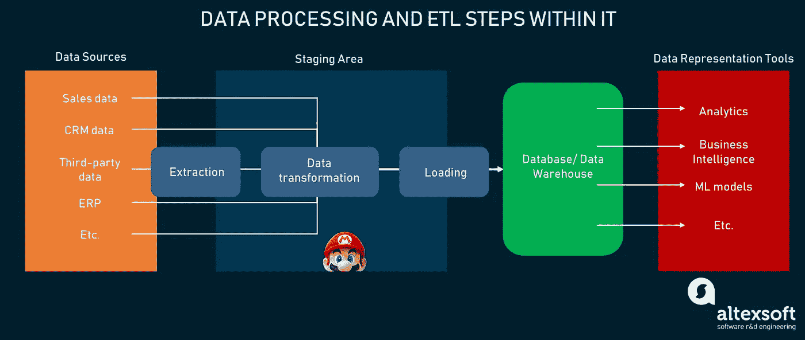
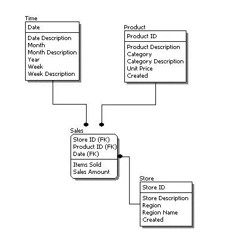
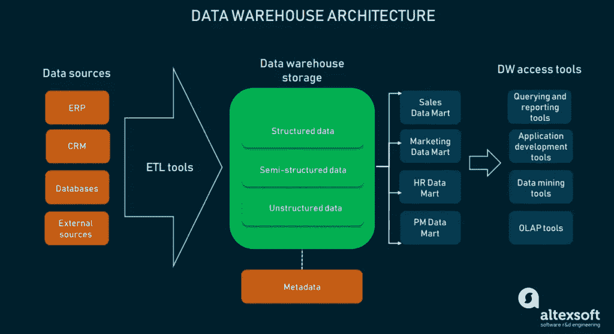
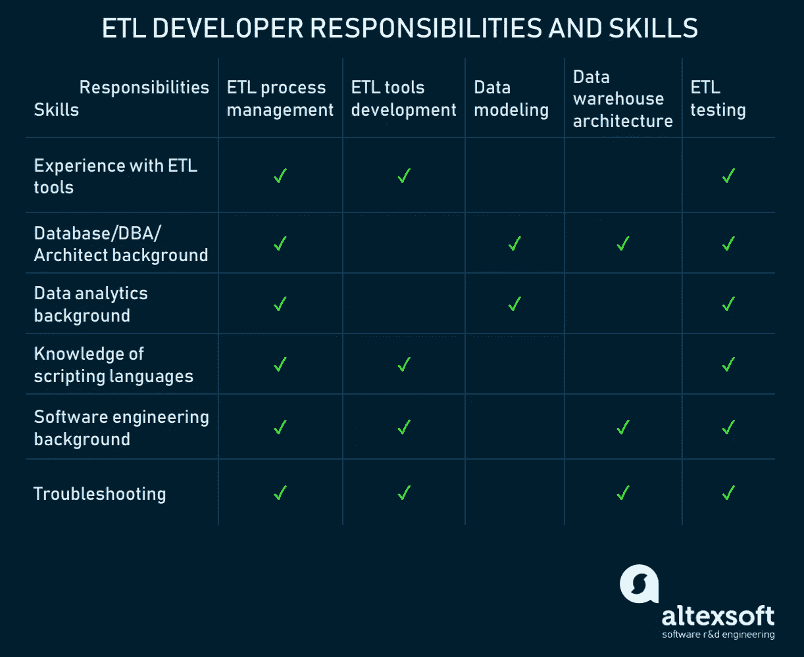

# 谁是 ETL 开发人员:角色描述、过程分解、职责和技能

> 原文：<https://medium.datadriveninvestor.com/who-is-etl-developer-role-description-process-breakdown-responsibilities-and-skills-4a3642a6e96b?source=collection_archive---------3----------------------->

大约 14 年前，[数学家兼数据科学家 Clive Humby](http://www.humbyanddunn.com/) 说:“*数据是新的石油*如今，对数据的痴迷风靡一时，因为所有企业都在努力获取数据。然而，与石油不同，数据本身没有成本，但除非你能理解它，否则它毫无价值。

[*数据工程*](https://www.altexsoft.com/blog/datascience/what-is-data-engineering-explaining-data-pipeline-data-warehouse-and-data-engineer-role/?utm_source=MediumCom&utm_medium=referral&utm_campaign=shares) 和 [*数据科学*](https://www.altexsoft.com/data-science-and-machine-learning-consulting/?utm_source=MediumCom&utm_medium=referral&utm_campaign=shares) 的敬业从业者是当今寻找新方法收集、处理和存储数据的淘金者。使用特定的工具和实践，企业实施这些方法来产生有价值的见解。企业利用数据的最常见方式之一是[商业智能](https://www.altexsoft.com/blog/business/complete-guide-to-business-intelligence-and-analytics-strategy-steps-processes-and-tools/?utm_source=MediumCom&utm_medium=referral&utm_campaign=shares) (BI)，这是一套将原始数据转化为可操作信息的实践和技术。

 [## 为什么数据将改变投资管理|数据驱动的投资者

### 有人称之为“新石油”虽然它与黑金没有什么相似之处，但它的不断商品化…

www.datadriveninvestor.com](https://www.datadriveninvestor.com/2019/01/25/why-data-will-transform-investment-management/) 

这些数据可以用于各种目的:进行[分析](https://www.altexsoft.com/blog/business/transform-decision-making-with-a-data-driven-culture/?utm_source=MediumCom&utm_medium=referral&utm_campaign=shares)或创建[机器学习](https://www.altexsoft.com/whitepapers/machine-learning-bridging-between-business-and-data-science/?utm_source=MediumCom&utm_medium=referral&utm_campaign=shares)模型。但不能以原始格式使用。任何处理数据处理的系统都需要将信息从存储器中移出，并在过程中进行转换，以供人或机器使用。这个过程被称为**提取、转换、加载**，或者 **ETL** 。通常，它是由特定类型的工程师——ETL 开发人员来完成的。

在本文中，我们将讨论 ETL 开发人员在数据工程团队中的角色。我们将讨论他们的主要职责和技能，同时揭穿 ETL 开发人员和相关角色的常见误解。

# 谁是 ETL 开发者？

ETL 开发人员是一种软件工程师，他们管理*提取、转换、*和*加载*过程，实现技术解决方案来完成这些工作。该过程分为三个主要阶段:

**提取物**。企业将历史信息或实时数据流存储到许多系统中。这些信息分散在不同的软件中，并以不同的格式组织。提取阶段需要定义所需的数据源，无论是 ERP、CRM 还是第三方系统，并从它们那里收集数据。

**变换**。当从数据源收集数据时，它通常被放在一个叫做*暂存区*的临时存储器中。当放置在该区域中时，数据按照定义的标准和模型进行格式化。例如，不同格式的金融数字$34.50，0.90 美分，01.65 将被更改为单一连贯格式:$34.50，$0.90，$1.65。

**加载**。ETL 过程的最后阶段是将结构化和格式化的数据加载到数据库中。如果数据量很小，任何类型的数据库都可以使用。BI、大数据处理和机器学习中使用的一种特定类型的数据库称为*数据仓库*。

仓库在结构上不同于普通的数据库:它可能包括几个工具来表示多维数据，并使每个用户都可以访问它。*数据表示* *工具*连接到一个仓库，以便用户可以将它拖出来并对其进行操作。表示工具是实际的 BI 工具，通过交互式仪表盘和报告工具提供分析数据。

*Data processing in a nutshell and ETL steps outline*

数据在到达最终目的地供用户访问之前，要经过多种技术形式。为了移动数据，我们需要建立管道，而这正是管道工(ETL 开发人员)的工作。

通常，ETL 开发人员是数据工程团队的一部分——负责数据提取、处理、存储和维护相应基础设施的酷小子。数据工程团队的主要任务是获得原始数据，决定它看起来应该是可消费的，使它成为可消费的，然后存储在某个地方。

团队的名单取决于项目的范围、目标、数据处理的步骤和所需的技术。因此，数据工程团队可能包括以下角色:

*   **数据架构师。**一个人可以是[数据科学或数据工程团队](https://www.altexsoft.com/blog/datascience/how-to-structure-data-science-team-key-models-and-roles/?utm_source=MediumCom&utm_medium=referral&utm_campaign=shares)的一部分。数据架构师的角色是设计数据工程师将要开发的基础设施。
*   **数据工程师**。这是一种特定类型的软件工程师，他们开发界面和生态系统来获取信息。
*   **数据分析师。这个团队成员定义数据收集方法、数据模型、类型，并概述转换过程。**
*   **数据库/仓库开发者**。数据和其他信息一样，必须存储在某个地方。它可以是一个普通的 SQL 数据库，也可以是一种特殊类型的存储，即数据仓库。数据库/仓库开发人员负责数据存储的建模、开发和维护。
*   **DBA 或数据库管理员。**这是一个负责[数据库管理的人](https://www.altexsoft.com/blog/business/comparing-database-management-systems-mysql-postgresql-mssql-server-mongodb-elasticsearch-and-others/?utm_source=MediumCom&utm_medium=referral&utm_campaign=shares)如果有多个数据库，或者一个 DB/warehouse 的结构，像火箭科学一样复杂。
*   **数据科学家**。处理机器学习的项目还包括一名数据科学专家，甚至一个专门的部门。
*   **商业智能开发者。**这是一名专注于开发 BI 接口的软件工程师。
*   **ETL 开发人员**是一名软件工程师，通过开发/管理相应的基础设施，涵盖数据处理的提取、转换和加载阶段。

将 BI 项目作为数据处理的主要业务用例，让我们详细阐述 ETL 开发人员的职责。

# ETL 开发人员的职责是什么？

就 BI 项目而言，ETL 开发人员是主要的工程角色之一。虽然主要职责是负责提取、转换、加载阶段，但是 ETL 开发人员执行与数据分析、测试和系统架构相关的任务。为了概述 ETL 开发人员可以执行的所有可能的任务，我们将简要介绍所有可能的任务:

*   ETL 过程管理
*   数据建模
*   数据仓库体系结构
*   数据管道(ETL 工具)开发
*   ETL 测试

现在，我们来详细说说每一点。

## ETL 过程管理

ETL 是数据处理的关键阶段之一。它既有方法，也有技术。ETL 开发人员或专门的开发团队的主要任务是:

*   概述 ETL 过程，设置数据处理的边界
*   为每个元素和整个数据管道提供系统架构
*   记录系统的需求并管理其开发
*   参与 ETL 工具的实际开发/实现
*   [对工具和数据管线进行测试](https://www.altexsoft.com/whitepapers/quality-assurance-quality-control-and-testing-the-basics-of-software-quality-management/?utm_source=MediumCom&utm_medium=referral&utm_campaign=shares)

因此，ETL 开发人员可以是工程师、技术主管、项目经理或 ETL 过程的 QA，这取决于系统的范围。ETL 开发人员经常与团队的其他成员合作，以获取有关业务需求或最终用户需求的信息。它需要正确理解需要什么样的数据格式，应该如何加载(按部分加载，或动态更新)，以及如何在数据仓库中表示(OLAP 立方体、SQL、NoSQL、数据集市等)。).

我们联系了[韦恩·亚多](https://www.linkedin.com/in/wayne-yaddow-7839624/)，一位数据质量培训师和商业智能顾问，详细阐述了 ETL 开发人员的职责。Wayne 建议考虑以下几点:“*ETL 开发人员负责分析、解释数据模型，并与数据分析师合作解决数据问题。所有的系统设计和发布活动都要通过 ETL 开发人员的验证。还要考虑需求验证，对系统用户、开发人员进行用户访谈，以及对 ETL 过程的业务需求进行监控*。

## 数据建模

在从数据源提取数据之前，ETL 开发人员应该定义需要哪些格式。将在仓库(和用户界面)中表示的数据的最终格式被称为*数据模型*。

*Logical data model example*

数据模型是通过与业务分析师、数据分析师和数据科学家合作来构建和记录的。ETL 开发人员将使用这些模型来定义转换阶段和执行格式化的底层技术。

## 数据仓库体系结构

仓库是用于保存结构化数据的大型存储设施。它通常被分解成更小的元素，如数据集市。数据集市用于向专门部门提供对具有特定属性的所需数据的访问。例如，如果仓库是一个收集了所有信息的大型存储区域，那么数据集市就是存储主题数据(会计、网站指标等)的小型数据库。)

仓库本身或数据集市连接到最终用户界面，帮助用户访问信息、操作信息、进行查询和形成报告。此外，在格式化阶段可以用元数据丰富数据，这也涉及到整个仓库体系结构的变化。

*Warehousing architecture and data representation tools*

ETL 开发人员负责定义数据仓库架构以及将数据加载到其中的工具。仓储是一个复杂的过程，其开发通常由专门类型的数据库开发人员进行。然而，ETL 开发人员可以拥有构建它所需的所有技能和知识。

## 数据管道开发

每个系统组件独立设计后的最后阶段是数据管道的开发。数据管道是一种技术基础设施，可作为一个系统自动执行以下操作:

**从给定来源提取数据**。只要信息存储在不同的系统中，ETL 工具就应该与每个系统集成在一起。

**数据上传到中转区**。暂存区是进行格式化的地方。在某些情况下，它可以在仓库中完成，但最常见的是使用一个单独的数据库来加快过程并保持仓库的整洁。

**数据格式化**。当数据传输到临时区域时，会按照定义的标准进行格式化。这可能包括以下操作:

*   数据清理，删除无用数据字段的过程
*   数据结构化/映射，定义数据类型和它们之间的联系的过程
*   添加元数据以丰富细节信息

**将结构化数据加载到仓库**。数据可以分部分加载，也可以不断更新。动态信息可能需要查询方法从数据源请求更新的数据。如果不需要更新，数据将按部分加载。

## ETL 测试

在开发过程中，ETL 开发人员负责测试系统、单元、数据模型和仓库架构。除了通常的 QA 活动之外，ETL 测试还需要检查以下方面:

*   数据模型测试
*   数据仓库架构测试
*   制图表达工具检查
*   数据流验证
*   上传/下载/查询速度测试
*   系统性能测试

技术实现通常由 QA 团队和软件工程师来完成。但是特定于数据的方面由 ETL 部门和数据分析部门检查。 *ETL 测试包括 ETL 系统代码、数据设计和映射技术的测试。Wayne Yaddow 指出:“对所有流程进行根本原因分析和解决生产问题也是流程的一部分，对数据库和数据流测试进行常规测试也是流程的一部分。*

为了履行上述所有职责，ETL 开发人员应该拥有丰富的技术背景。因此，现在我们将转向 ETL 开发人员所拥有的实际技能。

# ETL 开发人员的技能

ETL 开发人员是一个特定学科的角色，需要几个领域的专业知识。ETL 开发人员具有软件工程背景和数据库开发经验。这是 ETL 开发人员的一般素质，但是让我们把它缩小到特定的技能。

*The list of ETL developer’s skills required to execute corresponding responsibilities*

使用 ETL 工具的经验。由于数据工程是一个成熟的行业，市场上有很多现成的解决方案。像 [Talend](https://www.talend.com/) 、 [Informatica](https://www.edureka.co/blog/what-is-informatica/) 和 [Pentaho](https://www.hitachivantara.com/en-us/products/big-data-integration-analytics/pentaho-data-integration.html) 这样的仪器被认为是行业标准。因此，ETL 开发人员使用这些工具的体验就像设计师使用 Photoshop 一样。

ETL 工具是开箱即用的解决方案，可以从一开始就执行提取、转换和加载步骤。ETL 开发人员 in‌ ‌this‌ ‌case 是连接数据源和仓库的数据集成工具的管理员。任务是将现有的工具与 ETL 工具集成，管理操作，并实现一个接口以使数据可用。

**数据库/DBA/架构师背景**。ETL 开发人员必须是数据库工程方面的专家。为了理解数据存储需求和设计仓库架构，ETL 开发人员应该具备 SQL/NoSQL 数据库和数据映射方面的专业知识。还有像 [Hadoop](https://www.nec.com/en/global/prod/slpf/product/dph/index.html) 这样的仪器，它既是 ETL 作为数据集成工具使用的框架，也是平台。

**数据分析专长**。只要 ETL 开发人员参与数据建模、映射和格式化，就需要数据分析专业知识。

**脚本语言知识**。如果您处理大型数据集和复杂的管道，您将需要一些自动化。ETL 开发人员可以使用脚本来自动化这个过程的一小部分。ETL 最流行的脚本语言是 Bash、Python 和 Perl。

**软件工程背景**。ETL 开发人员在编程语言方面有很强的专业知识。ETL 用的最多的是 C++和 Java。如果将通过移动设备使用数据表示工具，也可以使用 JavaScript。

**故障排除**。数据处理系统操作大量数据，并且包括多个结构元素。ETL 开发人员负责系统的正常运行，这需要很强的分析思维和故障排除技能。

# 什么时候雇佣 ETL 开发人员？

由于技术背景和职责领域的原因，ETL 开发人员与其他数据工程角色有交叉。主要的建议是，当您在构建大规模数据处理系统并且数据流很复杂时，雇用 ETL 开发人员。在这种情况下，ETL 开发人员是不可替代的。

**仓库开发人员而不是 ETL 开发人员**:如果你的系统的焦点落在数据仓库内部的操作上，仓库开发人员是 ETL 开发人员的一个很好的替代者。在 BI 项目中具有丰富专业知识的专用数据库/仓库开发人员可以执行数据流实施，并使用数据集成工具。

**商业智能开发人员，而不是 ETL 开发人员** : BI 开发人员是软件工程师，专门实现依赖于数据管道的 BI 接口。如果您的项目侧重于现成的解决方案，以及与商业智能工具提供商的集成，BI 开发人员将承担维护系统的任务。

*最初发表于 AltexSoft 技术博客**[***谁是 ETL 开发人员:角色描述、流程分解、职责和技能***](https://www.altexsoft.com/blog/datascience/who-is-etl-developer-role-description-process-breakdown-responsibilities-and-skills/?utm_source=MediumCom&utm_medium=referral&utm_campaign=shares)*