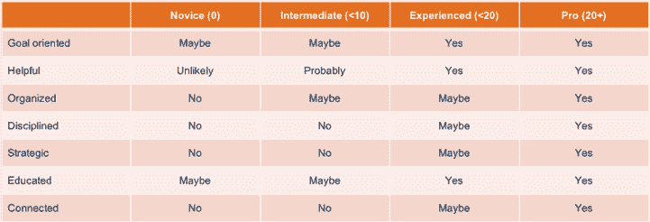
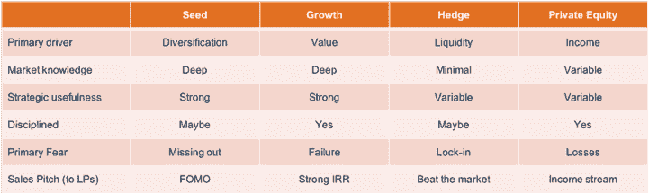

# 谁在投资大麻产业？

> 原文：<https://medium.datadriveninvestor.com/who-is-investing-in-the-cannabis-industry-a1f4006ac620?source=collection_archive---------37----------------------->

“man holding lighter” by [A B E D K A Y A L I](https://unsplash.com/@abedkayali?utm_source=medium&utm_medium=referral) on [Unsplash](https://unsplash.com?utm_source=medium&utm_medium=referral)

作为大麻产业的投资者，企业家会问我们，他们在寻找资金时有哪些选择，如果有的话，这些选择会有什么不同，因为这是整个联邦非法的全新产业。

首先要知道的是，事实上，这个行业存在一些差异，但这些差异更多地与这个行业的新颖性有关，而不是与它的现状有关。因为大麻是一个年轻的合法行业，许多在更成熟的行业中的融资形式不太常见…比如银行贷款和信用额度。

为了帮助你更好地了解作为企业家的选择，我们细分了四种不同类型的资金来源，以及每种来源与这个新兴行业的关系。

众筹
你总是可以选择一种众筹方式，即一家公司从个人那里获得现金，以换取某种特殊待遇——可以是首次使用产品、帮助设计产品的机会，甚至是少量股权。这种类型的融资有许多利弊，但这里要注意的重要一点是，在这种情况下提供资金的人是对你的业务感兴趣的普通人。因此，它不仅是一个很好的现金来源，也是一个增加曝光率的好方法。不过要小心行事，因为[是大麻产业的一部分，这让它变得更加复杂](https://mjbizmagazine.com/the-411-on-cannabis-crowdfunding/)。

**天使投资人**

除了风险资本，这是大麻领域最常见的股权融资形式。天使投资者是对有前途的公司进行私人投资感兴趣的高净值个人。

有时天使作为个人单独投资，有时他们作为团体或财团的一部分进行投资，通常由 Arcview Group 这样的组织提供便利，Arcview Group 是大麻行业最大的天使团体。天使投资集团的结构都略有不同，但天使投资集团最重要的一点是，他们是围绕寻找和整理交易，并最终为其中一些交易提供资金而建立的。

天使可以快速行动，承担其他投资者可能不舒服的风险，这可能是他们被称为“天使”的部分原因——他们可能会在你最需要的时候把你举起来。

不管你在哪里找到他们，都有很多这样的投资者——一些比其他人更有组织性、纪律性和经验。作为一名企业家，你需要知道寻找什么，以确定他们是谁，以及你应该(或不应该)花多少时间与他们在一起。

下面的图表将帮助你了解天使，以及他们的问题和目标如何帮助你确定他们对这个空间的熟悉程度。

**家族办公室**

家族办公室管理家族积累的财富。家族理财室由“家族”雇佣并支付薪酬的专业投资者管理，他们代表家族审查交易流程、提出投资建议并为交易提供资金。警告——家族理财室可能会比较保守，在投资决策上行动缓慢，所以要做好耐心的准备，要明白家族中有人可能会因为大麻而拒绝投资。家族政治和戏剧可以在这里发挥作用，但一个好的家族办公室经理将有助于减轻这一点。

**资金**

市场上有相当多不同类型的基金，每种基金在投资地点、时间和方式上可能都有不同的目标和偏好。作为一名负责筹资的企业家，你有责任成为积极投资于你所在行业的所有基金的专家。

下面是一些不同类型的基金及其目标的分类。

***【风险投资基金(种子期和成长期)***

种子期和成长期风险资本基金(以及天使投资者)在大麻行业也很常见，最适合服务于新兴市场。这些基金的目标是以一定的估值(有时是折价)投资一家公司，并在未来获得高额回报。这些基金中的大多数都希望在 10 年内获得 10 倍的投资回报，因为它们会以某种形式退出——IPO、并购或收购。这就是为什么在过去的 5 年里有这么多风险投资基金进入大麻产业并不奇怪。然而，有一句话要小心“蒸汽”基金——只存在于网站和新闻稿中的基金。大麻行业有很多蒸汽基金。他们是蒸汽基金，因为他们没有资本在银行投资。要么他们正在筹集资金，要么他们计划与你谈判一笔交易，然后出去筹集资金，一些人称之为“募集资金”。不要害怕在签署文件时问风险投资基金是否有足够的资金来完成交易…而不是在他们出去找投资者筹集资金来完成交易之后。

***对冲基金***

除了风险资本，我们还看到了对冲基金在大麻行业的发展——尤其是随着公开市场重要性的提升。与风险资本基金相比，对冲基金更注重创造快速流动性(即快速投资回报)。

对冲基金投资一家私人公司，并明确计划让其上市，这种情况并不少见。通常，这种确切的情况会在他们的投资文件中详细说明，或者修改到公司的经营协议中，以确保如果他们不执行这一计划，公司将受到惩罚。再次，企业家要小心。

也就是说，对冲基金通常是由经验丰富的投资者管理的——他们在金融方面比你更有经验——所以他们可以让你变得超乎想象的富有。然而，它们也能摧毁你的公司。

***私募基金***

私募股权基金与天使投资人、对冲基金、风险投资基金和家族理财室截然不同。私募股权基金通常看到所有者通过董事会代表或股份所有权将公司控制权让给私募股权公司。尽管创始人可能会继续持有一些股份，但私人股本融资通常会带来全新的管理和所有权结构。

由于传统的私募股权是一种后期投资模式，迄今为止在大麻行业中相对不常见——主要是因为该行业目前规模较小且缺乏大公司。随着行业的成熟，我们预计在未来 3-5 年内，大麻行业将会出现更多私募股权形式的投资。

**公共市场**

首次公开发行(IPO)是初创企业融资的一种常见形式。目前，在美国只有少数公司选择了这种方式。然而，由于加拿大联邦政府对大麻的进步立场，加拿大在这一领域取得了显著进展。通常情况下，上市对于初创公司来说不是一个好的选择，但在大麻行业，上市已经成为相对流行和有利可图的融资方式。为什么？一个词——流动性。投资者和所有者可以通过公开募股、反向并购或其他上市机制获得股票流动性。在大麻行业之外，趋势正好相反，在大型基金和主权财富基金的帮助下，私人持有的“独角兽”保持私人身份的时间越来越长，这些基金将 9 位数的资金投入到 11 位数和 12 位数的估值中。事实上，美国上市公司的数量目前正在减少。

了解你可以利用的不同形式的资金，以及每种资金在当前大麻行业中是如何相互作用的，将有助于你的公司选择正确的道路。所以，在选择最适合你的方案之前，一定要想好你的目标和时间表。

*原载于*[*go.canopyboulder.com*](https://go.canopyboulder.com/news/who-is-investing-in-the-cannabis-industry)*。*