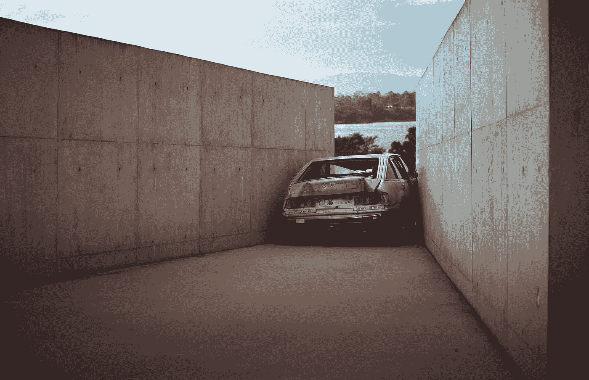

# 在自动驾驶汽车发生事故的情况下，谁应该承担法律责任？

> 原文：<https://medium.datadriveninvestor.com/who-is-legally-accountable-in-the-case-of-an-autonomous-vehicle-accident-d536f0e969a2?source=collection_archive---------4----------------------->

## 人工智能车辆的案例。

“wrecked gray vehicle between concrete walls at daytime” by [Gareth Harrison](https://unsplash.com/@gareth_harrison?utm_source=medium&utm_medium=referral) on [Unsplash](https://unsplash.com?utm_source=medium&utm_medium=referral)

我仍然认为自动驾驶汽车是一种奢侈品，而不是必需品；汽车制造商继续提出人工智能汽车优于非自动驾驶汽车的论点。

不过，考虑到这种情况——在某些情况下，如果司机是残疾人，受影响，或者只是累了，让 *AI 来驾驶(可怜的凯莉·安德伍德双关语)*。

问题仍然存在，万一发生事故，谁负法律责任？

在澳大利亚，政府已经明确表示，无论行人多么无知，司机几乎总是错的。考虑到这种困境，如果汽车是自动驾驶的，制造商应该承担法律责任吗？

为人工智能辩护的理由是，它是优越的，随着不断的改进，自动驾驶汽车已经发展出预测/防止撞车的能力*(正如一个病毒特斯拉视频中所展示的)*。

从保险的角度来看，就我的理解而言——无论如何，方向盘后面的司机应该注意道路，因此责任由司机承担，而不是自动驾驶汽车。

如果政府形成相同的意见，就排除了自动驾驶汽车被追究事故责任的可能性；因为这样的人工智能系统故障或车辆故障与机械故障属于同一类别。

尽管应该提出这样的论点，如果自动驾驶汽车的唯一目的是消除驾驶员的压力，那么让 ***AI 来驾驶*** *(另一个无耻的 Carrie Understood reference)。*那么，如果不是为了豪华，为什么司机会一开始就投资一辆昂贵得多的车呢？

沃尔沃*的总裁兼首席执行官哈坎·萨缪尔森 坚持认为，如果全自动驾驶汽车出现系统或感官故障，公司将承担法律责任。*

*同时，在半自动驾驶车辆中——对人工智能故障的调查、驾驶员的责任以及对事故的逐案分析都将纳入考虑范围，因此驾驶员可能/可能在事故中承担法律责任。*

*这是指拥有和操作自动驾驶技术车辆的个人。*

*在拼车服务的情况下，情况可能会有所不同——例如 ***优步*** 推出自动驾驶车辆，如果司机正在驾驶车辆，情况也不会有所不同，因为乘客愿意进入车辆，因为他们知道车辆是通过人工智能技术驾驶的。*

> *出于争论的原因，我将暂时排除人工智能系统黑客——因为它可能属于犯罪干扰或网络犯罪类别。*

*半自动和全自动车辆的情况已经如此确定，*

*如果车辆是**半自动**，司机在法律上是有责任的，因此要对任何损害负责。*

*在**全自动驾驶汽车**的案件中，该案件仍然不确定，无法形成关于确切的**谁**将被追究法律责任的意见。*

*   ***应该是制造商吗，**如果是，这是客户在购买自动驾驶汽车时签订的协议吗？*
*   ***这应该是一项人工智能机制调查吗，**如果是，我们会看到政府在改进的交通犯罪部门建立进一步的支出以监控人工智能系统故障吗？*
*   ***如果是保险公司的责任，**如果是这样，将会制定新的政策，因此，该案件将会在保险公司、制造商和相关车辆所有者之间反复进行。*

*毫无疑问，随着技术创新的到来，监管也在演变，对人工智能驾驶汽车的需求很可能会成为未来交通运输的基础。*

*在我们能够准确确定谁应该承担责任之前，客户是否应该冒险购买一辆自动驾驶汽车——如果不是为了奢侈品的话？*

> *这是一个需要研究和回答的问题，显然一如既往——我不是对这项技术不屑一顾，但我确实希望更好地理解被称为“现代交通的未来”的法律分支。*

***请随时在下面留下您的意见，我总是乐于接受开放的辩论，并随着这项技术的发展获得进一步的见解。***

***感谢您的阅读。***

**原载于 2018 年 11 月 2 日*[*www.datadriveninvestor.com*](https://www.datadriveninvestor.com/2018/11/02/who-is-legally-accountable-in-the-case-of-an-autonomous-vehicle-accident/)*。**