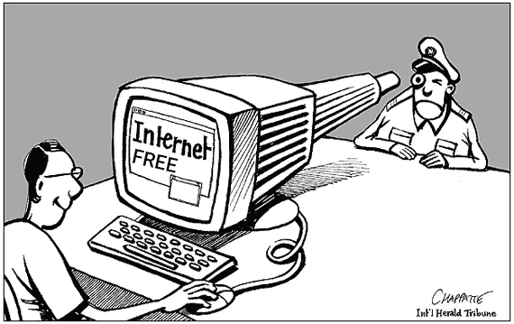
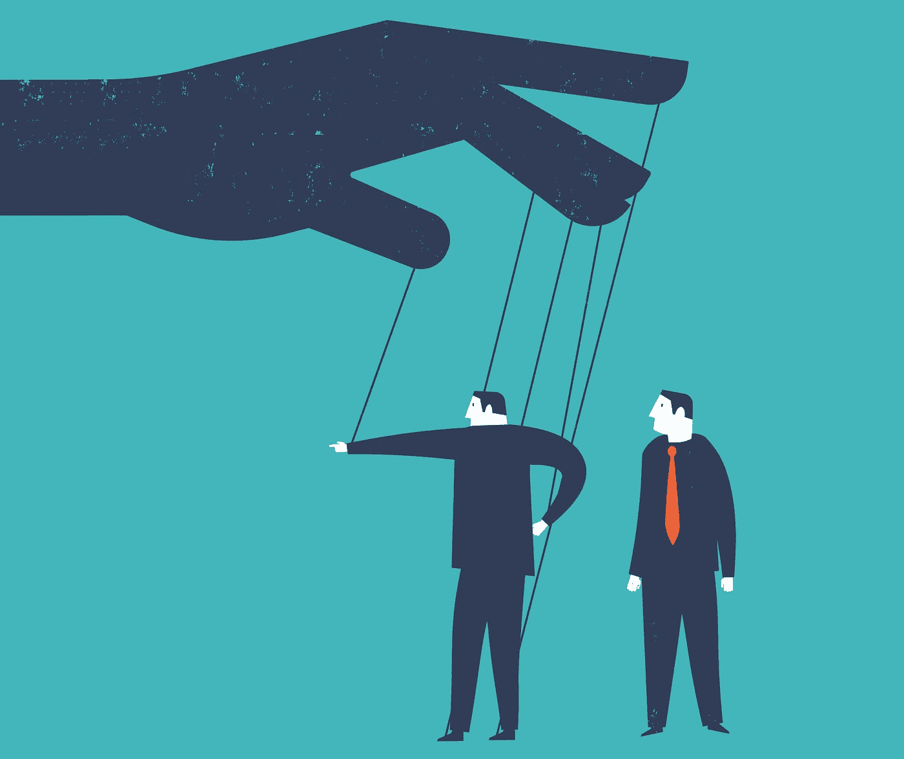
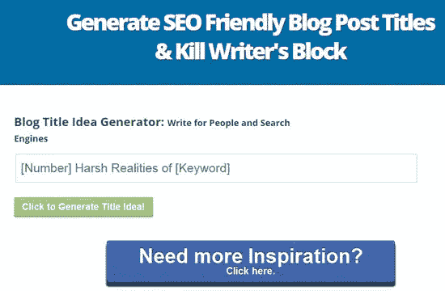

# 谁在为所有免费的东西买单？

> 原文：<https://medium.datadriveninvestor.com/who-is-paying-for-all-the-free-stuff-10c65ae758e6?source=collection_archive---------15----------------------->

## 第 4 部分:为什么隐私很重要？

在本系列文章的最后一部分中，我们看到了数据经纪人、搜索引擎和社交网络如何将互联网变成了一张巨大的渔网，以及我们如何被赤裸裸地卷入其中。几乎我们使用的每一个电子产品和每一个在线服务都会收集我们的数据。我们在上一篇文章中提出的问题是…

*那又怎样？
他们真的能用我所有的数据做什么？
我只是一个凡人，为什么我的隐私如此重要？*

 [## 谁在为所有免费的东西买单？

### 第三部分:裸体站在人群中

medium.com](https://medium.com/@rahul.nyk/who-is-paying-for-all-the-free-stuff-472796c884ea) 

1950 年，诺伯特·维纳在他的《人类对人类的利用》一书中，提出了一项思想实验。他设想了一个全球计算机系统，在这个系统中，每个人都有自己的设备，这些设备根据他们所做的事情给他们反馈。

他假设，在这样一个科技发达的世界里，所有的人都会受到某种程度的行为改变。他认为，这样的社会将是疯狂的，将无法面对自己的问题。但他感到欣慰的是，这只是一个思想实验。

在当今世界，他将负担不起这种奢侈。在许多方面，今天的互联网很像诺伯特·维纳想象的那样。所以我们可能会问…

*他对大规模行为改变的预测正确吗？我们是否正在走向一个无力面对自身问题的社会？*

我将在文章的这一部分尝试回答这些问题。

让我们看看我们的现实离诺伯特·维纳思想实验有多近。

## 情感黑客

人工智能不同于其他形式的软件技术，因为它可以学习和适应。一个经典的程序可以用一个明确定义的方法做它应该做的事情，以达到一个明确定义的目标。另一方面，人工智能程序旨在实现一个目标，没有明确定义的方法。它从数据中学习并自我进化。AI 不知道道德，它只知道成功和失败。因此，人工智能算法为实现目标所做的事情往往是不可取的，甚至是神秘的。

我们使用的免费互联网服务收集的所有数据都被人工智能算法(如 facebooks feed 算法和 youtube 推荐算法)用来研究我们的在线和离线活动。过去 10 年左右开发的人工智能很大一部分(如果不是全部的话)只是为了研究在线人群，并向他们展示赞助内容。这样做，人类心理最脆弱的部分正被人工智能利用，以最大限度地利用互联网的货币——人类的注意力。

你的注意力是社交网络或任何内容生成平台(如 youtube 或 facebook)的产品。正如 facebooks 的联合创始人之一肖恩·帕克所说:

> “构建这些应用程序的思维过程，脸书是第一个，……都是关于:‘我们如何尽可能多地消耗你的时间和有意识的注意力？’"

***如何通过他们的注意力来抓住和抓住人群？***

寻找这个问题的答案成为 AI 的第一批大规模使用案例之一。包括社交网络在内的这些内容平台创造的算法，旨在找出什么吸引了你的注意力，以及如何保持这种注意力。

这些算法有意无意地了解到，抓住你注意力的最简单方式是抓住人类心理最脆弱的方面。他们了解病毒内容背后的模式，并最大限度地利用它。

1.  **情调**
    情调高的内容产生的牵引力更大。情感内容更能吸引大众，产生更多的喜欢、支持和评论。当我们充满短暂而强烈的情绪时，我们的逻辑部分会变得盲目。
    负面情绪是强大的内在触发因素，更容易被激发。它们的发电成本也更低。愤怒、轻蔑、仇恨、孤独、不满、害怕失去等情绪比积极情绪更强烈，因此更有可能引发行动。人们更容易相信消极的观点，而不是积极的观点。给我们带来不安全感的内容比给我们提供真实信息的内容传播得更快。
2.  **争议。**
    简单的道理往往平淡无奇。替代解释总是更有趣。人类登月太简单了，没什么意思，一个精心策划的伪装成登月的假登陆更吸引人。再加上一些神秘的死亡，你就有了一个获胜的公式。
3.  **哗众取宠。** *“让你保持健康的练习”*是一个没有人会点击的标题，*“你需要立即开始的 5 个确定的练习来减掉那难看的赘肉”*更吸引人。
    强化词和修饰语，如“多”、“丑”、“马上”等。已经成为任何标题、说明甚至帖子内容的组成部分。事实上，有太多的在线工具给你一些关键词，建议你如何修改标题来增加内容的病毒式传播。

1.  **强化元素。包含以前用过的熟悉元素的内容更有可能引起消费者的共鸣。实验被认为是危险的，坚持配方更安全。一个很好的例子是千禧年 whop，我将在下一节解释它。**

请注意，内容的真实性或其道德性根本不在这个等式中。事实上，很多时候恰恰相反。真相平淡而简单，小说往往更有趣，而且可以根据口味进行调整。此外，真相并不是人工智能的目标。

有句谚语说“不要让事实妨碍一个好故事。”这似乎比过去任何时候都更真实。

## 降级内容

最早的内容生成者依靠其内容的质量来产生吸引力。例如，一个好的摄影师会尝试点击最好的照片，一个电影制作人会制作高质量的视频等等。随着时间的推移，随着内容数量和免费消费的增加，分发变得越来越算法化。

作为对算法偏见的回应，艺术家们退居二线，而注意力传播者开始推动狂热。他们调整他们的内容，以利用这些黑客触发一个反馈循环，内容调整得越多，算法就越容易操纵。

想象你是一个有天赋的歌手，站在拥挤的大厅里，有许多歌手。你开始展示你的技巧，但意识到很少有人注意到你，因为有很多人在同时唱歌，所以你调高音量，人们开始注意到你。其他人也一样。作为回应，你再次调高音量。循环继续，很快每个人都在声嘶力竭地尖叫。再也没有歌声了。

上面的例子完全适用于音乐行业。有时在 90 年代，流行音乐家意识到在大调音阶的第五和第三音符之间交替的旋律模式易于演唱，并且由于其熟悉性而引起人们的注意。它变得如此受欢迎，以至于几乎每首排行榜上的歌曲都重复使用这种模式，现在被称为[“千年呐喊”](https://en.wikipedia.org/wiki/Millennial_whoop)。因此，过去二十年中创作的大多数歌曲都有一种奇怪的熟悉感，这是以牺牲音乐的多样性和质量为代价的。

新闻也是如此，它变得越来越耸人听闻，但也越来越有预见性。小报上充斥着越来越多的形容词、强化词和修饰语。电视新闻经常过度煽情，过分强调收集 TRP 的阴谋。一些机构将情绪化的黑客攻击打击到如此程度，以至于事实和虚构之间几乎没有界限。

事实上，现在有公司致力于大量制造垃圾内容。它们产生了带有幽默、情感、争议、耸人听闻，当然还有性吸引力(淫秽)内容的模因、视频、照片等。让它们在社交媒体上疯传。这些公司毫不奇怪地被称为内容生成公司。就像数据经纪人一样，内容公司也在互联网的幕后工作。如果你想知道你是否在他们面前，只要去 facebook 给你的 feed 发几个卷轴就行了。

与几年前相比，我们现在消费的是垃圾内容，而且数量更大。很难想象我们的生活和我们的决定在多大程度上受到这些垃圾信息的无意识影响，但这确实令人担忧。

这并不是说没有艺术家了，但是你上一次听说我们这一代的萨尔瓦多·达利、拉古·拉伊、平克·弗洛伊德或者普莱姆钱德是什么时候？即使它们在那里，你也必须趟过这些垃圾才能找到它们。让我想起西蒙和加芬克尔的一副对联:

“分析能值得吗？
剧场真的死了吗？”

## 行为矫正

回到拥挤的大厅里的歌手的比喻，最终，一个人只需要大声尖叫的技巧就能赢得比赛。很快，那些对唱歌一无所知，但能喊得更大声的人，将会加入这场尖叫盛会，来收买你的注意力。这导致了所谓的“点击诱饵”。

想象你正在寻找一种好的护发素，你在网上搜索它。你发现了一篇标题吸引人的文章，然后你点击了它，却发现文章的内容完全是伪造的，或者文章的正文根本不存在。你抛弃了它，继续前进，但是这篇文章已经达到了它的目的。您对购买护发素的兴趣同时在许多数据经纪人处注册。

一两天后，你在一篇虚假文章的吸引人的标题上的瞬间点击将从你的记忆中抹去，但在这段时间内，它将在互联网上传播开来。你被标记为销售护发素的目标，你的数据被卖给任何能付钱的人。现在无论你在网上走到哪里，空调都会追你几个星期。不经意间，你可能会买一个在你眼前闪现的最迷人的广告。

在这种情况下，你实际上是在寻找一种护发素，并被说服购买一种你本来不会考虑的特定品牌。大不了！

我不使用护发素，从来没有。想象一下，脸书或谷歌的机器学习算法意识到你和我有一些共同特征，我可能也喜欢护发素。我也将闪现类似的朗朗上口的幽灵内容，上帝保佑，如果我点击，我被标记。我甚至不记得我为什么点击了它，我是如何看到这篇文章的，但是买护发素的想法现在已经在我的脑海里扎根了。广告会追着我，很有可能，我会一生中第一次买下它。

这种类型的行为矫正仍然是良性的。它能造成的最大损害是卖给你定价过高的平庸产品。但是请记住报纸发生了什么！如果你的行为可以被修改来卖产品，那也可以被修改来卖宣传。

每次选举前后，脸书都充斥着迷因、有趣的工程照片、非常短的采访剪辑(脱离上下文看起来很有争议)、虚假推文的截图等等。你有没有想过是谁做的？这些点击诱饵是由政党雇佣的公关机构和内容生成公司产生的，目的是出售关于其对手的负面信息。它们基于算法猜测闪现在你眼前。

你可能会因为他们的幽默而点击他们，但是一旦你点击了他们，你就被标记为一个有可能被转化的投票者。现在你可能会被越来越激进的内容“重新瞄准”，这可能会影响你的投票决定。你在互联网上的任何地方都能看到这些内容。颇具讽刺意味的是，你的选票是用出售给你护发素的同样机制买来的。

## 压型

2016 年，中国政府开始在全国部分地区试行社会评级系统。其目标是根据关于公民在线和离线活动的数据，量化公民的好与坏。你可能会问…以谁的标准来衡量好与坏？当然是政府！

虽然这似乎是一个离谱的想法，但中国政府并不是唯一一个考虑这个问题的政府。有太多的公司正在研究基于人工智能的人工推荐引擎。简单地说，他们正在发明一个人工智能引擎，它将决定你是否适合某个特定的用途。

比方说，你正在找工作。你写了一份闪亮的简历，展示了你在之前的职业生涯中所有的成就和荣誉。假设你的潜在雇主雇佣了一家员工推荐公司，这家公司利用人工智能来判断你是否适合这份工作。考虑到他们可能掌握的关于你的大量数据，你的简历可能不再那么重要了。

由于人工智能不遵守规则，它从群体中学习，你可能最终会为别人的错误买单。人工智能可能会建议你倾向于抑郁症，而你在过去没有表现出任何迹象，你的工作申请可能会被拒绝。

虽然上述场景是虚构的，但并非不可能。这里有一个活生生的例子。

 [## 亚马逊废除了显示对女性有偏见的秘密人工智能招聘工具

### Amazon.com 公司的机器学习专家发现了一个大问题:他们的新…

www.reuters.com](https://www.reuters.com/article/us-amazon-com-jobs-automation-insight/amazon-scraps-secret-ai-recruiting-tool-that-showed-bias-against-women-idUSKCN1MK08G) 

有许多基于人工智能的招聘机构也有类似的模式。根据 2017 年的一项调查，约 55%的美国人力资源经理表示，人工智能(AI)将在未来五年内成为他们工作的一部分。

人工智能的目标是看一个特定的候选人是否很适合公司文化。然而，正如我们所见，人工智能算法通常有自己的思想。就像人类一样，他们的决定不能总是被推理出来。

现在想象一下，在寻找人生伴侣时，同样的场景。是的，你猜对了..就在我们说话的时候，这也正在发生。婚姻也吸引到人工智能的力量，以匹配夫妇。虽然一开始的意图就像神圣的婚姻一样神圣，但谁也不知道它会在多长时间内跌入兔子洞。

我们被描述为销售产品，同样的描述也越来越多地被用来评判我们。随着人工智能找到更多的应用，我们可能会发现自己在生活的方方面面都受到了评判。就像今天的内容因其搜索引擎友好性和病毒式传播而优化一样，我们可能会开始为人工智能推荐和数字可接受性而优化自己。就像今天的内容越来越缺乏艺术一样，我们可能会越来越缺乏自己的个性、内心的平静和幸福。

用我们赚的钱支付我们使用的服务和产品是一个非常简单且无害的交易。通过放弃对我们生活的权力和控制来付出同样的代价，对我们来说太昂贵了，我们再也负担不起了。

我们的现在看起来危险地接近乔治·奥威尔或阿尔多斯·赫胥黎在他们的小说中可能虚构的未来。然而，这不一定是我们的未来。毕竟我们是人类。我们制造问题并寻找解决方案。我们最终总是会赢…而且我们会赢。

技术总是跑在社会的前面。我们发明的每一种新工具都会带来颠覆。但最终我们会学会忍受它，学会控制它，并利用它为我们造福。互联网也不例外。

既然我们离诺伯特·维纳的反乌托邦未来如此之近，我们如何才能避免它呢？

*怎么能让谷歌和脸书的行为矫正帝国屈从于我们的意志呢？*

这是我希望在下一篇文章中涉及的主题。但简单的答案当然是…开始为我们免费使用的产品和服务付费，并要求隐私权。

参考资料:

杰伦·拉尼尔的精彩演讲。必须观看

推荐引擎的可怕效果。

 [## 亚马逊废除了显示对女性有偏见的秘密人工智能招聘工具

### Amazon.com 公司的机器学习专家发现了一个大问题:他们的新…

www.reuters.com](https://www.reuters.com/article/us-amazon-com-jobs-automation-insight/amazon-scraps-secret-ai-recruiting-tool-that-showed-bias-against-women-idUSKCN1MK08G) 

关于我:

我是一名企业家，作为首席执行官@Stealth mode 社交商务初创公司，试图用技术创新解决印度的跨境电子商务挑战。在此之前，我已经作为企业公民在半导体行业工作了 10 多年。
我的个人网站上关于我的更多信息

www.rahulnayak.com