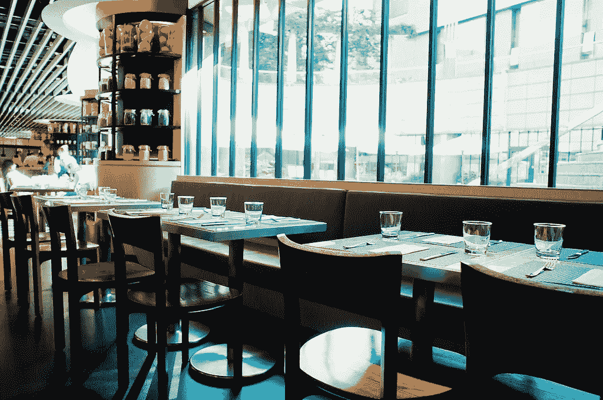
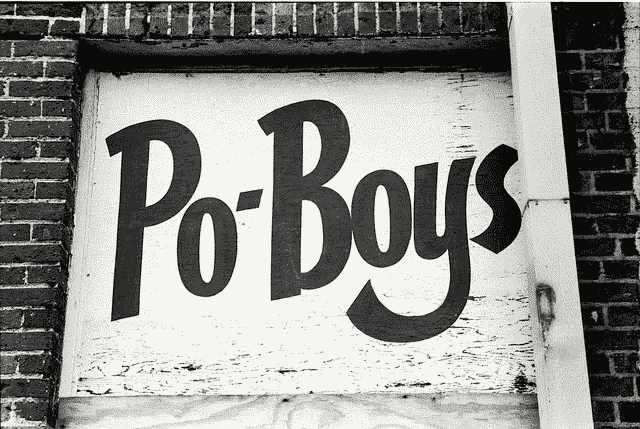
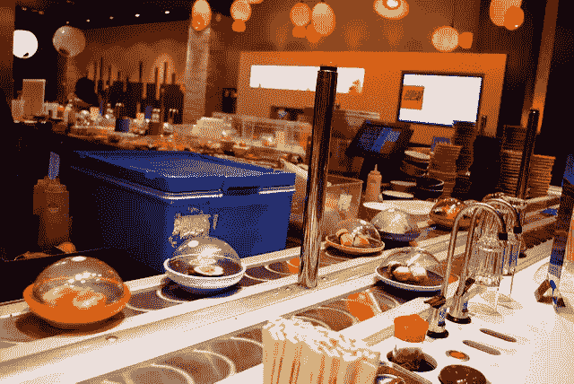
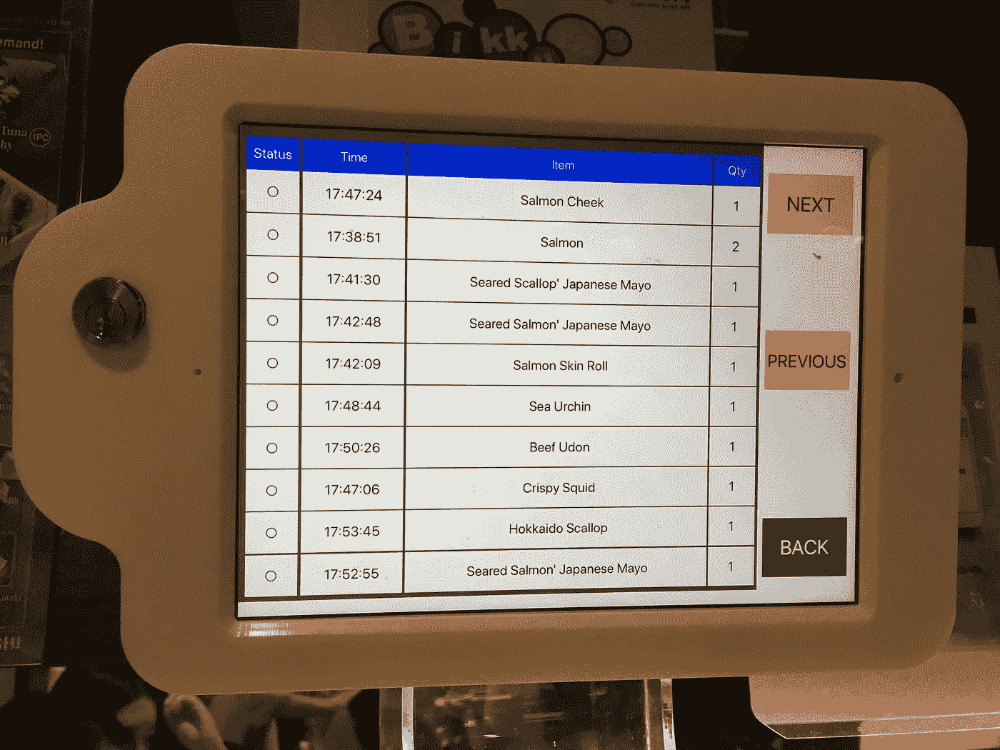

# 谁知道在外面吃饭变得如此数据驱动？

> 原文：<https://medium.datadriveninvestor.com/who-knew-that-eating-out-became-so-data-driven-8b7216bfa100?source=collection_archive---------20----------------------->

Photo via flickr: [https://www.flickr.com/photos/vofan/5223651535/sizes/l](https://www.flickr.com/photos/vofan/5223651535/sizes/l)

服务员大步走过来，把他的点菜本摔在我们的桌子上。

它只有一张纸，所以不会发出声音。我和妻子非常想吃 po' boys，所以我们去了当地一家专门做卡津菜的酒吧。我们去那里是为了早点吃午饭，所以餐厅还没满一半。

然而，有一张二十人的桌子。他们围坐在一张长桌旁，每边十人。服务员刚刚为他们点菜，这似乎让他很累。

# 注册会计师

抨击秩序册是在开玩笑。他精神很好，尽管他脸上的表情在说，“看，我刚接了一份二十人的订单。我希望你们这些好人保持简单。”

我们点了外卖，他就上路了。

我们的饭还没上，服务员就过来聊天了。他想到了即将到来的注册会计师考试。四天的考试，以及更多的准备时间。

他告诉我们他对数据和数字的热爱。我和妻子跟他开了些玩笑。然后他走回厨房查看我们点的菜。

# 数据驱动的反馈评估

我们的警察来了。我点了牡蛎，我妻子点了虾。我们交换了一半，这样我们每个人都可以尝试另一个人的🤟

Photo via flickr: [https://www.flickr.com/photos/stevensnodgrass/8266144670/sizes/l](https://www.flickr.com/photos/stevensnodgrass/8266144670/sizes/l)

几分钟后，我们的服务员过来检查我们的食物，问道:

“你幸福吗？”

我的妻子面无表情，“温和”，然后继续吃她的 po '男孩。

服务员的回答让我大吃一惊。

右手拇指放在下巴上，食指斜伸在嘴唇上，他说:

“嗯。我没有足够的基线来评估你的答案。我暂时相信它的表面价值。希望你会再来，这样我们就可以开始建立一个基线。”

我打赌他对所有第一次来的顾客都这么说😉

因为他选择问一个关于情绪的间接问题(“你快乐吗”)，而不是一个更直接的问题，“食物味道如何”，服务员在得出结论方面受到限制。

需要更多的数据点来了解我的妻子是否处于持续的轻度幸福状态，或者是否可以在她的情绪和她对食物的满意度之间得出相关性。

# 去吃晚饭😋

晚饭，我和妻子在一家旋转寿司餐厅吃了晚饭。

Photo via flickr: [https://www.flickr.com/photos/wolfsavard/3144585723/sizes/z/](https://www.flickr.com/photos/wolfsavard/3144585723/sizes/z/). Photo used to illustrate the concept — this is not the restaurant we ate at.

一盘盘现成的寿司在传送带上旋转。抢着吃。

或者，顾客可以使用固定在桌子上的平板电脑来订购新鲜制作的商品。

传送带上旋转的是同样的一套物品，但我和妻子认为，让我们来点新鲜的吧💪

由于餐厅的自助服务模式，我们的女服务员在那里给我们倒茶，回答问题，并回应我们可能有的任何特殊要求。

# 来自小盘子的大数据

在我们的平板电脑上，我点击了一个标有“订单历史”的按钮，看到这个我很着迷:

当一个定制订单准备好了，一个铃响了，商品从传送带上飞下来，正好停在我们的桌子上方。

上面的时间标记反映了每样东西送达我们的时间。

如你所见，我们很饿😜

我开始思考我们的卡津餐厅服务员会如何利用餐厅的数据。可能性包括:

1.  **工人效率**:从下订单到完成订单的平均时间
2.  **物品复杂度**:有些物品会比其他物品需要更长的时间来完成吗？
3.  **菜单选择**:哪些项目最受欢迎，与星期几或一天中的时间有关联吗？
4.  座位周转:顾客每次访问停留多长时间？餐厅能更精确地估计新来顾客的等待时间吗？
5.  **按时间分布**:顾客第一次坐下时是“订单激增”还是订单在整个拜访过程中平均分布？如何根据这些见解优化用餐体验？

总而言之，基础数据科学可以应用于优化餐厅的结果:更高的餐桌吞吐量(每天)和每位顾客花费的更多美元。

我要去看看卡津餐厅的服务员是否想要一份新工作。