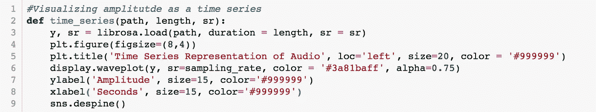
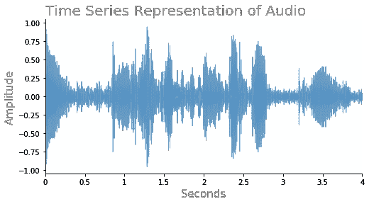
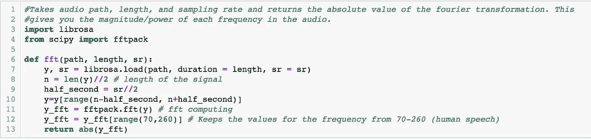
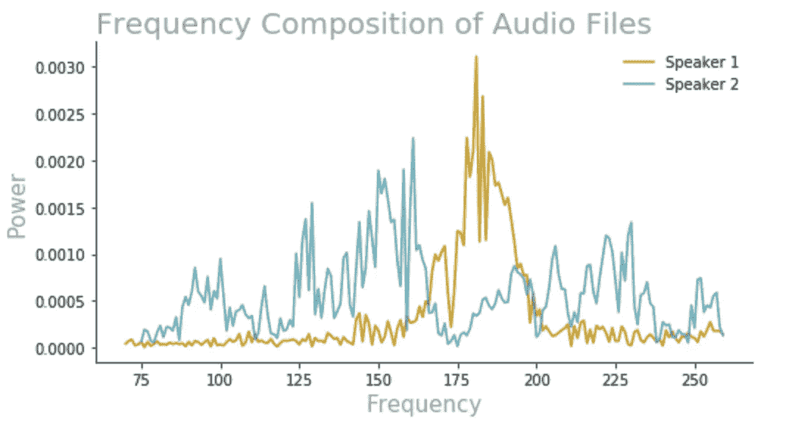

# 谁说的？

> 原文：<https://medium.datadriveninvestor.com/who-said-that-c753ac5b66ac?source=collection_archive---------20----------------------->

“white robot” by [Franck V.](https://unsplash.com/@franckinjapan?utm_source=medium&utm_medium=referral) on [Unsplash](https://unsplash.com?utm_source=medium&utm_medium=referral)

我的项目的目标是创建一个模型，它可以利用说话者的音频来确定说话者的性别。开始这个项目时，我没有操作音频数据或音频预处理工作流程的经验。当我查看这个领域的其他项目时，我找不到处理人类语音的音频预处理管道的例子。有许多可用的库被设计来从音乐样本中提取特征，但当涉及到性别确定或说话人识别时，这些库对语音数据没有帮助。我偶然发现了一个 Kaggle 数据集，它提供了经过处理的音频数据，为我指出了我最终想要隔离的输入，但它没有解释*他们如何能够从语音音频中提取这些特征。弄清楚如何创建这样的输入需要对音频特征工程进行大量研究:了解可以从音频中提取哪些信息，以及了解这些特征中的哪些将有助于我实现目标。*

我的数据转换的第一步是使用 Librosa 的 load 函数将 mp4 文件转换成时间序列。

Path is the location of the audio file you wish to load. Duration is how much of the audio file you want to load and the sampling rate (sr) is how many samples of audio data you want per second.

在那里，我能够通过绘制信号随时间的振幅来可视化数据。

Example code for generating the time series plot using librosa

Plot of the amplitude (strength of the signal) of the audio file over time.

因为我试图确定说话者的性别，我需要从音频文件中提取频率。为此，我在 SciPy 中使用了离散傅立叶变换(FFT)。这种转换采用音频的时间序列表示，并将其转换到频域。这些傅立叶变换是实数和虚数的数组，从中可以提取音频的频率、幅度和相位。

Example code for loading in an audio file and using fast fourier transform.

为了直观显示音频中表现最突出的频率，我将 FFT 数组的绝对值作为 y 轴的值，并将时间序列的长度范围除以音频文件的持续时间。x 轴现在表示频率范围，y 轴表示音频文件中每个频率的功率。

Plotting FFTs of two different speakers.

看了几幅频率与功率的关系图，发现不同人之间的高频和低频峰值不同，我觉得在建模数据集中使用 FFT 阵列的绝对值作为观察值很舒服。

对于我的分类模型，我主要关注逻辑回归、梯度推进、使用主成分分析的支持向量机和密集神经网络。在这些模型中，梯度推进和神经网络表现最好。我用一个神经网络对一秒钟的讲话进行了观察，达到了 0.85 的测试精度。然而，如果我使用 25 秒的语音，神经网络和梯度推进的准确度都是 0.91。我尝试的 SVM 模型也具有与其他模型相似的测试精度，约为 0.90，但训练时间要快得多。

**结论:**

对于我的模型的实际应用，能够实时确定说话者的性别是最重要的。这将减少公司必须存储的音频数据量，并允许在呼叫者找到客户服务代表之前进行安全检查。出于这个原因，我会推荐使用梯度推进模型，因为它具有快速的预测时间，并且通过一个人大约 25 秒的讲话，可以以 90%的准确率预测他们的性别。