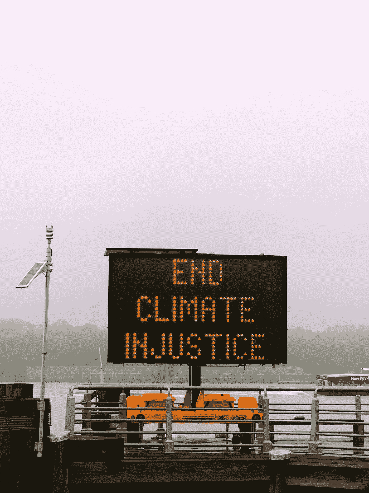
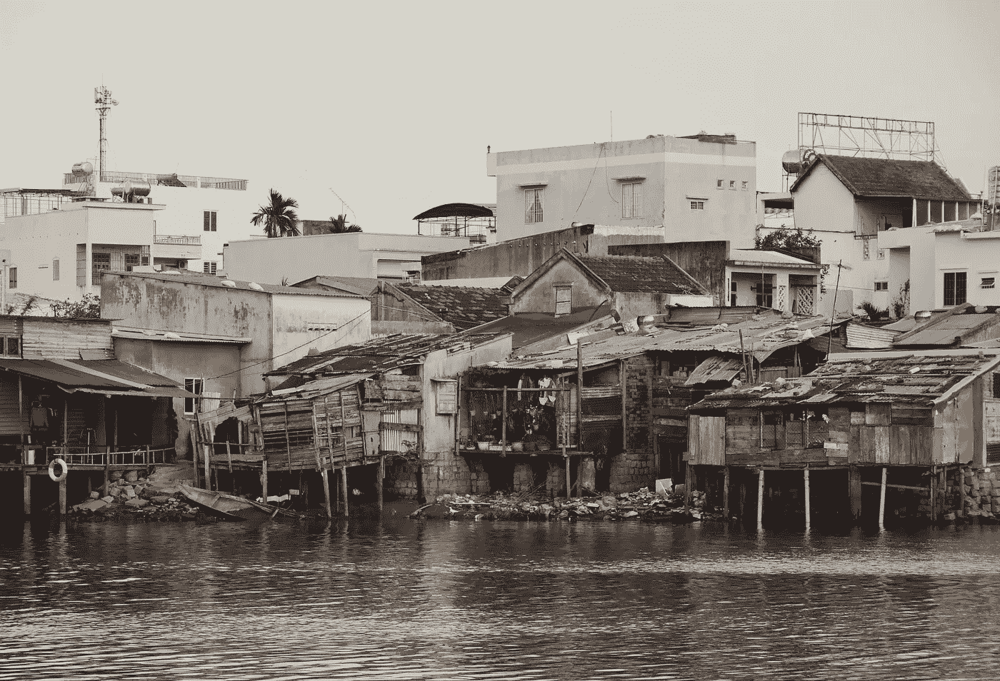
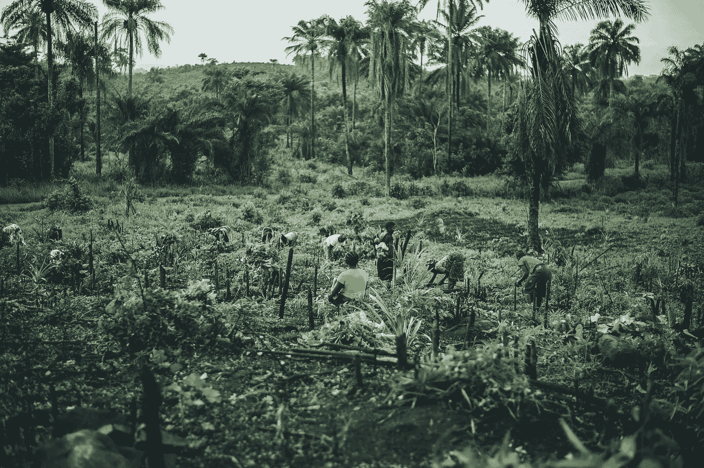
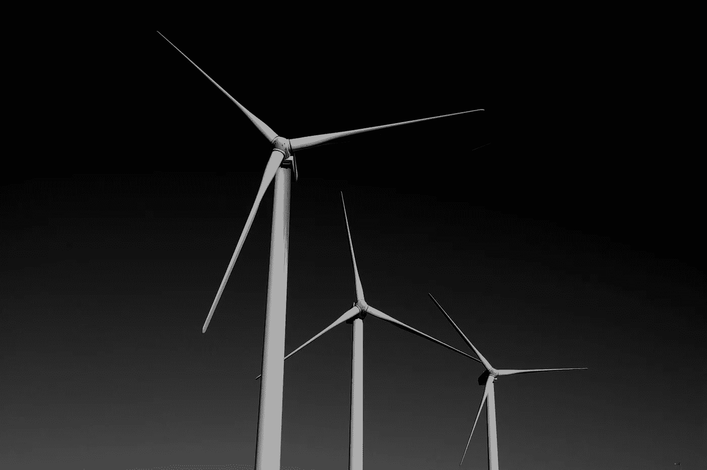
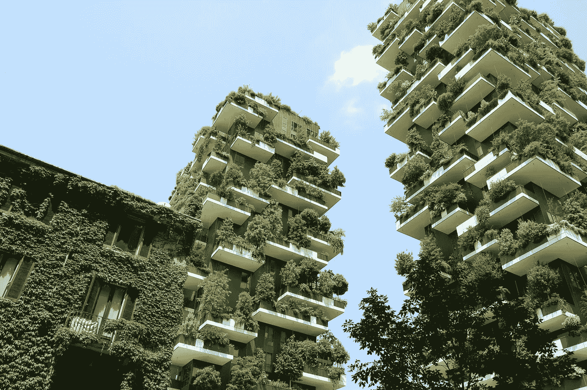

# 谁会被落下？

> 原文：<https://medium.datadriveninvestor.com/who-will-be-left-behind-ce053014cfde?source=collection_archive---------10----------------------->

Photo by [Jon Tyson](https://unsplash.com/photos/M6bsFPIfl1Y?utm_source=unsplash&utm_medium=referral&utm_content=creditCopyText) on [Unsplash](https://unsplash.com/search/photos/climate-injustice?utm_source=unsplash&utm_medium=referral&utm_content=creditCopyText)

## 正在进行的气候辩论中的特权与贫困

从我还是个孩子的时候起，我就被告知要节约用水，缩短淋浴时间，离开房间时关灯以节约用电，购买回收纸制品和使用可重复使用的水瓶，将香蕉皮制成堆肥，尽可能乘坐公共交通工具，从当地农民那里购买有机食品，尽可能减少浪费。坦率地说，对我来说，仅仅是想到有人会忽视对他们的回收品进行分类，就令人震惊(T2)。

我专注于个人的行善态度让我在*的几年*里可以拍拍自己的背——认为我是尽自己的一份力量拯救世界的模范公民。自 20 世纪 70 年代中期的嬉皮士运动以来，这种可持续发展的观点一直被反复提及。最常与“绿拇指”联系在一起的是当地的农业运动、零废物生活方式、纯素食饮食以及限制总体碳排放的吝啬政策措施。没有被广泛讨论的是，这些我们与可持续发展联系在一起的形象通常是白色的、成本高昂的、特权的。

从来没有人告诉我，这些撒玛利亚人的事迹主要是为那些负担得起的人保留的。虽然我将得到政府援助的保证，并继承可耕种的肥沃土地和用水权，但实际上有数百万人生活在不久将变得不适于居住的国家。极端天气、海平面上升和持续的干旱不成比例地影响到那些负担不起为这些日益增加的灾难设计的补救措施的人。

# 到底是什么问题？

鉴于最近在波兰举行的气候谈判，以及政府间气候变化专门委员会(IPCC)的新报告，我马上想到谁将首先受到这些迫在眉睫的变化的影响。如果你没有听说，2018 年的联合国气候谈判在争议中结束。批评者指出，目前的决议没有考虑如何根据 IPCC 的报告将全球变暖限制在 1.5 摄氏度以下。“目前，我们的世界比工业化前的水平高出 0.8 摄氏度...按照目前的趋势，气温上升 2 摄氏度可能在一代人的时间内达到”( [SDSN](http://unsdsn.org/wp-content/uploads/2014/02/130919-TG07-Agriculture-Report-WEB.pdf) )。普遍的共识是，我们的行动速度还不够快，彻底的政策变革必须来自各国元首，以便妥善解决已经成为全球危机的问题。

该报告涉及的一个关键问题是可持续性和贫困之间的关系，以及如何将它们视为不可分割的唯一出路。

> “伦理考虑，特别是公平原则，是本报告的核心，认识到升温至 1.5 摄氏度和超过 1.5 摄氏度的许多影响，以及将升温限制在 1.5 摄氏度所需的缓解行动的一些潜在影响，不成比例地落在穷人和弱势群体身上”——IPCC

Manila, Philippines. Photo by [Jordan Opel](https://unsplash.com/photos/3VLHF9b9Plg?utm_source=unsplash&utm_medium=referral&utm_content=creditCopyText) on [Unsplash](https://unsplash.com/search/photos/poor?utm_source=unsplash&utm_medium=referral&utm_content=creditCopyText)

不足为奇的是，没有干净水、缺少食物或被迫离开家园的并不是富人。是那些一生都生活在同一个地方的人们，努力充分利用他们被赋予的一切，总是为他们的原生环境的宜居性而奋斗。

根据[美慈组织](https://www.mercycorps.org/articles/climate-change-affects-poverty)，“四分之三的贫困人口依靠农业和自然资源生存。对这些人来说，气候变化的影响——有限的水和食物来源以及对它们的竞争加剧——是生死攸关的大事。”

2015 年，[时代杂志](http://time.com/4143972/kiribati-climate-change-refugees-paris-sea-levels/)的 [Per Liljas](http://time.com/author/per-liljas/) 报道称，太平洋岛国基里巴斯的居民已经*每 2-3 个月就*经历一次海水泛滥。在这些洪水中，可饮用的水消失了，动物被挂在笼子里的树上，下水道直接流入居民家中。据估计，在短短 50 年内，整个岛屿系统将被淹没在水下。我们谈论的是在我们的有生之年，超过 10 万人因气候变化而迁移。

据联合国环境规划署称，由于地理位置和普遍的贫困，整个非洲大陆将变得特别脆弱。“到 2020 年，由于气候变化，预计非洲大陆将有 7500 万至 2 . 5 亿人面临日益严重的水资源压力……(此外)全球变暖 2 摄氏度将使非洲大陆 50%以上的人口面临营养不良的风险”([环境署](https://www.unenvironment.org/regions/africa/regional-initiatives/responding-climate-change))。

**目前，没有为气候变化难民提供庇护的先例。**

不断发展的绿色技术及其相应的相关政策有一个坏记录，即因富奖励富，因穷惩罚穷。如果提供的解决方案不考虑那些最需要它们的人，我们就没有希望为后代确保一个宜居的环境。现在需要一个真正的社会“平等化”。

## 气候变化在三个主要领域对弱势群体产生了不成比例的影响:

**农业** —食物系统、农业和资源分配。
**技术** —太阳能、风能、水能、生物燃料和可持续生活系统。
**政策**——对可持续技术的补贴、与弱势国家的慈善关系、排放上限、土地的重新分配，以及立法者和行业高管之间的利益分离。

Photo by [Annie Spratt](https://unsplash.com/photos/_vgsXME077Q?utm_source=unsplash&utm_medium=referral&utm_content=creditCopyText) on [Unsplash](https://unsplash.com/search/photos/rainforest?utm_source=unsplash&utm_medium=referral&utm_content=creditCopyText)

# 农业:

根据 IPCC 报告[的估计，1000 万平方公里(25 亿英亩)将需要从牧场重新造林，或者转变为粮食作物——以达到 1.5 摄氏度的变暖目标。这对于依赖农产品出口来维持当地经济的国家来说尤其重要。](https://www.ipcc.ch/sr15/)

根据联合国粮食及农业组织(FAO)的数据，“每年大约有 1800 万英亩的森林消失，这个面积大约相当于巴拿马的国土面积。”为了给牲畜放牧或棕榈油等能源作物腾出空间而砍伐森林，不仅损害了土地，也损害了当地居民。皆伐增加了洪水的风险，降低了土壤肥力，取代了土著社区，将储存的碳释放到大气中，确保了生物多样性的丧失，并威胁到当地的水资源。

> 我们实际上是在拿生命赌博——为了少数受益于现状的人，把那些依赖于我们当前食品体系稳定的人置于危险之中。

"**全球范围内，如果今天生产的用于饲养动物的所有作物的 40%直接用于人类消费，那么到 2050 年，有足够的耕地养活 90 亿人** " ( [粮农组织](http://www.fao.org/docrep/018/ar591e/ar591e.pdf))。目前，我们的粮食系统偏向于工业化农业，侧重于饲料作物的生产而不是粮食作物。毫不奇怪，肉类和乳制品行业(尤其是美国的)的巨头*利润丰厚。据纽约每日新闻[的玛尔塔·扎拉斯卡报道，“2011 年，仅在美国，肉类年销售额就高达 1860 亿美元。”另外还有 380 亿美元的政府税收补贴。这就是我们为此付出的代价。想象一下，如果这些钱用于补贴小规模的有机蔬菜和谷物农场，我们的农业会是什么样子。](https://www.nydailynews.com/opinion/marta-zaraska-big-meat-article-1.2669374)*

在美国，**“全国 210 万个农场中，约有 39%接受补贴，补贴的大部分流向了玉米、大豆、小麦、棉花和大米的最大生产商”** ( [EWG](https://farm.ewg.org/) )。这些补贴是为了确保低成本的饲料和燃料来源。这种结构通过垄断破坏了我们的食物系统，从而威胁到我们的食物系统。我们越是集中和简化我们的生态系统，它们就越容易受到全球气候变化的影响。新害虫和疾病的蔓延、表土流失、杀虫剂和除草剂的过度使用、水供应紧张以及营养价值下降都是这种整合的后果。

工厂化农场通常位于农村和低收入地区，这些地区无力对抗拥有它们的企业集团。成千上万只经常用抗生素治疗的疾病缠身的动物产生的废物对它们居住的社区具有潜在的致命后果。工厂化农场的径流为周围的野生动物创造了有毒的生活条件，导致当地水道中大量藻类大量繁殖，使生态系统缺氧。废物的堆积也会对人类健康产生严重影响，污染空气和当地的饮用水供应。

> “1996 年，疾病控制中心发现印第安纳农业饲养场附近饮用的井水中硝酸盐含量高与自然流产有关”([尤尔卡巴](https://www.onegreenplanet.org/environment/how-factory-farms-impact-the-communities-where-they-are-located/))。

此外，这些企业通常垄断了当地的就业机会——即使它们名声在外。暴露在高浓度的“硫化氢、甲烷、氨和二氧化碳”中，工人和周围的居民不断面临流感样症状、脑损伤、视觉并发症、呼吸系统疾病、耐抗生素葡萄球菌感染、胃肠道寄生虫和过早死亡的风险( [Yurcaba](https://www.onegreenplanet.org/environment/how-factory-farms-impact-the-communities-where-they-are-located/) )。

通过这种方式，我们实际上是在拿生命赌博——为了少数受益于现状的人，把那些依赖于我们当前食物系统稳定的人置于危险之中。

Photo by [Matt Artz](https://unsplash.com/photos/2dCdOoYDjOQ?utm_source=unsplash&utm_medium=referral&utm_content=creditCopyText) on [Unsplash](https://unsplash.com/search/photos/sustainable?utm_source=unsplash&utm_medium=referral&utm_content=creditCopyText)

# 技术和政策:

> “贫穷-环境倡议……往往导致许多单独的微型项目和“解决方案”，而不是改变现有的制度和政府政策。”— [开发署](http://www.undp.org/content/undp/en/home/ourperspective/ourperspectivearticles/2013/06/12/sustainability-must-combine-environment-concerns-with-poverty-reduction-george-bouma.html)

“绿色技术”和政策不可思议地交织在一起，特别是在政府补贴、提议的碳排放上限和新技术开发拨款方面。这一点在加利福尼亚州得到了最好的说明——这是全州减少碳排放和投资可持续技术的政策典范。他们的限量及交易计划、电动汽车税收抵免以及最近对“新兴能源解决方案”的“淘金热”是我们当前解决方案([利普顿](https://www.nytimes.com/2011/11/12/business/energy-environment/a-cornucopia-of-help-for-renewable-energy.html))的完美案例研究。

2012 年，加利福尼亚州启动了一项针对工业的“总量管制和交易”计划。它旨在阻止企业使用化石燃料，并鼓励他们过渡到更清洁的燃料来源和绿色技术。公司必须购买被称为“碳排放配额”的许可证，以合法地释放碳排放——对出售的许可证数量有一个总的上限，该上限逐年下降。其目的是将大部分销售收入再投资到全州范围的气候变化计划中。理想情况下，这些许可的价格会变得过高，公司无法承担成本，他们除了改变别无选择。不幸的是，结果喜忧参半([卡斯勒](https://www.sacbee.com/news/local/environment/article162517213.html))。

根据[加州空气资源委员会](https://www.arb.ca.gov/)的数据，2016 年全州温室气体排放量下降了 2.7%，总体水平低于 1990 年([贝克](https://www.sfchronicle.com/business/article/California-hits-2020-greenhouse-gas-reduction-13066821.php))。然而，受到最严格监管的设施不成比例地位于“有色人种比例较高、贫困、受教育程度较低、语言闭塞的居民比例较高的地区”( [PLOS 医学](https://journals.plos.org/plosmedicine/article?id=10.1371/journal.pmed.1002604))。此外，这项立法给加州居民带来了个人税收负担，从而持续推高了汽油价格。有能力这样做的公司继续为许可证付费，而不限制他们的排放。对大多数人来说，这种激励还没有达到临界水平。一些公司甚至被允许通过投资林业管理(Kasler)等环境项目来抵消其产出。

以另一个新兴的绿色技术市场为例:电动汽车。**目前，超过 99%的电动汽车补贴发放给了年收入 5 万美元或以上的家庭，近四分之三发放给了年收入 10 万美元或以上的家庭** ( [洛里斯](https://www.heritage.org/energy-economics/commentary/how-green-energy-subsidies-transfer-wealth-the-rich))。“电动汽车税收抵免”早在 2009 年奥巴马政府时期就已实施。它旨在鼓励消费者在购买下一辆汽车时“环保”，并激励汽车制造商增加电动汽车产量。对公司的补贴将在售出第 20 万辆汽车后封顶，这是一个门槛，[特斯拉](https://www.tesla.com/)，奢侈和可持续发展的家喻户晓的名字，最近通过了。

问题是，对于大多数美国人来说，电动汽车仍然太贵了。即使有 7500 美元的政府补贴摆在桌面上，**“一辆电动汽车的** [**20 年拥有成本**](http://www.adlittle.de/sites/default/files/viewpoints/ADL_BEVs_vs_ICEVs_FINAL_November_292016.pdf) **比一辆气体燃料汽车多 20000 至 32000 美元”。2017 年，在 1700 万辆汽车总销量中，电动汽车的销量不到 20 万辆。更糟糕的是，一些州已经采取了“零排放汽车”的命令，要求一定比例的销售由电动或低排放汽车组成。无法达到这些配额的公司必须亏本出售额外的车辆，或者为每一次信用短缺支付高达 5000 美元的罚款。而像特斯拉这样的公司从超过这些配额中获得超额利润，主要分配给上层市场([洛里斯](https://www.heritage.org/energy-economics/commentary/how-green-energy-subsidies-transfer-wealth-the-rich))。**

就政府对可再生能源的投资而言，情况类似。2009 年出现了一股真正的绿色技术“淘金热”，伴随而来的是政府对太阳能和风能发电厂的补贴。太阳能电池板可能是个人使用最广泛的，但它们的好处往往仅限于富有的房主。**“纽约州是美国十几个太阳能生产州之一，但在 2014 年，** [**不到 4%的**](https://www.americanprogress.org/issues/green/reports/2014/05/29/90551/rooftop-solar-adoption-in-emerging-residential-markets/) **太阳能装置惠及了收入低于 4 万美元**的纽约州家庭”。太阳能电池板的初始安装费用从 10，000 美元到 20，000 美元不等，目前还不能安装给占美国居住人口 97%的租房者使用([策克利](https://www.rentcafe.com/blog/rental-market/market-snapshots/change-renter-vs-owner-population-2006-2016/))。

对于全国性的太阳能和风力发电场，政府补贴为投资者提供了很少甚至没有财务风险，保证了未来几年的收入。据《纽约时报》报道，“自 2009 年以来，其他 15 家太阳能和风能发电厂也获得了类似的补贴。”这些项目是否需要政府资助的问题正在讨论中。几乎所有这些项目都主要由税收支付，这些项目的大多数投资者都是金融和技术巨头，如高盛、谷歌和通用电气。

所以我的问题是:这些措施的好处是否超过了纳税人或小企业最初的成本？对于我们正在玩的这场漫长的游戏来说，这一切值得吗？或者，从长远来看，这些涓滴思想的政策会伤害我们吗？

*是&否……基本上很复杂。*

Photo by [Chris Barbalis](https://unsplash.com/photos/bIx15C7AnNg?utm_source=unsplash&utm_medium=referral&utm_content=creditCopyText) on [Unsplash](https://unsplash.com/search/photos/sustainability?utm_source=unsplash&utm_medium=referral&utm_content=creditCopyText)

# 有些技术是值得的:

我们已经讨论了当前所有不起作用的解决方案，所以让我们来看看一些起作用的解决方案——是的，它们确实存在。这只是我认为值得我们花费时间和金钱的三个想法。

**社区太阳能是正确的选择！** 以 [OnForce Solar](http://www.onforcesolar.com/about-us/) 为例，这是一家总部位于纽约的太阳能公司，致力于实现“社区太阳能”该系统允许居民购买附近太阳能发电场产生的能量，而无需安装自己的电池板。然后，用户或会员根据农场生产的电力从他们的公用事业公司获得信用。这个系统有它的缺点，社区项目收取过高的会员费，低收入居民更难从传统的公共事业中获得。然而，该模型的核心似乎值得这些最初的绊脚石。美国 50 个州中有 42 个州目前至少有一个社区太阳能项目，其中 19 个州有鼓励发展共享可再生能源的政策。

你知道我们真的可以在实验室里种植肉类吗？
我们实际上没有足够的土地来养活全世界可持续发展的牲畜。**目前，畜牧业“占人类引起的温室气体排放量(全球)的 14.5%至 18%”**([Friedman](https://www.nytimes.com/2018/01/25/climate/cows-global-warming.html))。幸运的是，有一种新东西叫做“实验室培育的肉”它是从一头活牛或其他动物的干细胞中培育出来的，然后在实验室中培养产生肌肉组织。最棒的是，实验室培育的肉类**“可以将传统生产肉类的排放量减少 96%，并将肉类生产所需的土地使用量减少 99%”**([戴维斯](https://bigthink.com/technology-innovation/advent-of-lab-grown-meat))。随着泰森食品公司最近在美国[孟菲斯肉类](http://www.memphismeats.com/home/#aboutus)的投资，我们应该尽早在餐馆和杂货店看到这种产品。如果投资得当，这是一个农业问题的技术解决方案，在气候变化的情况下，它可能成为确保全球粮食安全的关键因素。

**转基因生物并不都是坏的…** 与其给肉类、奶制品和当前的工业化农业注入补贴，为什么不投资研发更全面的耐寒水稻、大豆和谷物呢？科学家们已经发现了一种叫做“CAM”的遗传机制，在这种机制中，植物的光合作用过程发生了变化，因此它只在晚上吸收二氧化碳，全天保存水分。堪萨斯州萨利纳的土地研究所的一组研究人员一直在研究一种名为“Kernza”的多年生小麦品种这种小麦不仅比传统小麦更耐旱、抗病，而且根系也更深。这使得它更好地保持土壤肥力，从大气中捕捉碳，并防止侵蚀。它也有望在未来十年内在谷物大小和产量方面超过一年生品种。

**一些有灵感、有投入的人在地方一级工作，开发和实施适合每个人的系统*。*我们只需要扩大他们的模式，并以他们的方式引导适当的资金。**

# **我们只需要支持&实现这些想法:**

如果做得好，接下来的几年可能是增长和改善的重要机会，而不是倒退和停滞。

气候变化的核心是一个经济问题。预计在未来十年中，与其后果相关的成本将会飙升。在人道主义援助、联邦和地方紧急服务、基础设施修复以及相关的医疗保健费用方面，全球范围内的支出估计飙升至数千亿美元。地方政府必须将其投资、补贴、税收抵免和其他经济激励措施集中在增长型行业上，这些行业提供就业机会并改善当地环境*高于一切*。

绿色建筑和设计、水安全和保护工程、可再生能源研究和实施以及自然科学家和技术人员等行业的利润率和对工人的需求都在增长。展望未来，各项举措必须主要关注如何减轻气候变化对最弱势群体的影响——这意味着我和数百万其他美国人将需要检查我的特权，并做出一些早该做出的牺牲。

这种个人可持续发展的心态变得有害无益。我只能要求，向前看，你和你的直系亲属和朋友，参观当地的住房项目，游行，投票，和你的邻居一起打这些法律战。将你的时间和金钱捐献给那些在世界范围内为正义而战的组织。投资于可持续技术，让最需要的人受益。询问你的食物来自哪里，注册农产品订阅，向当地食物银行捐赠新鲜农产品，然后向你所在的城市申请一个社区或大楼范围内的堆肥箱。给你的州长或参议员写信，提出你自己的解决方案，参加市政厅会议，或者加入一个有类似想法的社区组织。教育你自己，然后把你学到的东西教给你的邻居。

最重要的是，为你的信仰挺身而出。

我必须强调，这是一个全球性问题，需要全球性的解决办法。是的，它将从个人层面开始，但在未来十年将急剧升级。这是我们扭转局面的时间。在这一转变过程中，我们不必孤军奋战——事实上，如果我们在一起，对每个人来说都会更容易、更安全。

**如果你有更多关于如何帮助当地社区的想法，或者你有一个你特别热衷的组织，请回复让我们知道更多关于它的信息以及我们如何帮助你！**