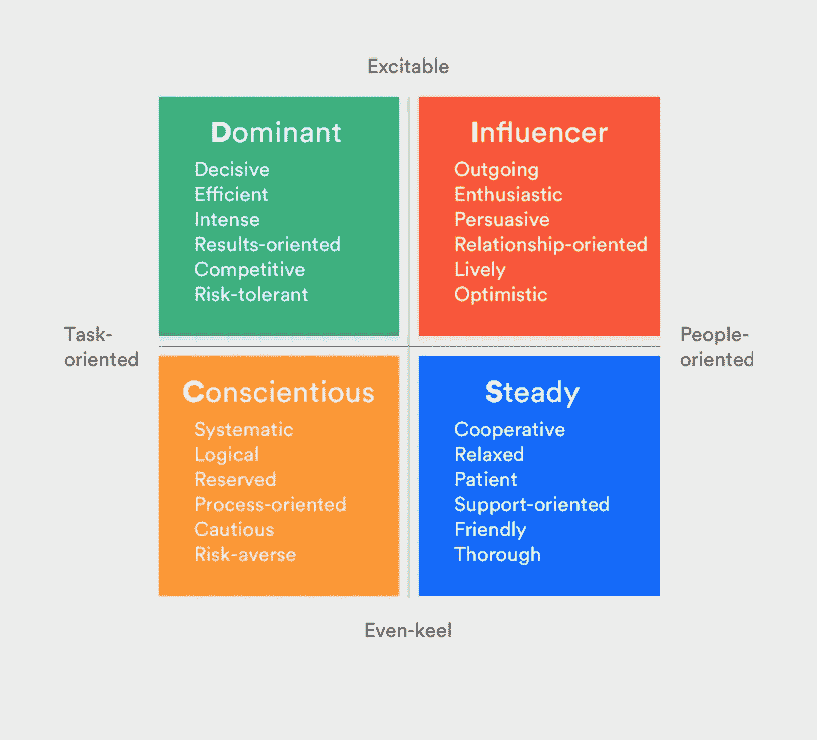
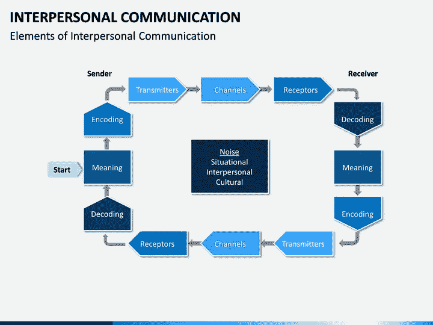
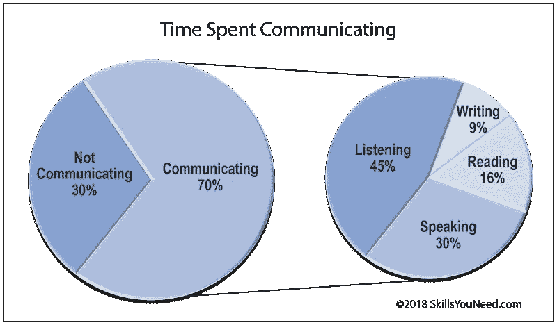

# 这到底是谁的即兴表演？

> 原文：<https://medium.datadriveninvestor.com/whose-improv-is-it-anyway-49ff42afe113?source=collection_archive---------7----------------------->

## 即兴创作有助于工作和家庭交流

Photo by Kyle Head on Unsplash

成功的企业家学会随机应变，这是快速思考的艺术。

想要得到有用的提示，请咨询[詹·奥兰尼克·布朗](https://twitter.com/JenOleniczak)。她不仅赞同即兴创作，她还写了一本书:“ [*站着思考:提高你在工作中即兴沟通技巧的技巧和诀窍*](https://www.amazon.com/Think-Your-Feet-Impromptu-Communication/dp/1260457036) ”

作为一名演说家、企业家和作家，布朗支持“废话”。她和前 20 名千禧一代营销策略师、教练、LinkedIn 讲师和全球演讲者 Chelsea Krost[讨论了如何通过有针对性的即兴表演保持沟通技巧。](https://twitter.com/ChelseaKrost)

在这种或那种情况下，每个人都不得不在即兴谈话、采访或演示中即兴发挥。

“几周前，我在红帽峰会上主持了一个会议，”布朗说。“有人说了一些非常深奥的话，让我停下了脚步。我屏住呼吸，对这个声明做出了回应——并承认了我的震惊。很多时候，透明就是自信。

 [## 在创业之旅中，拥抱学习|数据驱动的投资者

### 好像建立一个数百万美元的公司还不够困难，企业家必须额外照顾他们的…

www.datadriveninvestor.com](https://www.datadriveninvestor.com/2018/10/16/on-the-entrepreneurial-trek-embrace-the-learning/) 

“这里有一个要点，”她说。“提出问题来澄清——并获得时间——然后 [*倾听*](https://medium.com/datadriveninvestor/tips-for-entrepreneurs-not-spoken-for-9de87df8653) 让你到此为止。”

Krost 有自己用柠檬制作柠檬水的经验。

“几年前，我在一次演讲中登台演出，”她说。“当我走上舞台时，我注意到我穿了两只不同的靴子。

“我没有被吓到，而是指出来，完全是在开玩笑，”克罗斯特说。"观众们乐在其中，最终它成功了。"

掌握即兴创作有助于工作和个人生活中的交流。

“即兴表演就是倾听和回应，”布朗说。“句号。没有笑话，没有插科打诨，没有智慧。只是倾听和回应。这是我们每天整天都在做的事情——或者应该做的事情。练习是锻炼肌肉的关键。

“日常对话是即兴的——或者应该是——因为你不应该预先计划你的交流，”她说。“走出去，尽快参加即兴表演课，或者查看你能找到的任何即兴表演资源。”

# **实用改进**

克罗斯特指出，即兴创作不仅仅是喜剧或戏剧表演。

“即兴表演可以帮助我们学会应对困难、尴尬或意想不到的情况，”她说。“从工作中的批判性思维到处理生活中的困难关系，即兴表演帮助我们更有效地沟通。我喜欢我的大学即兴表演课。”

具体来说，Krost 描述了即兴创作的作用:

*   当被一个面试问题难住时
*   尴尬的薪资谈判
*   当演示没有按计划进行时
*   当被安排在工作现场时
*   在推销中
*   在团队会议中

了解自己沟通风格的演讲者可以提高他们的即兴创作技巧。

布朗说:“有四种沟通方式:被动、主动、被动主动和‘最好的’——自信。”。“我很自信。不过，问问那些不是我最大粉丝的人，他们会说咄咄逼人。

“知道如何最好地沟通很重要，”她说。“更重要的是*和其他*人如何交流。然后你可以在回复中使用这些信息。”

有了这些知识，再加点料。

“了解你的风格很重要——以及你给它添加的调味品，”布朗说。“我可能很自信，但有时我也很古怪。我做了一个网上研讨会，我很确定我的观众对我的笑话不是在笑就是在呻吟。

“自信和好斗是两回事，”她说。“你在为自己主张与主张。你咄咄逼人。”

布朗指出，即兴创作的第一条规则是对一切说“是”。

“接受新的想法、建议，甚至指责，”她说。“例如，说是的，我正在努力改进、改变和解决问题。

“‘是的’有这种可能性，”布朗说。“你做*不是*成为一个唯唯诺诺的人或者受气包。这是即兴表演中最不恰当的原则之一。不代表什么都同意。你是在肯定现实情况。”

# **通信准备**

她发现了在会议、演示和重要对话之前需要考虑的四个沟通关键因素:

*   你是谁，加上你和你谈话对象的关系
*   你在哪
*   你想要的加上他们想要的
*   你的感受加上他们可能的感受

布朗说:“如果一次谈话让人感到不满足，其中的一个因素可能是不明确的。”“通常我们会错过自己想要的，不会去想他们想要的。如果我们同时关注这两点，对话会神奇地变得简洁。

“我喜欢认为这四个因素——也是即兴表演中的魔法——是所有对话的支柱，”她说。

Krost 在会议、演示或谈话前有自己的考虑:

*   总体目标
*   利基焦点、要素和解决方案
*   观众人口统计
*   环境和位置
*   可用时间

“这些因素帮助我定制我想要和需要如何传达我的信息，”Krost 说。“每次会议、演示或谈话都有不同的因素在起作用。你必须灵活有效地沟通。

“最好的沟通者是伟大的倾听者，”她说。“他们能很好地理解肢体语言，有同理心，来自一个合作的地方，渴望学习。”

基本的社交风格有内向型、外向型和两者兼而有之型。

“我是一个表现出色的内向者，”布朗说。“我在大群体中筋疲力尽。我更喜欢一对一。这有点奇怪，因为我教书，但对我来说这是完全不同的。对话规模越小越好。我希望我在大群体中不会感到尴尬。”

克罗斯特声称自己是一个流浪者。

“虽然我喜欢社交，喜欢和别人在一起，但我也珍惜自己的独处时间，”她说。

“谈到我的工作社交方式，我也很灵活，”克罗斯特说。“作为一名企业家，我经常独立工作，但我喜欢在特殊项目上与他人或团队合作。一切都是为了平衡。”

# **生长突增**

尽管布朗和克罗斯特拥有沟通方面的专业知识，但他们仍在努力成长和提高。

布朗说:“我希望 T4 更擅长讲故事——不仅仅是好故事，而是惊人的好故事。“这是我关注的事情。因为我想在销售和客户交谈中更多地使用故事，所以需要大量的课程和阅读。”

克罗斯特想保持警惕。

“不仅仅是倾听客户的挫折，我还想了解他们的背景——导致他们走到这一步的成功和挑战，”她说。“这将有助于我明确如何帮助他们转变心态，从而全面提高工作效率和成果。

“交流的层次令人着迷，”克罗斯特说。“我们可以听到同样的事情，但根据发送者、接收者和环境的不同，接收方式会有所不同。”

冲突管理是工作场所的一个大问题。即兴创作在这里也有帮助。

“当你遇到冲突时，点击*是和*，避免使用*而是*，”布朗说。“当你说好的时候，你并不同意。你在肯定他们刚刚说的话。*是的*你心烦意乱。*是的*我没有达到我的目标。然后用*和*添加一个语句:*和*我想修复它。告诉我怎么做。

“但是 T21 这个词把一件事情放在了另一件事情之上，”她说。”*但是*我不是故意的。但是你没说清楚。更重要的是，你刚才说的话还是*之后的话但是*？避开它，看看会发生什么。我保证你的生活会变得更轻松，你也不会那么好斗了。”

除了交流，即兴表演还帮助人们思考和创造。

布朗说:“*是的，*对构思和创造也很有帮助。”。“我们太经常地利用‘但是我们不能’如果我们对所有的可能性持开放态度，我们就能看到更多。所以接下来的想法，试着*肯定它*，然后*补充*细节。"

Krost 增加了一个可操作的任务来改善她的即兴交流。

“我想在与他人交谈的过程中更加关注自己与自己的对话，”她说，“我是否在预测、预测未来、过度分析、思考一些不相关的事情？即兴交流等于在场。”

布朗补充了一句鼓励的话。

“即使是小石头也会在水中激起涟漪，”她说。"现在就开始并保持进步*,这样你就能走出可能的困境."*

***关于作者***

*吉姆·卡扎曼是拉戈金融服务公司的经理，曾在空军和联邦政府的公共事务部门工作。你可以在[推特](https://twitter.com/JKatzaman)、[脸书](https://www.facebook.com/jim.katzaman)和 [LinkedIn](https://www.linkedin.com/in/jim-katzaman-33641b21/) 上和他联系。*