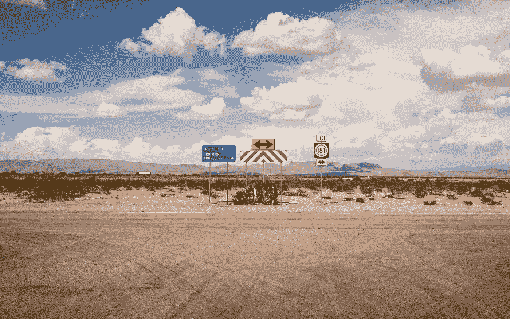

# 你到底是谁

> 原文：<https://medium.datadriveninvestor.com/whoyoureallyare-630586529fdc?source=collection_archive---------15----------------------->

我们在不断地成长、成熟、改变和生活。我们往哪边走？我们是谁？我们最亲近的人知道答案吗？

我们不需要向每个人展示我们的全部，为什么要呢？

人们说，有一样东西我们永远也得不到，那就是时间。

我们每周都有 168 个小时。

但是，我可以补充一点，能量。

人们普遍认为意志力是有限的。一旦我们一天没有了意志力，我们就完了。

 [## 成功的生活数据驱动型投资者的 25 种自我提升方式

### “我活得越久，学到的就越多。学的越多，体会的越多，知道的越少。”―米切尔·莱格兰德时间到…

www.datadriveninvestor.com](https://www.datadriveninvestor.com/2019/03/12/25-self-improvement-ways-for-a-successful-life/) 

个人精力呢？

最终，我们能控制自己的能量，虽然内向者和外向者有很大不同，但我们仍能控制自己。

> “发生的一切都是我们旅程的一小部分。我们可以选择被动，也可以积极主动，克服恐惧，设定自己的目标，并尽最大努力实现目标。不管是好是坏，我们总有选择的余地。”乔治·鲍特里

我正在读詹姆斯·罗斯布什的书《真实的里根》。这本书讲述了罗纳德·里根的伟大之处，以及为什么它如此重要。

在书中的一部分，他写道，“里根不是一个地方，麻木不仁的人。他只是害怕让人们(甚至包括一些家庭成员)太靠近而感受不到他的感受。

当我通读这本书并标出各个部分时，那是我标出的段落之一。

> 但是，我想了想，也想到了我自己。在书的前面，罗斯布什写道，“在某种程度上，这是里根和他的妻子南希的共同点:他们严格控制和管理他们是谁，他们会向谁透露自己——也就是说，他们会透露他们内心深处的想法和弱点。”

现在，在思考了这两个部分之后，我有了不同的想法。我不认为这是恐惧。我认为里根是有策略的——即使是带着他的感情。

回到我之前提到的，我认为个人的精力也是有限的。外向的人在聚会或招待会上可以走来走去。但是，一个内向的人？几个小时后，内向的人可能会变得筋疲力尽。

相反，让外向的人独处太久，他们可能会变得疯狂，需要人来激励他们。

现在，我问，情感呢？信仰呢？

我考虑我自己。当我感受到一些东西，一些深刻的东西，我通常不会和任何人分享。因为在我的逻辑思维中，我为什么要这么做？

人们在乎吗？当然，我知道他们有。但是，与此同时，我需要什么样的能量来分享一些东西，然后让他们施加能量来回应呢？

*简短的回答，很多。*

我不认为里根害怕告诉别人他内心深处的感受，因为我真的不怕告诉别人我的感受。但是，我确实认为他可能不愿意分享它们，因为通常，它们可能很大，令人不知所措，并且需要很多解释。

虽然，是的，与他人分享这一点很好，但也许并不总是需要分享。我知道我是一个内向的人，我从我的独处时间，从这样的事情中获得能量，早上坐在我的桌子前写作。

> 作者还在第三章分享道，“甚至他自己的妻子南希也写道，‘他周围有一堵墙。他让我比任何人都更接近他，但有时甚至我也感觉到了那种障碍。"

哇哦。这有多真实？

我们都相信不同的东西，这就是我所相信的。我在周日写了这篇文章。

所以因为我们都相信不同的事情，我们都向人们展示我们自己不同的一面。

对我来说，重要的是表现出同理心和善良，这是我身份的一个重要部分。但是，我并不总是以同样的方式展示我的抱负和动力。

无论环境如何，善意几乎总能得到积极的回应。

另一方面，野心会被认为是自大、过分自信或自命不凡。

所以，当我展示我的动力或野心时，我会更加小心。我并不总是觉得有必要向所有人展示我的全部。

当你向人展示自己时，首先展现的是什么？人们对你的普遍看法是什么？

这里我再举一个关于我自己的例子。

我的话是金子。我相信诚实在人际关系和生活中是非常重要的。因此，我向每个人展示我的诚实。我努力说出真相，当我对某些事情不确定时，我会分享，并总是寻求展现真实。

无论我遇到谁，我总是表现出这一点。

但是，我并不总是表现出我的野心或动力。也许我应该，但是现在，我还没有找到足够的理由向我遇到的每一个人强调这一点。

> “我们做决定，我们的决定造就我们”——托德·穆林斯