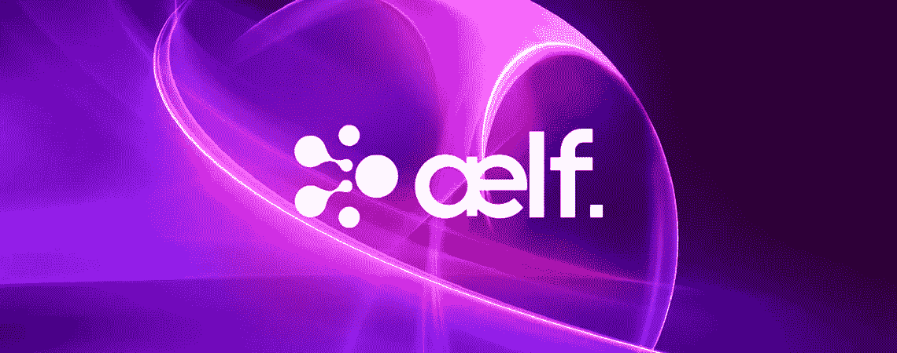

# 为什么 lf 可以成为区块链项目的基础

> 原文：<https://medium.datadriveninvestor.com/why-%C3%A6lf-could-be-the-foundations-of-blockchain-projects-e9a827f61f89?source=collection_archive---------34----------------------->

## 我最近偶然发现了一个项目，今天我想和大家分享一下。令人惊讶的是，尽管到目前为止它有非常可靠的凭证和成功，这个项目在最近的 ICO 的浪潮中多少有点被忽视了。

Very satisfied to have been introduced to this hidden gem. In the most recent prolonged bear markets, the project has consistently sustained its price far better than many other projects | [Source](https://www.tokens24.com/cryptopedia/coin-guides/what-is-aelf-how-it-works)

[**？lf**](https://aelf.io/)**将自己描述为多链并行计算网络区块链框架。**这适用于？lf 打算通过主要同时执行多个交易请求来在区块链领域的未来扮演的主要角色。lf 出现的时候，区块链应用程序的数量正在增加，对区块链平台和社区以外的影响微乎其微。

尽管区块链的应用在不断增加，但与区块链工业最初对该技术抱有的高且有些不切实际的期望相比，其速度并不令人满意。

# 区块链仍有待成熟💭

区块链应用，尽管到目前为止取得了进步和发展，仍然远远落后于行业真正的主流采用。有些担忧是真实的；提出了这样一个问题:如此高水平的技术如何能够真正产生预期的影响。例如，区块链不一定能改善所有适用它的领域，事实上，在某些情况下；区块链最终可能会给已经存在的复杂系统增加更多的复杂性。

诸如此类的事实可以归因于一些主要的区块链协议(如比特币和以太坊)仍在使用的技术。由于其结构上的弱点，它们的运作受到限制。

因此，建立在以太坊等协议之上的分散式应用程序可能会发现，当它们继续在该协议上运行时，很难实现它们最初的目标。延迟是经常发生的，特别是在 DApp 突然流行的情况下，如 [CryptoKitties](https://www.bbc.com/news/technology-42237162) 所见，或者当一个新项目具有独特的底层结构导致网络大规模拥塞时，最近一次经历是在 [FCoin 发布后](https://www.ccn.com/chinese-exchange-fcoin-accused-of-crippling-ethereum-network-for-cheap-publicity/)。这两个项目由于各自的原因，在以太坊网络内造成了严重的延迟，结果给其他用户带来了极大的不便。

潜在的问题是现有的区块链协议不能有效地适应其网络的需求。当前创建的协议使得一个 DApp 经历的流量将影响整个网络，包括建立在该协议之上的其它 DApp。如果再加上无法高效扩展，区块链将深受其害，因为它将变得越来越复杂，并成为延迟的根源，而不是最初描述的理想创新解决方案。

# 错位的优先事项❗

许多区块链协议的内在弱点是众所周知的。开发人员一直致力于对现有和即将推出的区块链的总体架构进行重大升级。然而，在市场需求和可扩展解决方案方面，许多开发都没有足够的指导。最近，随着 4.0 区块链时代的到来，改进协议的发布引起了一些兴奋，这将极大地提高可伸缩性。

这些只是一个更复杂问题的一般解决方案，即创建一个可以根据需求进行调整的区块链，或者创建一个专门为某个特定部门服务的区块链。

到目前为止，现有的进化区块链的想法都有其积极的一面；然而，仍然希望有一个健壮的、真正统一的平台，它能够处理所希望的请求，而不损害其结构的任何方面。这就是？lf 计划通过成为一个专为区块链定制的操作系统来实现前面陈述的地方。

# 适应性是⚖的关键

lf 不仅使他们的区块链像一个操作系统，而且使它高度可定制，这将使它在这个高度创新的时期在技术和经济领域更加实用。其他区块链目前正在进行的改进也将实施到系统中，特别是那些影响区块链在现实世界中的性能和实用性的改进。

？lf 将自己描述为“多链并行计算区块链网络”，这样的用户可以将？lf 表示为同时运行多个事务或指令的程序。当与？lf 成为高度适应性操作系统的设置相结合时，他们成为具有真正协同作用和可伸缩性的项目的目标将从他们的架构中转化而来。高适应性平台的可用性非常广泛，涵盖了人们可以考虑应用区块链技术的各种领域。

根据不同系统中发生的交易类型，不同的系统有不同的要求。例如，当涉及到银行业务时，安全性和隐私是所有软件都必须考虑的关键方面。基于区块链的软件也是如此。有了安全，交易的速度可能会受到损害，以保障交易的安全和隐私。

然而，速度仍然必须足够快以提供效率。[博彩业](https://cointelegraph.com/news/video-games-and-blockchain-new-experience-for-players-or-more-profit-for-developers)需要一套不同的要求，其中交易速度可能优先于安全性。如此复杂的细节正是 elf 计划高层次执行的。

lf 将通过使用多链设置使其平台更具适应性，这样，根据网络需求水平，主链也可以支持其他侧链。每个链都高度专业化地服务于特定类型的智能合同。因此，对于银行和金融科技等服务，根据交易的性质，可能会有不同的侧链。主链可以仅用于比特币交易，而其他侧链可以服务于菲亚特的交易。

执行的工作类型的这种分离和区别使？lf 变得更加高效，因为它为接收到的每种类型的事务请求都有一个专用的段。回到由 CryptoKitties 引起的减速，elf 确保这种延迟是不可能的；就好像一个 DApp 正在经历大量的流量，那么它的服务将是唯一受影响的，而其他所有协议将不受影响地运行。

[游戏、银行、金融科技](http://www.cityam.com/264442/fintech-understanding-blockchain)、流媒体甚至[供应链管理](https://www.forbes.com/sites/bernardmarr/2018/03/23/how-blockchain-will-transform-the-supply-chain-and-logistics-industry/)通常被认为是资源饥渴的业务，由于庞大的用户群和他们可能实施的服务，这些业务可能会影响他们赖以生存的任何区块链协议。因此，此类平台可以由？lf 有效地提供服务，因为每个部分都有自己的侧链，侧链也可以有自己的侧链，以帮助提高所提供服务的效率。

# 一个便利的未来☀️

lf 自称是区块链的 Linux。它可以根据特定系统的具体情况适用于任何系统。考虑到区块链的优势和所需的技术变革，lf 实际上可能有助于鼓励区块链的采用过程。通过其架构，lf 进行了分工，从而提高了其实用性和可用性，超越了绝大多数现有的区块链平台。

***免责声明:*** *请仅将此信息作为我的* ***自己的*** *意见，在任何情况下都不应视为理财建议。做任何决定前请记住****DYOR****🤓*

♂️你好，我叫萨尔。*如果你觉得这篇文章很有用，并且想看我的其他作品，请一定拍下并关注我的* [*媒体！*](https://medium.com/@salmanmiah) *😎*