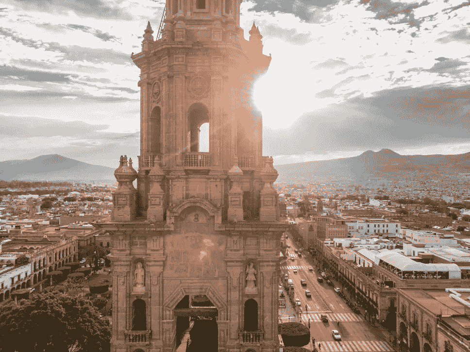

# 为什么 2019 年将是墨西哥的决定性一年

> 原文：<https://medium.datadriveninvestor.com/why-2019-will-be-a-defining-year-for-mexico-b64f53a1999e?source=collection_archive---------25----------------------->

墨西哥是拉丁美洲第二大人口和第二大经济体的所在地，根据最新数据，其国内生产总值约为 1.15 万亿美元。此外，尽管其他一些拉美国家面临严峻的经济形势，但该国在许多领域都实现了稳定和增长，2019 年将是决定性的一年。下面，我分享我对拉丁美洲最激动人心的市场之一的未来的想法和预测…

**新联盟**

自从安德烈斯·曼努埃尔·洛佩斯·奥夫拉多尔(Andrés Manuel López Obrador)获胜以及美国-墨西哥-加拿大协议于 2018 年底签署以来，墨西哥在政治和经济上都恢复了信心。事实上，尽管唐纳德·特朗普(Donald Trump)制定了在美墨边境修建隔离墙的计划，但两国关系并不像一些人预测的那样紧张，特别是在考虑到美中贸易战的情况下。此外，美国的增长在 2019 年应该保持稳定，许多人预测美国在 2019 年将增长 2.5%。这对墨西哥来说是个好消息，因为这意味着更高的人均 GDP 和更高的可支配收入水平，这将增加进口需求。

但是不仅仅是政治联盟改变了墨西哥人做生意的方式。事实上，独立团体和委员会正在释放墨西哥的巨大潜力，让这个国家在世界地图上崭露头角。[澳大利亚、新西兰和墨西哥商务委员会(ANZMEX)](https://www.bizlatinhub.com/anzmex-growth-story/) 就是其中的一个例子，该计划旨在建立澳大利亚和墨西哥之间的商务关系，并鼓励两国之间进一步的贸易和投资。随着世界变得越来越全球化，企业寻求在新的市场中与合作伙伴合作，现在是整合和利用贸易关系的最佳时机。我亲身体会到，走出你的舒适区，在一个新的领域创业是可行的——这可能看起来很陌生，但它能带来长期回报！

**对能源的高需求**

最令人兴奋的行业之一是[墨西哥能源行业](https://www.bizlatinhub.com/mexican-energy-sector-update/)，这是 2019 年及以后的另一个关键增长工具。该国致力于《巴黎协定》和其他国际协定，并在为本国公民创造更环保的能源以及帮助世界各国方面拥有既得利益。墨西哥已经明确表示，它希望帮助企业建设负担得起的、可扩展的可再生能源工厂，最近还推出了新的监管框架和新的法规，以鼓励可再生能源的创新。

墨西哥已经取得了一些重大进展，举办电力拍卖，将能源项目授予墨西哥和其他国家的私营企业，这有助于增加竞争，降低价格，并以更快的速度创新绿色能源市场。这种创新为不同行业提供了机会，制造业可以减少碳足迹，酒店业可以从旅游业的增长中受益，所有企业都可以获得更便宜、更环保的能源来为他们的组织提供动力。

**新一轮创业浪潮**

在世界各地，我看到年轻人选择就业的方式发生了巨大变化，许多人决定自己创业，创办自己的企业。随着创业世界变得越来越令人兴奋，墨西哥创业生态系统对墨西哥和世界各地的企业家越来越有吸引力，该国的科技领域正在崛起，这为整个行业带来了机遇。

由于墨西哥靠近美国，劳动力成本低，生活水平高，越来越多的企业家踏足该国成立公司。最重要的是，自 2011 年以来，拉丁美洲的风险资本交易增加了 600%以上，银行和私人投资者更加重视拉美公司。在[我在墨西哥](http://www.theglobaldispatch.com/my-experience-of-starting-a-business-in-mexico-45786/)和整个拉丁美洲创业的经历中，我看到了创业公司的巨大增长，这是由成功故事、低准入门槛和加速器推动的，如 500 Startups、NXTP Labs 和旨在注入资本和推动增长的 Startup Mexico。

**增长行业的新机遇**

绿色能源不是我预计 2019 年墨西哥唯一增长的行业。事实上，在许多成长中的行业都有机会，比如汽车制造业。随着菲亚特克莱斯勒(Fiat Chrysler)等全球公司将全部业务转移到墨西哥，以及墨西哥与世界之间越来越多的自由贸易协定，墨西哥最适合开发下一代汽车，无论是汽油动力汽车还是电动汽车。除此之外，围绕英国退出欧盟的不确定性也在鼓励主要汽车制造商退出英国，寻找更稳定的市场，那里有大量人才——墨西哥只会在 2019 年增加其制造业实力。

我还预计，墨西哥的出口市场将在 2019 年出现增长。该国已经是世界上第 12 大出口国，近 80%的商品运往美国，美中关系日益紧张，制裁已经发出警告，企业无疑会将墨西哥作为替代品。最重要的是，墨西哥的贸易协定比世界上任何其他国家都多，因此英国退出欧盟应该在未来几年为与欧洲和英国的贸易提供一些额外的渠道。

最后，还有采矿。安德烈斯·曼努埃尔·洛佩斯·奥夫拉多尔被任命后，墨西哥采矿业的未来仍悬而未决，因为他在当选前曾表达过对该行业的一些担忧。然而，大多数商业分析师仍然认为，采矿的好处(创造就业、经济增长、创新)超过了潜在的环境问题，新的矿区将在 2019 年及以后拍卖，以进一步促进该国的增长。然而，政治改革和重新关注员工安全是必须的，许多人已经呼吁政府做出这些改变。

*准确预测墨西哥在 12 个月后的样子是不可能的，但很明显，墨西哥正在崛起。我相信，2019 年将是墨西哥决定性的一年，外国投资增加，本土创新和政府专注于增长。无论你是墨西哥人还是其他国家的人，都不要忽视等待你的机会。*