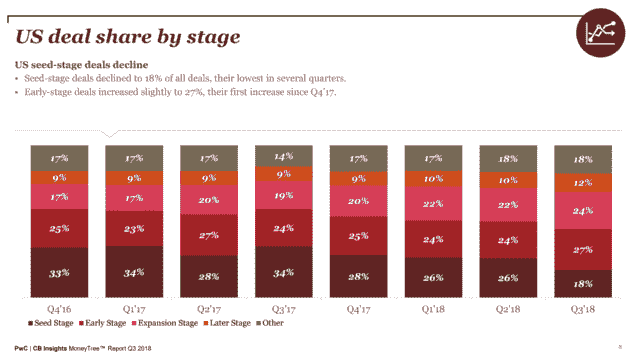
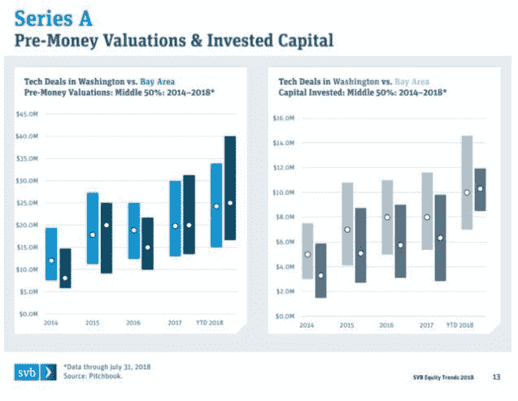
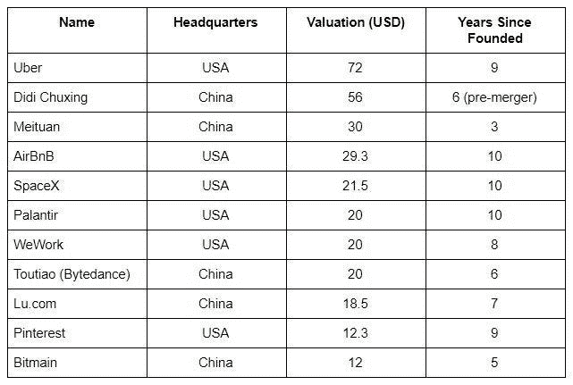

# 为什么 2019 年将是创业公司的混合融资年

> 原文：<https://medium.datadriveninvestor.com/why-2019-will-be-a-mixed-fundraising-year-for-startups-9a32ab626c91?source=collection_archive---------22----------------------->

预测应该总是带有警告——过去并不是未来的完美预测者。即使是最复杂的模型也可能没有捕捉到现实中最重要的变量。尽管如此，许多重要迹象表明，2019 年对于美国创业公司来说是更具挑战性的一年。这不是对经济放缓的预测，而是对资本公司的需求增长将快于资本供应的预测。

**1)更加专注**

在过去的几年里，美国已经看到越来越多的资金被分配到后期阶段。鉴于独角兽的爆炸式增长和越来越多的[“怪物”回合](https://www.linkedin.com/pulse/why-monster-rounds-dangerous-your-startup-amit-garg/)——它们已经超过了生态系统的整体增长，这应该是有道理的。如果这种趋势持续下去，我们应该预计种子企业家在 2019 年将为资本池展开更激烈的竞争。

**2)资金增长>通货膨胀**

自 2009 年以来，美国通胀率一直没有大幅波动，预计 2019 年将与 2018 年类似。

创业融资和估值的总体增长无疑超过了 2.5%的通胀平均水平。简而言之，市场继续期待创业公司成为比其他经济部门更强大的增长引擎。

**3)大型出口**

[CB Insights](https://www.cbinsights.com/research/unicorn-startup-market-map/) 在 2018 年 8 月统计了全球 260 家独角兽，这个数字还在继续增长。由于这些公司已经成熟多年，不可避免地会有相当数量的公司退出，最有可能的是上市。

事实上，只看按市值排名的软件/服务前 10 名，我们就可以推断出几个趋势。第一，这是两国游戏。第二，中国公司更年轻。第三，美国绝大多数公司已经存在了 10 年以上，这高于科技公司在 7-8 年内上市的历史平均水平。鉴于 2017 年高调的 IPO 以及 2018 年更多的 IPO，我们应该预计 2019 年将有更多的 IPOs 更高的流动性最终将推动早期阶段。

这些是专注于实践见解的短文(我称之为 GL；dr —良好的长度；确实读过)。如果它们能让人们对某个话题产生足够的兴趣，从而进行更深入的探索，我会感到非常兴奋。我在三星的创新部门 [*NEXT*](http://samsungnext.com/) *工作，专注于深度科技领域软件和服务的早期风险投资，这里表达的所有观点都是我自己的。*

