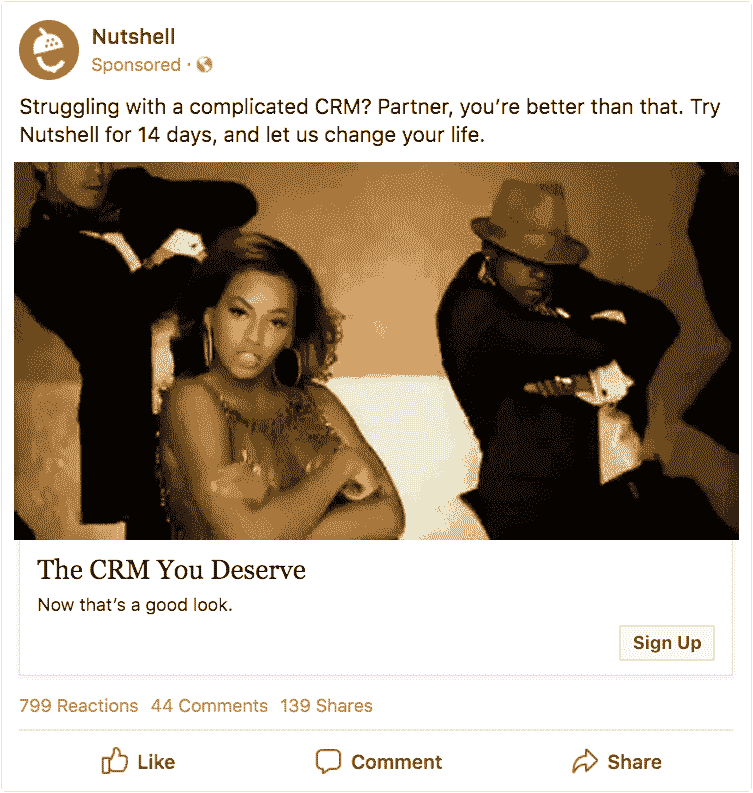
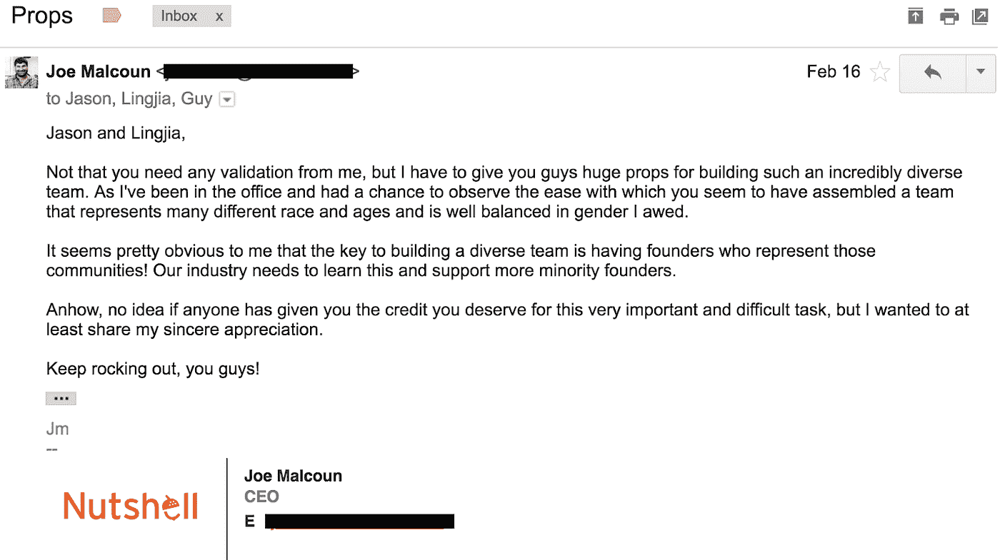

# 为什么碧昂斯脸书 GIF 迫使我们面对文化挪用。

> 原文：<https://medium.datadriveninvestor.com/why-a-beyonce-gif-on-facebook-forced-us-to-confront-cultural-appropriation-720131e99ca4?source=collection_archive---------0----------------------->

Photo by [ALP STUDIO](https://unsplash.com/photos/BCChEYrooGU?utm_source=unsplash&utm_medium=referral&utm_content=creditCopyText) on [Unsplash](https://unsplash.com/?utm_source=unsplash&utm_medium=referral&utm_content=creditCopyText)

去年夏天,[果壳](http://www.nutshell.com)直面科技行业丑陋的一面。我们开始意识到一些典型的、但却具有破坏性的性别偏见和办公室行为，它们无助于我们的女同事感受到支持。

我在[的一篇博客文章](https://medium.com/@jmalcoun/how-pee-on-our-toilet-seats-made-us-talk-about-diversity-challenges-ab7c84ada4b6)中公开分享了这次经历的细节和我们的反应，一些人正确地指出，性别多样性只是科技投资者和经营者需要关注的维度之一。果壳最近的一次经历准确地强调了这一点，我想像以前一样对此保持透明。

几周前，我们收到一条发自内部的推文，称我们在脸书的一个广告公然盗用黑人文化。这是碧昂斯在她的“升级 U”视频中跳舞的 gif，标题是“与复杂的 CRM 作斗争？搭档，你应该做得更好。试试果壳 14 天，让我们改变你的生活。”

这个广告得到了房间里没有一个有色人种的热情支持。而且是*碾压*。每一项参与度指标都创下了我们的记录。就我们而言:**任务完成** *。*

然后我们收到了凯莉·威廉姆斯的推文，她是一名数字营销高管，在一个以白人和男性为主的世界里，她整个职业生涯都在与身为黑人女性的逆风抗争。

这条消息传到了我们的#社交媒体 Slack 频道，并立即在整个办公室传播开来。有一种明显的寂静，团队成员互相斜睨一眼，表明我们真的不知道该做什么或想什么。就我个人而言，我很快就经历了从羞愧到迷茫的各种情绪。我最初的反应是“什么？人人都爱碧昂斯。我们是如何挪用黑人文化的？”

但是尽管我有一种强烈的愿望，想完全忽略这种情况，希望它会消失，但在内心深处，我知道正确的事情是直接联系凯莉，认真对待她的观察，并找到机会从这次经历中学习。我真的很紧张。非常非常紧张。我有足够的社会意识，能够理解许多人在处理这个最敏感的社会问题时是多么的粗心。我立即感受到不信任的痛苦，怀疑自己是否有能力在不完全搞砸的情况下进行这次谈话。

在我们通话之前，Kelly 分享了[这篇文章](https://everydayfeminism.com/2015/08/appropriating-black-culture/)，描述了如何*欣赏*黑人文化，而不是*利用*它。这是非常有启发性的，帮助我理解了语境在文化挪用相关问题中的重要作用。它还帮助我为可能是我一生中最尴尬的一次谈话做准备，对此我非常感激。

几天后，凯利和我通了电话。这是一次令人难以置信的谈话，也是我担任果壳公司首席执行官以来最有成就感的一次。她描述了自己最初害怕说什么。然后她说她厌倦了什么都不说。这是经常发生的事情，鉴于美国历史上这段特别令人不安的时期，她不想再这样做了。那句话让我很感动。

> 她描述了自己最初害怕说什么。然后她说她厌倦了什么都不说。

然后，她分享了她生活和职业生涯中的一些具体而深刻的经历，这些经历强调了忽视少数群体在职业环境中面临的困难是多么容易。她也很善良。她*教我*。我们经历了整个被误导的广告实验，一起想出了可以做得更好的方法。

坚果壳的迟来的节日聚会被安排在我们打完电话后立即开始，但我发现自己不希望我们的谈话结束。当我们说再见的时候，我们达成了一个协议，我们要找到一种方法来一起讲述这个故事。

当然，所有这些的答案是投资于多样性。简而言之，这一直是我们面临的挑战。不是出于欲望或者意愿。但是我们会继续尝试，我们会继续承认困难的部分，这样我们就可以继续学习。我们还将探索其他方法，以确保在设计营销资产时考虑到少数群体的观点。虽然雇佣一个多元化的团队显然是解决这一问题的一种方式，但我们也可以确保咨询这一领域的专业人士，并依靠可以提供自己观点的朋友。我希望凯利将继续成为我们可以依赖的坦率、周到帮助的人之一。

> 我们将继续努力，我们将继续承认困难的部分，这样我们就可以在前进的道路上不断学习。

另一方面，如果我们在看到它工作的时候不大声喊出来，我们就不知道我们在努力完成什么。本着这种精神，我会认识到什么可能是中西部(或所有)最多样化的团队？)科技。我在 [Clinc](http://www.clinc.com) 的朋友们很快建立了一个令人印象深刻的团队，一个展示了各方面多样性的团队。这个团队是由一群非常多元化的创始人组成的，这并不奇怪。**我从这次经历中学到的主要东西是:我们需要支持创始人更加多元化。**

我拍拍他们的背:

如果你所在的公司像果壳公司一样，目前没有任何有色人种担任领导职务，那么考虑文化挪用等问题尤为重要。考虑上下文，明白当你让别人感到不舒服时，“我没有任何恶意”不是借口。