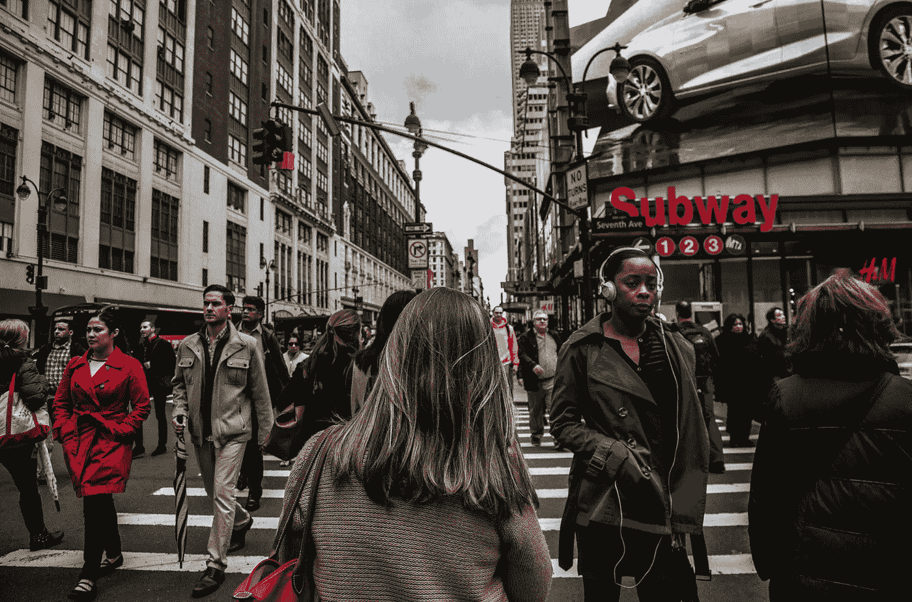

# 为什么全民基本收入不起作用

> 原文：<https://medium.datadriveninvestor.com/why-a-universal-basic-income-wont-work-cb741acbd791?source=collection_archive---------10----------------------->

Photo by [Sharon McCutcheon](https://unsplash.com/@sharonmccutcheon?utm_source=unsplash&utm_medium=referral&utm_content=creditCopyText) on [Unsplash](https://unsplash.com/s/photos/capitalism?utm_source=unsplash&utm_medium=referral&utm_content=creditCopyText)

*“每一个复杂的问题都有一个清晰、简单而错误的答案”*

全民基本收入被政界许多人称赞为解决贫困、停滞的生活水平和日益高涨的自动化浪潮的方法。理由是，给每个成年公民无条件的收入将消除原有福利计划的官僚作风，并确保基本需求得到满足。

这种收入的第一个局限是，它无法解决生活成本危机和近期相对贫困加剧的主要原因，即住房成本。近几十年来，租房和买房成本的增长超过了工资通胀。这是房地产商品化和更容易获得抵押贷款的结果。除此之外，供应跟不上日益增长的需求。

无条件收入的规定可能会让事情变得更糟。在这种制度下，没有额外收入的人的房租将面临最大幅度的上涨。这将是由一群收入低但平等的人造成的非常高的需求的结果。在有住房福利方案的国家已经可以看到类似的效果。

 [## 保护主义、政治和经济动荡|数据驱动的投资者

### 美国股市昨日出现 400 多点的大幅反转，为未来的事情发出了警告信号。市场…

www.datadriveninvestor.com](https://www.datadriveninvestor.com/2018/06/28/protectionism-politics-economic-turmoil/) 

当然，可以引入租金控制来应对这种情况。尽管如此，从已经实施这一政策的地方可以看出，寻找住房可能会成为一项艰巨的任务。这就是为什么我建议，在一个州实施全民收入之前，他们应该推行社会住房项目，同时激励私人企业增加供应。

这让我想到了引入它的第二个限制，它的自由派和右翼支持者经常忽视这一点。他们认为这是解决结构性问题的万能方法，而这些问题将永远存在于自由市场资本主义经济中。这就是为什么对于一个拥有全民基本收入的右倾政府的国家来说，总是存在危险。

Photo by [Christopher Burns](https://unsplash.com/@christopher__burns?utm_source=unsplash&utm_medium=referral&utm_content=creditCopyText) on [Unsplash](https://unsplash.com/s/photos/people?utm_source=unsplash&utm_medium=referral&utm_content=creditCopyText)

免费医疗服务可能会被侵蚀掉，因为可以看到每个人都可以负担得起健康保险或更高的共同支付额。将接受者分为“好”和“坏”穷人也变得更容易，因为他们在经济上是平等的。一方面是年轻的失业专业人士，另一方面是那些有毒瘾和精神健康问题的人。

此外，雇主会认为，在工人的基本需求已经得到满足的情况下，降低他们的工资是可以接受的。按照同样的思路，我们可以看到更多时间更长的实习。归根结底，普遍基本收入本身是一个生硬的社会民主措施，只会缓和自由市场经济的影响。

它也没有意识到不同的人所面临的情况的多样性。对于一个技术亿万富翁来说，通过 20 多岁的企业家的眼睛想象世界是非常容易的，然而他们往往只占人口的一小部分。例如，单身母亲在抚养孩子时往往需要额外的经济和社会支持。同样，对于瘾君子来说，额外的钱是没有用的，他们需要康复和社会服务。

所以我要特别对那些左派说，小心你的愿望。人们很容易看到普遍收入的好处，并被承诺的无贫困世界的天堂所吸引。然而，你越是挖掘和认识到我们生活的社会的复杂性，它的弊端就变得越明显。