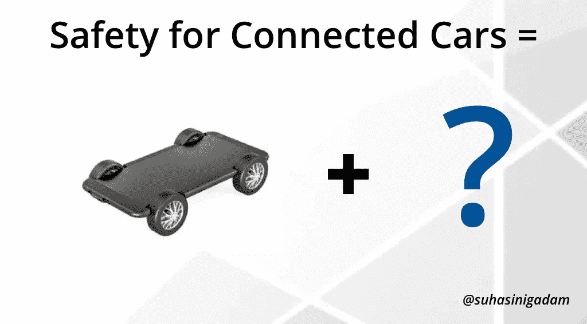
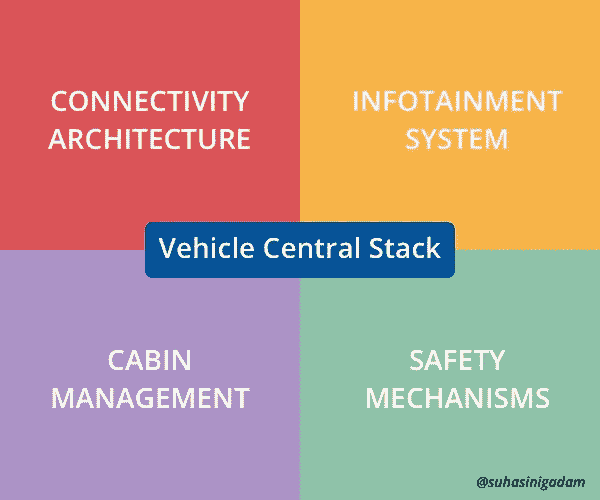

# 为什么汽车的中控台比智能手机多？

> 原文：<https://medium.datadriveninvestor.com/why-a-vehicles-center-stack-is-more-than-a-smartphone-354fb3123f8?source=collection_archive---------1----------------------->

联网汽车和自动驾驶汽车的最新发展让人们普遍认为，未来的汽车将是一辆“带轮子的智能手机”。特斯拉用其类似 iPad 的仪表盘说明了这一点，用户只需按一下按钮，就可以使用车载应用程序。汽车行业的其他公司已经开始赶上来，利用车辆生成的数据和人工智能，通过使其无缝和直观来增强客户的用户体验。智能手机已经成为我们生活的核心设备，无论是与家人和朋友保持联系，预订旅程，跟踪我们的福祉，还是在家里使用智能插头。随着客户需求的普及，将智能手机与汽车整合已经成为几乎每个汽车制造商[的首要任务](https://www.theverge.com/2018/1/19/16907374/volkswagen-mercedes-nissan-detroit-auto-show-2018)。汽车将变得像今天的智能手机一样智能和互联，但这足以确保用户在车内获得安全和愉快的体验吗？

**智能手机 VS 联网汽车**

车辆的联网汽车中央堆栈可分为 4 个主要类别:

1.连接架构:该网络将设备相互连接(车对车或车对一切和智能手机对智能手机或智能手机对一切)。

2.信息娱乐系统:这个多媒体系统包括所有可以通过信息娱乐仪表板屏幕访问的应用程序和服务。

3.车厢管理:控制和维护车内环境，如温度、灯光、存储等。

4.安全机制:用于避免碰撞和警告乘客道路危险的安全机制。

现在我们知道了车辆中央堆栈的 4 个主要类别，智能手机与联网车辆相比如何？

1.**连接架构:**在通过 3G 和 4G、蓝牙和 USB 等蜂窝网络进行连接方面，智能手机在这一类别中远远领先于汽车。您可以将您的智能手机连接到另一部智能手机或任何其他设备，包括无线耳机、健身带、智能家居设备和汽车。然而，汽车才刚刚开始连接智能手机和传感器，它们还有很长的路要走。有了 5G，人们希望车辆可以开始相互连接，并与周围的道路基础设施连接。对于自动驾驶汽车来说，与行人、骑自行车的人和路上的其他物体连接是一种尚未实现的必要性。

2.**信息娱乐系统:**智能手机之所以成为智能手机，是因为它拥有漂亮而直观的用户界面，能够以最简单的方式使用移动应用和服务。没有智能手机，优步就不会成为优步，Snapchat 也不会成为 Snapchat。无论是导航还是连接到移动应用程序，汽车中的信息娱乐系统都不像你希望的那样完美。它们很慢，反直觉，当你真的需要它们的时候，它们不是很有用。只需打开智能手机，在谷歌地图上找到目的地，就简单多了。车载信息娱乐系统的设计和用户界面将超越前面的小仪表板，在车辆周围显示屏幕和实用按钮。

3.**客舱管理:**今天，我们可以用智能手机控制家里的任何智能设备，从灯到冰箱。还记得詹姆斯·邦德电影里那些酷车和高科技小玩意吗？未来的汽车将展示其中一些功能，不仅是在车内，还通过智能手机集成。这种体验将类似于使用手机控制房子周围的智能设备，无论是控制车内温度还是在车窗上拉起屏幕来小睡一会儿。物联网(IoT)和大数据的发展已经渗透到汽车行业，用不了多久，汽车就会成为一台巨大的智能互联网机器。

4.**安全机制:**现在汽车行业最关心的是人的安全问题。让我们详细看看联网和自动驾驶汽车的安全系统:

与智能手机或其他消费设备相比，汽车需要更高的安全、安保和隐私标准。在大多数情况下，当你重启智能手机或笔记本电脑时，问题就会消失。当无人驾驶汽车正在从 A 点行驶到 B 点的过程中，如何重启它呢？

即使智能手机与自动驾驶汽车集成在一起，汽车也比智能手机更容易识别道路上的物体。车辆可以配备近程传感器来检测周围环境中的危险，不像智能手机相比汽车要小得多。

当自动驾驶汽车受到网络攻击时会发生什么？智能手机能解决汽车的网络安全问题吗？答案可能是否定的。联网和自动驾驶汽车必须能够自给自足，以自行识别、保护和减轻网络风险。

智能手机的使用寿命为 2-3 年，而汽车的使用寿命为 8-10 年，这需要弹性和稳定的硬件以及能够支持这种硬件的软件。当然，现在有了空中下载(OTA)软件更新，汽车可以像智能手机一样在整个生命周期中不断更新，前提是它们用正确的硬件进行改装。硬件和软件都不会与智能手机中使用的相同。

随着 [GDPR](https://www.zdnet.com/article/gdpr-an-executive-guide-to-what-you-need-to-know/) 的到来，监管才刚刚开始浮现互联技术的世界。围绕联网和自动驾驶汽车的法律框架仍然是武断和模糊的。政府需要接受这些不可避免的技术转变，并准备好监管商业和科技公司。

尽管从智能手机生态系统中可以学到很多东西，但汽车包含高度复杂、技术敏感的系统，必须符合高技术和法律标准。这些系统是由汽车制造商严格按照道路安全法规、产品安全和质量标准开发和监控的，在某些情况下，远远超出了法律要求。安全物流胜过智能手机的胜利，使联网汽车无法与智能手机相比。随着汽车技术的快速发展，政府面临越来越大的压力，需要建立新的监管框架来维持快速增长的速度，并使道路对每个人都安全。工业 4.0 将提高生产过程的灵活性、速度、生产率和质量，使汽车行业能够增强和定制他们的产品。我们需要了解的是，这将如何影响不同人群的移动服务？

**免责声明:本文表达的观点和意见仅代表我个人，不代表任何其他人或公司。所有内容都受版权保护。*