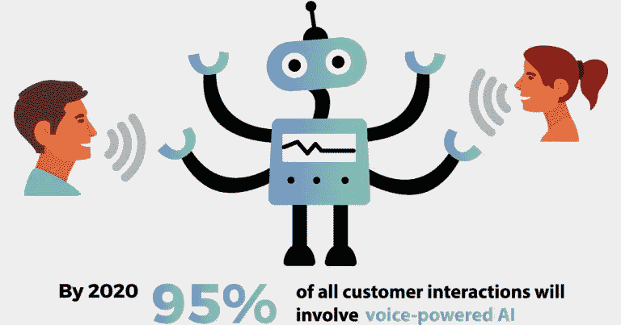
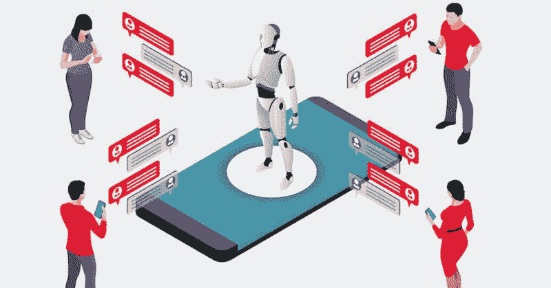

# 为什么人工智能是客户体验的未来

> 原文：<https://medium.datadriveninvestor.com/why-ai-is-the-future-of-customer-experience-b262b0b439b9?source=collection_archive---------27----------------------->

人工智能和机器学习语言已经通过其无可挑剔的能力击败了商业世界的根基。这些技术的响应性创新使商业领域能够以更贴切和个性化的方式与受众交流。[像聊天机器人](https://www.technource.com/blog/artificial-intelligence-innovations-that-impact-the-future-of-work)、自然语言识别和虚拟助理这样的创新，由于其直觉和洞察力，有可能帮助全球品牌、公司和行业了解客户的需求。

根据 IDC、Servion 和 Gartner 的预测，在未来几年，将不再有人与人之间的互动，而只有机器人与客户之间的互动，或者更准确地说，我们可以说，机器与人之间的交流是一种更可靠、更有吸引力的方式。原因是，人工智能极大地提高了客户的满意度，此外，通过认知计算进行的交互被认为是最成熟的行为之一，可以深刻地确定用户的需求和选择。现在，让我们来探索这些创新是如何打破坚果壳，把握客户体验的未来的。

AI Customer Experience

# **对客户历史做出准确预测**

在 2018 年，每个企业都希望客户体验发生根本性的变化，并需要满足其客户，因为这个敏捷的世界需要更具吸引力和说服力的东西。现在终于感谢人工智能的进步，这完全带来了客户满意度的多功能改造。作为客户的代理人，你不可能完全了解客户的行为、生命周期、选择和属性。因此，你需要一个娴熟的客户，通过它你可以直接潜入客户的生活。人工智能创新决定了人们的主流思想、选择、偏好和生活方式，进而为品牌创造了一份想象中的报告。公司和品牌利用这些报告对顾客的行为做出准确的预测。你预测你的顾客的本性，你就能满足他。

# **解决实时问题，创造无障碍环境**

你用过谷歌助手，苹果的 Siri 或者亚马逊的 Alexa 吗？如果是，那么你已经在利用人工智能了。这些虚拟助手或更正确的人工智能助手提供了一个对话环境，在这里你可以追踪任何位置，搜索任何东西，购买你的衣柜，跟踪即将到来的趋势和新闻。通过这些语音技术，客户可以处理他现实生活中的问题；不花太多力气就能筛选出他的需求。无论何时你下命令，这个个人助理在跟随你的命令之后带来真实的结果；他们严格按照你的指示，以真实的方式服务。根据最近的报道，人工智能助手不仅确保了卓越的客户体验，还被认为是削减开支的有效方式；亚马逊、谷歌和苹果等大型科技公司正通过这些助手不断增加收入。

AI Solving Real Time Problems

# **人工智能让你的品牌成为好听众**

你的品牌只有具备倾听品质，才能提供有希望的客户体验。集成了人工智能的 IOT 设备允许您收集客户的数据、优先级和预算，通过这些数据，您可以在个人层面上确定用户的偏好。因此，你在倾听顾客的需求，作为一个好的倾听者，你可以在几分钟内解决顾客的问题。

AI Increase Your Brand Visibility

通过人工智能，品牌可以将数据(结构化和非结构化)转换为可用的信息，然后利用这些信息来锁定受众。通过在个人层面上满足客户的需求，你可以与你的用户建立一种值得信赖的关系，并使你的企业与众不同。简而言之，收集数据不是一件小事，你使用这些信息的方式很重要。了解个人喜好会极大地促进客户与品牌的互动，并在客户面前留下永久的印象。

除了这些语音技术，我们怎么能忘记聊天机器人呢？它们取代了人类的工作，也取代了人与人之间的互动。聊天机器人不仅仅是对话助手，因为它们通过吸引人的文本和用户友好的环境吸引客户。他们通过在有限的时间内提供优化的解决方案来珍惜客户的时间。可以说，这些对话使者以乐观的方式展示品牌，他们采用聪明、独特和吸引人的方式在顾客面前宣传品牌。

# **人工智能已经无处不在**

尽管 2018 年只是人工智能方法的开始，但创新者正在广泛采用这种令人难以置信的技术来执行人类任务。无论你是在办公室与客户打交道，还是在家里观看足球比赛，人工智能都可以通过提供一条本能的路径来有效地减轻人类的压力。让我们考虑一些富有成效的例子，这些例子已经在为扣人心弦的观众使用 AI。

AI Is Everywhere

每个人都喜欢的足球，利用人工智能知识带来了高质量的比赛现场直播。一切都是 AI 数据库组合的。现场得分，球员的历史，表现和活动都存储在后台。几乎每个足球教练都使用 AI 云计算技术，以便评估球队的薄弱环节。这将有助于教练监控所有球员的表现。不仅仅是足球，几乎每一项运动都在与人工智能、控制论和 IOT 合作，为体育爱好者带来最佳和获胜的团队。

人工智能在推荐音乐、视频和电影方面也发挥着重要作用。在使用 YouTube 时，你一定注意到这个应用程序会向你推荐新闻提要、你选择的视频等等。类似地，网飞、loop 和 Spotify 广泛利用人工智能的洞察力，以提供推荐的频道、歌曲和播放列表。智能手机、自动汽车、无人机都在吸收人工智能知识产权，以提供更好的客户体验。这些都是 AI 的日常生活应用，缓解了客户的生活，减少了人类的工作。

# **结论**

与 AI 握手，为你的品牌提供了新的标杆。对人工智能的正确理解和有价值的实施提高了客户体验，创造了友好的氛围，吸引了您的观众，提高了业务收入，并让您与您的客户保持稳定的关系。有了人工智能，你可以为你的企业创造价值，因为它有可能创造高质量的客户体验。因此，如果你在经营一家企业，你的品牌应该采用人工智能的直观方法，因为它定义了客户与品牌互动的路径。