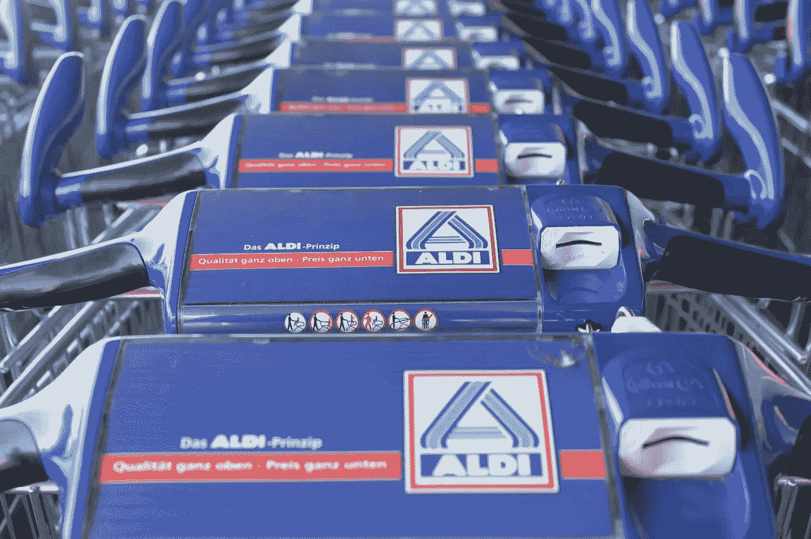
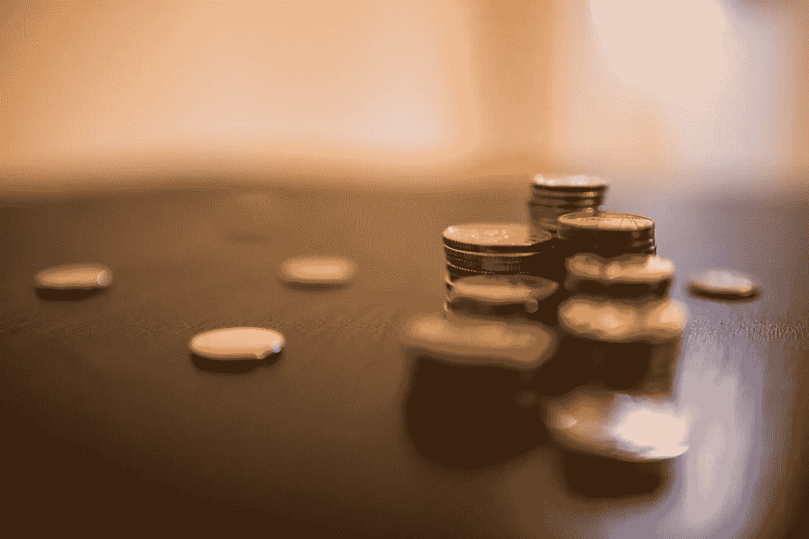
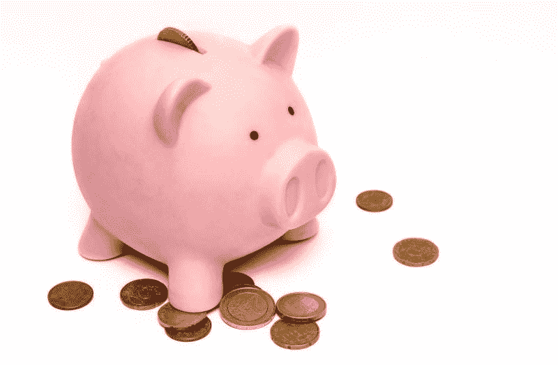
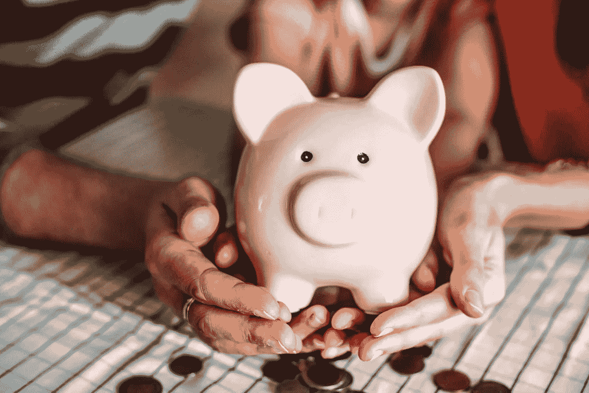
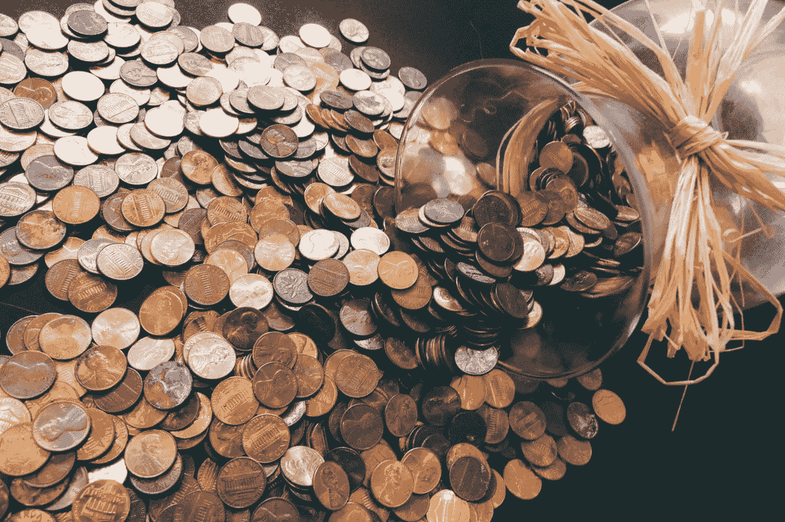

# 为什么阿尔迪是美国最具破坏性的杂货商——市场疯人院

> 原文：<https://medium.datadriveninvestor.com/why-aldi-is-americas-most-disruptive-grocer-market-mad-house-9bf1673d6496?source=collection_archive---------1----------------------->

奇怪的是，德国人拥有的 Aldi 是美国最具破坏性的杂货商。事实上，比起亚马逊(纳斯达克股票代码:AMZN) ，阿尔迪在改变美国食品业格局方面做得更多。

目前， [Aldi](https://corporate.aldi.us/en/aldi-history/) 在美国经营着超过 1800 家商店，并计划很快再增加约 400 家。然而，阿尔迪的销售额有限*进步杂货商* [估计](https://progressivegrocer.com/top-50-grocers-amazon-8th-place-while-rest-industry-restrategizes-reshuffles)阿尔迪在 2017 年销售了价值 146.65 亿美元的杂货。

相比之下，美国最大的独立杂货商；**克罗格(纽约证券交易所代码:KR)** ，2017 年杂货销售额为 792.4 亿美元。与此同时，美国最大的“杂货商”**沃尔玛(纽约证券交易所代码:WMT)** 售出了价值 1568.09 亿美元的杂货。澄清一下，沃尔玛超市是美国最受欢迎的“杂货店”。

 [## 为什么包容性财富指数比 GDP 更能衡量社会进步？-数据驱动…

### 你不需要成为一个经济奇才或金融大师就能知道 GDP 的定义。即使你从未拿过 ECON 奖…

www.datadriveninvestor.com](https://www.datadriveninvestor.com/2019/03/08/why-inclusive-wealth-index-is-a-better-measure-of-societal-progress-than-gdp/) 

# 为什么阿尔迪如此具有破坏性

阿尔迪是如此具有破坏性，因为它的商店打破了美国超市业务的所有规则。

首先，阿尔迪酒店的设施很少。没有药店、面包店、熟食店、肉类柜台、咖啡馆、咖啡店、银行、比萨饼店、珠宝店、加油站等。相反，阿尔迪只卖杂货和有限的干货。

第三，阿尔迪限制其库存，通常提供一种品牌的产品。第四，阿尔迪强调高品质和新鲜度。

第五，阿尔迪专注于自有品牌的销售。事实上，阿尔迪的网站宣称其 90%以上的产品都是阿尔迪自有品牌。值得注意的是，沃伦·巴菲特估计好市多在 2017 年出售了价值 390 亿美元的柯克兰自有品牌，*商业内幕* [报道](https://www.businessinsider.com/warren-buffett-costco-kirkland-brand-thrives-2019-2)。因此，巴菲特计算出柯克兰食品的销售额现在超过了卡夫亨氏，后者在 2017 年销售了价值 263 亿美元的食品。

第九，Aldi 用很少的员工提供简单的购物体验。众所周知，Aldi 要求购物者“租用”购物车。解释一下，购物者为购物车支付了 25 美分，但如果他归还的话，可以拿回硬币。

# 什么是阿尔迪？

对自有品牌、小商店和简单性的强调使 Aldi 能够提供极低的价格。例如，2019 年 4 月 24 日，堪萨斯州哈奇森的碎牛肉每磅 1.99 美元，79₵每包蘑菇。

然而，Aldi 提供的质量比像 **Dollar General (NYSE: DG)** 这样的一元店更高。而且，阿尔迪强调的是新鲜食物。因此，一个很好的方式认为阿尔迪是工人阶级的乔氏商人。

另一种看待阿尔迪的方式是将其视为一个规模较小的 **Costco Wholesale(纽约证券交易所代码:COST)** ，不收会员费。事实上，和好市多一样，阿尔迪强调自有品牌。此外，像好市多阿尔迪提供了一个“寻宝”购物体验与它的“[阿尔迪发现](https://www.aldi.us/en/weekly-specials/aldi-finds-for-may-8/)；精选产品特价。

最后，Aldi 的小规模和无装饰战略使其能够将商店设在其他杂货店“不敢涉足”的地方。例如，在小城镇、铁锈地带、市中心、旧街区和旧郊区。值得注意的是，Aldi 和它的同父异母兄弟 Lidl 正在大举进军纽约市和长岛。

# 阿尔迪在美国成功的原因

阿尔迪的一切都不寻常。值得注意的是，Aldi 是少数在美国取得成功的外国杂货商之一。一些非常有竞争力的外国杂货商，包括英国的**乐购(伦敦证券交易所:TSCO)** [在美国食品市场上戏剧性地失败了](https://www.usatoday.com/story/money/business/2013/04/17/tesco-exits-usa/2090801/)。

特别是，Aldi 的目标是工人和中下阶层，而竞争对手却忽略了他们。比如，批评家；像杰西·杰克逊牧师一样，声称克罗格故意关闭贫困地区的商店并将资源重新分配给富裕社区，*今日美国* [报道](https://www.usatoday.com/story/money/nation-now/2018/04/10/jesse-jackson-kroger-protest/502688002/)。

另一方面，Aldi 在工人阶级社区、旧郊区、小城镇和一些市中心地区开设商店。此外，Aldi 将其美国足迹集中在东北部和中西部收入萎缩的地区，即所谓的“锈带”。

# 阿尔迪如何利用收入不平等和工资停滞获利

Aldi 正在将自己定位于从美国日益加剧的收入不平等和工资停滞中获利。具体来说，Aldi 是日益囊中羞涩的中产阶级的完美购物体验。事实上，皮尤研究中心估计，2016 年美国中产阶级的购买力已经有 40 多年没有增长了。

例如，圣路易斯联邦储备银行[估计](https://fred.stlouisfed.org/series/MEPAINUSA672N)2016 年美国个人平均收入中值[为 31099 美元。澄清一下，这个数字涵盖了所有美国人，包括那些没有工作的人。](https://marketmadhouse.com/why-america-needs-a-basic-income/)

另一方面，根据劳工统计局(BLS)的计算，普通美国工人的税后工资为每周 905 美元，或每年 47030 美元。此外，一些群体的工资要低得多。

# 美国人没什么钱

例如，据 BLS 估计，职业女性的税后年薪为 41，912 美元或 860 美元一周。此外，非裔美国人的税后工资是每周 737 美元，每年 38324 美元。此外，西班牙裔的税后工资是每周 696 美元或每年 36192 美元。

最后，50%的美国人享受医疗保险；对于大多数领取者来说，65 岁开始，每年收入不到 26200 美元，亨利·j·凯泽基金会[估计。此外，2016 年，医疗保险受益人(普通老年人)的收入中值为 26，200 美元。](https://marketmadhouse.com/senior-citizens-need-a-basic-income/)

因此，许多美国人都在省吃俭用。因此，阿尔迪的客户群非常庞大，而且还在不断增长。据 CheatSheet 估计，美国家庭平均每周在食品杂货上的花费在 885 美元到 1056 美元之间。而且， *CheetSheet* [声称](https://marketmadhouse.com/why-aldi-is-americas-most-disruptive-grocer/In%20contrast,%20the%20average%20American%20family%20spends%20between%20%24885%20and%20%241,056%20on%20groceries%20a%20week,%20CheatSheet%20estimates.)一个美国家庭可以节省 21%；或者一年 2000 美元，在阿尔迪买食物。

# 阿尔迪的奇怪历史

阿尔迪；或称 Albrecht Discount，始于 1913 年德国埃森的一家家庭杂货店。有趣的是，一位名叫安娜·阿尔布雷特的女性创立了阿尔迪。

然而，这是阿尔布雷希特的儿子；西奥和卡尔，他们在二战后将杂货店变成了折扣帝国。20 世纪 60 年代，西奥和卡尔因为卖烟的问题吵了一架，他们无法解决。

结果，兄弟俩把生意分成了两个连锁店 Aldi Nord(北方)和 Aldi Sud(南方)。事实上，是 Aldi Sud 在美国经营 Aldi 品牌的杂货店。

奇怪的是，Aldi Nord 和 Aldi Sud 在美国直接竞争。解释一下，阿尔迪诺德拥有乔氏百货。

Aldi Sud 计划投资 34 亿美元，到 2022 年在美国再开 800 家店。目前，Aldi 在 35 个州开展业务，所以它的足迹和 Kroger 一样大。事实上，*商业内幕* [声称](https://www.businessinsider.com/aldi-overhauls-stores-to-compete-with-walmart-and-kroger-2018-8)到 2022 年，Aldi Sud 将成为美国第三大杂货店。

Aldi Nord 正在通过积极的收购扩大其在美国的业务。例如，Alid Nord 将把纽约州和新泽西州的 27 个最好的市场改造成 [Lidil](https://www.lidl.com/about-us) 商店，*超市新闻* [报道](https://www.supermarketnews.com/retail-financial/analysis-lidl-poised-disrupt-metro-new-york-grocery-market)。目前，Aldi Nord 在美国经营超过 474 家 Trader Joe's 和超过 66 家 Lidl 商店。

# 能投资阿尔迪吗？

不幸的是，个人无法投资于私有的 Aldi Nord 和 Aldi Sud。然而，你可以投资与 Aldi Sud 合作的公司。

上市百货公司**美国柯尔百货公司(纽约证券交易所:KSS)** 计划与阿尔迪开设 5 至 10 个共享位置。为了解释，美国柯尔百货公司给了阿尔迪一半的店面空间。

这个想法是为了减少美国柯尔百货公司的足迹；让 Aldi 进入新市场，比如威斯康辛州的 Waukesha。解释一下，美国柯尔百货公司是众多缩减规模以削减开支和保护自己免受亚马逊攻击的零售商之一。

重要的是，美国柯尔百货公司允许顾客在其商店中退货，因此，亚马逊的受欢迎程度可能会在美国柯尔百货公司的帮助下吸引更多顾客前往 Aldi。

然而，我认为市场先生在 2019 年 5 月 2 日高估了美国柯尔百货公司股票 69.95 美元。相反，我认为科尔是一只很好的股息股，因为它在 2019 年 4 月 3 日向 67₵支付了股息。此外，该股息于 2018 年 12 月 26 日从 61₵增长。

# 阿尔迪的光明未来

归根结底，我觉得阿尔迪在美国前途光明，因为收入低。

此外，阿尔迪可以重复美国柯尔百货公司与许多其他零售商的伙伴关系。包括 TJX 的 [HomeGoods](https://marketmadhouse.com/why-are-the-tjx-companies-making-money/) 、 **Walgreens(纳斯达克股票代码:WBA)** 、 **CVS Health (NYE 股票代码:CVS)** 、 **Nordstrom(纽约证券交易所股票代码:JWN)** 、 [Sears](https://marketmadhouse.com/sears-is-suing-lampert-and-the-us-treasury-secretary/) 、亚马逊书店、Staples、 **Best Buy(纽约证券交易所股票代码:BBY)** 等等。

最后，像拼车应用这样的新技术可以帮助 Lydl 和 Aldi 发展。解释一下，Lyft 的杂货店准入计划让低收入人群搭车去杂货店。

显然，低收入购物者最有可能乘坐 Lyft 前往阿尔迪。值得注意的是，*超市新闻* [估计](https://www.supermarketnews.com/retail-financial/lyft-expands-grocery-access-program)多达 2350 万人可以从这个项目中受益。不仅仅是 Lyft，Alphabet 的无人驾驶汽车子公司 Waymo 让客户搭车去亚利桑那州的沃尔玛。

因此，Aldi 简单而颠覆性的模式可能是美国杂货店的未来。投资者最好注意一下，因为 Aldi 的成功可能会给一些传统零售商带来厄运。

*原载于 2019 年 5 月 2 日 https://marketmadhouse.com**的* [*。*](https://marketmadhouse.com/why-aldi-is-americas-most-disruptive-grocer/)