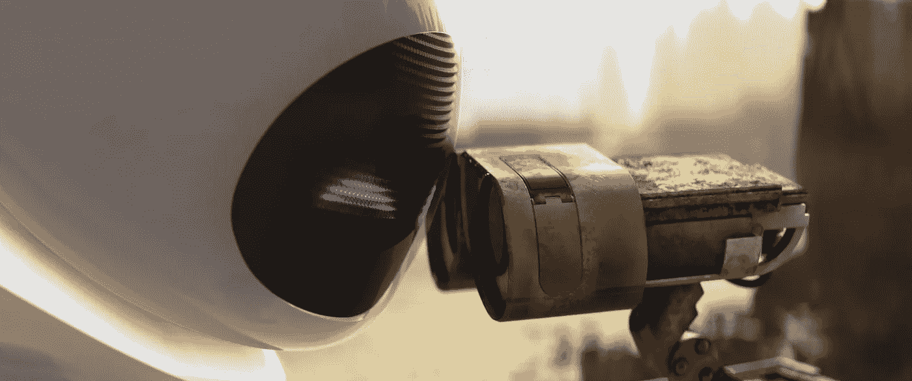

# 为什么我没有创造力 2

> 原文：<https://medium.datadriveninvestor.com/why-am-i-not-creative-2-fb861dd40c?source=collection_archive---------13----------------------->

第二章:分享习惯

“但我，因为贫穷，只有我的梦想，”W. B .叶芝在 1899 年写道。结尾是，“我把我的梦铺在你的脚下；/轻轻地踩，因为你踩着我的梦。”这首诗的节选真是迷人。我们所做的一切都不是为自己创造的。我们需要别人的意见。这就是为什么即使是社交媒体的巨大成功，也已经征服了所有年龄的“儿童”，包括那些白发苍苍的儿童，他们对一种技术感到兴趣，这种技术可以让这个世界变得更容易接近，对似乎几乎对生活失去信心的一代人来说，也不那么危险。

没有人能逃脱它的魔力。

我们分享吸引我们注意力的一切。分享的行为是一种肯定和确认我们人性的方式。试着在不寻常的情况下，不与目睹同样场景的人交换眼神。

 [## 在创业之旅中，拥抱学习数据驱动的投资者

### 好像建立一个数百万美元的公司还不够困难，企业家必须额外照顾他们的…

www.datadriveninvestor.com](https://www.datadriveninvestor.com/2018/10/16/on-the-entrepreneurial-trek-embrace-the-learning/) 

是的，不可能！

Directive = Helping Eva to achieve her own directive

“分享习惯”是人类历史上最强大的工具。这种力量可以改变任何国家的经济和政治方向。今天的“分享习惯”是一种新的货币，这种潮流掌控着国家和公司、选举活动以及传统沟通渠道的命运。技术没有创造“分享习惯”，但它成功地使它成为不可避免和无价的。

众所周知，这是货币的末日。是啊！因为它，我们现在都很穷。我们都在同一水平线上。只有我们的梦想还在，还有把它们放在世界脚下的渴望，等待着它们带着一些感情在上面行走。

几个世纪以来，我们用工作来换取种子、石头、盐、硬币等。现在，我们的价值与我们能产生的分享量紧密相连。我们投入时间，宝贵的时间，向虚拟世界交付我们最好的。是分享的习惯定义了我们。创意越强，其公开化的潜力也就是赢得人心的潜力就越大。

但这正是危险所在。

我们更喜欢借用创意。我们不喜欢冒险。分享我们确信会成功的东西更容易也更安全，因为每个人都在谈论它，并且已经被我们甚至不太了解的大量人所证实。当我读到那篇文章《老实说？我们不喜欢创意！”我发现了一个站不住脚的真理:“大多数人讨厌怀疑和不安全感。”这种现实使我们远离创造性的原创。怀疑让我们缺乏安全感，而不安全感滋生了怀疑，这种怀疑形成了恶性循环，最终扼杀了我们的创造精神。

对此我毫不怀疑。

面对新的情况，充满未知的新层面，令我们恐惧。我们讨厌缺乏安全感。我们讨厌怀疑。因此，我们更喜欢分享重复的想法，由我们应该尊重的人盖上“认可的印章”。创新是一种风险，我们更愿意把它留给那些在很大程度上被称为“……疯子、不合群者、叛逆者、麻烦制造者、方孔里的圆钉子……那些看待事物与众不同的人——他们不喜欢规则……你可以引用他们，不同意他们，赞美或诋毁他们，但你唯一不能做的是忽视他们，因为他们改变了事物……他们推动人类前进。 虽然有些人可能认为他们是疯子，但我们认为他们是天才，因为那些疯狂到认为自己可以改变世界的人，才是真正改变世界的人。”

是的，我只是分享了一个不是我的想法。是真的。但是不要忘记，只有当一个想法激发分享，并在时间和空间上重塑自我，以多种方式适应和服务于多种目的，总是创造开创性的价值，以多种不同的方式激励人们时，它才是好的。

当史蒂夫·乔布斯批准上面引用的文字时，他可能没有想到“与众不同”的概念会在多大程度上改变苹果的历史和他自己的历史。乔布斯失去了他帮助创建的公司，因为他的思维方式与众不同，表现出了一种远远超出标准的创造力。接下来的旅程你已经非常了解了。不管怎么说，敢于超越剧本内容的人和公司，是那些发现自己原创性的人和公司；当然要付出很高的代价，但是对于那些贫穷的，只有梦想可以分享的人来说，任何牺牲都是值得的。

很难描述我们生活的这个时刻:21 世纪的黎明。在过去，关于这些日子已经说了很多，也预言了很多。飞行汽车和智能机器人与我们互动，照顾我们的生活。不，这些都还没有成为现实，但是如果你注意的话，所有直到现在还不真实的变化已经可以被感知，一点一点地，以一种无法衡量的速度发生，因为我们无法适应它的节奏。

手机的大小和用途已经改变了很多次，以至于不可能创建一个可靠的时间线来准确地讲述它的故事。数字技术创造了我称之为忏悔的东西，并称之为社交媒体。对引起我们注意的事情不加评论是不可能的。我们无法抗拒讲一个好故事的诱惑，同样，我们也无法抗拒一个好故事的魅力。

关于人的事件是认知的春药。我们想知道其他人发生了什么。当然，根据所涉及的戏剧和困境来改变强度。我们使用数字窗口来看和被看，来销售和购买我们认为好的东西。大地球村是一个无止境的市场，在这里你可以无限制地购买任何东西。今天，曾经是人际关系温度计的金钱让位于“分享习惯”。

可分享的想法是新的商品。变量可以被任何东西代替，就像货币一旦被制造出来，就只能作为一种元素来限定交换，作为一种相互信任的文件。可靠的信息印章将很快成为金融交易的新后盾。如果要分享的信息是可靠的，那么它就值黄金、钻石、石油或任何国家最重要的政治职位。产品和人们的声誉将取决于他们产生信任从而分享的能力。

我们生活在一个充斥着假新闻的时代。但正是这一挑战将检验人类的命运，迫使我们纠正整个文化，保护人类最有价值的资产:好奇心。我们好奇，是因为有一种内心的躁动让我们所有人感动。没有例外！不管你是谁，也不管你住在哪里，都有一种好奇心，这种好奇心会根据你的文化负载，基于你在生活中从童年，尤其是在早年学到和经历的一切而发挥作用。我们好奇是因为我们沉迷于“分享习惯”。所有吸引我们眼球的东西都需要展示给其他人。简直无法抗拒！

算法存在于我们按下的所有按钮，我们访问的地方，点击和评论等。他们试图以各种方式将我们的行为等同起来，并创建一个数学公式来揭示我们的概况，预测我们的决定。打破这个界限会给代码的拥有者不可想象的力量。问题是，至少在目前，人类的思维，无论多么驯化，都会让迄今为止创造的任何人工智能感到害怕和惊讶。

在一个黑暗和不确定的时代，当我们被迫发挥创造力，跳出框框思考，以获得生活中的一些运气和一丝希望时，请记住，机器有连接到我们大脑的“电缆”，试图了解我们如何学习，从而通过填补空白来促进我们的生活。这个非常时期要求我们接受创造力的牺牲，这需要持续的努力、奋斗、即兴创作和适应新的情况，以及重写心理概念。但是我们有一个数字保姆，她把一切都交给我们。

This is my new book, spare some time to know more about creativity.

分享是人类的必需品！但是，要穿越这个充满可能性的海洋，我们需要一种独特的方式来应对不断不稳定的气候，这种气候每五分钟就会强加新的规则。人类已经居住在地球上，现在正准备接触其他星球，因为他们无法抵抗推动他们前进的力量，甚至会犯错误。

这是创造奇迹的力量，也是推动艺术寻找团结人们的新方法的力量。因为人，在过去，在现在，当然在将来，是绘画，写诗，耕地和收获，航海，发现新世界，揭开心灵的秘密，给计算机编程的唯一和最好的理由，因为这些和无限的其他原因，不可避免地，按下分享按钮。