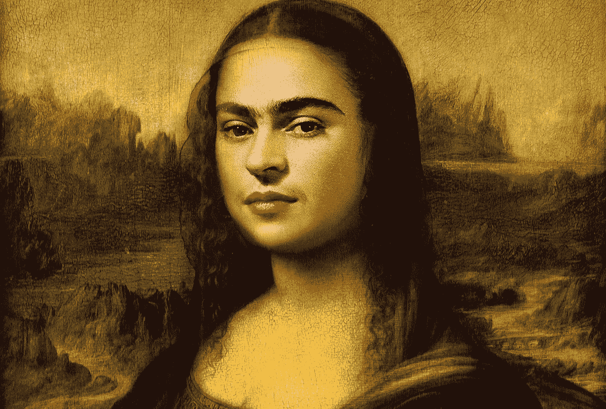

# 为什么我没有创造力？

> 原文：<https://medium.datadriveninvestor.com/why-am-i-not-creative-53c64bae1a5d?source=collection_archive---------8----------------------->

创造力:任何人的日常恐惧，不管他们如何生活。

直到最近，焦虑还是一个禁忌，一个只有名人才有的项目，现在是任何人日常生活的一部分，不管他或她是住在贫民窟还是公寓里，是在寺庙里，还是在山顶上。

 [## 人工智能与创造力:作为创意引擎的比根——数据驱动的投资者

### 的确，2018 年可以被视为人工智能创造的创造力全盛时期的开始。当然可以…

www.datadriveninvestor.com](https://www.datadriveninvestor.com/2019/02/13/ai-creativity-biggan-as-a-creative-engine/) 

焦虑是世纪之恶。

Look to yourself, like Frida Kahlo did.

我们为没有工作而焦虑，这对于那些擅长该行业的人来说没有太大的不同，甚至对于自己企业的所有者来说也是如此。不可预测性扼杀了我们处理时间的方式。拥有还是不拥有，这是个问题。当我们难以下咽时，恐慌、痛苦和焦虑无时无刻不在咬我们的脚后跟，抓我们的地板，扯我们的头发，在我们耳边低语，偷走我们的空气。我们都是这一流行病的受害者。焦虑无声地袭击，偷偷摸摸。以错误的方式与之斗争会给它带来更大的力量。

“该死的上帝！这个人说他要谈谈创造力，他带着焦虑的口吻说道，“你一定在思考。焦虑的一个！

我创造性地工作。是的，我通过每天为客户创造创意来支付账单。然而，在过去的几年里，这口井日复一日地干涸，从那里我只能得到微咸的苦水。说真的！此外，不可否认，这最终反映在我的作品中。更不用说阴影已经蔓延到职业、家庭和社会关系。我非常担心他几乎不能正常思考，重新发明概念，用新的视角解决问题。我的头脑是干燥的，一种奇怪的愤怒在空气中盘旋，伴随着强烈的，易燃的，令人窒息的气味，灼伤了我的眼睛和鼻子。时刻处于戒备状态，准备逃跑或进攻。

我意识到创造力不是一种“天赋”，而是一种努力。一种倾向。我告诉一个朋友，人类的思想就像一条河，当我们决定迟早要筑坝堵住我们的思想时，水的体积最终会让路并找到出路。人类天生好动。无论我们多么内向或胆小，内心都有一片易燃的海洋，等待着奇迹的出现；一个能够赋予整个燃料体积任何意义的火花。

# 光和隧道

就业革命正在爆发。忘记长久以来梦想的稳定，忘记我们父母和祖父母的骄傲。从现在开始，我们将越来越多地通过立法来实现我们所知的工作终结的预言，以及他们周围的一切:工资、假期、退休等等。等。等。一个让你焦虑的完美地点和完美场景。沉浸在这种充满不确定性的氛围中，在我们自己建造的隧道的尽头没有任何光亮。

没有“创造力”的人需要有。很快。但是怎么做呢？那些与它一起工作的人不再知道如何让人们高兴，保持观众的快乐。人们的注意力在哪里，钱就在哪里。这是事实。

重复的活动是没有人想去的地牢，因为已经有许多算法可以解决这些问题。重复的活动使人感到无聊，因此渴望某种消遣。梦想今天的工作是成为一名游戏程序员。为满足渴望感官体验的年轻一代的日常需求而制作的游戏创造了财富。满足这一巨大需求的创造力在哪里？

无论你生活在哪个国家，人类的创造力都存在历史性的不足。对这种天赋的需求从未如此之大，以至于到目前为止，这种天赋被认为是智人的专利。但是，为什么我没有创造力？

工业革命的机械逻辑困扰我们太久了。即使在今天，教室，即使连接到互联网，仍然使用排队的椅子，学生面前有一个人有权教他们。(真的吗？)世界上所有的领域都在进化，迁移到从未想象过的水平，但学校仍然在那里实行“思想控制”，在“教室里进行黑暗的讽刺”，总是说“错了，再来一遍！错了，再来一遍”。从单一的角度来评价学生，使用标准化的，通常是过时的方法，用数字尺度给他们打分，无视他们所有的能力和才能，无论是身体的，心理的，认知的，还是情感的，这是一种未命名的罪行。也许莫扎特、爱因斯坦和玛丽·居里的一些作品因为没有被基于重复的方法格式化而注定不为人知和智力死亡。

到目前为止，世界各地的学校创造了专家，这些人对新事物处理得很差，在破坏性的情况下完全迷失了方向。在适应方面有巨大的困难，因为他们没有很好地发展自我学习的能力，不断地探索；那种孩童般的好奇心在调查的熔炉中燃烧，坚持总是问同样的问题。

如果你是所谓的“创造性”领域的专业人士，你应该每天都会收到大量的需求，要求你解决问题、创造创意、拯救导演、制片人、经理、首席执行官等。这样的需求从哪里汲取灵感？如果你不是来自这个所谓的“创造性”世界，也就是说，如果你属于石碾凡人的宇宙，你知道你的鹤嘴锄很快就要成为一个应用程序，你必须弄清楚如何更新，否则你就会真的死去。

# 更多的焦虑

如果我们的学校不知道如何帮助我们，如果我们的工作，无论是否有创造性，吸干了我们所有的血汗和泪水，如何找到一些创造力来拯救我们的生命和支付我们的账单？

我们没有创造力，因为我们生活在一个系统化了一种方法的社会，这种方法的目的只是为了维护机制。在自主性方面表现出色的学校，鼓励他们的学生进行批判性思考，诸如此类，是现代的选择，是时尚。为什么我们以前没有做好呢？为什么要花这么长的时间来认识人类的这种自然的智慧，这种智慧只有在没有障碍和官僚主义的环境中才能展现出来？

我们的学校看起来更像监狱，有高墙、电栅栏和监控摄像头。谁不会对那样的生活感到焦虑和恐惧呢？

我们没有创造力，因为我们的文化仍然看不到野性和本能思维的真正价值。我们更喜欢标准化和可预测的东西。最好是可测量的。历史已经证明，我们杀死了大多数有着荒谬想法的人，但他们今天主宰着我们的生活。陌生人会害怕，是的，但是会改变事情的进程。创造力需要自由，这背离了旧的概念，即工作等于在给定的物理空间中的体力劳动和工作时间，满足了预先建立的规则。一个被纯粹精英统治所压抑的社会的艰难困境。

现在，随着绳子套在我们的脖子上，整个世界都面临着世界末日，河流和海洋被污染，全球变暖扰乱了我们的气候，普遍缺乏就业机会，以及数十亿人要吃饭，焦虑变得更加明显。任何人都无法控制；即使是最强大的名字也不知道如何收回。

毕竟，雇佣训练有素的人越来越难。我说的不仅仅是充满课程和专业的文凭和课程。事实上，我所说的人类准备好应对逆境、破坏(突变)，并在此期间处理好自己的情绪，重塑自己，能够从失败中吸取教训，主要是与他们在前进的道路上遇到的人分享他们的胜利。

创造力不是天赋，而是人类永远需要克服自身的极限。我们生活在一个微妙的时刻，这需要我们极高的创造能力。它将从哪里来？来自同一个地方:来自我们的恐惧。我们之所以焦虑，是因为我们害怕这个新世界带来的我们无法正确解释的影响。事情发生得太快了，从我们身上碾过。我们在飞行中，甚至在修理飞机。速度带来痛苦。恐惧让我们愤怒，因为我们不知道该做什么而愤怒，但正是这种恐惧可以推动我们前进，证实带我们来到这里的野性本能:生存意识。

焦虑并不是一件坏事。一个没钱的愤怒的父亲可以偷窃，但他也可以创造一个新的想法来养活他的孩子，给他的不仅仅是食物，而是一个如何谋生的可持续的例子。一个有截止日期的艺术总监可以抄袭那些“没人会注意到”的材料，或者在自己的舒适区之外寻找解决方案，相信即使是最新的实习生也能给你“一盏灯”，拯救整个活动。

This is my new book, spare some time to know more about creativity.

无论你是会计师、历史老师、管理员，还是跨国公司的总裁，都没有关系。你的创造力不取决于你获得的学位或你工作的限制。你的创造力永远取决于你超越期望的勇气。而那永远藏在细节里。我们忽略了一切，只看大背景。但是答案总是在那里，在几乎没人看的角落里。创造力的历史就是人类历史本身。人类的躁动不安可以刺激我们的进化。如果一代人害怕什么，下一代人会解决它。

# 正确的方向

世界焦虑不安，颤抖不已，瞳孔放大。我们的手出汗，肚子里冷个不停。这个世界为我们的注意力付出了高昂的代价，正因如此，我们无法拥有焦点。这就是为什么这么多的痛苦。世界的新主人将是那些能够驯服他们的思想，在正确的时间，为正确的人，出于正确的原因，对正确的事情给予适当关注的人。养成健康的选择性姿势，这有助于我做出更好的选择，关注细节，将是让世界朝着正确方向发展的关键。

我们会一直焦虑吗？当然啦！这是我们的祝福，也是我们的诅咒。秘密是我如何控制我的注意力。利用你的焦虑。否则只会消耗你的心智，直到什么都没有了。它将不可避免地像大海中的波浪一样到来，总会接踵而至。你可以冲浪，也可以在沙滩上玩。这是你的决定。快点，又有一辆来了…

要有创意！多关注自己就好。你会惊讶的！