# 为什么亚马逊总是赢——一篇视觉散文

> 原文：<https://medium.datadriveninvestor.com/why-amazon-always-wins-so-far-a-visual-essay-ebcbd36353f8?source=collection_archive---------1----------------------->

这是与一个即将到来的视频文章( [*这里是法语版*](https://youtu.be/qnJ1BKrEspw) *)相对应的文本，是关于商业问题系列的第一篇。*

亚马逊于 1994 年推出。同年，邪教电影《店员》上映。时间快进 20 年，巧合的是，电影中那些相当粗鲁的职员可能已经预料到了 Amazon Go 的“走出去”技术(即完全取消职员)。

在 1994 年，错过亚马逊的发布会很容易。那一年最激动人心的技术发布被称为索尼 Playstation 和 Netscape。

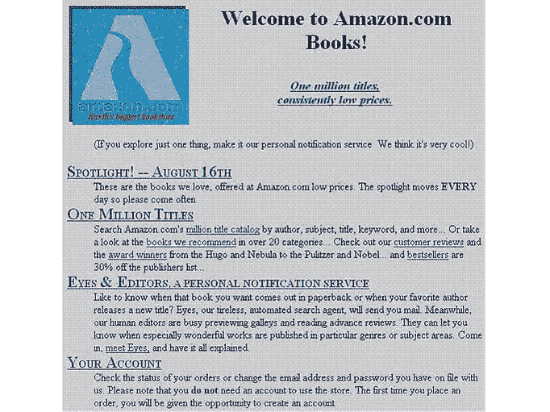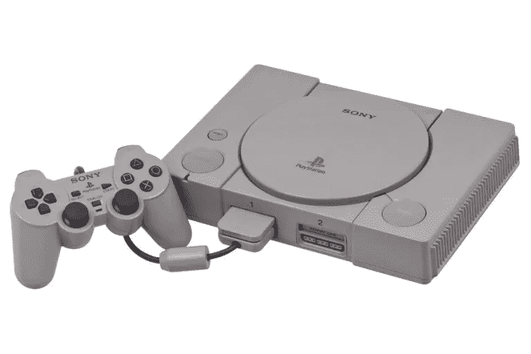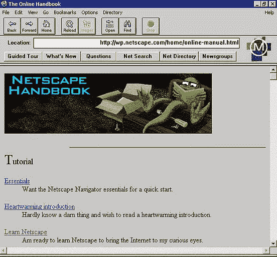

tech in 1994: one shade of grey

杰夫·贝索斯在网上卖书的想法一直被认为是第一步。选择书籍不是因为对书籍的热爱，而是因为书籍类别中的商品比任何其他类别的产品都多。这一想法以及随后亚马逊产品范围扩大到目前的规模，将使他在 2017 年成为世界上最富有的人，23 年前他辞去了对冲基金的工作，创办了自己的创业公司。

# 实体店 vs 线上，还是亚马逊 vs 零售？

## 零售业的状况

零售业不断发展和复制——每一项创新都对行业产生深远的影响。市场(公元 3000 年)，有店面的商店(18 世纪)今天仍然存在。百货商店(19 世纪)，然后是购物中心和超市(20 世纪)是他们那个时代的大破坏者。

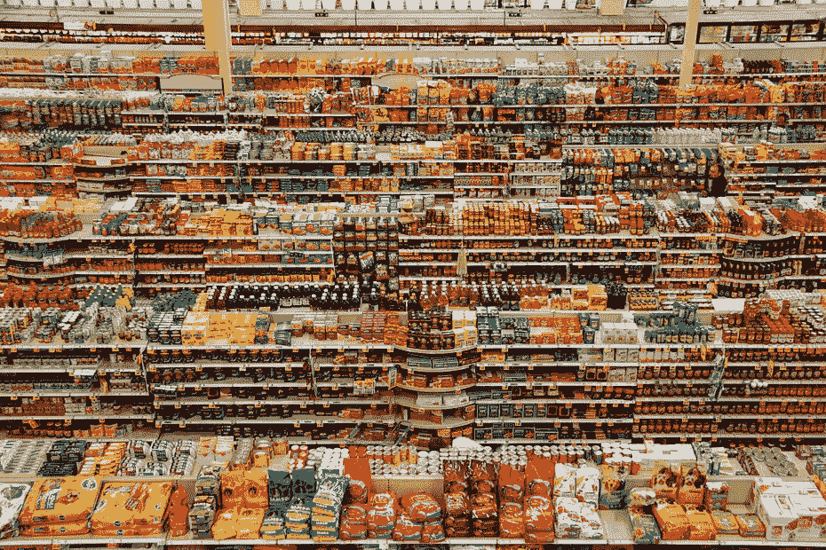

事实上，超市对杂货购物的影响，从 30 年代的 3%到 60 年代超过 50%的市场份额，使电子商务相比之下显得缓慢和温顺(在其诞生后的 20 年里，目前占总量的 17%)。

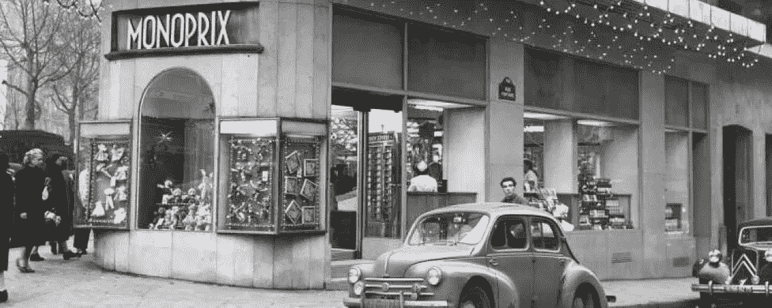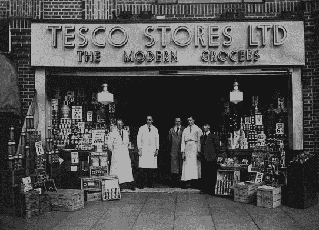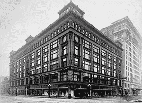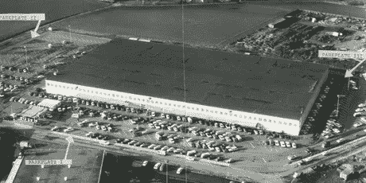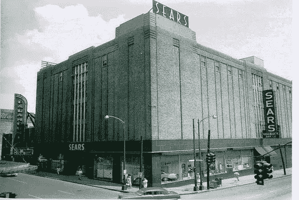

就竞争格局而言，电子商务与之前的破坏之间的区别在于，亚马逊(Amazon)一家公司占据主导地位，并实现了前所未有的全球影响力。

*   客户满意度排名第一
*   2017 年美国电商的 44%
*   2017 年全球电子商务增长的 50%(中国除外)

## 为什么股票市场喜欢亚马逊？

虽然亚马逊显然是电子商务的 MVP，但它看起来只是更广泛的零售领域的另一个参与者。值得将其与世界上最大的零售商沃尔玛进行比较。

2017 年是亚马逊最好的一年，对沃尔玛来说是非常糟糕的一年，但如果你比较沃尔玛和亚马逊在 2017 年的数据，规模差异很明显:

*   沃尔玛的营业额比亚马逊高出 2.8 倍
*   沃尔玛的利润比亚马逊高 4.5 倍

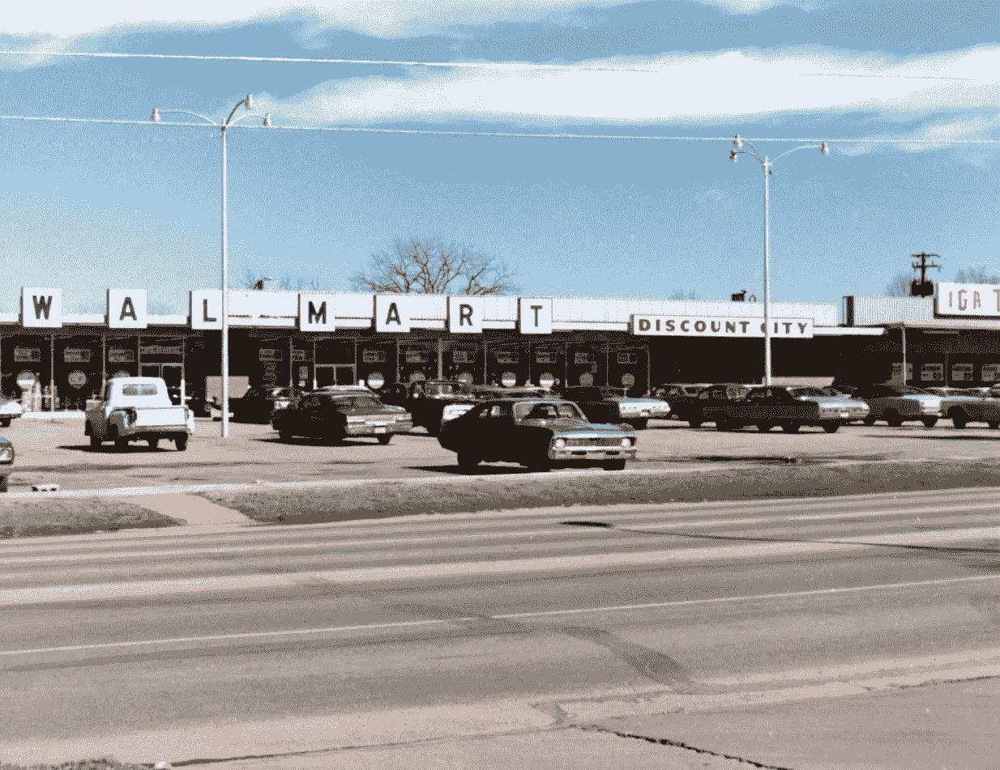

*   然而，截至 2017 年底，亚马逊的股票市值(7800 亿美元)是沃尔玛(2600 亿美元)的 3 倍。

相比之下，从长远来看，股市的涨势更加明显。这是从 2006 年到 2016 年十年间主要零售商的股价变化

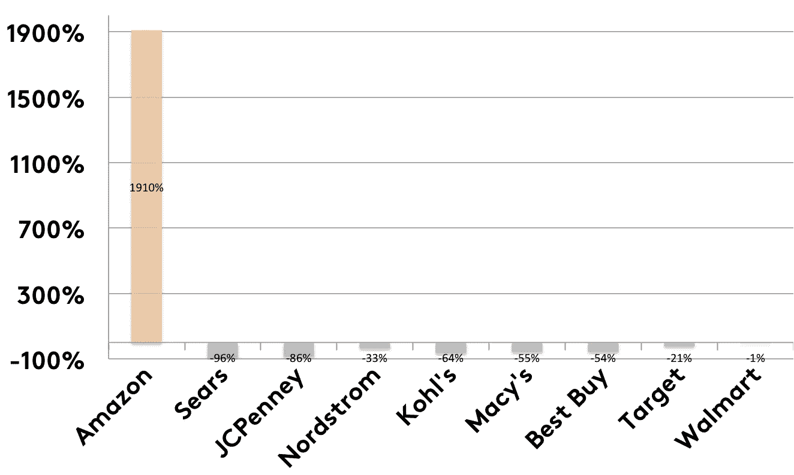

2006–2016: change in share price, major US retailers

在全渠道时代，随着电子商务的采用率接近 100%，传统的“实体与在线”的对立正在逐渐消失。这张图表让“亚马逊与其他零售企业”看起来更有说服力。

这种极高的市场估值让亚马逊相对于所有竞争对手拥有不公平的优势:它可以获得超级廉价的资本。

# 亚马逊和利润

尽管事情在 2017 年开始发生变化，当时亚马逊报告了 30 亿美元的净利润，但其历史表明，在这一领域的记录参差不齐，乏善可陈。

那对一些人来说是讨厌的。

从传统的角度来看，格拉汉姆的[智能投资者](https://www.amazon.co.uk/Intelligent-Investor-Definitive-Investing-Practical/dp/0060555661) (1949)仍然是我个人理财的主要参考，直到我读了斯科特·加洛韦的 [The Four](https://www.amazon.co.uk/Four-Hidden-Amazon-Facebook-Google/dp/059307789X) (2017)，我才能搞清楚自己。

现在很明显，亚马逊非常努力地花掉它赚的所有钱:

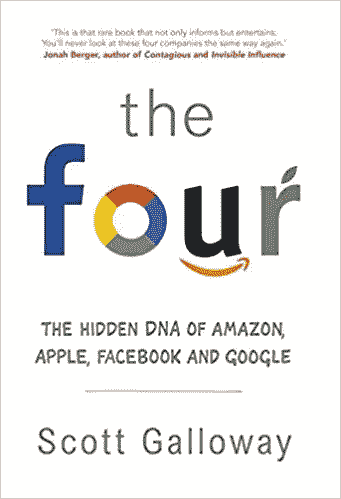

*   它是研发支出最多的国家:2017 年为 220 亿美元
*   购买靠近市中心的昂贵仓库，将交付时间缩短到一天或几个小时:几十亿美元？
*   客户服务:从个人经验来看，如果你在亚马逊上买东西，退款是如此容易，以至于你真的想知道他们准备损失多少钱。
*   如果你是一家送货的公司，你可能会收取一定的费用，但要比送货的费用高。亚马逊在送货上损失 70 亿美元。

## 他们为什么这么做？

在零售版的《权力的游戏》中，亚马逊得到了龙、瓦雷利亚钢武器和一堵墙。他们让任何人都很难赶上。

Amazon’s delivery and customer service is ready for

## 他们怎么能这样做？

真正的超能力是让亚马逊获得所有其他能力的能力，也是《权力的游戏》擅长的能力:讲故事。

> "我们这个时代最会讲故事的人可能要数史蒂文·斯皮尔伯格-杰夫·贝索斯了."

斯科特·盖洛威，四人组

这个故事的核心是成为世界上最以客户为中心的公司。亚马逊的惊人之处在于，当你观察这家公司时，你会发现他们做的每一件事都是真实的。它不仅仅是倾听顾客的心声。

最后，这个故事之所以可信，是因为它被成长赋予了生命，而且是用数字写的。亚马逊季度收入的图表给人印象深刻的是它的陡峭性和规律性。

唯一被发现的不规则现象是 2017 年 Q2 奥运会异常加速。

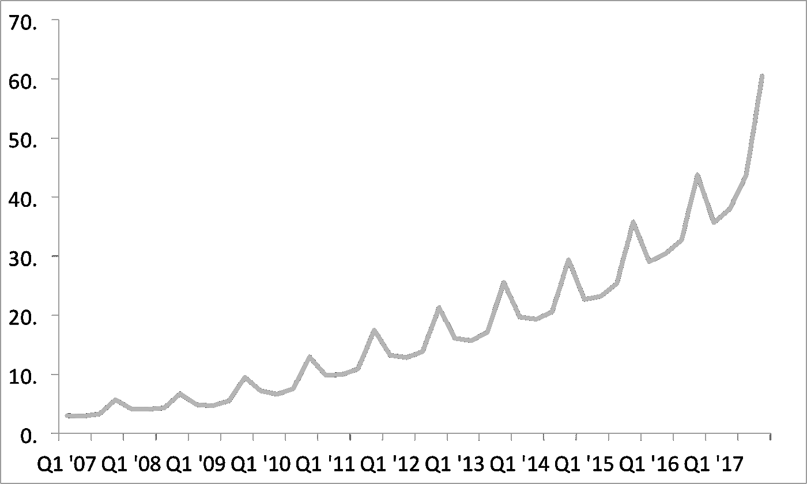

Net revenue of Amazon from 1st quarter 2007 to 4th quarter 2017 (in billion U.S. dollars)

# 大胆押注创新

有了这么多廉价资本，亚马逊可以冒险创新。Kindle，Prime 和现在的 Alexa 已经成为主流。像 Prime Air 这样的创新可能更多的是公关而不是实质。而且也不确定亚马逊申请专利的“飞行仓库”是否会飞起来。

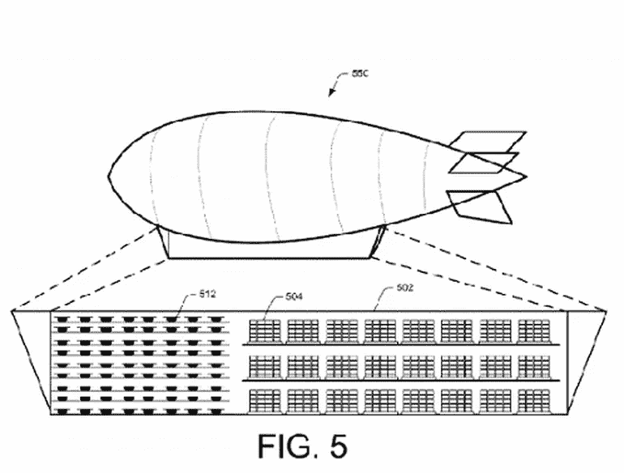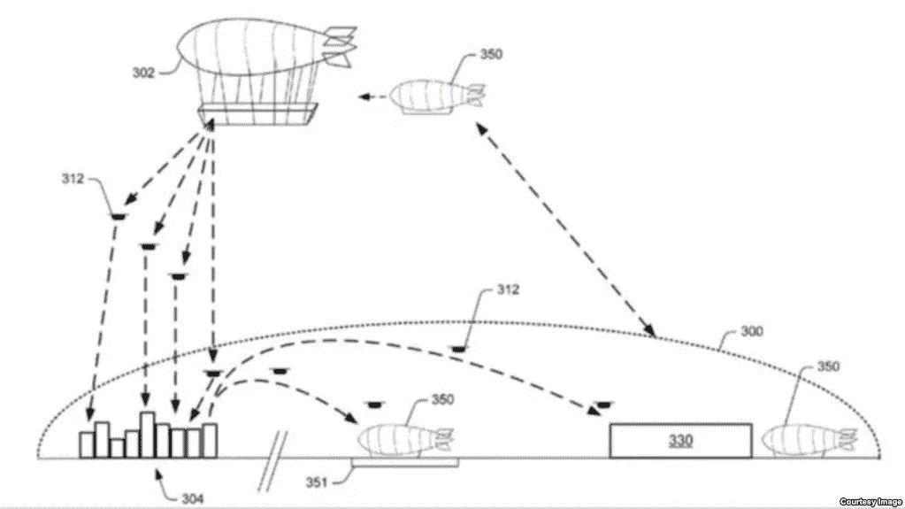

然而，到目前为止，最大的创新是 AWS 亚马逊网络服务(云服务的世界领导者)——这实际上比该公司的零售业务带来了更多的钱。

最后，还有一种亚马逊不喜欢过多谈论的创新:人工智能和机器人。

这些生活在亚马逊履行中心的小家伙有些不舒服，你想知道他们取代了多少工作。

# 3)它可以让人们付费购物

除了创新和廉价资本，亚马逊还有另一个巨大优势:Prime。

如果你从未听说过它，你会认为订阅然后付费购物是疯狂的，这是可以原谅的。但是看看阿姆森广告中的那个人，当他用完牙膏的时候，他正在使用 Prime。

他并不孤单，事实上他代表了大多数美国家庭 52%订阅 Prime (52%)。显然，他们不仅仅是为了购物才加入的有很多额外津贴，但 Prime 客户也是迄今为止最活跃的，所以购物才是最终的目的。

# 接下来呢？已经是第二天了吗？

对亚马逊来说，这是一段令人兴奋的经历。

这是一个迷人而又神秘的组织。

作为最有价值的公司之一，它还能继续保持最低利润吗？它是第十大雇主，但它对就业和社会有什么影响呢？

随着它成为领导者和每个人的目标，它能与所有人竞争吗？

*   像沃尔玛这样的超市正在通过购物过程引入技术。
*   其他人正与谷歌和家乐福等科技公司合作，挑战 Alexa
*   政客们正在参与进来

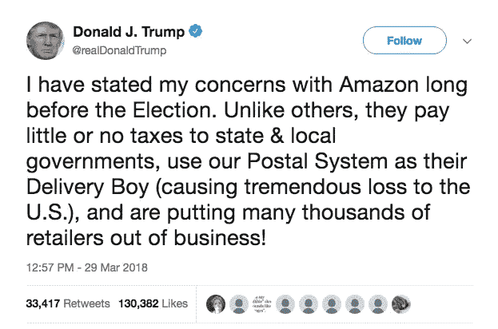

不过有一个问题有明确的答案:

第二天是什么样子的？

尽管取得了令人难以置信的技术和商业成就，但我印象最深的是，对于这样规模的公司来说，愿景和文化仍然如此清晰。

对亚马逊来说，有一点是肯定的，那就是这仅仅是开始，因为看起来在一段时间内，它仍将是第一天。