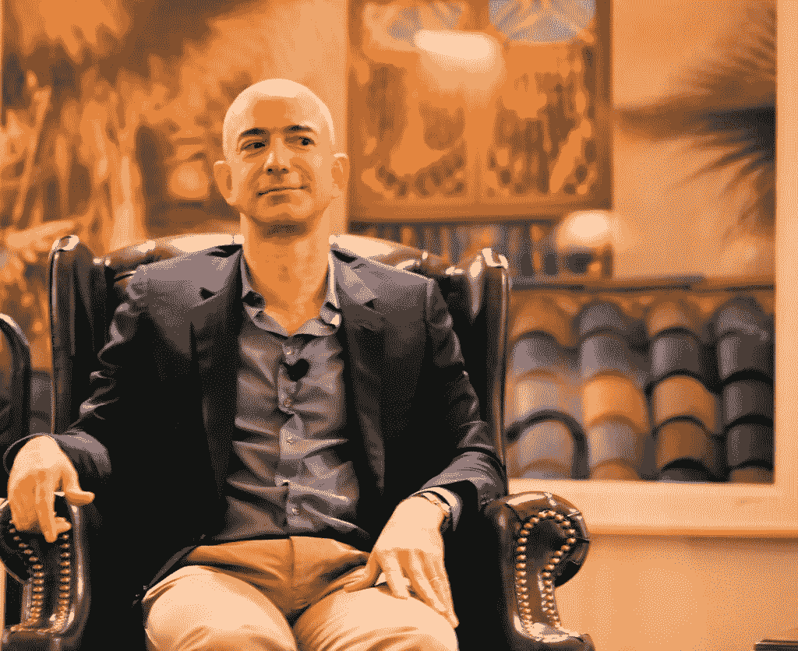
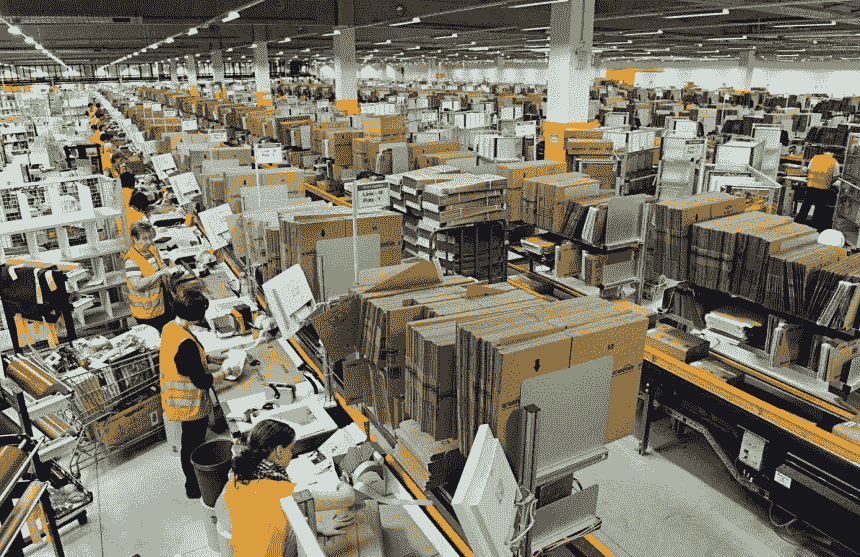
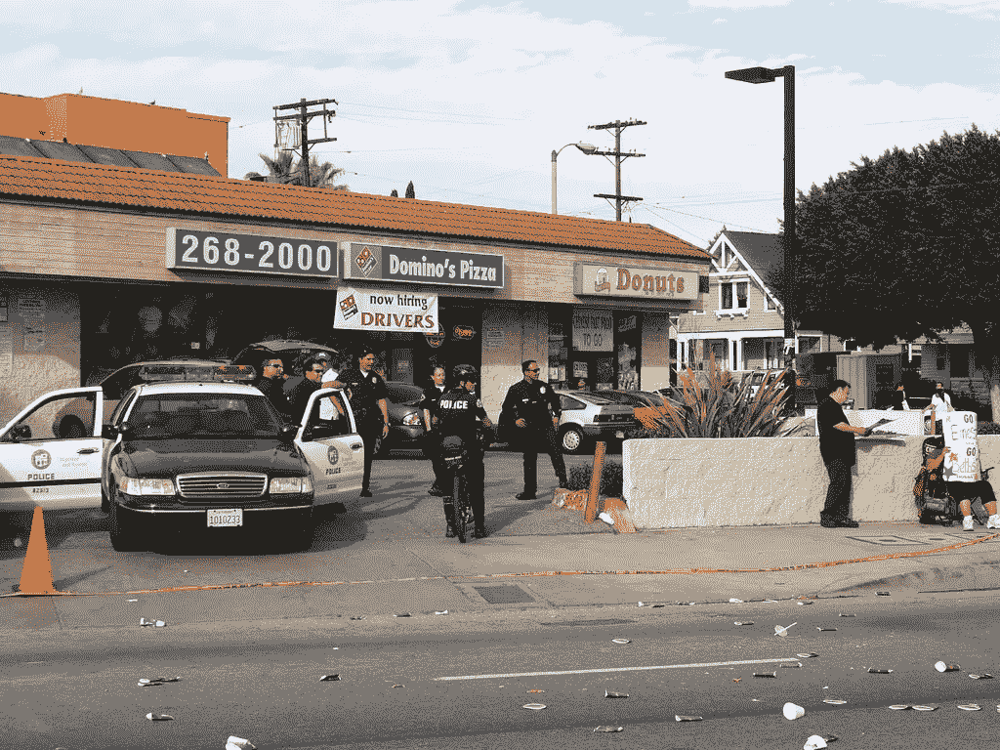
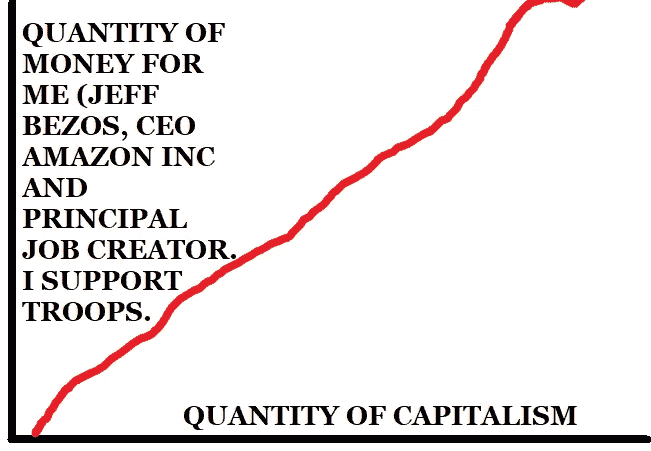

# 为什么亚马逊把最低工资提高到每小时 15 美元

> 原文：<https://medium.datadriveninvestor.com/why-amazon-raised-its-minimum-wage-to-15-an-hour-baafc2c648dc?source=collection_archive---------15----------------------->

## 世界上最重要的 100%人类杰夫·贝索斯的普通一天

Image: [Steve Jurvetson @ Flickr](https://www.flickr.com/photos/jurvetson/5129303018)

杰夫·贝索斯走进他在亚马逊巨型仓库的办公室，锁上身后的门，松了一口气——世界上最努力工作的首席执行官很少有属于自己的时间。他环顾四周，像以前数千次一样，感受着房间的宏伟。通过单向玻璃墙和地板，他不仅可以看到整个仓库的全景，而且中央指挥中心可以对仓库内的任何一点进行近距离监视。他咧嘴一笑，抖抖战利品，搓搓双手。在漫长的一周努力工作中，他一直期待着这一天，在这一周中，他终于登上了世界首富的宝座。这样的荣誉只有像他这样一代人才可能获得。

然而，在开始之前，他需要查看最新消息。

"阿利克夏，给我看看华盛顿邮报。"来自他个人新闻渠道的反馈立即被投射到他面前的巨大屏幕上。

他浏览了标题。*杰夫·贝索斯世界首富。* *亚马逊创造数百万就业岗位。亚马逊工人不想要工会。俄罗斯针对英雄杰夫·贝索斯的假新闻宣传活动曝光。* [*州长科莫提议用杰夫·贝索斯的公共监狱来换取纽约州仓库*](https://nypost.com/2018/11/15/cuomo-calls-amazon-deal-a-home-run-while-defending-massive-tax-breaks/) *。* [*为什么我们需要与伊朗开战*](https://www.washingtonpost.com/opinions/war-with-iran-is-probably-our-best-option/2015/03/13/fb112eb0-c725-11e4-a199-6cb5e63819d2_story.html) *。他的笑容几乎和他的个人财富与乌拉圭整个国家的 GDP 之间的差距一样大。*

其中一条引起了他的注意:*唐纳德·特朗普称亚马逊应该缴纳更多的税；* [*爱国的美国抵抗运动通过购买更多的亚马逊产品来反抗他。*](https://www.theguardian.com/commentisfree/2018/apr/07/amazon-donald-trump-america-jeff-bezos)

“太好了，”他正确地喊道。"在 2020 年，他没有机会反对我的候选资格。"

但那是以后的事了。现在，他有更重要的事情要处理。" Alexa，扫描仓库寻找时间窃贼. "他的笑容现在超越了他的脸。

只用了两秒钟就找到了一个不诚实的恶棍。“警戒！警报！”亚历克莎理直气壮地喊道:“在 C1 a 区发现一名非生产工人。罪犯:42069 号货架堆垛机。呈现视频。”

Image: [Scott Lewis @ Flickr](https://www.flickr.com/photos/99781513@N04/16278498935)

就在那里:一名懒惰的员工大胆地在仓库地板上接电话，尽管事实上他的劳动换来的是公平公正的市场决定的每小时 7.2 美元的工资。这一幕可能会让一个不那么重要的人感到震惊，但如果没有精神上的坚韧来承受这样的创伤，杰夫·贝索斯就不会是世界上最富有的人，也不会是最有道德的人。

“绝对不能接受！”笑容不再了。“Alexa，放大放大，我想听听这个忘恩负义的懒汉到底认为什么比把那个 78 磅重的箱子运到指定地点更重要。”

房间的扬声器里播放着一个尖锐刺耳的声音。“是的，我们五分钟后就要开始了。他们不知道工会或罢工的事。爸爸，15 美元一小时，这是需要的。我们会让这家公司破产，毁掉美国。卡卡卡卡卡卡！”

“亲爱的奥巴马！”贝佐斯张着嘴说道。“真正的美国人永远不会谈论工会。邪恶的俄共颠覆分子已经渗透到我们公司了！”弗拉基米尔·普京无意中与共产主义创始人弗拉基米尔·列宁同名，但他似乎并不满足于抢走希拉里的风头。他的魔爪没有边界，他现在试图摧毁美国的生计。

Alexa 不需要被告知该做什么。贝索斯说完话后 0.443 秒，警察局长在线上。“贝佐斯少爷，先生！有什么问题？”

"工会化，我重复一遍，工会化。"

“太可怕了，先生。还有别的吗？”

“俄罗斯人。”

“天啊，先生。还有别的吗？”

"嗯，一些加入工会的人可能是黑人。"

“亲爱的上帝，先生。我们上路了！”

美国的未来悬而未决。幸运的是，它掌握在我们的蓝衣男孩手中。

Image: [Raymond Shobe @ Flickr](https://www.flickr.com/photos/bossco/411697094/in/photolist-772mhm-4DPvtS-6SiopY-6A13Gk-iiBeaA-76KdG4-6ReP9N-H8BTr-76KfLX-76P9Ms-76Ked6-Co4cL-4scEX1-76P9fm-5VkGq3-7zhYRy-58Ucav-6NapDa-271V6iQ-pePTit-5YWRL4-a2EBNA-7Z88oL-7Hr7P8-atSepa-2uwegX-eba5p7-7h7s4P-2uADhh-2uwbEc-2uAFgs-5ZqLu4-52a8zn-5jSCU9)

30 秒后，一辆警用 M1 艾布拉姆斯穿墙而过，粉碎了一个毫无防备的俄罗斯妥协的共产主义颠覆分子。

“别反抗了！”司机一边继续往前走，一边喊道。

工党的爪牙被突袭了。他们在仓库地板中间挤在一起，齐声撒尿。[他们在工作时间无法控制自己的膀胱，这是偷懒的典型症状。](https://nypost.com/2018/04/16/amazon-warehouse-workers-pee-into-bottles-to-avoid-wasting-time-undercover-investigator/)

“趴在地上，马上！”警车通过扩音器发出刺耳的声音，对那些懒惰的无所事事的人施以他们不应得的怜悯。

所有人都答应了，除了一个人:贝佐斯之前当场抓到的那头猪。"我想和贝佐斯先生谈谈."

杰夫·贝索斯从他的办公室飞下来，带着由他最好的朋友和远见卓识的天才同伴埃隆·马斯克为他手工制作的喷气背包，直接降落在煽动者面前。他交叉双臂，非常确定自己看起来非常酷。毕竟，摄影师在他的宣传拍摄中总是向他保证。

“贝佐斯先生，我要求……”

突然，坦克开火了，正义地安乐死了一个昏睡的劳工，他脸朝下趴在地上，双手放在背后。“他有枪。继续。”

"嗯……不管怎样，戈斯波金·贝佐斯，我们需要一条活路."

杰夫笑了。他知道这个左倾的傻瓜不是他智力的对手。他的笑容终于回来了，这一次比亚马逊公司全食商店硅谷技术员工的队伍还要长。

“你看这个？”他举着一张纸问道。“这个图表显示了全世界每天靠一美元生活的人的数量。你注意到自 20 世纪 70 年代以来下降的速度有多快了吗？循证政策！”

Image: Logic and Reason, Inc.

令人费解的是，罗斯基耸耸肩，敢于回答。“塔克哲？一天一美元很低吧，达？我要求每小时 15 美元！”他没有意识到这个要求有多荒谬。

贝佐斯有生以来第一次感到了自我怀疑。这张图表客观地证明了资本主义是人类前进的道路，明确地显示了每个人都从像他一样的开创性天才的辛勤工作中受益，即使是生活在像非洲这样甚至没有亚马逊 Prime 的怪异国家的人。这个有用的白痴的共产主义灌输显然是强大的。是时候拿出大枪了。

当然，杰夫·贝索斯正好有这个东西。他掰着指关节，深吸一口气，走上前去，直直地看着他可怜又不合逻辑的对手。

《动物庄园》

共产党人很快就不可思议地瓦解了，无法承受如此不可思议的教条。美国得救了。

Image: [Robert Bejil @ Flicker](https://www.flickr.com/photos/robnas/5906972709/in/photolist-9ZYMc4-qJNzFa-dpfrw1-6xNNrq-eMtwmW-bmF2it-f2YkFS-aqZNUB-8wf6X4-omTKvr-35bXu9-cBNvnY-qWqZjJ-aBndeR-89eTiB-6r6xSo-6r6y9N-9NjQGr-7MKiUc-9mzv3R-9sCH9W-7UaPMk-ctjFa1-9NzGHk-mWH6fB-6TzFcT-fnkcqs-bSBjVv-nVrWUy-c7Ta7S-9z5spv-9z8PnN-cpGa4A-5c3GEu-2aasUbc-ocgVCL-9ZxVtG-fyU3ro-8SviW3-dapurN-jpmQKQ-jppxQt-gKC1qJ-amhJd6-6HiiGG-daptaH-7djLv-35eM9B-izMHXN-2aeYrPJ)

贝佐斯亲切地感谢了警官们的服务。他们排好队，立正站好，他和他们一一握手，向他们敬礼，并递给他们一张 Amazon.com 甜甜圈八折券。在雷鸣般的、甜甜圈般的掌声中，他飞回了自己的办公室。

"阿利克夏，给州长打电话。"

“贝佐斯先生，你有什么愿望？”州长打了招呼。

“我需要你给我弄几千个 [**签约**替换人员](https://www.bloomberg.com/news/features/2018-11-01/amazon-flex-workers-are-left-out-of-minimum-pay-raises)给我的仓库，stat。所有努力工作的人，至少 50%的女性，没有一个爱发牢骚的千禧一代认为一周工作 80 小时是多余的。”

“当然，马上，大人。这将使亚马逊在创造就业和多元化方面更加领先。请不要离开我们的州，我求求你。”

杰夫挂了电话，他的笑容掩盖了从地球到他和埃隆未来的火星殖民地的距离。他的目光盯着他面前可笑的超大红色按钮，上面方便地标着“将最低工资提高到 15 美元”。

“如果某些*工会的笨蛋*认为他们可以让*我*，仁慈的贝佐斯先生，提高我公司的最低工资，我会被诅咒的。我*选择*自己做。”

他把脸撞在按钮上。