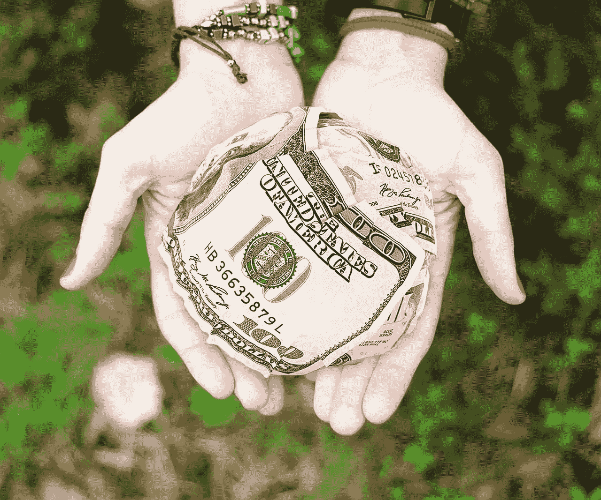
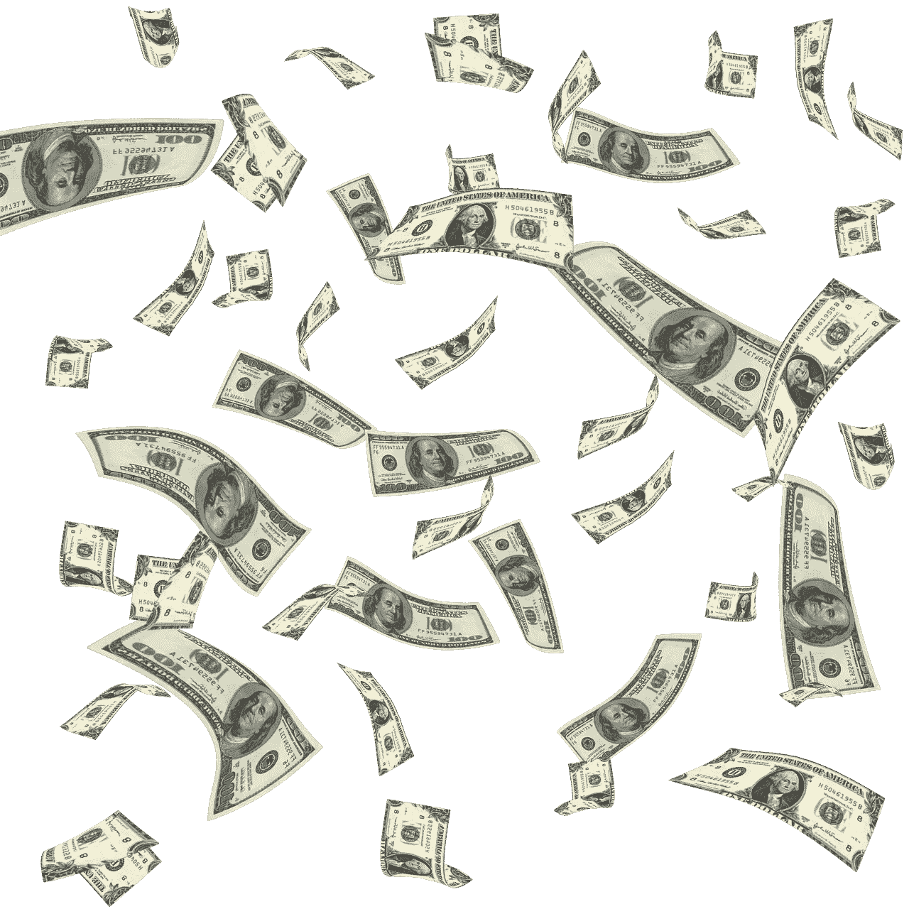

# 为什么美国需要基本收入

> 原文：<https://medium.datadriveninvestor.com/why-america-needs-a-basic-income-f571eee9ee6b?source=collection_archive---------1----------------------->

许多人会问，为什么美国需要基本收入，因为我们的经济发展得很好。奇怪的是，这些人是正确的，但数字显示大多数美国人没有分享繁荣。

值得注意的是，美国的国内生产总值(GDP)从 2012 年的 16.155 万亿美元增长到 2017 年的 19.39 万亿美元，*贸易经济学* [计算](https://tradingeconomics.com/united-states/gdp)。GDP 是一个国家出售的所有商品和服务的总和。因此，美国赚了很多钱，但普通美国人却没有。

相比之下，真实的个人收入中位数；圣路易斯美联储[估计](https://fred.stlouisfed.org/series/MEPAINUSA672N)2016 年美国人均收入为 31099 美元。此外，美国的平均家庭收入是 60，336 美元，这是数字部门计算出来的。

 [## 经济就是要包括人-数据驱动的投资者

### 建模，数据，最重要的是，人 Tayo Oyedeji 博士在他的食谱中混合了所有这些成分，为一个…

www.datadriveninvestor.com](https://www.datadriveninvestor.com/2019/03/06/economy-is-all-about-including-people/) 

# 美国人没什么钱

这 60，336 美元听起来不错，直到你意识到它代表几个人，并做一点数学。例如，Arcgis.com[估计](https://www.arcgis.com/home/item.html?id=db2ab608ba0a473d9731d87fa215cb8b)2017 年美国平均家庭拥有 2.6 人。

用 60，336 美元除以 2.6，你会得到平均个人年收入 23，206.15 美元；远低于圣路易斯联邦储备银行的估计。因此，普通美国人赚的钱很少。

当你考虑到丈夫、妻子和两个孩子时，事情会变得更糟；典型的美国家庭。具体来说，用 60，336 美元除以 4，你一年的收入是 15，084 美元。

令人难以置信的是，一年 15084 美元接近联邦个人贫困指导线一年 12490 美元。因此，许多美国人生活在贫困边缘。

# **美国人应该有多少钱**

这些数字表明普通美国人没有参与到美国飞速的经济增长中。

例如，如果我们将 2017 年美国国内生产总值平均分配给每个美国人，个人收入中位数可能是每年 53，128.54 美元。解释一下，53128.24 美元是 2017 年美国人均国内生产总值，*贸易经济学* [算](https://tradingeconomics.com/united-states/gdp-per-capita)。为了澄清，人均国内生产总值是一个国家的国内生产总值平均分配给所有公民。

此外，如果我们以人均 GDP 为基础，美国的平均家庭收入将是 138，134 美元。细说如果把 53128.45 美元乘以 2.6；平均每户 138，134 美元。

此外，2017 年四口之家的人均家庭 GDP 为 212，514.16 美元。因此，大多数美国人没有分享到日益增长的国家繁荣。

# **为什么美国应该重新分配财富**

从这些数字中我们可以得出的明显结论是，收入不平等是真实存在的，而且可能是美国的头号问题。然而，我们很少在新闻或大众媒体上听到它。

幸运的是，普通美国人并不愚蠢，他们中的大多数人意识到经济出了问题。因此，他们听取了像美国参议员伯尼·桑德斯(佛蒙特州)、美国参议员卡玛拉·哈里斯(加利福尼亚州)、杨安泽和美国参议员利兹·沃伦(马萨诸塞州)等提出财富再分配计划的政治家的意见。

[基本收入](https://marketmadhouse.com/advantages-to-basic-income/)；杨和哈里斯提出的方案是最好的财富再分配方案，因为它将把最多的钱迅速分配给最多的人。解释一下，在基本收入计划下，政府将税收收入以现金形式分配给每个公民。

具体来说，杨提议联邦政府每年向每个 18 岁以上的公民支付 12，000 美元的自由红利。杨想通过对所有商业交易征收增值税来为他的自由红利融资。

根据杨的计划，平均个人收入将增长到每年 43，099 美元，或平均 2.6 人家庭的年收入为 35，206 美元。注意:杨的计划歧视有孩子的家庭，因为自由红利从 18 岁开始。

# 美国人破产了，并深陷债务之中

我们需要讨论像基本收入这样的解决方案，因为普通美国人的缺钱威胁到我们国家的未来。

如果美国人年收入只有 23，206 美元，他们怎么能买得起汽车、电子游戏、食品杂货、房子、智能手机、衣服和所有其他现代生活的装饰品呢？目前，许多人通过债务来弥补差额。

毫不奇怪，据书呆子钱包估计，美国人在 2018 年 12 月欠下了 13.51 万亿美元的个人或消费者债务。具体来说，美国家庭平均欠汽车贷款 28033 美元，抵押贷款 184417 美元，信用卡债务 6929 美元，*书呆子钱包* [计算](https://www.nerdwallet.com/blog/average-credit-card-debt-household/)。

此外，据书呆子钱包估计，美国家庭平均欠学生贷款 47，671 美元。事实上，12 月份美国学生贷款债务总额为 1.44 万亿美元，超过了汽车贷款债务总额 1.27 万亿美元。

# 基本收入能拯救美国吗？

这些数字表明，普通美国人已经破产并深陷债务之中。因此，美国人听政客们提出激进的经济解决方案也就不足为奇了，比如基本收入和工作保障。

这种情况威胁着我们的未来，因为普通美国人可能不再有足够的现金来维持我们的经济。现金减少意味着经济活动减少。再加上人口老龄化和不断上升的技术失业，我们很快就会面临类似 20 世纪 30 年代大萧条的局面。解释一下，当大多数经济活动停止时，大萧条就开始了。

在这种情况下，某种形式的基本收入将是必要的，以保持我们的经济运行。然而，主流政治家拒绝考虑这种可能性。很大程度上是因为他们害怕因为提出“免费计划”而被记者嘲笑。

这些数字表明美国需要基本收入，杨安泽的成功表明普通美国人了解现实。因此，重要的问题是我们如何让政治家们相信美国需要基本收入。我的猜测是，实现这一目标的唯一途径是利用投票箱剥夺反对基本收入的政客们的轻松工作。