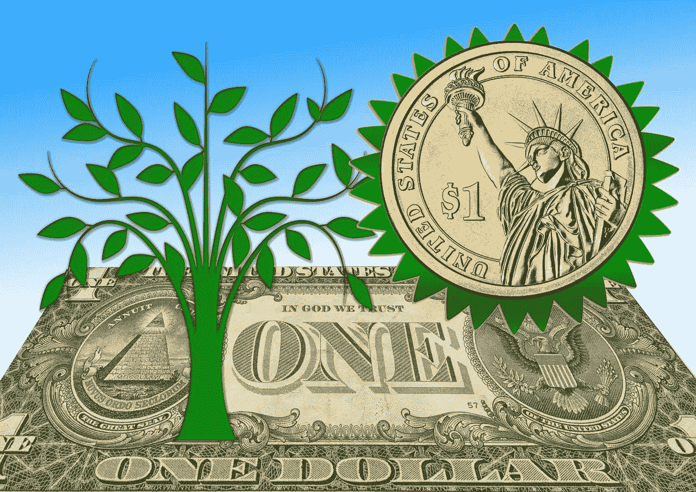
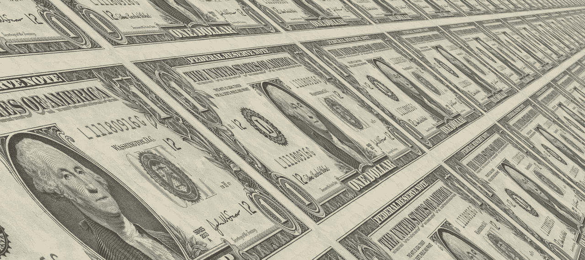
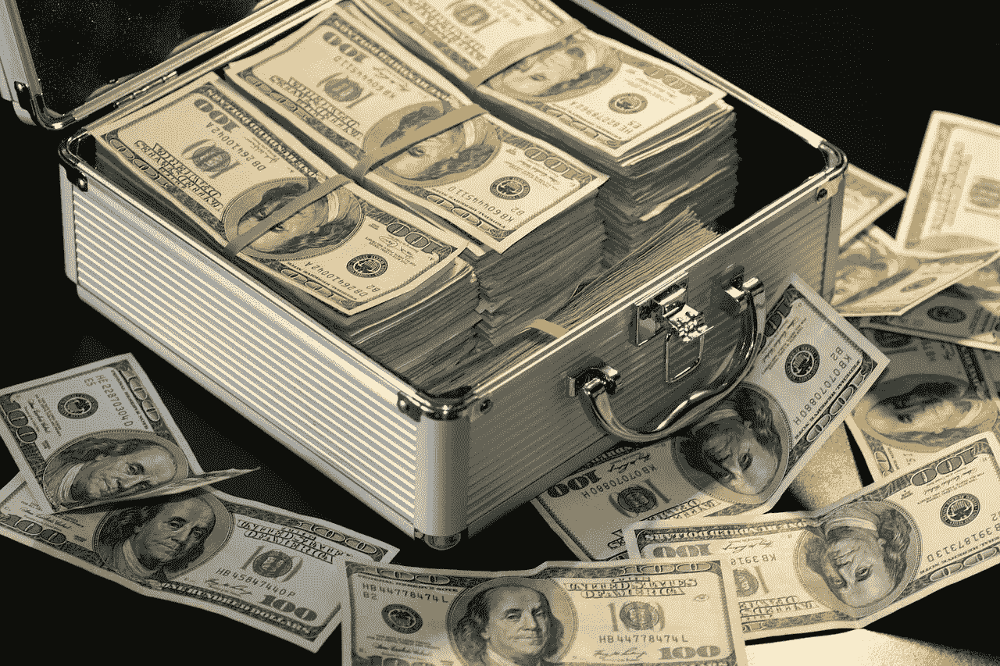
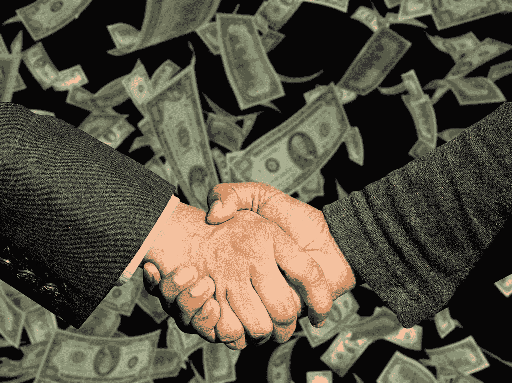
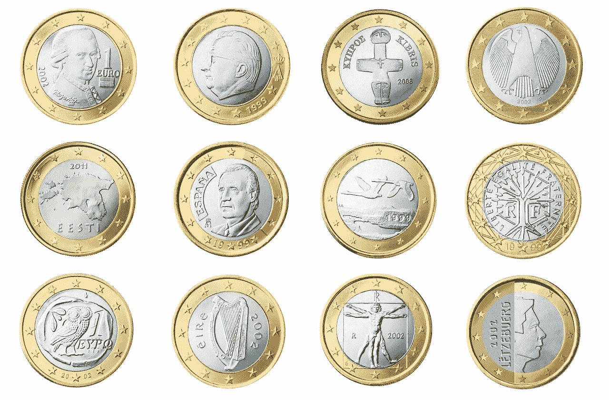
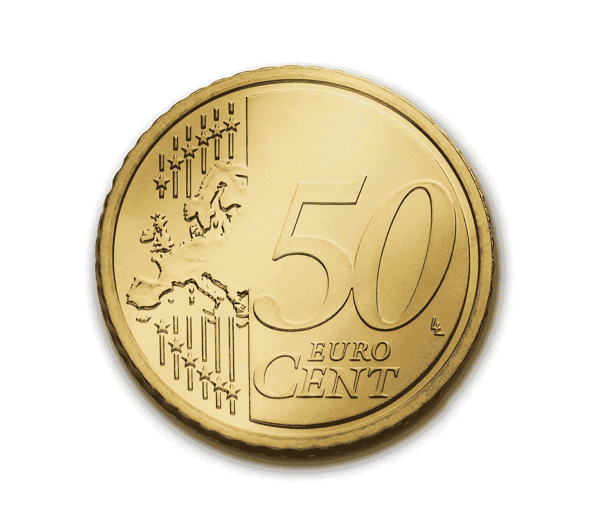

# 为什么美国会让美元贬值

> 原文：<https://medium.datadriveninvestor.com/why-america-will-devalue-the-dollar-42088956ac18?source=collection_archive---------1----------------------->

美国将在未来几年大幅贬值美元。美元贬值有几个政策制定者无法抗拒的巨大好处。

显然，贸易为美元贬值提供了最令人信服的理由。货币贬值通过使一个国家的产品在全球市场上更便宜来鼓励出口。相反，货币贬值会提高进口商品的价格，从而抑制进口。

减少美国进口是唐纳德·特朗普总统(纽约州共和党)的首要任务之一。因此，美元贬值对他的政府来说是合乎逻辑的政策。

**为什么川普会让美元贬值**

很明显，川普[赞赏](https://www.cbsnews.com/news/trump-accuses-china-eu-of-currency-manipulation-and-dollar-weakens/)中国鼓励工业增长和以弱势货币出口的政策。我认为特朗普想采取低币值、高出口的中国式经济政策。

此外，弱势货币将在重要方面让特朗普的一些最重要的支持者受益。例如，美元贬值会增加农产品和矿产品的出口。

由于农村选民的支持，特朗普赢得了总统大选。特别是，他在依靠农业、煤炭和石油的大平原、南部和中西部获得了大力支持。

为了证明这一点，特朗普最近的关税政策对农民产生了负面影响。考虑到这一点，奥巴马政府可以用贬值的美元来抵消关税的负面影响。

**特朗普什么时候让美元贬值？**

总统在这里承担了巨大的风险，因为弱势美元的好处可能要到 2020 年总统大选后才会显现。总之，特朗普的经济政策可能会让他无法连任。

因此，如果特朗普真想连任，他将不得不相当快地实施美元贬值政策。另一方面，特朗普可能会等到 11 月 6 日国会选举后再做出重大经济决策。

2019 年 1 月，众议院(最终控制美国经济政策的国会下院)将有新的领导层。因此，特朗普在提出新政策之前，正在等待看看谁是领导者。经常被忽视的一点是，特朗普需要国会批准(或漠不关心)才能实施任何经济政策。

**美国会因为债务而让美元贬值**

美国会让美元贬值，因为货币贬值带来的好处可能远远超过贸易。从长远来看，美元贬值是有道理的。

美国人忽略了货币贬值的最大好处之一。值得注意的是，货币贬值使得偿还债务变得更加容易。

举例来说，如果你欠了 10 万美元的学生贷款，而美元贬值了一半。你会欠 5 万美元而不是 10 万美元。

美元贬值很有吸引力，因为美国负债累累。例如，截至 2018 年 9 月 23 日，美国人欠学生贷款 1.624 万亿美元，信用卡贷款 8，826 亿美元，汽车贷款 7，500 亿美元。

可怕的是，大量债务无法收回。例如，房利美[计算出](https://www.americanfinancing.net/reverse-mortgage/mortgage-options-after-retirement)，67 至 74 岁的美国人中有将近一半(49.4%)仍在支付抵押贷款。

出于同样的原因，*美国金融* [估计](http://realtormag.realtor.org/daily-news/2017/12/13/44-retirees-still-have-mortgage) 44%的美国退休人员正在支付抵押贷款。特别是，在一项美国金融调查中，16.63%的美国退休人员承认他们永远无法还清抵押贷款。同样，32.31%的退休人员承认需要八年才能还清抵押贷款。

**美元贬值如何帮助老年人**

所有这些债务可能会引发金融危机，因为许多退休人员退休时除了社会保障收入之外一无所有。值得注意的是，2018 年美国的平均社保支付额为每月 1320 美元，而平均抵押贷款支付额为每月 1200 美元。

美元贬值将有助于老年人，因为政府根据通货膨胀调整社会保障。相反，没有人对通货膨胀做出最大的调整。

如果美元下跌，由于生活费用调整(可乐)，社会保障付款将增加。与此同时，抵押贷款支付将保持不变。为我们的外国读者澄清一下，社会保障是美国老年人和残疾人的基本收入计划。

因此，许多老年人可以用贬值的美元花更多的钱。老年公民是特朗普最重要的选区之一。皮尤研究中心[计算](http://www.pewresearch.org/fact-tank/2016/11/09/behind-trumps-victory-divisions-by-race-gender-education/)显示，2016 年，65 岁以上的人中有 53%投票给了特朗普。

换句话说，没有资深选民，唐纳德仍然会主持《学徒》节目。因此，在 2020 年之前让美元贬值对特朗普来说是明智的政策。锦上添花的是，美元贬值将帮助其他群体，如大学毕业生、小商人、非洲裔美国人、西班牙裔美国人和工人阶级白人更快地偿还债务。

**公司债务将迫使美国贬值美元**

最终，作为老年人，大企业从美元贬值中获益匪浅。具体来说，*福布斯*撰稿人杰西·科伦坡[认为](https://www.forbes.com/sites/jessecolombo/2018/08/29/the-u-s-is-experiencing-a-dangerous-corporate-debt-bubble/#16059d2600e0)“美国正在经历一场危险的公司债务泡沫。”

例如，自 2008 年以来，公司债务总额增加了 2.5 万亿美元，增幅为 40%。值得注意的是，美国的公司债务相当于其国内生产总值的 45%。因此，美国公司已经借了大约 8.36 万亿美元，他们可能无法偿还。

让美元贬值是消除企业债务泡沫的一个明显而简单的方法。此外，美元贬值可以化解学生贷款、汽车贷款、抵押贷款和信用卡泡沫。

我怀疑特朗普已经受到来自华尔街的巨大压力，要求他让美元贬值。高盛(NYSE: GS) 及其公司正在向特朗普施压，要求贬值，因为他们担心出现债务泡沫。投资银行家可以通过给他的政治对手钱来迫使特朗普让美元贬值。

显然，这给了特朗普另一个强烈的动机，如果他想竞选连任，就让美元贬值。此外，即使特朗普不参选，压力仍然会存在。还有许多其他政客需要钱来竞选连任，而华尔街有这笔钱。

**美国将如何让美元贬值**

让美元贬值最简单的方法就是让美联储贬值。

中央银行有权降低货币价值。例如，埃及央行在 2016 年将该国货币的价值削减了 14%。特别是，中国人民银行(PBOC)在 2016 年总统大选前让人民币贬值。

川普的问题在于美联储的董事会是半独立的。事实上，美联储理事的任期是七年。因此，特朗普需要几年时间来更换美联储的董事会。

正因如此，特朗普可能要到 2020 年才能得到他想要的经济政策。具有讽刺意味的是，唐纳德的继任者可能会享受到他的经济政策带来的好处。

投机者如何从美元贬值中获利

从积极的一面来看，投机者可以通过许多方式从美元贬值中获利。

最明显的方法是购买被视为美元替代品的大宗商品和工具。显然，这包括加密货币、黄金、白银和钯等贵金属以及许多期货。

我认为加密货币是流动性的，是普通人的最佳选择。然而，富人拥有黄金或钯可能会更好。

换句话说，一般人应该远离贵金属。除非他们知道超市和加油站接受黄金或白银付款。

加密货币对普通人来说更好，因为你可以快速出售它们。所以，需要的时候可以快速拿到现金。

更重要的是，[加密货币信用卡和借记卡](https://marketmadhouse.com/will-a-cryptobank-make-money-at-crypterium/)现在在技术上已经成为可能。不幸的是， **Visa(纽约证券交易所代码:V)** 和 **MasterCard(纽约证券交易所代码:MA)** 正在阻止他们，但这可以改变。

有哪些最好的美元替代品？

购买被视为美元替代品的法定货币是另一个有趣的策略。

具体来说，瑞士法郎是主要货币的替代品，受到一些投机者的欢迎。另一个有趣的选择是英镑。特别是英镑是世界上最大的银行中心之一——伦敦金融城的货币。

一个耐人寻味的反向选择是被整个欧洲接受的欧元。重要的是，欧元是德国的官方货币，德国是世界第四大经济体。

举例来说，欧元已经比美元更值钱了。2018 年 9 月 23 日，汇率为 1.18€兑 1 美元。

像爱沙尼亚这样的新兴银行中心使用欧元作为官方货币。因此，欧元可能比瑞士法郎或英镑更容易兑换。

出于这个原因，寻找避风港以度过即将到来的经济风暴的美国人应该考虑欧元。特别是，一个人可以移居 27 个欧盟国家。历史上，来自美国、非洲、亚洲、中东和拉丁美洲的经济难民逃往欧洲。这可能会增加对欧元的需求。

当美国让美元贬值时，你如何赚钱

一个有趣的选择是可兑换的加密货币，如******Bancor(BNT)****Ripple(XRP)**和 **DAO(道)**。值得注意的是，可兑换的加密货币设计用于快速兑换成其他替代货币、法定货币和贵金属。****

****每个人都必须意识到美国将会让美元贬值并为此做好准备，不管他们对贬值和投机者的看法如何。明白美元贬值为什么要来，把握其意义的人会赚钱。****

****当美国让美元贬值时，那些措手不及的人将会损失金钱。然而，那些认为美元将贬值的人可以从中赚钱。****

****请注意，这个评论仅仅是一个观点。推测之前请做好自己的研究和思考。****

****这篇评论首次出现在 [*市场疯人院*](https://marketmadhouse.com) 你的疯狂投机和疯狂货币的拳击场。****