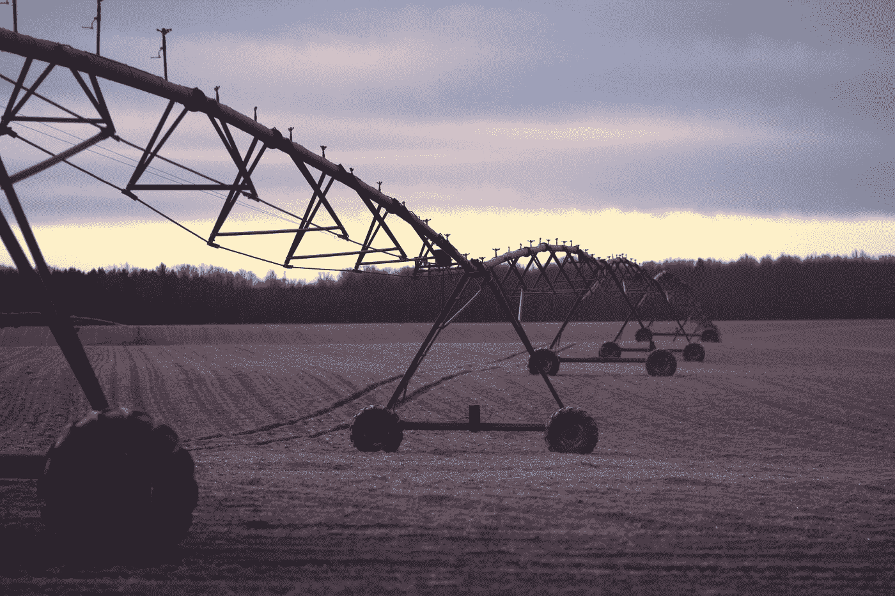

# 为什么美国农民如此重要

> 原文：<https://medium.datadriveninvestor.com/why-american-farmers-matter-a87638c941?source=collection_archive---------0----------------------->

“A long pivot irrigation system in a plowed field” by [Nicole Harrington](https://unsplash.com/@nicolegeri?utm_source=medium&utm_medium=referral) on [Unsplash](https://unsplash.com?utm_source=medium&utm_medium=referral)

在爱荷华州的中心地带长大，我有充分的理由对它有偏见。我可以坐在这里告诉你通常的“农民养活世界”，“农民比任何人都努力”，等等。我不会坐在这里用情绪化的语气来阐述我的观点。你我都知道，农民是世界上最艰难、最充实、最受尊敬的职业之一。一次又一次，我看到对农业专业一无所知的人不尊重这些辛勤工作的男人和女人。你已经知道这些人是这个国家的支柱，让我用 21 世纪财经的方式来解释给你听。

让我们用数字说话吧(数据来源:农业局和 UDSA)。

美国农场为美国 GDP 贡献了 1600 多亿美元。

让农业如此扩张的原因之一是它对不同产品、人群和行业的影响。无论是你穿的衣服，你吃的食物，还是你使用的许多产品，它们都可以追溯到耕作和农业经营。农业经济跨越许多不同的行业，因为它们为制造业、建筑业和其他重要行业提供了主要的原材料来源。随着主要农作物产量的增长，如玉米产量增长 360%，未来收入的潜力也在增长。随着美国国内生产总值的增长，你也可以看到农业市场正增长的相关性。

**#2:一个美国农场养活 165 个人。**

就像我之前说的，产量增长背后的技术和研究是有帮助的。随着更大的产量、更高质量的作物和改进的耕作技术，农民能够用更少的资源为更多的人提供高质量的商品。我们这个世界的人口正以惊人的速度增长，随着人口即将达到 80 亿，农民们必须适应。

**#3:其他国家使用我们的商品。**

我国出口大量农产品和商品。我们将近 25%的商品出口到其他国家，为他们的繁荣提供必要的资源。其他国家之间的农业贸易有利于这些市场的持续增长。在大规模发展经济的同时，它也支持与我们有贸易往来的国家之间积极的外交政策。我们与加拿大的农产品贸易占我们贸易的绝大部分，因此我们与加拿大有着非常积极的关系，这并不奇怪。

发展中国家 90%的劳动力从事农业。

农民提供了许多机会，也促进了发展中国家的发展。在许多发展中国家，农业是收入、就业和生计的主要来源。通过向发展中国家提供教育、培训和资源，美国能够促进农业的发展。这些类型的关系促进了其他国家之间的积极关系。在许多没有我们这样机会的国家，发展农业经济至关重要。对许多这些不幸的人来说，务农是他们唯一的生活方式。

这些只是一些数字、统计数据和观点，显示了农业在我们国家的重要性。还有许多不同的统计数据需要考虑，如果没有我们的农民，美国人的生活方式将会大不相同。

还不服气？看这个视频。

[https://www.youtube.com/watch?time_continue=1&v = H7yZdOl _ e _ c](https://www.youtube.com/watch?time_continue=1&v=H7yZdOl_e_c)

#美国农民

查看我的[网站](http://21stfinance.com)，了解更多关于农业、个人理财等内容。