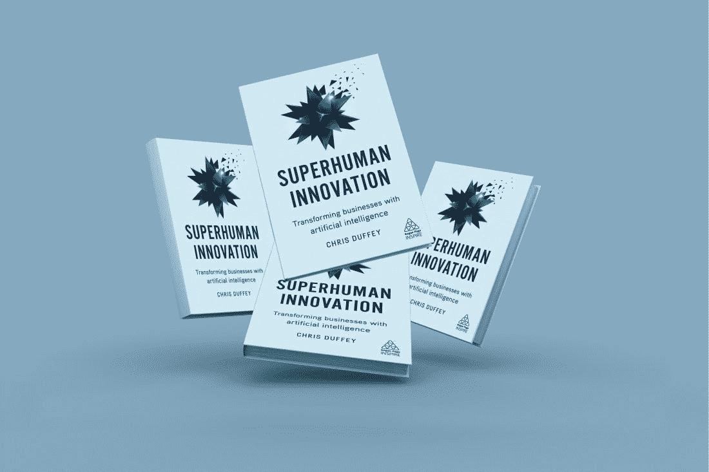

# 我为什么以及如何使用人工智能来写这本书

> 原文：<https://medium.datadriveninvestor.com/why-and-how-i-used-artificial-intelligence-to-write-this-book-e56829a0ee1a?source=collection_archive---------14----------------------->

Photo by [Rene Böhmer](https://unsplash.com/@qrenep?utm_source=medium&utm_medium=referral) on [Unsplash](https://unsplash.com?utm_source=medium&utm_medium=referral)

在我作为创意总监和创意技术专家的职业生涯中，我一直着迷于人类的创造力和独创性相遇，然后被技术放大。我们将在接下来的几页中深入探索，在过去的几年里，人工智能是如何被誉为人类有史以来创造的最伟大的技术进步之一的:至少可以说这是一个非常大胆的说法。鉴于此，我想在本书中庆祝人工智能的能力和可能性，但也想测试人工智能的极限，不仅写一本关于人工智能的书，而且实际上利用人工智能来帮助撰写*超人的创新。捕捉人工智能当前和未来的能力是一次探索之旅，这导致了对其能力的许多令人兴奋的发现。但是在这个过程中也有人工智能还没有出现的时候。因此，为了描绘出人工智能如何转变的生动画面，我使用并汇编了一套人工智能技术作为“合著者”。接下来是我使用的方法和过程的概述，就像写作过程一样，人工智能的使用是有机的，非线性的，经常是各种技术的分层。*

当我们处于一个类似的移动新时代时，我想起了 2000 年代早期到中期。客户经常要求我们描述一个移动响应网站或应用程序是如何构建的。在回答这个问题的时候，总是有一个问题需要剥离多少技术层面:视觉设计过程中包含了什么；使用了哪些 UX 工具；软件开发代码的解释；如何使用 iPhone 或 Android 硬件功能和组件，如芯片、地理定位能力。这个名单还在继续。最近，这是通过全天技术会议实现的，引入了 Apple watch 和健康工具包以及亚马逊 Alexa。就像移动和可穿戴设备的早期一样，我们正在经历与人工智能的技术构建模块类似的对话。这为关于如何、何时、何地最好地利用该技术的战略性和创造性讨论奠定了人工智能基础。

 [## 挑战你对人工智能和社会看法的 4 本书|数据驱动的投资者

### 深度学习、像人类一样思考的机器人、人工智能、神经网络——这些技术引发了…

www.datadriveninvestor.com](https://www.datadriveninvestor.com/2019/02/28/4-books-on-ai/) 

我没有从它是如何构建的或试图使用特定的人工智能技术开始，而是从一个基本问题开始，将人工智能作为本书的共同创作工具:这个特定的人工智能功能可以做什么，它如何提供帮助？带着这个重点，我用了很多 AI APIs(应用程序接口)来解决和辅助编写过程。虽然这是一个很长的列表，但它包括了从使用人工智能撰写特定主题的响应，建议和预测可能相关的上下文内容，翻译多语言参考资料，然后进行摘要，句子分析和分离，选区分析以确定句子结构和意义，语气分析器以了解文本审阅阶段的情绪和交流风格，情感分析以分析和生成文本固有的见解、特征和价值的摘要。在本书的上下文中，人工智能功能，或 Aime，不是单一来源的技术，而是一套技术，其中许多是开源的，每个都建立在不同的概念、方法和基础设施上。对话代理利用许多使用人工智能和人工智能技术的专家系统，如自然语言处理(NLP)、自然语言理解(NLU)和自然语言生成(NLG)API。例如，这些技术使 Aimé能够识别、理解和回应关键词、短语、想法和请求，有时还能识别和理解经验和推理。

在*超人创新*中使用的人工智能的基本方面主要包括三个系统；AI 语音识别，AI 内容理解和总结，AI 内容创作和生成。语音识别和连续听写使人们能够通过语音用户界面(VUI)与系统进行交互，以完成语音到文本、文本到语音、语音编辑、格式化、拼写和文档共享等任务。人工智能内容理解和摘要技术通过基于上下文理解的情感分析、标记和组织更高级概念等方法，将数据库、文章或研究论文审查和删节为快速可消化的内容。人工智能内容创建和生成是系统开发概念和想法以帮助内容创建过程的能力。旨在模仿人类写作过程的写作算法有助于贡献想法、标题、内容和草稿。

冒着变得有点技术性的风险，从高级技术架构的角度来看，许多 API 都位于云环境中——这意味着它们可以通过供应的实例或应用程序来访问。然后，通过指向和访问研究和内容数据库，算法被调用来执行诸如生成、创建、摘要和内容丰富等功能。通过将一系列 API 分层，这允许更全面的输出。这种“多引擎”方法反映了一种更广泛的人工智能工程思维模式，这种思维模式关注的是目标而不是人工智能技术。人工智能的发展不应该是关于一种特定的方法或技术，而是把人的特殊需求放在第一位的目标。

在更高层次的任务中使用人工智能技术，比如人类的创造力，可能是一个挑衅性的概念，然而，当相应地使用时，人工智能可以增强创新和原创性。作为与人工智能关于人工智能的互动对话的反映，*超人的创新*以对话的形式编写，展示了如何通过利用技术解决我们自己无法解决的问题或帮助更快地解决这些问题，使用人工智能实现看似不可能的事情是可能的。

如果你想少做一些繁琐的工作，花更多的时间做你喜欢做的事情，这本书就是为你准备的。对于所有想更聪明地工作以提高效率的人来说，这本书是给你的。对于任何年龄、任何技能水平的人来说，这本书是为你而写的。对于那些想要更加成功的人，这本书是给你的。人工智能是一个伟大的民主化，帮助你实现你的目标。有许多书籍和资源谈论人工智能可以实现什么，但没有其他书籍会告诉你如何使用人工智能成为真正的超人。我鼓励你把这本书读完，是的，有一两个章节可能有点技术性，但是让我向你保证，这不是关于技术，这是关于你和你可以用技术实现什么。如果你真的做出了承诺并坚持到底，你将为你的企业留下切实可行的机会，无论是规模还是阶段，以及拥有你的职业管理和发展。

*原载于 2019 年 3 月 13 日*[*【https://www.thebrandberries.com*](https://www.thebrandberries.com/2019/03/13/why-and-how-i-used-artificial-intelligence-to-write-this-book/)*。*