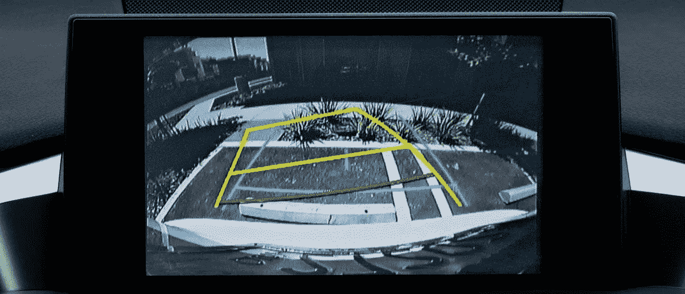
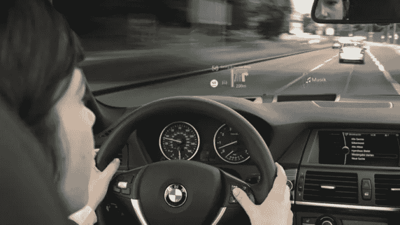
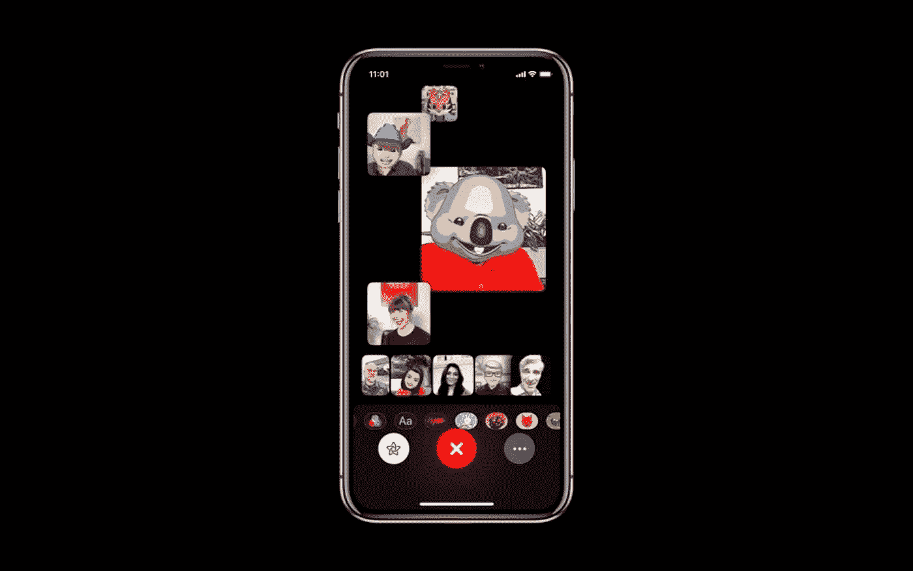

# 为什么苹果押注 AR 而不是 VR

> 原文：<https://medium.datadriveninvestor.com/why-apple-is-betting-on-ar-and-not-vr-6280857ae1e4?source=collection_archive---------44----------------------->

animoji(现在即将出现在 facetime)、Pokemon Go 甚至在你的车里等形式的 AR 已经被广泛采用。虚拟现实的技术还为时过早，在未来几年或更长时间内，我们可能不会在这个领域看到任何有意义的东西。

围绕苹果为 iPhone 推出 VR 耳机的猜测已经持续了一段时间。我们甚至可能用不了多久就能与谷歌的白日梦相抗衡。但是苹果已经把目光放在了增强现实上，这一点很明显。部分原因是因为你不需要耳机，并且用手机执行高质量 AR 的技术已经存在并成熟。

iPhone X 上双摄像头镜头的引入增加了深度映射，使手机能够更准确地将物体放置在视野中的表面上。甚至人像模式也类似于 ar 类型的交互。但是 AR 并不是什么新东西，这里有一个例子，你可能没有意识到，但它已经存在了很长时间。

# 一些例子

你的汽车的备用摄像头可能会有你的汽车移动方向的 ar 视图。这已经迅速成为大多数汽车的标准功能，也是 AR 的一种形式。

*图片来源:南亚特兰大雷克萨斯*

汽车慢慢进入市场的另一个例子是平视显示器。这是一个有用的功能，司机可以看到他们的仪表板，而不用把视线从路上移开。

*图片来源:Autoblog*

其他例子包括几年前开始使用的 snapchat 过滤器，苹果正在 iOS 12 中跟进 facetime 中的 Animoji。这应该是与朋友和家人视频聊天的有趣补充。

*图片来源:iOS 小工具黑客*

# 其他想法

1.  我们很少看到谷歌在 AR 领域的表现，但他们落后于 Niantic 和 Pokemon Go
2.  苹果可能会推出一款虚拟现实耳机作为额外的配件，但他们希望避免使用耳机来体验，因为随身携带是一种噱头
3.  他们预装在手机上的尺子应用程序是一个基准，让他们能够准确地使用两个摄像头将真实世界的深度转换为 3d 地图。相当惊人的技术

我认为在接下来的几年里，我们将在 AR 领域看到更多令人兴奋的发展。获得高保真 VR 体验的技术至少还需要几年时间。包括像素密度、小 FOV 透镜和其他种类的设备，如全方位跑步机，以实现完全沉浸。

*本帖原载于*[*https://www . gvkhna . com/blog/2018-09-17-why-apple-is-betting-on-ar-and-not-VR/*](https://www.gvkhna.com/blog/2018-09-17-why-apple-is-betting-on-ar-and-not-vr/)