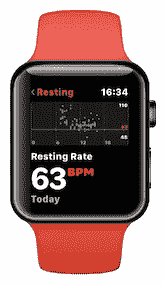
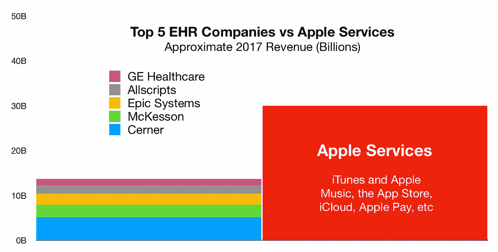
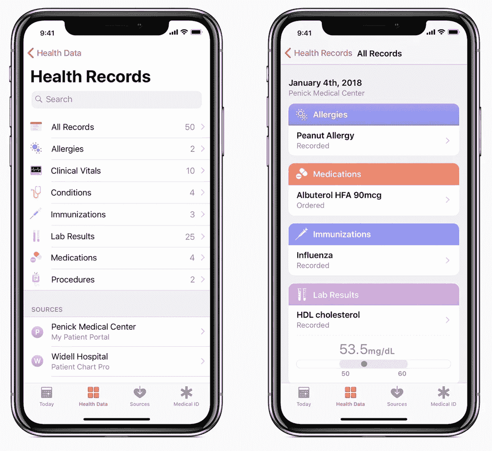

# 为什么苹果不会买 Epic(对不起，吉姆！)

> 原文：<https://medium.datadriveninvestor.com/why-apple-isnt-buying-epic-sorry-jim-76770968e93d?source=collection_archive---------4----------------------->

因此，上周，美国消费者新闻与商业频道的 Jim Cramer 建议苹果应该收购领先的电子健康记录提供商 Epic Systems，以便向投资者证明，苹果的服务收入可以成为可能正在萎缩的 iPhone 收入流的重要补充。

 [## 克拉默:苹果应该收购 Epic Systems，一家私人数字健康记录公司

### 吉姆·克莱默表示，此举将提振苹果公司的股价，并给该公司一个万无一失的方法来巩固其在…

www.cnbc.com](https://www.cnbc.com/video/2019/01/15/cramer-apple-should-buy-epic-systems-a-private-digital-health-records-operation.html) 

> “现在是他们在软件领域进行一次大的、引人注目的收购的时候了……”Cramer 说。“这里的想法是，这将使服务收入流占据更大份额，并迫使投资者和分析师重新评估苹果，而不仅仅是一家硬件公司。”

此外，Cramer 在美国消费者新闻与商业频道的[认为，苹果可以通过一次史诗般的收购成为系统急需的病人数据的通用存储库:](https://www.cnbc.com/2019/01/15/cramer-apple-should-buy-digital-health-records-company-epic-systems.html)

> “如果苹果想要成为通用电子健康记录提供商，成为手表数据和系统之间的握手，他们需要大举进入这个市场，而实现这一点的最佳方式是收购 best: Epic。”

我多年来一直是克拉姆的粉丝，因为尽管节目中有喇叭、号角和警笛，这个家伙似乎知道他在说什么——但我是苹果的粉丝和投资者(完全披露)甚至更长时间，在这一点上克拉姆只是没有意义。

因此，让我们看看“严重服务收入”和“全民健康记录”的角度克拉姆的说教。

# Apple Watch 收入是 Epic x 2

苹果是一家利润丰厚的公司，拥有数百万忠诚的客户，2018 年赚了超过 2750 亿美元，是谷歌或微软收入的两倍多，是脸书收入的五倍。这一收入的主要引擎是 iPhone，是的，随着中国经济的不景气，苹果公司刚刚遭受了 iPhone 销售的打击。

然而，苹果服务收入(来自 iTunes 和 Apple Music、App Store、iCloud、Apple Pay 等)继续攀升，从五年前的 150 亿美元增长到 2017 年的约 300 亿美元，然后到 2018 年达到 400 亿美元(是的，每年增长 33%)。

举例来说，这大约是达美航空或百思买一年的收入，而 Epic Systems [一年的收入不到 3B](https://www.nytimes.com/2018/12/20/business/epic-systems-campus-verona-wisconsin.html)——仅 Apple Watch 一项，就相当于苹果估计收入的一半。

事实上，EHR 五大行业公司*加起来* [在 2017 年](https://healthcareitskills.com/top-ehr-vendors-allscripts-athenahealth-cerner-epic-meditech/)的收入不到 150 亿美元。

很难想象在苹果服务已经赚到的 400 亿美元(并且每年以 25%的速度增长)的基础上增加 3B 的收入会让分析师认为“嘿，也许我们应该认真对待服务收入！”

# 如果数据已经在 iOS 中，为什么还要购买 EHR 的供应商呢？

Cramer 的第二个论点是，如果苹果收购了 EHRs 市场(如果不是收入)的领导者 Epic，它可以访问他们的健康记录，这将推动苹果成为一个通用的健康记录库。

这种说法的问题是，苹果*已经* *与*超过 160 个美国主要医疗系统，从斯坦福到耶鲁，纽黑文到约翰霍普金斯到西奈山，使他们的医疗记录能够显示在 iOS 健康应用程序中。

截至 2018 年 6 月，苹果已经[向开发者开放了对所有这些医疗记录的安全访问](https://www.apple.com/newsroom/2018/06/apple-opens-health-records-api-to-developers/)，“以创建一个使用健康记录数据来更好地管理药物治疗、营养计划、诊断疾病等的应用生态系统。”

 [## 苹果向开发者开放健康记录 API

### 开发健康应用的开发者可以在用户允许的情况下，基于用户独特的……

www.apple.com](https://www.apple.com/newsroom/2018/06/apple-opens-health-records-api-to-developers/) 

一句话:我真的不确定苹果收购任何一家小小的 EHR 供应商能带来什么额外的好处。我在推特上问吉姆:

苹果不想也不需要建造或拥有 EHR——不是为了引人注目的收购，也不是为了取悦分析师，更不是为了获取数据。苹果希望让数百万 iOS/watchOS 开发人员安全访问健康数据，以便他们可以为近 10 亿活跃用户开发令人惊叹的应用程序。

而这正是苹果正在做的事情。

*本故事最初发表于* [*未来健康*](https://futurehealth.live) *。*