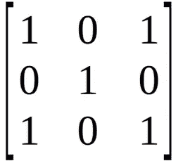
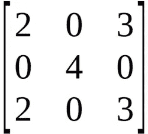
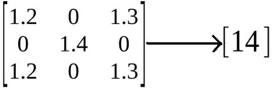

# 为什么卷积神经网络对图像分类有好处？

> 原文：<https://medium.datadriveninvestor.com/why-are-convolutional-neural-networks-good-for-image-classification-146ec6e865e8?source=collection_archive---------0----------------------->

“卷积神经网络非常擅长图像分类”。这是一个广为人知和广为人知的事实，但为什么会这样呢？

# 因素

神经网络中的参数数量随着层数的增加而快速增长。这可能会使模型的训练计算量很大(有时不可行)。调整如此多的参数可能是一项非常艰巨的任务。CNN 减少了调整这些参数所需的时间。

# 网络

CNN 是完全连接的前馈神经网络。CNN 在减少参数数量而不损失模型质量方面非常有效。图像具有高维度(因为每个像素被认为是一个特征),这适合 CNN 的上述能力。此外，CNN 的开发考虑到了图像，但也达到了文本处理的基准。CNN 被训练来识别任何图像中物体的边缘。

 [## DDI 编辑推荐:5 本让你从新手变成专家的机器学习书籍|数据驱动…

### 机器学习行业的蓬勃发展重新引起了人们对人工智能的兴趣

www.datadriveninvestor.com](https://www.datadriveninvestor.com/2019/03/03/editors-pick-5-machine-learning-books/) 

# 如何降维？

使用尺寸小于输入矩阵的滑动窗口来实现维数减少。凭直觉思考，我们立刻考虑完整图像的一小部分。这个正方形小块是窗口，它不断地从左到右、从上到下移动以覆盖整个图像。

小回归模型被训练来检测图像中的特定对象(比如一个模型检测狗，另一个检测草等等)。为了便于理解，假设我们有一个黑白图像(没有灰色阴影),并且该窗口有下面的图像补片视图。

上图代表了类似字符“X”的东西。将检测图像中相似字符的回归模型需要学习相似维度的模式和对应于作为正值的‘X’的值(如下图所示)。

在模型已经学习了矩阵之后，需要进行对象检测，这是通过使用滤波器通过卷积运算计算的值来完成的。

面片矩阵的所有单个元素的叉积(叠加操作)用学习矩阵计算，进一步求和以获得卷积值。卷积值越高，图像中存在的对象越相似。

使用所有卷积层中存在的卷积滤波器来执行该计算。你可以直观地认为这是将你的特征矩阵从 3×3 矩阵减少到 1×1 矩阵。在通过激活函数之前，每个滤波器的卷积结果中还会添加一个偏差。

使用上面提到的卷积计算，可以减少图像数据集过度恶化的维数。

# 这与网络有什么关系？

CNN 的所有层都有多个卷积滤波器在工作，扫描完整的特征矩阵，并执行维数缩减。这使得 CNN 成为图像分类和处理的一个非常合适的网络。

# 结论

CNN 对于图像分类非常有效，因为降维的概念适合图像中大量的参数。这篇文章仅仅触及了 CNN 的表面，但对上述事实提供了一个基本的直觉。