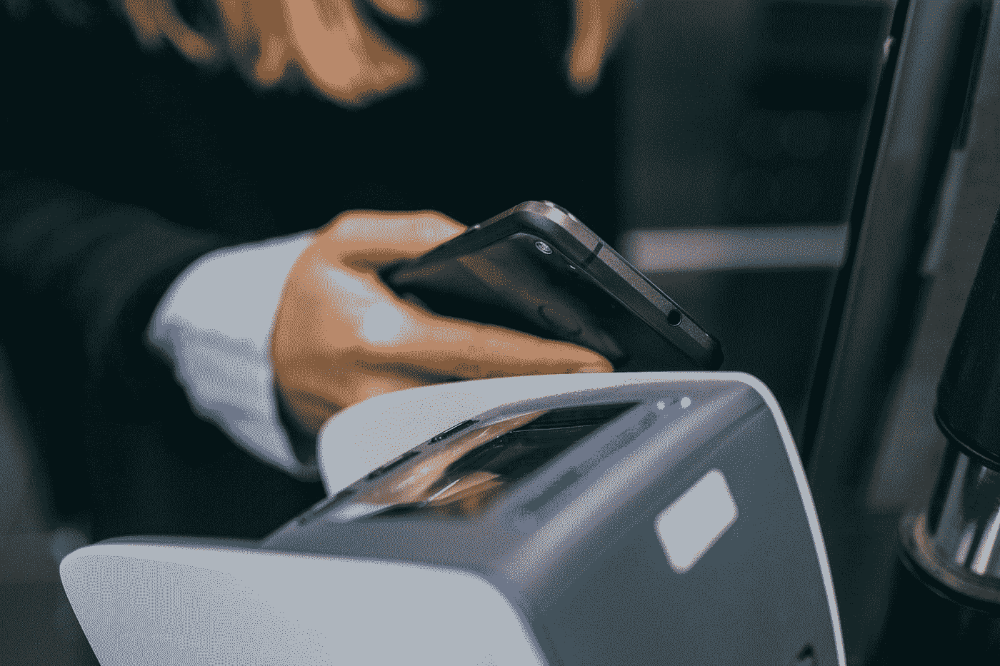

# 为什么我们对非接触式支付一无所知？

> 原文：<https://medium.datadriveninvestor.com/why-are-we-so-clueless-about-contactless-payments-23da60d2211f?source=collection_archive---------5----------------------->

我们对非接触式支付相对一无所知。但是关于支付方式的理论并没有预测我们会有多少好处…

Photo by [Jonas Leupe](https://unsplash.com/@jonasleupe?utm_source=medium&utm_medium=referral) on [Unsplash](https://unsplash.com?utm_source=medium&utm_medium=referral)

英国于 2007 年引入了无接触支付方式。截至 2014 年 12 月，约有 5800 万张非接触式卡在使用中(Campbell，2015)。英国卡协会(2015)的数据表明，非接触式卡的日益普及和移动支付的日益普及加速了现金的替代。万事达卡(2013)的一项美国研究认为，70%的非接触式交易低于 25 美元，并认为这些交易中的大部分将直接取代现金。

然而，非接触式的爆炸式增长可能不会受到现金替代的严肃驱动。万事达卡(2015)发布的数据显示，英国消费者使用非接触式卡的支出在一年内增长了五倍多，然而，“刷卡”的频率仅增加了一倍。持卡人推动交易价值同比增长 560%，高于截至 2014 年 7 月的 373%。2012 年初，当“tap”限额为 20 时，持卡人的平均非接触式购物为 4.52 英镑。2014 年的数据显示，这一平均值已增至 7.29。这些数字促使决定将限额提高到每笔 30 英镑。

 [## 外汇投资如何帮助偿还债务|数据驱动的投资者

### 外汇是对外汇市场的投资，不同国家的货币在外汇市场上进行兑换

www.datadriveninvestor.com](https://www.datadriveninvestor.com/2019/02/13/how-forex-investment-helps-to-repay-your-debts/) 

虽然研究表明，人们已经强烈偏好使用非接触式(Vista Retail Support，2017)，但向“点击即走”甚至无现金社会的发展可能不是一个积极的发展。从[借记卡和信用卡](https://www.moneyonthemind.org/blog/curse-of-the-credit-cards)可以看出，非接触式用户也容易增加他们的卡支出(James，2017；万事达卡，2013；万事达卡，2015；Trütsch，2014 年)。这是因为非接触式卡(有意)降低了显著性，导致支付的[痛苦降低，冲动控制减弱，消费意识降低。](https://www.moneyonthemind.org/blog/what-is-the-pain-of-paying)

Trütsch (2014)的研究表明，万事达卡(2013，2015)发现的支出增加可以复制。利用 2010 年消费者支付选择调查，Trütsch 试图估计使用非接触式卡对个人消费比例的影响。与万事达卡(2013 年)一致，分析发现支出大幅增加，但增幅要小得多。对于信用卡来说，非接触式的使用导致销售点的支出比率增加了 8.3%，而零售和服务购买的影响分别为 4.8%和 3.5%。对于借记卡，非接触式的使用导致销售点的消费比率增加了 10%。对零售和服务支付的影响导致 4.5%的增长。表面上看，非接触式对借记卡的影响比信用卡更大。这可能是由于使用频率:借记卡往往使用更频繁。如果要发现一种效果，最常用的方法效果最强。Trütsch (2014)没有详细说明这些增长是由于现金的替代，还是个人在没有替代发生的情况下明显支出更多。

James (2017)的研究也给我带来了一些担忧。通过调查和采访，他确定非接触式支付是首选支付方式，这与 Vista Retail Support (2017)的调查结果一致。然而，当询问参与者与其他支付方式相比，他们如何体验非接触式支付时，大多数参与者表示对自己的支出缺乏控制。超过 75%的人表示无法正确跟踪他们的支出，并且记错了他们的账户余额。

现在我不担心非接触式取代 PIN 验证。几乎没有证据表明这种变化会影响购买体验并导致更高的支出。让我担心的是现金的替代。

与其他支付方式相比，我已经写了多篇关于现金力量的文章。它更痛苦，更少屈服于诱惑，因此在记忆中更突出。如果你用现金，你不会花两次钱，只是因为你记错了你以前花了多少钱。如果你坚持用现金支付，你将永远不会发现自己为三个月前购买的物品买单，外加利息成本。现金又好又安全。事实上，它是有限度的，这是它最好的弥补特征。

此外，我不是一个戴着铝箔帽子躲在桌子下面的人，但我仍然是一个怀疑论者。非接触式卡是银行的产品。利用你的钱和债务赚钱的大众机构。我想强调的是，也是银行推出了信用卡，并从中获得了巨大的利润，而个人可以很快陷入债务漩涡。也是银行发放了可疑贷款和抵押贷款，从产出来看，这些贷款和抵押贷款实际上并不像看上去那么可靠。我只是说:如果一家银行给你一种金融产品，它不太可能对你有利。产品如果不能盈利，公司是不会发布的。

总的来说，尽管我很怀疑，但还是缺乏研究。我只引用了一些关于非接触式影响的研究。那不是一个论点。但令人怀疑的是，我们对非接触式还如此无知。因此，这就是我在自己的博士学位中研究的内容:支付方式，尤其是非接触式支付，对支出和支出回忆的影响。在下一篇文章中，我将概述我第一次研究的方法和初步结果。

**在那之前，我能给出的最好建议是:坚持用现金，你会知道你什么时候达到了极限。**

*这篇文章中使用的参考资料，以及其他许多伟大的文章都可以在* [*金钱上的头脑*](https://www.moneyonthemind.org/blog) 上找到