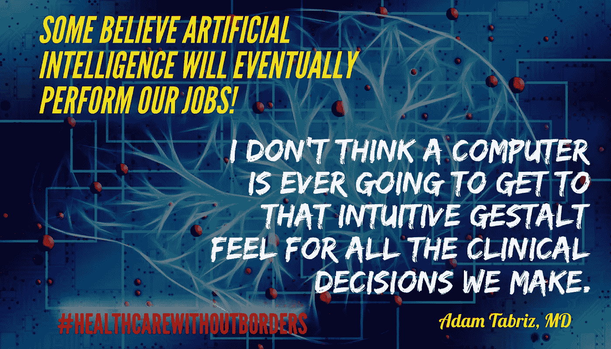

# 为什么人工智能不会取代医生

> 原文：<https://medium.datadriveninvestor.com/why-artificial-intelligence-will-not-replace-the-physician-e1bfd469743b?source=collection_archive---------10----------------------->

**Why Artificial Intelligence (#AI) Will Not Replace the #Physician**

同情、情感和移情是治愈过程和医学治疗的重要组成部分。但是，尽管你可以教计算机表现出移情作用，我相信它永远达不到真正的情感。

过度依赖工具——无论它们多么复杂和聪明——只会伤害人类。例如，我们在打仗时过度依赖设备。当人们用剑战斗时，没有对无辜的人造成附带伤害，因为战斗人员在战斗时相互面对。但是今天，我们使用复杂的炸弹，已知这些炸弹会杀死无辜的人和敌人——因此出现了技术滥用或技术出错的情况。

一些人说人工智能将比人类更好地诊断疾病并提供治疗。在回答这个问题之前，让我们先定义一下健康和疾病。这个定义一直是有争议的话题。然而，在真正意义上，它们被描述如下:

> 健康是“一种完全的身体、精神和社会福祉的状态，而不仅仅是没有疾病或虚弱。”但是我认为我们应该小心谨慎。

该疾病是导致患者疼痛、功能障碍、痛苦、社会问题或死亡或与患者接触的人出现类似问题的任何病症。这种更广泛的意义包括损伤、残疾、障碍、综合征、感染、孤立症状、异常行为以及结构和功能的非典型变异。同时，在其他情况下和出于其他目的，这些可能被视为不同的类别。

基于这些定义，我们可以确定无法从人工智能和技术中真正预期的因素。

# 我们是在对待数字和数值，还是在对待人类？

我们是在延长生命还是延长死亡？机器学习中使用的算法是基于为大多数人或个人创建的标准吗？

在我们得出结论之前，这些是需要回答的基本问题。如果是工程师治疗病人，那就是前者，但我们讨论的是内科医生，医学科学和医学不是精确的科学。

公司的要求是基于人口健康模型的，但是如果我们在希波克拉底的定义和个人自由的期望的基础上寻找个性化的护理，只有人类的“医生”才能提供一个人的同情心、同理心和人类真正的医疗需求。

简而言之，机器人治疗数字和算法，但医生治疗人类疾病。人类生活由尊严和完整性组成，而这些正是人工智能永远缺乏的。

我非常支持科技和医疗保健，尤其是人工智能。它是一个复杂的工具，但仍然是一个工具。如果使用不当，会产生毁灭性的后果。

> 正如希波克拉底所说，“有时关心，经常治疗，总是安慰。”

有时候不正常没什么可怕的，偶尔正常就可怕了。所以我们应该小心不要释放人工智能怪物。相反，让我们明智地使用它。

让我们将精准医疗应用于医疗实践。计算机永远无法对所有的临床决策做出直观的完形分析。利用机器学习通过“智能透镜”观察患者目标

> 加入我们的活动，了解我们如何创建一个超越贫困、政治和地理边界的医疗保健。