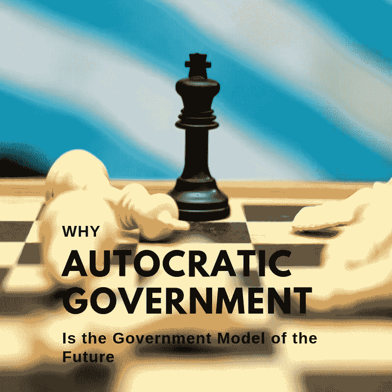

# 为什么专制政府是未来的政府模式

> 原文：<https://medium.datadriveninvestor.com/why-autocratic-government-is-the-government-model-of-the-future-dc82be54175d?source=collection_archive---------0----------------------->

# 远离民主的转变

到目前为止，民主已经被证明是一种成功的政府模式。寿命延长了。生活水平提高了。社会地位的提高现在可以通过努力工作来实现。然而，我们正看到推动我们进入繁荣时代的民主基础开始崩溃。总统选举被操纵的频率越来越高。全球各地的国家都是由通过个人崇拜当选的暴君统治的。是的，学历史的学生可能会说，专制政府无法与民主政府竞争。也就是说，专制政府再次成为西方民主的威胁。事实上，在[人工智能](https://bunkerbasics.com/cost-of-efficiency/)的时代，专制政府可能是获得全球霸权所必需的。

# 集中式数据积累

一个国家成功的更重要的预测因素之一是技术能力。技术使领土扩张和经济进步成为可能。构成民主国家人口的大多数人享有技术的好处。然而，随着人工智能的继续发展，该技术的好处可能仅限于那些控制数据的人。

 [## 在中国做生意:如何优化您的运营|数据驱动的投资者

### 中国是一个受本地和外国公司欢迎的商业中心。在一个国家设立实体存在…

www.datadriveninvestor.com](https://www.datadriveninvestor.com/2019/03/17/doing-business-in-china-how-to-optimize-your-operations/) 

任何成功的人工智能都有大量的数据。像中国这样的人口大国在利用人工智能技术方面具有明显的优势，因为他们有更多的公民可以收集数据。此外，中国的专制政府建立了广泛的监控，这进一步促进了数据的积累。这些数据为中国的人工智能系统提供了动力，使中国政府相对于将隐私和自由视为核心价值观的政府而言，拥有了技术优势。我并不是说专制政府对一个国家的公民有利。然而，我的意思是，中国的专制政府可能是第一个实现技术突破、领先于民主国家的政府。

# 模糊私人部门和公共部门之间的界限

在中国，私营部门和公共部门之间的界限非常模糊。众所周知，华为和阿里巴巴背后都有中国政府的全力支持。私营部门和公共部门的联姻让华为和阿里巴巴迅速实现了巨大的规模，尽管这并非没有争议。美国政府实际上已经将华为列入其电信市场的黑名单。间谍和知识产权盗窃的指控阻止了华为在美国成为一支有竞争力的力量。也就是说，这些公司享有政府资金和关系，这有助于开发尖端的人工智能系统。

尽管大型中国公司与政府关系紧密，但美国公司并不都希望与山姆大叔建立类似的关系。美国科技公司内部爆发了高调的抗议活动，以回应这些公司与五角大楼的合作关系。特别是谷歌，已经被迫停止军方资助的项目。该公司表示，将不会续签合同，以制造用于驱动军用无人机的人工智能。民主国家必须平衡政府、公司员工、消费者和公司自身的利益。这种微妙的平衡行为可能会导致众所周知的人工智能球被扔掉。一个除了终身任期的总统之外不对任何人负责的专制政府要脆弱得多。

# 如何阻止向专制政府的转变

在过去的几年里，帮助民主国家统一的力量成了共同的敌人。虽然许多美国公民对与军方合作心存疑虑，但如果没有这样的合作，我们将失去对自由世界领袖的主张。民主国家之间和内部的团结对于打击专制政府的进一步扩散和加强是必要的。尽管美国可能没有 10 亿人口，但超过 50%的地球居民生活在民主社会中。

进一步明确这些联系，并在人工智能和其他技术进步方面开展合作，是阻止像中国这样的专制政府的唯一途径。美国已经变得过于满足于自己先前的成就。我们政府和人民之间的裂痕正在被利用。走向孤立的趋势将导致民主的灭亡。打破这一趋势还为时不晚，但民主国家必须找到调和分歧的方法。

最初发布于:[https://bunkerbasics.com/autocratic-government/](https://bunkerbasics.com/autocratic-government/)