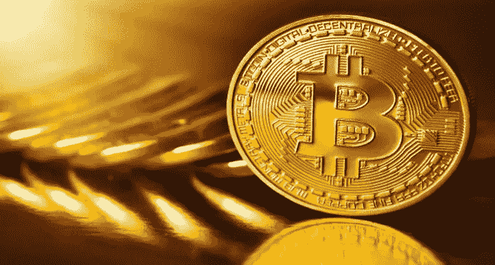
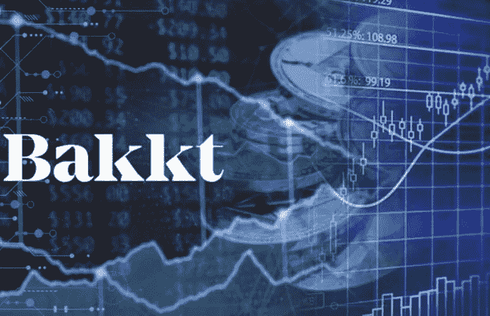

# 为什么比特币永远不会实现它的目的。

> 原文：<https://medium.datadriveninvestor.com/why-bitcoin-is-never-going-to-fulfill-its-purpose-a6232d243685?source=collection_archive---------37----------------------->

2008 年，世界遭遇了几十年不遇的金融危机。这将在未来几年的政治和经济决策中发挥重要作用，但仍有许多人深受其害。

作为对此的反应，法案获得通过，量化宽松全面实施，银行得到纾困，公众愤怒成为全球每天都会发生的事情。

印刷钞票导致各国货币贬值，银行的看法可能达到了历史最低点。为了应对这种情况，一个化名为[中本聪](https://en.wikipedia.org/wiki/Satoshi_Nakamoto)的不知名开发者发明了被称为比特币的数字货币。

你为什么问历史课？嗯…这是因为似乎每个人都忘记了这一点…比特币是为了创造银行的公共独立性。为了反对量化宽松，部分储备银行和金融机构的首脑们。

开始的时候还不错，个人通过小额费用在全球范围内转移资金。从 2009 年[到 2017 年](https://www.buybitcoinworldwide.com/price/)由于各种原因，价格多次飙升和暴跌，许多人因价格波动而变得富有。

这一切都不为人知…直到 2017 年 12 月。

突然，价格爆炸了。百万富翁从左、右、中间冒出来，政府突然把加密货币放在了他们谈话的最前沿，特别是在中国。

华尔街站在场边等待机会，现在他们似乎要对巴克特采取行动了。[星巴克](https://www.starbucks.com/)、[微软](http://www.microsoft.com)和 [ICE](https://www.theice.com/about) 的合资公司。他们声称是为了让公众更容易获得比特币，但实际上他们是在集中比特币；通过为他们的客户把它们都放在一个地方，从而切断流通并囤积起来。

不幸的是，加密货币领域的大多数人都希望这种情况发生，以提高价格，然而，他们为了快速获利而牺牲了理想。

当然，一旦微软介入，星巴克在全球范围内接受比特币，比特币将变得更容易获得，但当 1%的人已经拥有该产品的很大一部分时……这真的重要吗？