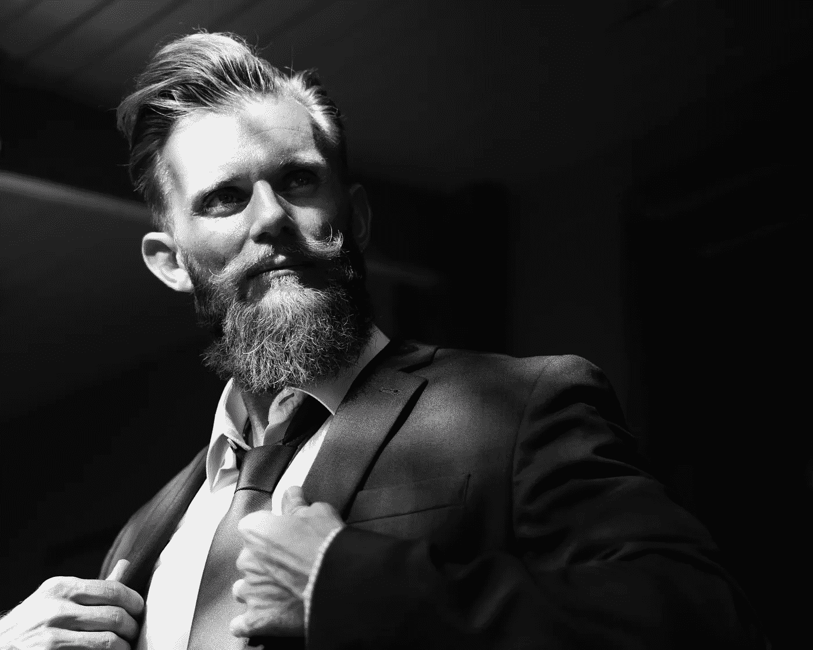

# 为什么身体语言在数字时代比以往任何时候都更响亮

> 原文：<https://medium.datadriveninvestor.com/why-body-language-is-louder-than-ever-in-the-digital-age-ea2a9dd4619e?source=collection_archive---------22----------------------->

Shoulder pulled back, chest is open, this is confidence | Photo by [rawpixel](https://unsplash.com/photos/qy1da0Y12Q4?utm_source=unsplash&utm_medium=referral&utm_content=creditCopyText) on [Unsplash](https://unsplash.com/search/photos/confidence?utm_source=unsplash&utm_medium=referral&utm_content=creditCopyText)

习惯和肢体语言曾经是一项重要的生活技能。在数字时代，随着人们转向数字通信，它变得越来越不重要。这使得面对面的交流变得更加重要，无论是与投资者会面、工作面试，甚至是喝杯咖啡。肢体语言给你周围的人，你交往的人一种印象，不管是自信同情的性格。现在你如何“说”肢体语言？你可以记住一些基本的手势来给人留下特别的印象

## 态度

最明显的是姿势，是你的框架。强壮的骨架给人以强烈的印象，虚弱的骨架流露出虚弱。坐直或站直，肩膀向后拉，给人一种自信的感觉。前倾表示兴趣和意图。这表明你在专心听，并且想要更多的信息。向后仰是一个有力的姿势。老实说，在大多数情况下，这会让你与之交谈的人感到不舒服。它表现出不感兴趣和冷漠。这与你的手臂姿势相结合，甚至会给人以傲慢而不是冷漠的印象。但是，在比较随意的谈话中，却能表现出放松和舒适。与所有其他人相反，懒散是相反的，这是纯粹的软弱和投降。它在身体上使你变小，并从你的存在中带走。最后要记住的是你如何定位你的身体。面向你想要的东西。如果你正在和某人谈话，而你的胸部正对着门或远离门，那么这表明你对谈话不感兴趣。想想去约会，坐在他们对面还是肩并肩。如果你做过，你就知道我在说什么。面对面坐着会让谈话变得激烈，并排坐着会让注意力集中在食物上，很难建立联系。

## 手臂，胳膊（arm 的复数）

你的身体包含你的重要器官，心脏，肺等。你的手臂是用来保护它的。把你的手臂放下来，让你变得开放和暴露，人们自然会注意到这一点。这让你更加平易近人。交叉双臂，封闭自己。它让你变得几乎不可接近，就像一堵在靠近你之前需要打破的大墙。想想你生气不想继续一段对话的时候。你双臂交叉，身体后倾，对谈话表现出不感兴趣和不屑。你可能不太重视你的手臂如何影响你的形象，但它们比你想象的更重要。

Leaned back, arms and legs open, slouching. Relaxed, confident, and just doesn’t care | Photo by [Parker Whitson](https://unsplash.com/photos/BbHDqrI4l08?utm_source=unsplash&utm_medium=referral&utm_content=creditCopyText) on [Unsplash](https://unsplash.com/search/photos/portrait?utm_source=unsplash&utm_medium=referral&utm_content=creditCopyText)

## 腿/脚

你可能认为你的腿和脚不会给人任何印象，但它们会。它比你身体的其他部分更微妙，但潜意识里人们会察觉到它，不管他们是否完全理解。你的腿和脚带你去任何地方。当你在比赛时，你不要让他们稍微向左，而是让他们朝着终点线。说话也是一样，如果你把它们指向和你谈话的人，这表明你订婚了。把它们指向门意味着你准备好离开这个对话。就像你的手臂一样，你可以交叉双腿。通常，双腿张开表示舒适和自信，双腿紧闭表示焦虑或紧张。对于男性来说，脚踝跨过膝盖的姿势可以明显打开双腿，显示自信，甚至是挑战。

## 紧张

这与其说是定位，不如说是控制或观察身体的张力。紧张表现出压力和焦虑。紧握的拳头，紧咬的下巴，松散交叉的手臂与紧密交叉的手臂。一个人的紧张程度通常表明他被压抑的强烈情绪。这比身体语言的其他身体特征更难控制。

## 反映

最后但同样重要的是，模仿肢体语言可以建立融洽的关系。你必须小心，因为如果做得不正确，它可能会被视为嘲弄。它不应该在他们刚做的时候发生，而是可能在 10 到 20 秒之后。微笑应该以微笑来回报，放松身体应该以放松你的身体来回报。如果他们摸他们的鼻子，不要去摸你的鼻子，认为这会给你一种团结的感觉，对你的镜子要合理。这是和某人建立融洽关系的一种快速简单的方法。

每个人都是不同的，因此每个互动都是不同的。在每次互动中，请使用这些指南。我倒觉得有人很没精打采，表现出缺乏自信，不去挺胸挺胸，准备接管世界。去放松，让他们感到舒适和开放。有时间和地点，但那是另一篇文章。