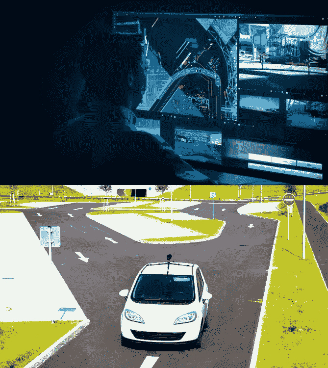

# 为什么加州有更好的自动驾驶汽车法规？

> 原文：<https://medium.datadriveninvestor.com/why-california-has-the-better-set-of-regulations-for-autonomous-vehicles-e45411384531?source=collection_archive---------0----------------------->

Image Source: Wired, The Drive

不管我们喜欢与否，自动驾驶汽车即将到来，如果不是马上，肯定会在未来 5 年内。随着无人驾驶汽车的推出，对标准监管的需求只会增加。您知道吗，在 50 个州中，[美国只有 19 个州](http://www.ncsl.org/research/transportation/autonomous-vehicles-self-driving-vehicles-enacted-legislation.aspx)(有些州的法规正在审批过程中)尚未引入自动驾驶汽车立法。大多数州都出台了针对自动驾驶汽车的专门法律，但并不都是一样的，各州有所不同。作为发放自动驾驶汽车测试许可证数量最多的州([截至 2018 年 6 月 1 日](https://www.dmv.ca.gov/portal/dmv/detail/vr/autonomous/permit)55 张)，让我们看看加州对自动驾驶汽车的规定。

与其他州的法规不同，加州针对自动驾驶和无人驾驶车辆的 DMV 法规列表非常长，其中有 5 部法律非常突出。它们是什么？

*(参考加州法规)*

词汇表:

*   ATV 自动测试车辆[227.02(b)-第。1]
*   奇数—操作设计域[227.02 (j) —第。2]

1.在没有驾驶员的情况下，ATV 需要遥控操作器。全地形车必须符合以下要求:[227.38(b)-第。11]

*   持续监控车辆和双向通信链路
*   描述制造商将如何监控通信链路。
*   说明如何监控制造商测试的所有 ATV。

2.对于紧急情况和交通执法情况，需要“第一响应者”(执法部门、消防部门、紧急医疗人员)的执法互动计划，包括:[227.38(e)-Pg。12 + 13]

*   方法与 ATV 的远程操作员进行通信，该操作员在任何时候都是可用的。
*   重要车辆和保险文件的位置。
*   将车辆安全驶离道路的方法。
*   识别车辆是否处于自主模式以及如何安全地解除自主模式的方法。
*   方法来检测并确保自主模式实际上已被停用。
*   适用时，与电动和混合动力汽车安全互动的方法。
*   对全地形车赔率的描述。
*   关于危险情况或公共安全风险的必要附加信息。

该计划应在网上提供，并应可供第一反应者使用。制造商应定期审查该计划，以根据需要更新变更，至少每年一次。

3.除了法律要求的任何其他机制之外，还需要安装自动技术数据记录器机制，该机制安装在 at ATV 上，以只读格式记录碰撞前 30 秒内车辆自动技术传感器的状态和操作的技术信息，该只读格式必须可从商用工具中访问和检索。第 228.06 (6)页。22]

4.要求提供网络安全证书，证明 ATV 符合适当且适用的当前行业标准，有助于防御、检测和应对网络攻击、未经授权的入侵或错误命令。第 228.06 (10)页。23]

5.信息隐私条例:如果要收集和使用个人信息，需要乘客的书面披露和批准。不得歧视任何乘客。[228.24——第。30 + 31]

加州是硅谷的所在地，这可能有助于该州更好地理解自动驾驶汽车“运营架构”的重要组成部分，并关注人类安全。这些法规让我们对自动驾驶汽车的影响有了一个整体的了解，这不仅包括道路安全，还包括其他严重的安全问题，如网络安全和数据隐私。

有太多的文章提到政府缺乏对自动驾驶和无人驾驶汽车的法律法规。政府在无人驾驶汽车方面被难住的原因是，他们没有足够的人员真正了解这项技术实际上是如何工作的，以及这些汽车可能造成的影响程度。他们不想阻碍创新，但他们也承担不起将公众生活置于风险之中。各州将如何制定未来的自动驾驶汽车法规仍有争议，但目前，与其他州相比，加州有一套更好的法规。另一方面，德国关注自动驾驶汽车必须遵守的更详细的道德规范。

资源:

*   加州法规—[https://www . dmv . ca . gov/portal/wcm/connect/a6ea 01 e 0-072 f-4f 93-aa6c-e12b 844443 cc/DriverlessAV _ Adopted _ Regulatory _ text . pdf？MOD=AJPERES](https://www.dmv.ca.gov/portal/wcm/connect/a6ea01e0-072f-4f93-aa6c-e12b844443cc/DriverlessAV_Adopted_Regulatory_Text.pdf?MOD=AJPERES)
*   内华达州法规—[https://www.leg.state.nv.us/NRS/NRS-482A.html](https://www.leg.state.nv.us/NRS/NRS-482A.html)
*   亚利桑那州法规—[https://az gover . gov/sites/default/files/related-docs/EO 2018-04 _ 1 . pdf](https://azgovernor.gov/sites/default/files/related-docs/eo2018-04_1.pdf)
*   德规—[https://www . bmvi . de/shared docs/EN/Documents/G/ethic-commission-report . pdf？__blob=publicationFile](https://www.bmvi.de/SharedDocs/EN/Documents/G/ethic-commission-report.pdf?__blob=publicationFile)

*免责声明:本文表达的观点和意见仅代表我个人，不代表任何其他人或公司。所有内容都受版权保护。*