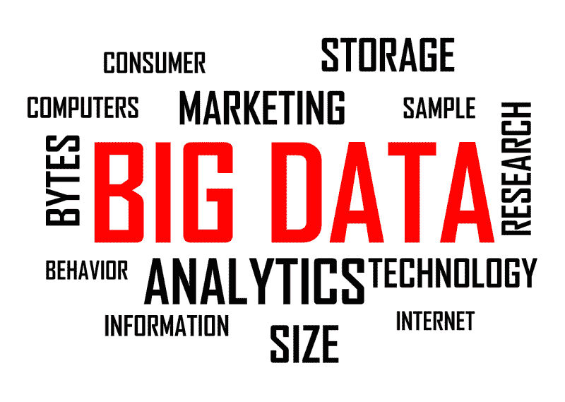
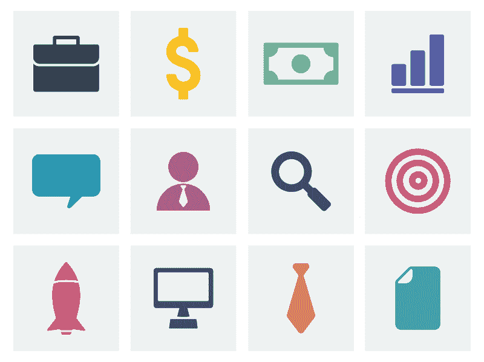
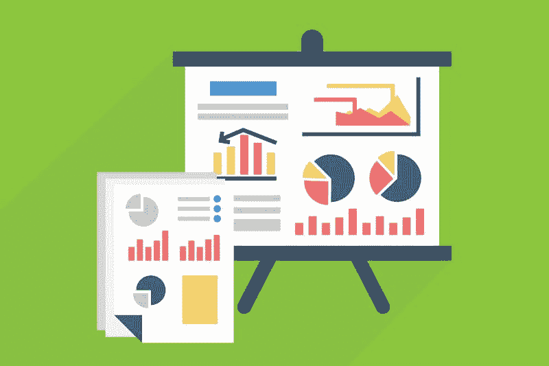
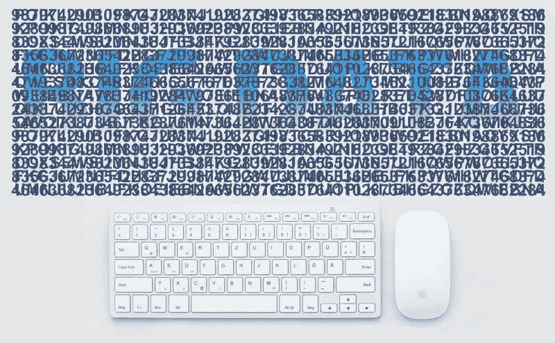
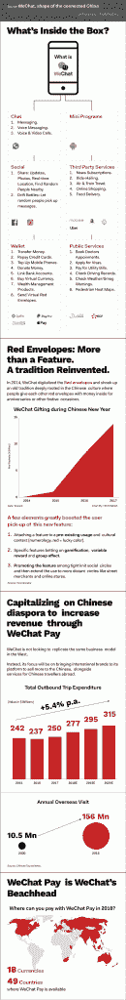
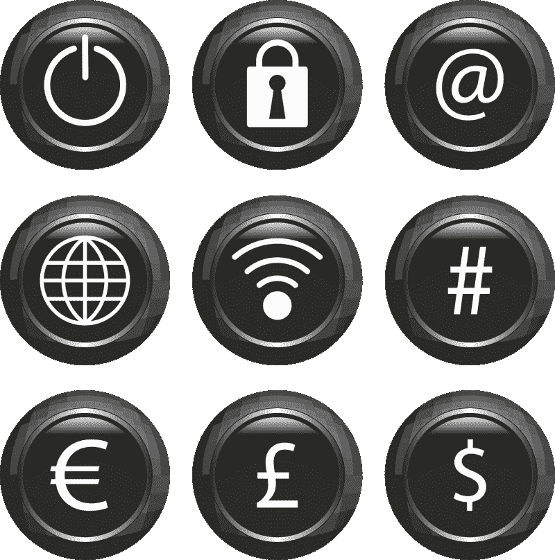
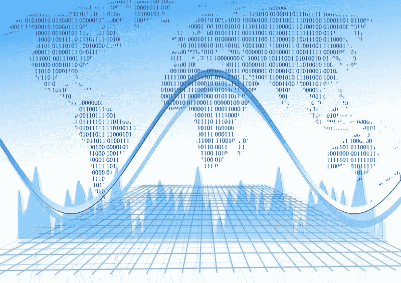
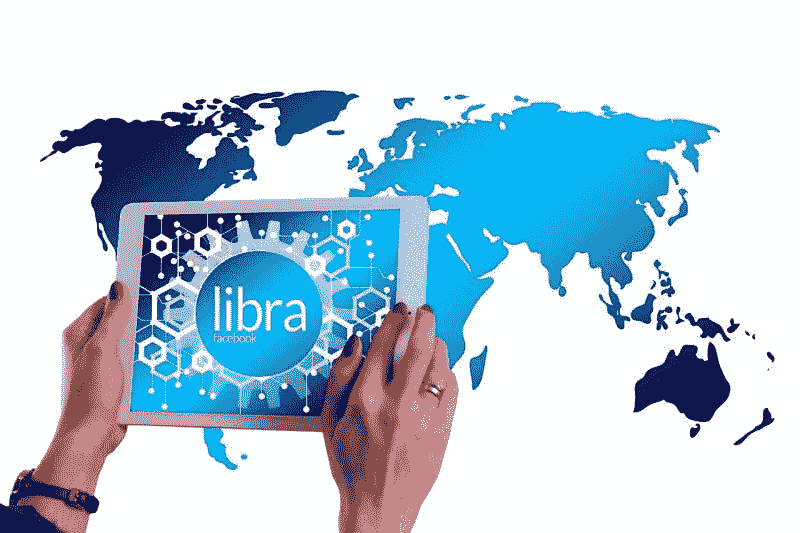
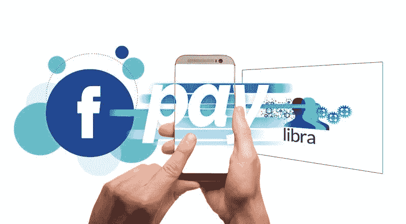
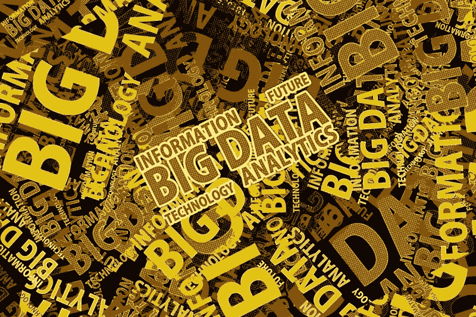

# 为什么中国拥有 21 世纪，这是数据市场疯人院

> 原文：<https://medium.datadriveninvestor.com/why-china-owns-the-21st-century-its-the-data-market-mad-house-187dab9a974e?source=collection_archive---------2----------------------->

中华人民共和国将成为 21 世纪的主导力量，因为它拥有最多的数据。数据现在是世界上最重要的资源，而中国拥有最多的数据。

“数据是石油；有人说它是 21 世纪的黄金，是我们的经济、社会和民主越来越依赖的原材料，”西门子首席执行官 Jaoe Kaesar 去年在斯德哥尔摩对听众说。*《经济时报》* [报道](https://economictimes.indiatimes.com/magazines/panache/data-is-the-21st-centurys-oil-says-siemens-ceo-joe-kaeser/articleshow/64298125.cms?from=mdr)Kaesar 认为数据是第四次工业革命的基础。

 [## 在中国做生意:如何优化您的运营|数据驱动的投资者

### 中国是一个受本地和外国公司欢迎的商业中心。在一个国家设立实体存在…

www.datadriveninvestor.com](https://www.datadriveninvestor.com/2019/03/17/doing-business-in-china-how-to-optimize-your-operations/) 

“第四次工业革命几乎改变了人类的每一项活动:我们相互交流和互动的方式，我们学习的方式，我们制造东西的方式，我们工作的方式，我们使用地球资源的方式，”Kaesar 说。"虽然赢家通吃，但数字化转型的输家将面临个人滑铁卢."

[滑铁卢](https://www.britannica.com/event/Battle-of-Waterloo)滑铁卢是拿破仑一世最后一战，也是法兰西争夺欧洲霸权的终结。滑铁卢之后，法国成为二流强国和大英帝国的附庸国。英国实力的一个基础是对 19 世纪最重要资源的控制:煤炭。

# 中国控制着 21 世纪的石油

今天，中国力量的基础是数据，这是我们这个世界上最重要的资源。中国拥有如此多的数据，以至于作家、数据科学家和风险投资家李开复给这个人民共和国贴上了“数据的沙特阿拉伯”的标签。

李的假设是，中国产生的数据远远多于其他任何国家；因此，中国是世界上最富有的国家。具体来说，中国产生的数据要多得多，因为其数字平台的用户比其他国家多。李的引述和假设来自他的书 [*AI 超级大国:中国、硅谷和新的世界秩序*](https://www.amazon.com/AI-Superpowers-China-Silicon-Valley/dp/132854639X) *。*

中国产生大量数据的一个原因是，现代中国社会是一个数据收割机的梦想。在最近的*麻省理工科技评论*中，文章作者[观察](https://medium.com/mit-technology-review/china-has-started-a-grand-experiment-in-ai-education-it-could-reshape-how-the-world-learns-c771f5980deb)；“中国企业家有大量数据可以用来训练和完善他们的算法。人口众多，人们对数据隐私的看法比西方宽松得多(尤其是如果他们能获得令人垂涎的好处，比如学习成绩作为回报的话)。”

中国政府和公民积极与数据收集者合作。例如，*时代* [报道](https://time.com/collection/davos-2019/5502592/china-social-credit-score/)称，中国政府和大数据正在合作创建一个社会信用评分，以方便收集公民数据。德国政治学家塞巴斯蒂安·海尔曼称中国目前的努力是利用“数据数字[列宁主义](https://marketmadhouse.com/technocracy-or-is-it-leninism-from-silicon-valley/)，*南华早报* *邮报* [报道](https://www.scmp.com/news/china/policies-politics/article/2129897/china-big-data-watching-you-and-could-be-huge-challenge)。

讽刺的是，海尔曼认为中国人可以从数字列宁主义中赚钱。他写道，“随着中国出口其日益强大的安全和监控技术，商业利益将推动这一全球发展。”这句话摘自海尔曼的书 [*红天鹅:非正统的政策制定如何促进了中国的崛起*](https://www.amazon.com/Red-Swan-Unorthodox-Policy-Making-Facilitated/dp/9629968274) *。*

注:在海尔曼的论文中，列宁主义指的是 V·I·列宁在前苏联建立的政治结构，而不是共产主义。

相比之下，欧盟在 2018 年通过了[通用数据保护条例](https://www.wired.com/story/europes-new-privacy-law-will-change-the-web-and-more/)，使得数据收集变得更加困难。例如，法规要求公司在收集你的数据前获得许可。

因此，当中国大幅增加数据生产时，欧洲却在限制数据生产。因此，中国可能会变得更加富裕；因为数据就是钱，而欧洲越来越穷。

# 中国的金融数据是美国的四倍

包括移动支付使用情况在内的一些数据支持了 Lee 的假设。例如，中国的支付应用让他们的美国竞争对手相形见绌。

中国移动支付平台正在收集的海量金融数据包括:

WeChat Pay 2019 年 3 月活跃用户 11 亿，PYMNTS.com[预估](https://www.pymnts.com/earnings/2019/tencent-wechat-pay-merchant-growth-q4/)。此外，腾讯控股旗下的微信支付在 2019 年拥有 10 亿日常用户。

Zdnet.com[声称【2019 年春节，8 . 23 亿人送了现金礼物。](https://www.zdnet.com/article/over-800-million-wechat-users-sent-digital-monetary-gifts-during-lunar-new-year/)

Technode [估计](https://technode.com/2019/01/10/alipay-1-billion-users/)2019 年 1 月用户超过 10 亿的一个lipay。tech node[估计](https://technode.com/2018/09/18/alipay-gains-200-million-users/)支付宝的所有者[蚂蚁金服](https://geekcrunch.reviews/ant-financials-world-conquest-continues/)，是 2019 年 1 月世界上最有价值的金融公司。

此外，Technode[估计](https://technode.com/2019/03/28/chinas-mobile-payment-market-fourth-quarter-growth-dwindled/)2018 年第四季度，中国第三方移动支付市场的交易额为 7.01 万亿美元。相比之下，Statista [预计](https://www.statista.com/statistics/226530/mobile-payment-transaction-volume-forecast/)2019 年整个全球支付市场的收入为 1.08 万亿美元。

在对比中，美国最大的移动支付平台；**据 Statista [估计](https://www.statista.com/statistics/218493/paypals-total-active-registered-accounts-from-2010/)，PayPal Holdings(纳斯达克:PYPL)** 在 2019 年第二季度拥有 2.86 亿注册用户账户。

美国第二大移动支付平台；Statista [估计，2019 年第二季度，Apple Pay 在全球拥有 2.53 亿用户。](https://www.statista.com/statistics/911918/number-apple-pay-users-by-region/)

根据这些数字，我估计中国最大的两个移动支付平台产生的数据量是其最大的美国竞争对手的近四倍。因此，中国可能拥有比美国多四倍的金融数据。

# 为什么中国能主宰 21 世纪的金融

因此，从理论上讲，中国的银行和金融科技公司对个人金融数据的了解可能是美国竞争对手的四倍。因此，中国公司可能会主导快速增长的移动支付应用市场。

例如，蚂蚁金服预测客户需求的可能性可能是贝宝的四倍。因此，从理论上讲，蚂蚁金服在客户服务方面比贝宝强四倍。

此外，蚂蚁金服比贝宝拥有多四倍的客户行为数据，可以输入到它建立的任何人工智能中。因此，蚂蚁金服的人工智能可能比贝宝或[、T5、高盛的](https://marketmadhouse.com/does-investment-banking-make-money-at-lazard-and-goldman-sachs/) **(纽约证券交易所代码:GS)** 、人工智能聪明四倍。

因此，中国可能会像美国在 20 世纪主导全球金融、英国在 19 世纪主导全球金融那样，在 21 世纪主导全球金融。值得注意的是，大英帝国是 19 世纪最强大的政体，而美国是 20 世纪的主导力量。

如果金钱就是力量，中国可能在短短几年内主宰世界。因此，美国可能会在没有意识到的情况下输掉这场数据战争。

# 美国能在数据战争中幸存吗？

美国在数据战争中有一些优势。例如，Statista [估计](https://www.statista.com/statistics/618115/number-of-visa-credit-cards-worldwide-by-region/)是美国最大的支付提供商；**Visa(NYSE:V)**2019 年第三季度有 12.4 亿张信用卡在流通。

因此，Visa 的支付平台可能仍然比微信所有者蚂蚁金服的网络更大。然而，Visa 依靠的是老式技术——塑料卡。同样，**万事达卡(纽约证券交易所代码:MA)** 在 2019 年第二季度有 11.38 亿张信用卡在流通，Statista [估计](https://www.statista.com/statistics/618137/number-of-mastercard-credit-cards-worldwide-by-region/)。

应该让美国人害怕的是支付宝和微信的时代。事实上，阿里巴巴于 2004 年 12 月 8 日推出了支付宝。相比之下，Visa 于 1958 年 9 月以美国银行的名义成立。

因此，支付宝还不到 15 岁，而 Visa 已经 61 岁了。因此，Visa 花了 61 年才获得 11.38 亿个账户，支付宝花了 15 年才达到同样的目标。

同样，他们在 1966 年 12 月 16 日推出了万事达信用卡。令人难以置信的是，腾讯控股于 2011 年 1 月 21 日推出了微信支付。所以，万事达将近 53 岁，微信支付九岁。令人惊讶的是，微信用了 9 年时间吸引了几乎和万事达卡一样多的客户。

# 中国的社交媒体攻势

Medici [声称](https://gomedici.com/fintech-story-of-wechat)，到 2018 年，你可以在 49 个国家使用微信支付。此外，你可以用微信支付支付货币。Medici 将微信支付称为“腾讯在国外市场的滩头阵地”。

因此，腾讯控股现在可以通过微信支付在 49 个国家部署其数据收集能力。此外，微信本身可以追随并主导社交媒体和互联网的使用。

李开复称微信为“数字瑞士军刀”，拥有谷歌、Twitter、亚马逊、Instagram、Pixia、Venmo、PayPal、优步、YouTube 甚至 TurboTax 的一些功能。Medici 报告称，微信的功能包括:

*   信息发送
*   语音信息
*   语音和视频电话
*   迷你程序、Android 应用程序或 DApps(分散应用程序)
*   照片共享
*   新闻订阅
*   乘车招呼
*   资金转移
*   分期付款
*   银行业务
*   数字货币
*   理财产品
*   点对点(P2P)现金支付
*   获取政府文件，如驾驶记录和签证申请
*   天气和热量信息
*   购物和食品配送

# 腾讯在美国的滩头阵地微信支付和沃尔玛

现在微信在美国和其他 48 个国家都有了。微信进入的一种方式是让中国游客或大零售商使用微信支付。值得注意的是，据路透社[报道](https://www.reuters.com/article/us-china-walmart/in-china-payment-war-walmart-places-bet-on-tencent-idUSKBN1H30U9)，美国最大的零售商**沃尔玛放弃了支付宝，转而支持微信支付在中国的门店。**

而且沃尔玛提供自己的支付 app，类似于[微信支付](https://marketmadhouse.com/?s=Walmart+Pay)；沃尔玛支付，通过其美国商店。Market Madhouse 估计，2017 年 11 月，6%至 7%的美国手机用户在使用沃尔玛支付。Pymnts.com 估计，6%的美国智能手机用户使用沃尔玛支付。

如果 Pymnts.com 是正确的，美国可能有 1596.4 万沃尔玛支付用户。为了解释，Statista [估计](https://www.statista.com/statistics/201182/forecast-of-smartphone-users-in-the-us/)2019 年美国有 2.659 亿智能手机用户，2.659 亿的 6%是 1596.4 万。因此，沃尔玛在美国的 5358 家商店理论上都可以接受微信支付。

值得注意的是，沃尔玛支付和微信支付使用相同的方法与收银机快速读取(QR)码进行通信。与 Apple Pay 和 Google Pay 不同，二维码应用程序通过扫描销售点(POS)系统生成的条形码来启动交易。

然而，像 Apple Pay 这样的恐惧现场通信(NFC)应用程序会向 POS 设备发送无线电信号。有趣的是，沃尔玛拒绝在其门店接受 Google Pay 等 NFC 支付解决方案。

因此，微信可以在美国沃尔玛拥有一个巨大的滩头阵地，而硅谷几乎没有人会注意到。事实上，我怀疑很大一部分硅谷工程师没有意识到沃尔玛仍在经营。

# 美国输掉了数据战争吗？

20 世纪的资源冲突显示了数据战争是如何发展的。尤其是英国，整个 20 世纪都在试图对抗美国在石油领域的主导地位。

例如，温斯顿·丘吉尔[推动议会救助英波石油公司，现在的英国石油公司(BP)在 1914 年控制了伊朗的石油。澄清一下，丘吉尔作为海军大臣掌管皇家海军。皇家海军需要这些石油来为军舰提供动力。](https://www.bp.com/en/global/corporate/who-we-are/our-history/early-history.html)

此外，在第二次世界大战期间，英国将军事力量集中在中东，以保护他们的石油供应不受纳粹的侵犯。1956 年，英国试图在法国和以色列的帮助下夺取苏伊士运河，以保持对中东石油的控制。

然而，美国总统德怀特·戴维·艾森豪威尔(堪萨斯州共和党人)在[苏伊士运河危机](https://www.history.com/topics/cold-war/suez-crisis)中支持埃及总统贾迈勒·阿贝尔·纳赛尔，从而结束了大英帝国的统治。没有中东石油；由沙特阿拉伯等美国附庸国控制，英国成为二流强国和美国附庸国。

如今，美国面临着类似于 1914 年英国的局面，一个咄咄逼人的对手正慢慢获得对世界上最宝贵资源的控制权。不同的是，今天的资源是数据，对手是中国。

# 脸书能为美国赢得数据战争吗？

美国在数据战争的一个重要领域仍有巨大优势:社交媒体。

全球四大社交媒体网络；脸书、YouTube、WhatsApp 和脸书信使都是美国人。同时，微信是世界第五大社交网络。

2019 年 7 月，Statista [估计](https://www.statista.com/statistics/272014/global-social-networks-ranked-by-number-of-users/)脸书拥有 23.75 亿用户，YouTube 拥有 20 亿用户，WhatsApp 拥有 16 亿用户，Facebook Messenger 拥有 130 万用户，微信拥有 11.12 亿用户。因此，美国目前正在赢得社交媒体战争。

而且，一家美国公司**脸书(NASDAQ:FB)**；拥有五大社交媒体品牌中的三个和第六大社交媒体渠道。详细来说，脸书拥有脸书、Facebook Messenger、WhatsApp 和 Instagram，这些公司在 2019 年 7 月拥有 10 亿用户。

我估计马克·扎克伯格的社交媒体帝国在 2019 年 7 月已经有 62.75 亿用户。因此，脸书的社交媒体规模是腾讯的六倍，而且与腾讯不同，脸书的业务遍及全球几乎每个国家。重要的是，脸书的绝大多数用户都不在美国

# 脸书的支付攻势

然而，脸书在很大程度上仍然是社交媒体，但扎克伯格正在努力改变这一点。

此外，据 CNET [报道](https://www.cnet.com/news/whatsapp-pay-is-coming-this-year-report-says/)，脸书将在印度推出 WhatsApp Pay，一款微信支付的克隆版，今年印度已有 4 亿用户。在美国、法国和英国，Facebook Messenger 包括一个类似于微信支付的 P2P 支付功能，*余额* [报告](https://www.thebalance.com/facebook-messenger-payments-send-and-receive-money-315074)。然而，脸书在支付方面仍落后于腾讯

为了改变这种状况，扎克伯格发起了一项全球加密货币计划，他称之为“天秤座计划(T10)”。重要的是，Visa、MasterCard 和 PayPal 都是天秤座协会的成员。

澄清一下，理论上你可以在地球上任何地方使用区块链平台用加密货币支付。然而，区块链需要克服许多限制才能进入大众市场。比如区块链的可扩展性问题。

# 马克·扎克伯格是美国的丘吉尔吗？

因此，我们可以把马克·扎克伯格想象成美国的丘吉尔，试图让他的国家为 21 世纪的新现实做好准备。请记住，丘吉尔冒着风险接管了盎格鲁-波斯石油公司，以确保英国的石油供应。

同样，扎克伯格买了[WhatsApp](https://www.investopedia.com/articles/investing/032515/whatsapp-best-facebook-purchase-ever.asp)；类似微信的短信应用，2014 年以 190 亿美元与腾讯竞争。值得注意的是，市场观察[指出](https://www.marketwatch.com/story/facebook-says-whatsapp-will-start-making-money-next-year-2018-08-01)，当扎克伯格收购 WhatsApp 时，它正在亏损，2018 年它仍在亏损。可以预见的是，华尔街和投资媒体嘲笑扎克伯格的购买。

众所周知，扎克伯格是一个像丘吉尔一样的历史迷。因此，与硅谷的大多数同行不同，马克了解这段历史。此外，扎克伯格和他的妻子中国也有私人关系；Priscillia Chan ，是华裔。同样，丘吉尔的母亲珍妮·伦道夫·邱吉尔女士也是美国人。

扎克伯格面临许多挑战；包括政府对加密货币的敌意，以及美国对社交媒体和脸书日益增长的敌意。奇怪的是，美国左派和许多媒体将唐纳德·川普(纽约州共和党人)在 2106 年总统大选中的意外胜利归咎于脸书。

扎克伯格正在整合能够确保美国数据优势的资源。不幸的是，马克几乎是一个人在战斗，但他的资源是巨大的。只有历史会告诉我们谁会赢得这场数据战争，但中国现在可能拥有优势。

# 为数据战争投资的公司

有趣的是，你可以投资一些股票，在数据战争的双方获利。这些库存包括:

T **持有 OTCMKTS 的 en cent:(tce hy)**微信和微信支付的所有者也是数字游戏的主要玩家。例如，腾讯拥有广受欢迎的大型多人游戏《T4 英雄联盟》背后的公司 Riot Games。路透社[报道](https://www.reuters.com/article/us-tencent-holdings-videogames-exclusive/exclusive-tencent-and-riot-games-developing-mobile-version-of-league-of-legends-sources-idUSKCN1SS0ZJ)目前，腾讯和 Riot Games 正在开发《英雄联盟》的手机版。

**脸书(纳斯达克代码:FB)**

A **lphabet(纳斯达克:GOOG 和纳斯达克:GOOGL)。**第二大热门社交媒体 YouTube 的母公司。Alphabet 拥有名为谷歌的数据收集机器以及自动驾驶汽车开发商和交通数据收集器 [Waymo](https://waymo.com/) 。我认为，凭借其积累的所有驾驶数据，Waymo 可能会成为交通运输领域的主要参与者。

A **利巴巴(纽交所代码:BABA)** 。蚂蚁金服的母公司是中国的在线商务大王。重要的是，阿里巴巴创造了支付宝。然而，蚂蚁金服是一家独立的私人控股公司。

A[**mazon**](https://onezero.medium.com/amazon-just-became-the-everywhere-store-dce9353decd3)**(纳斯达克股票代码:AMZN)** 电商巨头正在通过其[1.05 亿](https://statista.com/statistics/546894/number-of-amazon-prime-paying-members/)美国 Prime 会员积累海量消费者数据。此外，亚马逊还拥有全球首屈一指的数据存储基础设施提供商亚马逊网络服务(AWS)。美国消费者新闻与商业频道[估计](https://www.cnbc.com/2019/07/25/aws-earnings-q2-2019.html) AWS 的云业务在 2019 年第二季度的增长率为 37%。

D **伊迪楚星(OTCMKTS: DIDI)。**中国对**的回答【优步(NASDAQ:UBER)】**在 2018 年收集了 5.5 亿用户和 3100 万司机的数据*南华早报* [估计](https://www.scmp.com/tech/start-ups/article/2181542/didi-numbers-ride-hailing-firm-covered-more-miles-2018-5-earth)。此外，滴滴出行用户在 2019 年行驶了 488 亿公里。因此，滴滴出行拥有令人难以置信的旅行数据储备。

美国第二大拼车服务公司 Lyft 与滴滴出行建立了战略合作关系。Technode [报道](https://technode.com/2017/12/01/didi-chuxing-ends-us-experiment-encourages-users-to-download-lyft/)值得注意的是，滴滴出行在 2017 年关闭了其在美国的试验，并告诉美国乘客使用 Lyft 代替。

P **ayPal Holdings(纳斯达克股票代码:PYPL)** —这家快速发展的金融科技公司参与了 Libra 项目。

V **ISA(纽约证券交易所代码:V)** —可以访问 12.4 亿个信用卡账户的财务数据。

M **asterCard(纽约证券交易所代码:MA)** —可访问约 11.38 亿张信用卡的财务数据。

全球最大的实体零售商[声称](https://corporate.walmart.com/our-story)在 27 个国家拥有 2.65 亿客户和超过 11，200 家店铺。因此，沃尔玛从 265 名顾客和 11200 家商店收集数据。此外，沃尔玛还是电子商务和金融科技的主要参与者。

G **奥德曼·萨克斯(纽约证券交易所代码:GS)** 。这位投资银行界的传奇人物可能是一名数据玩家，因为计算机工程师占了[四分之一的劳动力。此外，高盛](https://www.cnbc.com/2018/04/30/computer-engineers-now-make-up-a-quarter-of-goldman-sachs-workforce.html)[通过 Apple Pay 向](https://marketmadhouse.com/goldman-sachs-plans-apple-pay-credit-card/)提供虚拟 Visa 卡，通过 [Marcus](https://www.marcus.com/us/en?prd=pl&chl=ps&schl=psg&cid=979005057&agp=52483360310&cre=340493356232&kid=marcus of goldman sachs&mtype=e&adpos=1t1&gclid=Cj0KCQjww7HsBRDkARIsAARsIT4tZ-y8G1qSzbdotALQAxYM1qJWhX1qMObb-XTYxd2k0WvL8vdCLQcaAir5EALw_wcB&gclsrc) 提供各种数字银行服务。

美国最大的银行声称其分支机构到 2019 年将覆盖 93%的美国人口，美国消费者新闻与商业频道反驳道。大通银行目前收集了 5053 家美国分行的储户数据，超过 16000 台自动取款机的交易数据，以及 1.606 万亿美元的存款数据，美国银行位置估计数据。因此，大通有大量的数据可用于实验，如加密货币及其 Chase Pay 移动支付应用。

数据是 21 世纪的石油，美国和中国正在争夺控制权。只有历史会告诉我们这场战斗的胜利者。然而，聪明的投资者可以从数据战争中赚钱。

*原载于 2019 年 9 月 29 日*[*https://marketmadhouse.com*](https://marketmadhouse.com/why-china-owns-the-21st-century-its-the-data/)*。*