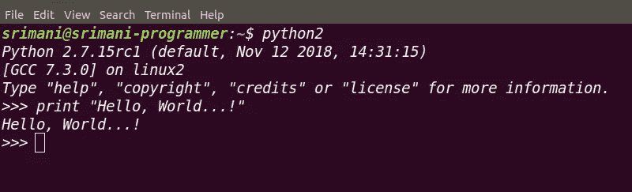
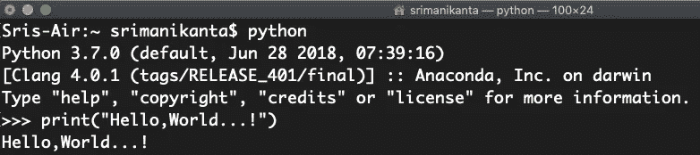
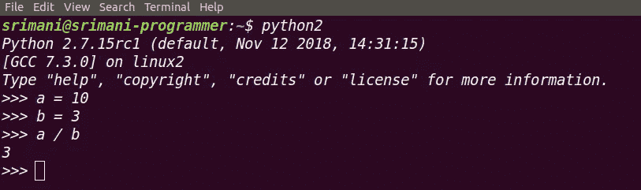
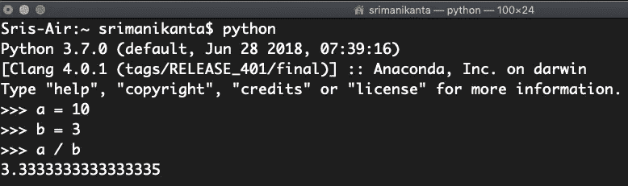
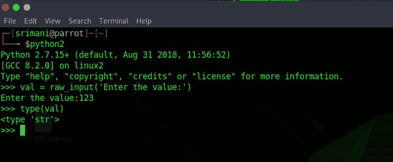
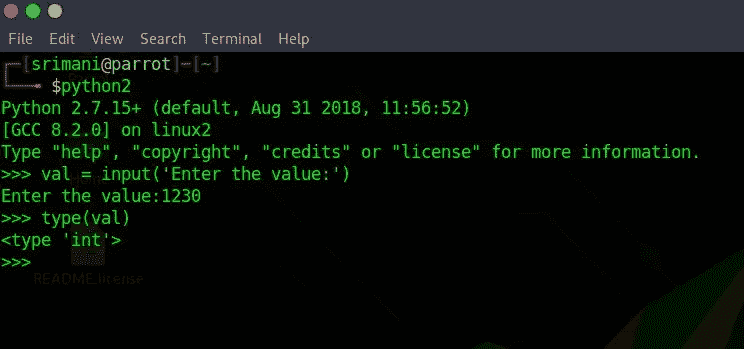
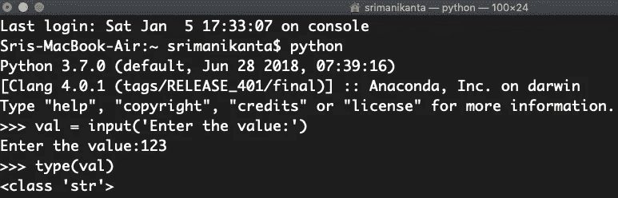

# 为什么公司从 Python 2 迁移到 Python 3。

> 原文：<https://medium.datadriveninvestor.com/why-companies-are-moving-from-python-2-to-python-3-86d948e529c0?source=collection_archive---------4----------------------->

> Python 2 是传统，Python 3 是未来。

Photo by [Davide Cantelli](https://unsplash.com/@cant89?utm_source=medium&utm_medium=referral) on [Unsplash](https://unsplash.com?utm_source=medium&utm_medium=referral)

出于学习的目的，大多数初学者都不知道应该选择哪个版本。在社区中，python 2 和 python 3 之间也有一场战争。有些人认为 Python 2 比 Python 3 更有优势。在本文中，我们将讨论 Python 2 和 Python 3 之间的主要区别，以及为您的编程生涯和软件开发选择哪一个。

# Python 2 和 Python 3 概述:

## PYTHON 2:

Python 2 于 1991 年 2 月 20 日正式发布，由 Guido Van Rossum 开发。它成为市场上使用最广泛的编程语言之一。在开发时，python 开发人员添加了一个很好的语法糖，使 Python 语言更容易学习。他们开发了一个很好的库栈，让开发者的生活变得简单。

> Python 2 支持函数式、过程式、面向对象和结构化编程范例。它还有一个自动垃圾收集器，可以更好地管理内存。

## PYTHON 3:

Python 3 被认为是 Python 的一个特性。这个版本的 Python 目前正在开发中。Python 3 的一个主要服务于 2008 年发布，以克服 Python 2 中的缺陷和问题。

> *Python 3 开发的主要焦点是清理代码库和移除冗余，清楚地表明执行给定任务只有一种方法。*

两个版本之间的主要变化如下:

## 打印声明中的更改:

在 Python 2 中，print 语句的语法是

Python 2.7.15.rc

在 Python 3 中，print 语句的语法是

Python 3.7.0

> python 2 中的 print 语句与 python 3 不同。
> 
> 打印“你好”！= print("Hello ")

## 整数除法:

在 Python 2 中，一般的除法运算会产生一个整数结果。

Python 2.7.15rc

在 Python 3 中，一般的除法运算会产生浮点结果。

Python 3.7.0

## 字符编码:

在 Python 2 中，字符编码是以 ASCII 格式完成的，默认情况下，字符串以 ASCII 值的形式存储。我们需要添加“u”来以 Unicode 格式存储字符串。

在 Python 3 中，字符编码是基于 Unicode 的。字符串以 UTF 8 格式存储。它存储了大量的字符值。

> Unicode 编码能够存储不同的语言字符和表情符号。

## 提高图书馆标准:

Python 2 库和 Python 3 库有巨大的区别。*许多基于 Python 2 开发的库与 Python 3* 不兼容。因此 Python 3 的库实现完全改变了。开发人员正在重新创建 Python 2 库，以获得 Python 3 版本的良好兼容性。

> Python 3 拥有比 Python 2 更好的标准和强大的库。许多机器学习和深度学习库也针对良好的模型开发进行了改进和增强。

## 输入功能:

**Python 2:**

在 Python 2 中，为了获取用户的输入，有两种类型的函数可用。

**raw_input():**

Python 2.7.15

> raw_input 函数将给定的输入类型显式地更改为字符串类型。

**输入():**

Python 2.7.15

*该函数采用您输入的值和类型，而不修改任何类型。*

## Python 3:

Python 3.7.0

在 Python3 中，只有默认的函数可以接受用户的输入，即 input()。这个函数将像 raw_input()一样工作。它会自动将值转换为字符串类型。

## 转移到新版本的原因:

如今，出于遗留原因，公司仍在使用 Python 2，但大多数公司都在使用 Python 3，因为它是新实现的未来。它们是:

1.  Python 2 传统上不是一种类型化语言。但是 Python 3 支持类型化，这克服了处理新代码时的开发冲突。
2.  Python 3 有很好的社区支持。
3.  Python 的每个新版本在运行时都会变得更快。

## 我应该学 Python 2 还是 Python 3？

最终的赢家是 Python 3，因为 Python 3 中所做的改变实际上让初学者更容易理解，而且 Python 2 到 2020 年底也不会得到支持。由于 Python 2 将在 2020 年被淘汰，Python 3 的采用是未来的明确方向。

## 结论:

正如我们之前讨论的，对 Python 2 的支持将在 2020 年底停止，Python 2 不能用于软件开发。因此，为了避免这个问题，公司正在转向 Python 3，它有更多的特性，良好的兼容性，比 Python 2 更有优势。所以你的编程生涯和软件开发还是首选 Python 3 比较好。