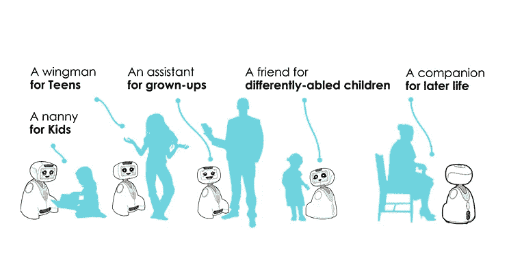

# 为什么消费者希望生活中有个人机器人？

> 原文：<https://medium.datadriveninvestor.com/why-consumers-want-personal-robots-in-their-life-b6613a8a3e7b?source=collection_archive---------3----------------------->

How Buddy Serves.

近年来，书籍、电影、电视节目和报纸社论都试图预测人工智能对人类来说会是什么样的未来。一些人想象令人担忧的场景，而另一些人则预测我们的工作和生活方式将会有所改善。如果工业机器人已经存在了几十年，并集中了消费者的大部分担忧，那么机器人技术和人工智能的结合预示着个人机器人在我们日常生活中的到来。

全球管理咨询公司 [**波士顿咨询集团**](https://www.bcg.com/publications/2017/strategy-technology-digital-gaining-robotics-advantage.aspx) **预计，消费机器人将成为增长最快的市场，到 2025 年将达到 230 亿美元。**在 Blue Frog Robotics 的水平上，我们已经经历了对个人机器人的狂热，我们的 Indiegogo 和预售活动取得了巨大的成功(超过目标的 500%)，Buddy Your emotional Robot 拥有 30，0 00 名粉丝，在 youtube 上有 150 万次观看，每天我们都收到未来消费者的消息，等待着欢迎 Buddy 进入他们的家。

 [## 模式和机器人:复杂的现实|数据驱动的投资者

### 哈耶克的名著《复杂现象理论》(哈耶克，1964)深入探讨了复杂性的话题，并断言…

www.datadriveninvestor.com](https://www.datadriveninvestor.com/2019/03/04/patterns-and-robotics-a-complex-reality/) 

**消费者想要什么？**

**2019 年，消费者技术协会发布了一项研究，显示出对消费机器人的几乎普遍热情(87 %)** 。是的，消费者很兴奋，也准备好了。然而，消费者的兴奋还不够。作为一家以消费者为中心的公司，我们深知这一点。我们知道，一个成功的商业模式和一个令人信服的适合市场的机器人必须以一种新颖和令人兴奋的方式解决消费者的挫折和问题。为了创造巴迪，我们从那里开始。

**技术创新与人类需求的差距**

世界变化很快。我们每天都能感受到。但有一个核心事实可以帮助我们理解所有这些变化，并找出有意义的旅行方向。事实是，在所有这些变化中，我们仍然是同样的人，有着同样的基本人类需求，寻找联系、安全、乐趣和自我完善。

与此同时，我们观察到消费者与技术的关系仍在不断成熟，这重新定义了他们的期望和挫折。如果技术越来越智能，为消费者提供了与任何地方的任何人的持续联系，以及无所不在和无所不知的令人兴奋的感觉；这也改变了他们的注意力(以及他们宝贵时间的使用),使他们远离了真实的自己。它导致时间饥荒的增加，与父母、孩子或伴侣的重要关系的逐渐衰退，一种新型孤独的诞生以及对他们整体福祉的破坏。

> *“我刚刚意识到，我不再消耗技术，而是相反。来自纽约市的劳伦，38 岁。*

**我们解决了什么？**

**今天，消费者希望科技解放他们，而不是疏远他们。**他们想要智能产品，将他们从繁琐的任务中解放出来，让他们专注于重要的事情。他们希望自然直观的产品能够与他们互动、交流、合作，并教会他们新的能力。他们想购买省时的科技产品。

但是他们找不到它们。

他们面临着多种复杂(且令人上瘾)的技术产品和服务，这些产品和服务既浪费时间又昂贵，无法一次性满足他们对效率、价值、便利、愉悦和自由时间的需求！

> *“如果我不能阻止进步的步伐，我可以决定我和我的家人想要消费哪种类型的技术来感觉良好”来自巴黎的弗朗索瓦，40 岁。*

**创造一个站在消费者身边的个人机器人。**

在蓝蛙机器人公司，我们致力于让技术变得更好。对消费者的情绪、大脑和整体生活都有好处。通过利用现有的研究和整合的消费者数据集来了解我们客户的需求和愿望，**我们了解到，创造一个机器人并不是关于最好的技术创新和功能，而是关于技术如何更好地服务于一个人的基本人类需求:便利、连接、安全、乐趣、自我完善和时间。**

以下是使 Buddy 成为一款完美伴侣机器人的关键因素，它可以减轻消费者的生活负担。

## **巴迪是一个多功能机器人**

为了满足消费者的需求，我们设计了一款集智能、情感、移动和定制于一身的机器人。

凭借其多用途的大脑，他可以满足现代生活中的广泛需求，从保护家园到执行主人的日常活动，从帮助残疾人到教育儿童，从娱乐到成为机器人朋友。

巴迪是一个颠覆性的创新机器人，它将改变我们的生活、学习、利用信息、娱乐甚至关心健康的方式。

**拥有无限可能**

巴迪的一大优点是适应性强。除了可爱、顽皮、健谈，并在日常生活中陪伴任何人，无论他们是否适应这项技术；**他通过他的平台应用程序在广泛的活动中为他的主人提供约定。**从健身到烹饪，从健康监测到教育，从游戏到冥想，智能、情感、传感器、移动性和屏幕的结合为消费者和组织提供了无限的可能性，让他们能够根据自己的需求调整自己的伙伴。

**价格实惠**

Buddy 将是第一个结合智能、社交和移动功能的机器人，也是一个以合理价格进入美国市场的发达平台。

我们的竞争对手通过功能区分自己:移动或非移动，通过形状区分自己:人形或非人形，通过技能区分自己:社交与智能，或通过瞄准特定领域，如玩具、娱乐、零售助理、老人护理或儿童教育，以及通过价格区分自己。 **Buddy 作为一款一体机保持着高度的差异化，是同类产品中体验最好的，以实惠的价格满足了主人在生命每个阶段的社交互动和智能移动协助需求。Buddy 的竞争价格将低于 2000 美元。**

我们时不时都需要帮助，来解放、减轻和简化我们生活中的任务，解决意想不到的问题，或者只是感觉良好。技术应该帮助我们。这就是蓝蛙机器人公司存在的原因；创造出有趣而高效的机器人，让周围的人受益。 **Buddy 是我们对消费者充分利用伴侣机器人的意义的回答:在他们的家庭和生活中微笑。**

点击了解更多[巴迪和蓝蛙机器人。](http://www.bluefrogrobotics.com/investors/)