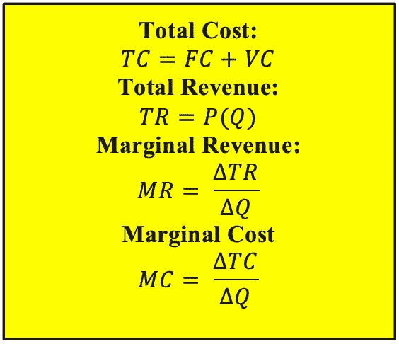
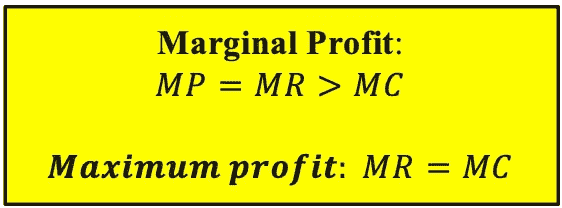
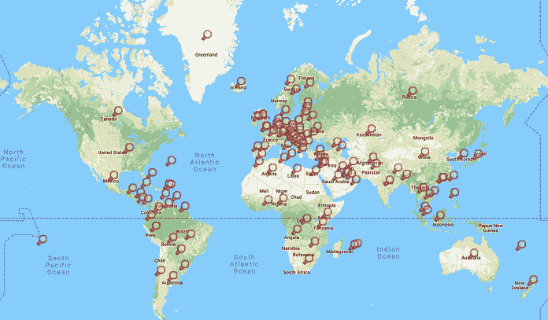

# 为什么企业拥抱可再生能源:这一切都归结于边际成本

> 原文：<https://medium.datadriveninvestor.com/why-corporations-embrace-renewable-it-all-comes-down-to-marginal-costs-24babab459c4?source=collection_archive---------10----------------------->

Image: Solar Electricity Alternative Board Bubble. Source: Mohamed_Hassan, Pixabay.com

从历史上看，政府实施的减排政策对企业变得更加环保几乎没有影响。自第一次工业革命以来，化石燃料提供了工业使用所需的大部分能源。利润利益推迟了对化石燃料能源的限制，因为直到最近，采购可再生能源过于昂贵，而且各国缺乏支持可再生能源替代品所需的基础设施。这使得可再生能源不太可能成为工业用途。尽管巴黎协定是各国和各公司在 2040 年前减少二氧化碳排放的象征性承诺，但只有私人部门才能将这一承诺变成现实，而且它也将会成为现实。

具有讽刺意味的是，在经济命运的转折中，那些为了盈利而污染我们的空气和水的工业可能是让我们摆脱困境的关键。可再生能源技术的最新进展已经提高了可再生能源的成本。公司注意到了这一点，并开始改变论调。在社会责任呼吁的掩盖下，企业看到了转向可再生能源的经济效益。

 [## 气候变化、ESG 和对更好数据的追求——数据驱动的投资者

### 在地球上许多地方经历了另一个令人难以置信的炎热夏季后，来自 S&P 的最新发现…

www.datadriveninvestor.com](https://www.datadriveninvestor.com/2018/08/24/climate-change-esg-and-the-quest-for-better-data/) 

今天，可再生能源的杠杆作用正以 10 年前看待技术和自动化杠杆作用的同样方式得到评估。纳米技术正被用来提高可再生能源的效率。例如，过去十年内的[研究](https://link.springer.com/article/10.1186/s40486-015-0014-2)表明，如果太阳能收集器中使用的水流体被*纳米流体*(罗宾·怀利，EniDay.com)所取代，太阳能收集器中的[热效率可以在更高的温度下提高 88%和 200%以上。随着纳米技术的进步，可再生能源的应用也在进步。就制造而言，这一切都归结为边际成本。](https://www.eniday.com/en/technology_en/nanotechnology-in-renewable-energy-sector/)

# **什么是边际成本？**

边际成本是每单位成本相对于生产和销售的每一额外单位的差异。边际成本越高，生产和销售的产品的利润就越低。重要的是要明白边际成本根据生产和销售的单位数量上下波动。为了更好地理解边际成本(MC)是如何计算的，我们必须知道其他几个术语:1)售出商品的*价格*(*P*); 2)售出商品的*数量*(*Q*)；3)固定成本*(*FC*)，它不随数量变化；4)变动成本*(*VC*) 5)*总成本* ( *TC* )，它是固定成本和可变成本的总和；6)*总收入* ( *TR* )，它是总销售额乘以总销售量；7)*边际收入* ( *MR* )，它是总收入相对于总销售量的变化。 参见插入:**

****

**公司依靠边际成本和边际收入之间的关系来确定边际利润，这个数字也随着收入变化和销售量变化之间的关系而波动。公司将增加单位产量，直到达到最大利润(MR 和 MC 相交的点，MR=MC)。这是一个公司在不再有边际利润之前已经达到它能生产的最大单位数的点。它也被称为最大生产点。生产和销售超过这一点的任何额外单位将不会产生利润，或者会导致这些额外单位的损失。参见插入:**

****

**企业面临的挑战是创造流程，使边际成本随着数量的增加而降低，从而产生规模经济。替代方案是当边际成本不随数量增加而变化时*规模收益不变* ( *CRS* )和当边际成本随数量增加而增加时*规模不经济* ( *DOS* )。参见插入:**

****

# ****能源和边际成本****

**机器人技术和[人工智能](https://www.datadriveninvestor.com/glossary/artificial-intelligence/)的引入显著降低了流程劳动的成本，但没有降低创造性劳动的成本。你可以编写软件和集成机器人来复制过程，但这需要能量。今天，我们用于云服务、网站甚至加密货币的计算机处理器需要大量的能源。云公司每年花费数十亿美元来保持世界各地的数据中心 24 小时运行。寻找廉价能源是大型科技公司非常关心的问题，他们战略性地将数据中心放在这里。以冰岛为例。它已经成为寻找廉价能源为他们的[采矿](https://www.datadriveninvestor.com/glossary/mining/)设备一天 24 小时供电的加密货币矿工的主要网站。越来越多需要大量能源来运营的公司正寻求迁往可再生能源不仅价格低廉，而且供应源源不断的国家。近年来，冰岛因其美丽的自然景观而受到游客的欢迎。它也受到需要大量能源为新的 *zettabyte* 数据中心供电的技术公司的欢迎。冰岛提供了一个独特的机会，因为[冰岛主要由水力和地热资源](https://unchronicle.un.org/article/iceland-s-sustainable-energy-story-model-world)中的自然能源提供动力，这些能源便宜、丰富，价格不会因为短缺或需求而波动。这里有一个例子，说明当公司在可再生能源容易获得和丰富的地方转向可再生能源时，边际成本是如何降低的。**

> *****您一天 24 小时运营一个数据中心。您的固定成本是占用数据中心所支付的租金和保险。可变成本包括您运营的服务器数量的成本、监控和管理服务器的 IT 员工的工资、维护和维修服务器的成本以及数据中心消耗的能源。这些能源用于为服务器供电，并保持服务器机房的温度凉爽(您的水电费)。您的收入结构设置为根据客户每月使用的小时数和 TB 数按月向客户收费。随着技术的进步，您需要更少的空间和更少的服务器来产生相同的处理能力和存储。然而，随着处理器变得更强大，它们消耗更多的能量，并且需要更多的能量来冷却。因此，您需要的空间量以及管理、监控和维护服务器所需的人员数量会减少，但您的能源费用会增加。此外，由于您现在有了更多的空间，而且购买技术的成本更低，因此您可以在相同的空间内安装更多的服务器，从而增加客户容量。这导致更多的能量消耗和成本。因此，尽管你的固定成本和其他可变成本下降了，你的能源成本却上升了。再加上基于需求的千瓦时能源价格波动，您的能源成本大幅增加，迫使您将大部分运营限制在需求较低且每千瓦时平均成本最低的非高峰时段。为了让您一天 24 小时运行服务器并利用更便宜的非高峰时段能源，您被迫在全球各地建立各种数据中心，这些数据中心将利用时区差异来维持 24 小时不间断服务，仅限于非高峰时段，以控制您的能源成本。相反，您决定将所有数据中心都设在冰岛，那里全年无休，热能自然产生，价格低廉，而且丰富。选择将您的所有数据中心整合到一个位置，如冰岛，那里的能源便宜且容易获得，您可以降低与必须运行多个设施相关的成本，这些设施只能在非高峰时段运行，以对冲能源成本。此外，您可以使用更强大的处理器和更大的存储容量来升级您的数据中心，以零边际成本服务更多的人群。这是因为能源成本不会随着能源使用的增加而增加。这是真正的可扩展性，因为这创造了规模经济，因为你的边际成本不会随着服务产出数量的增加而增加。*****

****

**Data Centers, Source: [Data Center Map](https://www.datacentermap.com/)**

**与传统的化石燃料能源相比，可再生能源正变得越来越廉价。正如上面假设的例子所示，可再生能源是创建完美市场的关键组成部分，副产品是更清洁的地球，随着公司制定利用能源成本的战略，准备使用低成本可再生能源的国家正在与公司合作建设现代基础设施，以提供家庭可再生能源。城市和私营公司分担建设新的可再生能源的成本，为纳税人和私营公司利益相关者节省资金，同时为在全球市场中的战略定位做好准备。**

**与化石燃料能源相比，可再生能源有多便宜？几年前，太阳能电池更贵，需要更大的表面积，需要更多的时间在阳光下提取能量。今天，太阳能电池更便宜，需要更少的阳光和表面空间来收集足够的能量用于商业用途。根据美国能源信息署的数据，2018 年，化石燃料发电的年均成本约为每千瓦时 10.58 美元。同样数量的太阳能可再生能源现在与传统能源的成本相当，而风能已经更便宜了。**

***“在全球范围内，陆上风力发电计划的平均成本为每千瓦时 0.06 美元，尽管一些计划的成本为每千瓦时 0.04 美元，而太阳能光伏发电的成本降至每千瓦时 0.10 美元。相比之下，基于化石燃料的发电成本通常在每千瓦时 0.05 美元至 0.17 美元之间。”——Dominic Dudley，福布斯 2018* **相关化石燃料成本****

***天然气* [*天然气*](https://www.datadriveninvestor.com/glossary/gas/) *电力的成本与天然气的商品价格挂钩，天然气本身就具有波动性。可控的、可储存的可再生能源的价格只与技术成本有关，而技术成本正在不断下降。最近的预测表明，到 2035 年，建设新的可再生能源+存储可能比继续运营现有的天然气工厂更便宜。”——大卫·罗伯兹，Vox 2018***

**公司必须应对运输成本，其中大部分与化石燃料消耗有关。*边际货运成本*衡量每增加一个运输单位的单位成本变化。物流公司确保低成本、高效、准确、准时地交付运输产品。他们必须计算边际货运成本，确定在一个集装箱能够装运以支付运输成本之前每个集装箱所需的最小和最大单位数量。太低的数量不能覆盖发送集装箱的成本，而太高的数量可能成本过高，因为如果负载太重，消耗的燃料量可能无法在不影响 *COGS* (售出货物的总成本)的情况下使装运可行。**

****

**Image: Transporation, Logistics, Trucking. Source: Free_Photos, Pixabay.com**

**然后是边际社会成本*，这是企业运营的副产品，通常被称为*碳足迹*。这是社会为应对空气、土地和水污染、废物管理、生态系统破坏以及全球变暖导致的自然灾害造成的财产和人员损失所付出的代价。长期接触有毒污染物和对生活质量的影响所产生的健康相关费用也包括在边际社会成本中，所有这些都需要数百万美元来减轻。留下碳足迹的行业可能会纳税来抵消这些成本，但纳税人会承担长期影响的成本。***

# ****如今，公司正在采取哪些措施向可再生能源发展****

**[包括苹果、沃尔玛、微软、谷歌和美国电话电报公司在内的至少 22 家财富 500 强公司](https://www.nytimes.com/2018/06/01/climate/companies-renewable-energy.html)已经承诺实现 100%可再生能源发电的目标，以匹配其年度能源消耗。**

***“从苹果和谷歌这样的科技巨头到沃尔玛和通用汽车，数十家财富 500 强公司自愿投资数十亿美元用于新的风能和太阳能项目，为他们的运营提供动力或抵消他们的传统能源使用，成为美国可再生能源电力增长的主要驱动力。”——布拉德·普卢默，NYT，2018 年 1 月***

# ****大规模采用****

**在特朗普政府让美国退出巴黎协定后，意识到政府没有动力转向碳中和，企业选择继续采用可再生能源作为削减成本的措施。企业也将此视为展示企业责任的一种方式，从而一举两得。公司发誓要遵守美国政府退出的巴黎协议。《纽约时报》称:**

**随着越来越多的公司转向可再生能源，更多的资金将投入到可再生能源技术和全面可持续发展中。这将提高可再生能源的效率，降低与可再生能源相关的成本，从而降低更多企业利用可再生能源的门槛。正如工业计算机技术的进步导致个人计算机的发明一样，可再生能源的广泛工业创造和使用将导致可再生能源技术的进一步进步。这将激励企业与各级政府合作，利用私人资金资助项目，创建支持可再生能源的基础设施。随着技术变得更便宜和更高效，全球各地的整个人口将在很大程度上采用可再生能源作为主要能源。**

**尽管我们最近当选的联邦政府官员在应对气候变化方面后退了一步，但公司都非常清楚零边际成本的“圣杯”在很大程度上取决于对可再生能源技术的持续投资。不管政府是否支持，企业都在转向可再生能源。降低边际成本是公司推进可再生能源技术的主要动力。因此，解决全球变暖和化石燃料依赖问题的答案最终不会通过政府强加的政策来解决，而是通过计算不解决问题所导致的边际成本来解决。企业知道采用可再生能源是实现零边际成本的解决方案。尽管边际成本可能是企业责任的原因，但这个原因无关紧要，因为最终每个人都是赢家。**

****

**弗雷德是纽约一家著名大型非营利机构的首席执行官。他获得了哥伦比亚大学社会工作学院硕士学位和纽约城市大学巴鲁克学院齐克林商学院硕士学位。**

***原载于 2019 年 5 月 23 日*[*【https://www.datadriveninvestor.com】*](https://www.datadriveninvestor.com/2019/05/23/why-corporations-embrace-renewable-it-all-comes-down-to-marginal-costs/)*。***