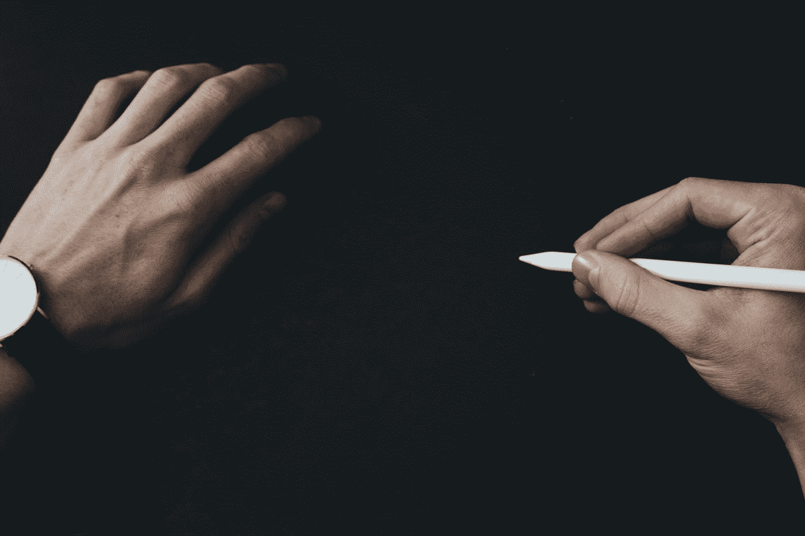
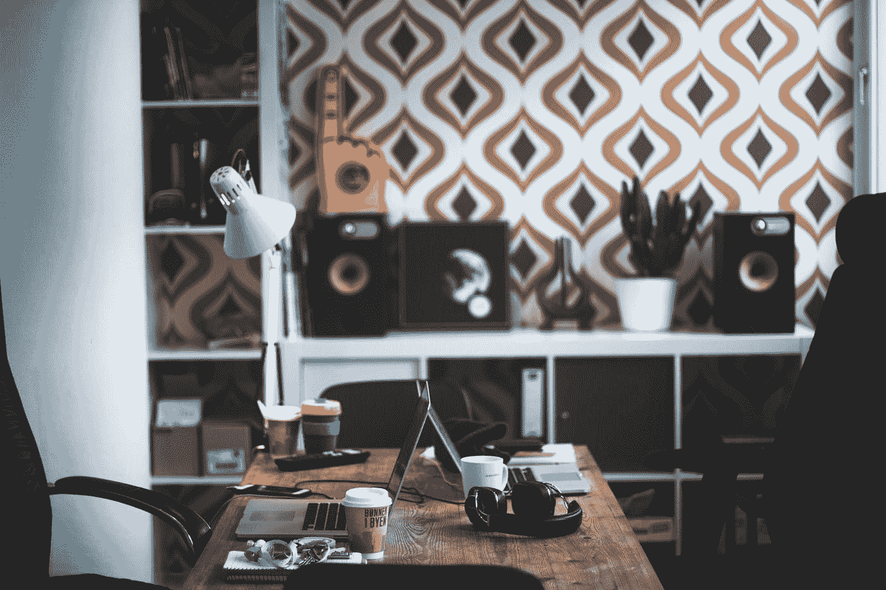

# 为什么创造力如此重要

> 原文：<https://medium.datadriveninvestor.com/why-creativity-is-so-important-52125a81f403?source=collection_archive---------13----------------------->

“person wearing black analog watch holding white pencil” by [Luca Laurence](https://unsplash.com/@luca_tism?utm_source=medium&utm_medium=referral) on [Unsplash](https://unsplash.com?utm_source=medium&utm_medium=referral)

> 创造力:运用独特的、富有想象力的想法来创造新事物。

随着我们一次又一次地看到所有复杂的进步，我们可能变得有点容易忘记想象在我们生活中的必要性。

大多数人决心走自己常走的路。毕竟，我们社会的大多数人似乎都很关注别人对他们的限制。“你只能到此为止。”"这是你能做的最多的事了。"

警示带几乎遍布我们看到的所有地方。限制和指导方针告诉我们对这种共性的通常期望。很快，与他人保持一致似乎变得更容易，压力也更小。

但是是吗？

你上一次有一个自发的、创造性的想法出现在你的脑海中是什么时候，就像打开了一个陈词滥调的灯泡？或者更好的是，你上一次能够*记起*那个想法是什么时候？

我敢打赌，当你被与你的想象毫不相干的需求压垮时，你脑海中唯一的创意就是你从宜家买的新咖啡杯。

现实是，我们的日常生活中几乎没有创造性思维。因为描述我们工作/生活平衡的奔忙流，我们简单地推迟和忽略了那些会——如果有机会的话——让我们看到内在的东西。

# 它本来的样子

在很小的时候，我们的思维就能与包含每一个转折的广阔的想象世界联系起来。一个大盒子不仅仅是一个盒子。这是一架超音速喷气式飞机，一辆清洁的跑车，一艘装备精良的宇宙飞船，注定要登陆月球——不，是火星。

用过的文件的背面不仅仅是“空白的一面”，永远不要作为无效垃圾使用和丢弃。这是一张画布，充满了当时在我们大脑中冒泡的许多奇怪和独特的创作。

没有人能告诉我们有什么不同。我们知道我们在创造什么，即使那些善意的“成年人”认为这是毫无意义的涂鸦。除了你和无限的生命、人和世界之间的玻璃层，还有什么是窗口呢？

什么变了？为什么一切都变得如此平淡，如此平常？

最终，其他人及其作品的影响塑造了我们思考和创造的方式。随着我们对周围世界和文化的认知逐渐成熟，我们开始相信那些告诉我们不同事情的人。

那真的只是一个盒子。不是跑车，不是喷气式飞机，不是宇宙飞船。只有一个普通的棕色盒子。你想象的任何事物都不会像某某事物那样伟大。所以，就像其他人一样:接受现实，继续前进。

> *从众成了我们的生存模式。*

但不一定要这样。

# 浪费的时间

几乎所有地方的每部智能手机上都至少有一款社交媒体应用。无论是 Instagram 还是 Twitter、Pinterest 还是脸书，每个人都可以进入屏幕内的世界。

在这个世界里，你可以试图给那些你从未见过、或许也不想见的人留下深刻印象。许多人去那里寻找下一个模仿或复制的想法，而所有这些都隐藏在普通人的焦虑背后。而且一触即发，他们的追求是无限的。

此外，网飞还有大量的节目和电影可供探索，还有其他娱乐资源。即使我们一遍又一遍地看到它们，我们还是忍不住重复同样的步骤，因为这是我们已经习惯了的。

现在，我会是一个傻瓜(和一个伪君子)，假装好像我从来没有陷入过滚动 Instagram feed 的陷阱，双击我遇到的所有令人惊叹的风景和生活方式照片。或者是我确信《办公室》是有史以来制作的最好的纪录片风格的电视节目之一。我真的可以看一整天！但至少现在我意识到了。当我需要独处的时候，我会更加清醒。

我的观点并不是说这些事情本身就不好。问题在于我们无法摆脱它们，无法留出时间进行创造性的思考。这样做已经成为某种标准，如果我们不小心，我们的思想将被人为的想象所取代。

这两种现实截然不同，而不是相同的。

# 从众的问题

我认为，这种让冗余永久化的心态影响了我们创造和想象的能力——甚至可能是我们的欲望。相反，我们安于现状的生活和思考方式。如果没有什么不同的做法，就很难提出新的想法。

因此，仍然有一种停滞感。一种被卡在轮子上的感觉，轮子在转动，但实际上哪儿也去不了。我们感到筋疲力尽，筋疲力尽，却不问自己为什么。这是因为我们陷入了旧习惯的怪圈，而这些旧习惯不会给我们带来任何好处。

纵观历史上几乎每一项发明，新发明都是通过突破传统的限制而产生的。他们会说，“肯定有更多的东西。”

一想到在其他编队的范围内让*永远运转*就让人不舒服。

以至于那些准备发挥聪明才智的人不得不首先解决与普通事物相对应的问题。这需要时间，这反过来又让位于一些原创的东西。

“gray laptop computer near black acoustic earmuffs on brown wooden table” by [Thomas Litangen](https://unsplash.com/@litangen?utm_source=medium&utm_medium=referral) on [Unsplash](https://unsplash.com?utm_source=medium&utm_medium=referral)

> 复制不是创造。它无法超越，它只是停留在内心，转来转去，无处可去。未能跳出框框，它延续了趋势，忽略了更伟大、更有效、甚至更有帮助的事物的可能性。

事实是我们没有足够的时间去思考。相反，我们主要关注如何复制已经创造出来的东西。这最终抵消了我们的连线方式。

# 可能的方式

事实是，有目的地采取新的生活方式的想法让我们害怕。当然，减少分心，专注于生活中最重要的事情对我们来说听起来很棒。但是当展示它的时候，担忧就出现了。其他人对此会怎么想？不看 Instagram 或 Twitter，我该怎么工作？

答案很有挑战性，但也是可行的:用为想象力和生产力提供空间的活动来取代所有这些分心的事情。电影制作人和《T2》背后的策划者打破抽搐，[安东尼·昂加罗](https://medium.com/u/1fb15ab25c0b?source=post_page-----52125a81f403--------------------------------)，描述了这种阻止我们创造潜力的欲望——抽搐

需要检查你刚刚发布的那张照片的通知。那双昨天上市的鞋子，是渴望得到最大关注的人的必备之物。甚至是那件配深蓝色牛仔裤的衬衫。这些都是冲动，召唤我们去回应那些占用我们时间和破坏健康习惯的事情，比如看书、写想法或去跑步。

从本质上来说，创造力很重要，因为它能解决问题，增加清晰度，并为改善我们中间的少数人或整个世界的生活带来可能性。

然而，为了最大化这个强大的工具，必须有一种意向的态度。为了达到*将成为*的目标，必须有一种推动*是*的边界的愿望。

你会怎么做？

***感谢阅读！***