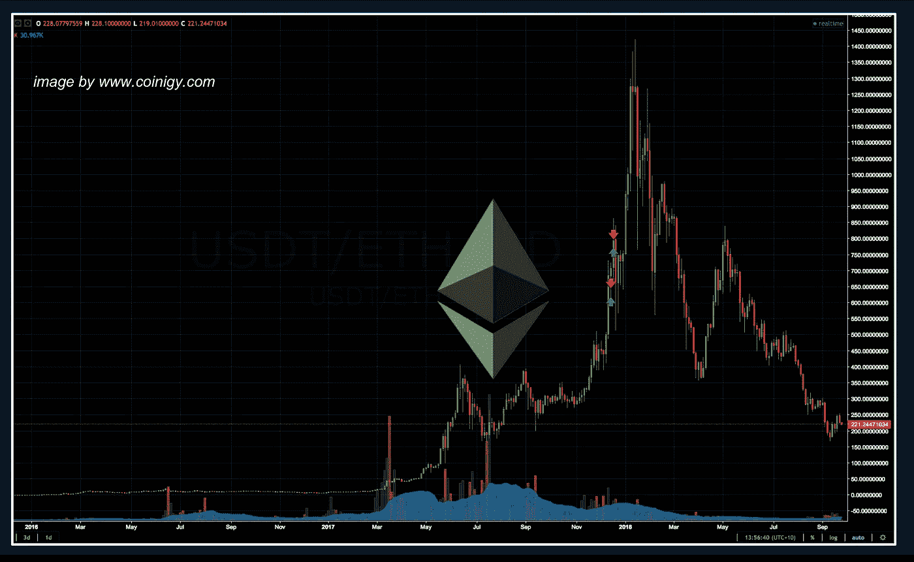

# 为什么加密货币有变成开源 R&D 和思想的培养皿的危险…

> 原文：<https://medium.datadriveninvestor.com/why-cryptocurrencies-are-in-danger-of-becoming-nothing-more-than-a-petri-dish-of-open-source-r-d-d552e5cbae84?source=collection_archive---------7----------------------->

2017 年对于比特币和加密货币市场来说是不同寻常的一年。这一年，一种新的千年灵丹妙药真正诞生了。加密货币的浪潮似乎不可阻挡，所有船只都漂浮在它的道路上。最新的高辛烷初始硬币发行(被普遍称为“ICO”)成为了加密知识分子事实上的第二收入来源——这些人花费了大量时间和精力来研究和理解加密货币的复杂性。千禧一代的影响者经常被*自拍引发的*自恋所驱使，向他们咆哮的人群兜售最新的 ICO。这个过程很简单:

-在预售阶段买入最新大力推广 ICO 的加密货币币；

-等待 ICO 在加密货币交易所上市，

-以 2 倍、3 倍、10 倍的回报出售硬币。

-冲洗并重复

唾手可得的金钱和多巴胺的诱惑将千禧一代卷入了雄心壮志的洪流中。这是通向简单出路的数字化、去中心化的通行证。为生活而工作是“20 世纪的事情”。然而，太多时候，这种景象隐藏在复杂的信息中，所有这些信息都经常隐藏在改变世界的薄薄的外表后面——一次一个蓝宝*。*

*兰博基尼愤怒的公牛标志成为了令人向往的加密货币牛市的象征，超级汽车的全球销量在 2017 年达到了历史最高水平。但是就像标志所基于的西班牙斗牛一样，斗牛无法在他们的斗牛士一丝不苟的临床精确性中生存。他们冰冷坚硬的钢铁带来了最后的致命一击。监管者开始兑现他们的承诺。*

*在自互联网时代以来最大的八球流星击中他们的阴影背后，全球监管者措手不及。他们危险地平衡创新和治理的走钢丝行为变得难以处理。绝望之下，他们试图驯服一头失控的公牛。全球监管者一个接一个地采用了统一的口头禅:*

> *“说不！…然后协商”*

*逐渐地，司法管辖区开始挤压加密货币市场，特别是 ICO 的监管。监管套利无处不在，因为 ICO 绝望地试图转换管辖区，以找到他们日益减少的友好面孔。市场不断受到不断重复的监管打击，导致加密货币崩溃，千禧一代奔向最近的出口，他们的脸上刻满了恐惧，因为他们面临着音乐椅游戏日益减少的现实，因为他们失败投资的买家变得越来越难以捉摸。*

*加密货币市场从 2017 年 12 月的历史高点下跌了近 80%。随后发生的事情只能被描述为一场旷日持久的宿醉，因为蓬勃发展的牛市变成了一场争吵不休的熊市。*

*兰博基尼转向亏损，硬币发行转向合规，FOMO 转向恐惧。ICO 项目的甜言蜜语变成了关于安全性和合规性的发人深省的酸溜溜的谈话。集体诉讼律师的好莱坞式笑容开始变得灿烂，因为他们为监管机构的突然行动做好了准备。人们冷酷无情地意识到，现行法律是秘密现实主义的基石，而不是不受政府干预和审查的自由意志主义承诺。经验丰富的加密货币所有者露出会心的微笑；新面孔的千禧一代做着鬼脸，每个毛孔都因幻灭而屈服。*

*悲伤的七个阶段压缩得像一架走调的手风琴；FOMO 求助于莫佛，绝望的他抱着责怪别人的希望；贪婪变成了悔恨，愤怒、痛苦、沮丧，最后是一种无可奈何的希望，希望事情最终会好转。随着时间的推移，HODLR 被镌刻在石头上——这是对那些长期持有加密货币而不是亏本出售的人的千年误用。也许千禧一代注定要成为霍德勒，他们被愤世嫉俗的金融操纵者所驱使，这些金融操纵者以雄辩的精确性表演了他们老掉牙的周期性繁荣和萧条剧本。这种现实感渗透到了企业的时代精神中。*

**

*随着加密货币价格的下跌，人们开始质疑如此多公共资助项目的可行性。*投资回报*成为大家耳熟能详的公司铃声。随着活力的增加，随着区块链技术继续其商业之旅，其本身也受到了严格的评估。慢慢地，随着目的的增加，区块链开始**与加密货币**脱钩，并越来越意识到:*

> *“加密货币需要区块链，但区块链不需要加密货币。”*

*在认识到底层技术的力量的同时，企业也认识到降低风险的绝对必要性。风险最小化是他们的基因，也是他们股东的期望。分散化是许多基于加密货币的项目的支柱，但企业对此兴趣不大。他们需要一个由他们认识的值得信任的合作伙伴组成的基础设施，而不是由他们不认识的合作伙伴组成的分散结构。私有区块链是他们所需控制的链接，就像互联网繁荣时期开发的“*内部网”*。然而，故事要求更高。*

*区块链技术的期望是巨大的、改进的性能。企业头痛需要快速有效的止痛药，而不是在分散化未来的暗淡和遥远的愿景中可以改善企业生活的诱人维生素的甜蜜承诺。尽管仅仅通过透明的计算机代码实现企业绩效、治理和合规自动化是自由主义者的梦想，但这却是股东的噩梦。自由战士们越来越多地受到限制，不仅因为不可接受风险的考验，还因为意识到技术还没有准备好。*

*企业的区块链继续以权力和潜力为前提。现实是，这一前提的承诺很难产生切实的结果。相反，企业必须对围绕四个 P 构建的技术路线图感到满意:*

*-概念证明*

*-原型*

*-飞行员*

*-还有…胸部膨胀*

*每个人都想要第五个“P”——生产就绪型产品——而昨天；但是这项技术仍然非常年轻，还没有在生产环境中测试过。这引出了很多问题:*

*-技术将走向何方？*

*-该技术何时会展示其第一个真正的杀手级应用？*

*-我们什么时候能看到生产就绪的产品解决实际问题？*

*-未来的机会在哪里？*

*每一个问题本身都是一个非常宽泛的问题，但是，事实上，没有人真正知道如何实现，更重要的是，技术何时才能真正实现企业方式的性能。可扩展性、安全性和隐私性是该技术取得成功所必需的绝对基础，虽然不断有改进，但目前仍面临挑战。*

*毫无疑问，当生产就绪产品*将*发布，永远难以捉摸的“杀手级应用”*将*诞生时，我们将看到一个转折点——但这仍有一段路要走。在此期间，当前格式的大多数加密货币都面临失去吸引力和相关性的严重危险。他们有被大公司忽视的严重危险，因此，有被边缘化的严重危险。生存是达尔文主义。*

*生存并不总是适者生存；它是关于最能适应新的和不断变化的环境。对于加密货币市场来说，这意味着拥抱机构和它们期望的场景。不幸的是，在加密货币泡沫中，太多耳熟能详的高调声音暗示他们拥有这项技术几乎是天赐的权利，并强烈认为机构会向他们寻求进入他们的应许之地的密码。那些拥有资金和分销渠道的人有能力将技术带入主流，他们通过自己的金融视角以不同的方式看待事物；通过解决他们需要解决的问题，为他们提供所需的投资回报，所有这些都在一个降低风险的结构中进行，其核心和本质是监管和合规。*

*然而，监管和合规对核心加密货币社区来说是一个诅咒。在纯粹主义者看来，监管和合规与*国父中本聪*在他最初的白皮书中详述的一切都是背道而驰的。毕竟，这项技术旨在让数字现金能够在不通过金融机构的情况下从一个人转移到另一个人。然而，现实是关于适应和生存，并且有进一步的力量在起作用，使这种叙事更加强大——安全令牌。*

*安全令牌将在全球区块链生态系统的发展中形成下一个主要的结构性浪潮。虽然基于区块链和基于加密货币的技术，但它们有一个至关重要的区别，完全定义了它们的潜在价值主张。他们积极接受监管和合规。*

*正如我们将在下一篇博客中探讨的那样，安全令牌将使机构能够广泛拥抱加密货币市场，这是它们以前无法获得的。大多数决定大型机构资本配置的投资指令，都要求它们投资于受监管的结构——例如债券和股票——而不是不受监管的结构，例如分散化的加密货币。监管者已经显示出对安全代币的热情，因为他们可以依靠许多现有的法律结构和协议来处理它们。这种温暖有可能为机构提供一个广泛的监管桥梁，从而为大量资本提供更充分的基础技术，并利用这一监管网关有可能提供的主要新金融机会、市场和产品。*

*那些仍然专注于去中心化和不受监管的结构、不适应新的监管和合规环境的加密货币，面临着严重的危险，它们只会成为开源 R&D 和思想的培养皿，而这些思想往往会在它们自己的回音室中孕育。*

***附录***

*在我即将发布的播客系列“[掉进兔子洞:区块链和超越](http://www.downtherabbithole.news)”中，我们将讨论区块链的现实，因为它继续发展，与加密货币脱钩，以及未来如何开始与安全令牌一起发展。11 月 15 日发布的“深入兔子洞:区块链及其他”将通过提供分析、提示和采访区块链生态系统内外的利益相关者，为您提供对该技术及其应用的第一手见解，以帮助您评估潜在的未来场景，应对挑战并迎接新的动态机遇。*

***关于作者***

**

*[Tim Lea](https://www.linkedin.com/in/timlea/) 是一位澳大利亚区块链企业家&布道者，一位国际主题演讲人，也是区块链书籍 [Down The Rabbit Hole](http://www.downtherabbithole.news) 的作者，该书全部用简单的英语写成。他还主持执行简报会和半日、一日和两日的大师班、研讨会和执行简报会。*