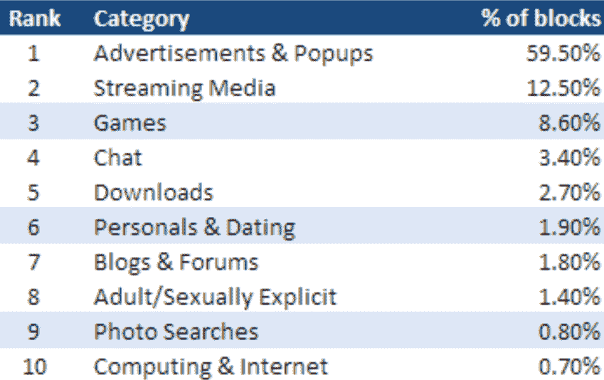
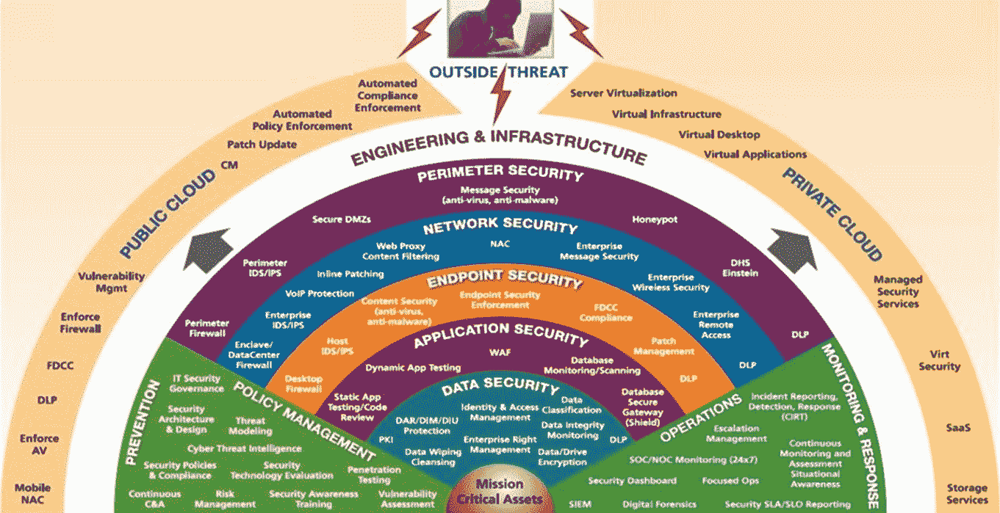
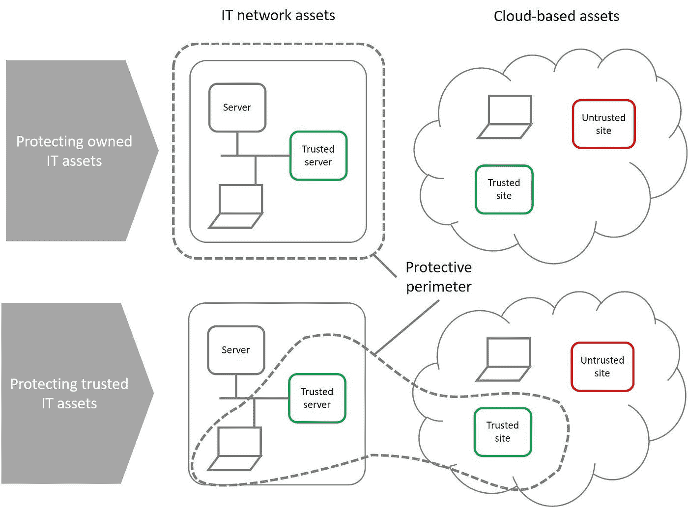
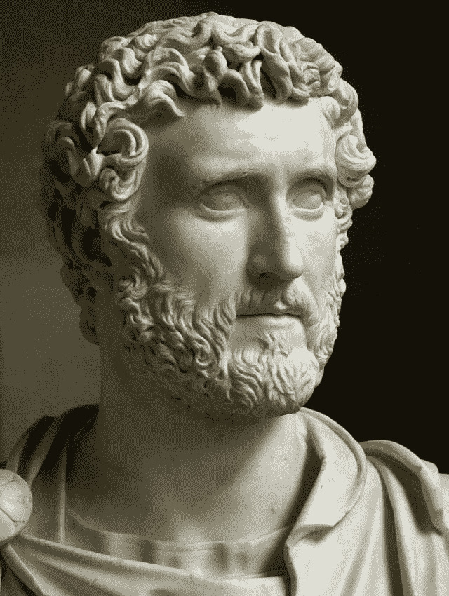

# 为什么网络安全如此艰难

> 原文：<https://medium.datadriveninvestor.com/why-cyber-security-is-so-hard-fe05921a72a0?source=collection_archive---------12----------------------->

# 筑墙是我们的天性

安东尼墙的修建始于公元 142 年，是罗马皇帝安东尼下令修建的。它由 36 英里长的城墙组成，其间散布着 20 座堡垒，耗时 2 年完成。然而 25 年后，当它的防御和创收价值不足时，罗马驻军放弃了它，搬迁到 16 年前建造的哈德良长城。建墙很贵，但如果建在正确的地方，还是值得的。哈德良长城在接下来的 300 年里被用作防御，以及控制贸易和移民的手段。2000 多年来，中国的长城发挥着同样的作用。

今天，我们生活在数字时代。这篇博客质疑在我们拥有的 IT 资产周围建造隐喻墙是否是实现网络安全的最佳方式，并建议我们在我们信任的数字资产周围建造墙。

# 互联网不是为数字时代设计的

除非你住在山洞里或依赖西南铁路的互联网连接，否则你应该清楚，我们生活在一个智能手机和互联网服务高度连接的世界，传统的网络边界正在消失。

问题是互联网是 20 年前设计的，没有考虑到今天的安全需求。当我们浏览网页时，我们邀请不认识的人在我们的计算机上运行代码，无论我们多么努力地修补软件漏洞和监控我们的 IT 基础设施，我们永远不会完全安全。作为一种安全措施，这和使用刺穿者弗拉德的保姆服务一样明智。

> [赛门铁克 2016 年威胁报告](https://www.symantec.com/content/dam/symantec/docs/reports/istr-21-2016-en.pdf)指出，78%的网站包含一个严重漏洞，如果被利用，可能允许恶意代码在没有用户交互的情况下运行。

这一观察没有逃过犯罪分子的注意，他们对过去十年网络攻击的频率和规模不断增加负有主要责任。尽管今天存在一个繁荣的网络安全市场，出售各种形式的保护，但网络安全攻击现在比以往任何时候都更加频繁和广泛。[网络犯罪造成的损失在 2017 年达到 3 万亿美元，到 2022 年将翻一番](https://www.business.att.com/solutions/Portfolio/cybersecurity/cybersecurity-resources/page=addl-info/?gc=cybersecurity-report/v6/index.html#resource)，这是历史上最大的财富转移。网络安全行业正在输掉与黑客的战斗，因为最有效的安全措施对用户来说是难以接受的，所以我们只能退而求其次。

# 网站屏蔽:残酷，有效

最简单的解决方案是在我们想要保护的东西周围筑起一堵墙，防止跨越边界的交互带来不可接受的风险。我们已经做了。一个经过验证的非常有效的网络安全解决方案是阻止对我们的 IT 网络安全构成不可接受的风险的网络部分。

99.95%被屏蔽的网址都是基于类别的。到目前为止，最大的比例与广告有关。

*【网址过滤趋势提供员工网络使用习惯一瞥，赛门铁克】*

其余 0.05%的块是恶意的，可以出现在任何类别的网站中。犯罪分子可以建立和托管恶意网站，但 80%的 URL 块是已经被侵入的合法网站。随着恶意 web 威胁的数量和种类不断增加，恶意数据块的比例也在稳步上升。

> [赛门铁克 2018 年威胁报告](https://www.symantec.com/security-center/threat-report)显示，13 个被识别的网址中有 1 个是恶意的。

为了确定我们可以信任什么，我们必须让自己暴露在风险中:欺诈调查人员和执行监管检查的合规官需要调查所有类型的网站，因此我们必须在不妨碍业务的情况下尽可能严格地定义信任边界。怎么会？

# 标出信任边界

Web 代理和防火墙供应商使用经过试验和测试的规则、人工智能和自动化来提供细粒度的 web 类别分类，但是[浏览一下配置指南](https://www.paloaltonetworks.com.mx/content/dam/pan/en_US/assets/pdf/framemaker/71/pan-os/pan-os/section_16.pdf)，你会发现这是一项复杂的业务。你可以在数百个选项中苦苦寻找，也可以接受默认的“最佳实践”设置，并希望它们能反映出你所在组织的 IT 安全政策。

# 现在处理用户骚乱

在安全性和便利性之间取得恰当的平衡当然意味着你将不得不面对那些工作受阻的用户的愤怒咆哮，你需要通过以下方式来应对:让你的首席信息官参与进来，围着马车打转；或者放宽政策。

# 这就是为什么我们需要深度的力量，对吗？

这就是我们监控网络的原因:提供第二道防线:使用预防技术来阻止我们可以阻止的事情，并使用监控技术来快速发现威胁，以便我们可以部署事件响应小组来处理威胁，以免造成损害。

理论就是这样:实践更有挑战性。你无法预料每一行代码背后的意图。被认为是合法的网站可能在以后被证明是恶意的。

这是今天的网站。目前没有公司为 Web 2.0 网站的复杂内容过滤提供支持。分析会发现规则遗漏的部分，但不是全部。网络安全没有灵丹妙药，这就是为什么我们把自己隐藏在一系列安全解决方案中，然后威胁发生变化，所以我们在上面放置额外的解决方案，等等。你可以看到这将走向何方…

# 复杂性是我们网络安全问题的根源

这就是为什么今天的 IT 安全架构使英国退出欧盟变得简单，但它们并不真正有效。

# 有没有更激进的方法来保护我的信息资产？

# 1)简化安全性

当今流行的“纵深防御”安全方法是当今许多安全技术提供的有限保证的结果，然而我们越是依赖某一特定的安全技术，就越没有必要投资于多层防御。少即是多。

以正确的方式实施的远程浏览提供了一堵隐喻墙，使我们能够通过消除一整类网络安全威胁来简化 IT 安全。它已经在安全政府中使用了很多年，并且正在成为行业内网络浏览的标准架构。(如果你订阅了 Gartner，看看它最新的一篇名为“[超越检测](https://www.gartner.com/doc/3869563/detection--core-security-patterns)”的论文，其中描述了 5 种可抵御规避的安全模式)。

# 2)让那些负责任的人定义信任什么

Naill Ferguson 在其关于“[法治及其敌人](https://www.bbc.co.uk/programmes/b01jms03)”的 Reith 讲座系列中研究了 2008 年金融危机的原因以及金融管理标准和监管的有效性，他指出，危机的部分原因是允许不负责管理风险的各方定义标准。

那些生存依赖于上级定性评估的人，在涉及权衡取舍的关键决策上不能被信任，因为他们没有“利益相关”，会为了个人的成功而与系统博弈。当员工的优先事项和目标与组织不一致时，这就成了一个问题(而且经常不一致)。

# 3)根据我们信任的资产重新定义保护范围

我们不应该围绕我们的 IT 资产创建一个边界，而是应该考虑围绕我们信任的东西部署我们的信息安全资源，而不管它们是属于我们还是属于另一方，如下图所示(非常简单)。

关于信任哪些网站的规则需要反映组织的风险偏好。这说起来容易做起来难。通常用于确定信任内容的规则包括:URL 注册日期；电子邮件发件人的 DMARC 检查(如果链接包含在电子邮件中)；URL 分类；URL 形式；域名所有权和透明度；以前对网站的访问。

# 4)采用“零信任”网络安全策略

问题是[我们不擅长判断风险](https://www.linkedin.com/pulse/how-worlds-best-risk-decision-makers-decide-paul-brucciani/)。我们相信名人代言、穿西装的人、任何印刷的东西——尤其是图表和精确的数字，即使它们是错误的。

最安全的方法是确定我们愿意信任的少数 web 服务，并将所有其他服务视为潜在的恶意——一种“零信任 web 安全策略”。

# 让“零信任”策略适用于远程浏览

只有当用户能够安全、无障碍地访问外围 IT 资源时，采用“零信任”网络安全策略才会奏效。远程浏览——将高风险的网络浏览业务从设备内部转移到网络外部的牺牲性浏览器——提供了一种有效的解决方案。如果你能为用户访问不可信的网站提供一种安全的方式，你就可以小心谨慎:只列出那些你完全信任的网站(如 SAP、Salesforce、LinkedIn、O365)，并通过你的安全远程浏览器访问所有其他类别的网站。

# 获得正确的远程浏览

远程浏览在概念上很简单，但在技术上具有挑战性:你必须在安全性、可用性(即用户体验)和成本之间取得平衡。[市场上有各种各样的产品以不同的方式平衡这些需求。重要的是确保无论您做出何种选择，安全模型都将设备与互联网完全隔离，并且解决方案的安全性可以得到明确保证。](https://www.linkedin.com/pulse/hardware-deployment-cloud-edward-amoroso/)

如果不能保证完全隔离，那么停止！您将增加成本和复杂性，并且可以说，通过将 it 暴露于更多形式的软件和处理器芯片恶意软件，IT 安全性变得更加脆弱:最好将您的钱花在爆米花上，以扔给攻击者。

# 收场白

罗马皇帝安东尼努斯明白墙的安全价值，即使他并不总是把墙建在正确的地方。幸运的是，他的养父哈德良 16 年前在一个更好的地方建了一个。

安东尼从公元 138 年到公元 161 年的统治以帝国的和平状态而闻名，在此期间没有重大的叛乱或军事入侵。当守夜人的护民官来询问口令时，他说的最后一句话是“ *aequanimitas* ”(镇定)。然后他翻了个身，好像要睡觉，然后就死了。

安东尼统治也可能因展示了有效的网络安全之道而闻名。

#网络安全#网络安全#风险管理#风险偏好#浏览隔离#远程浏览